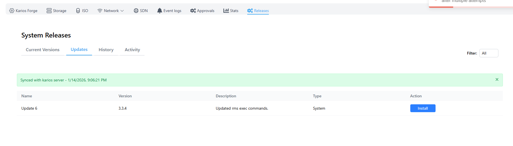
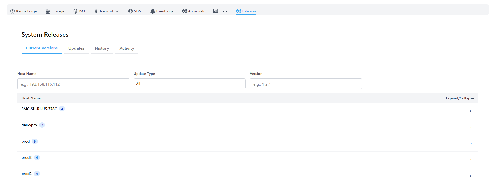
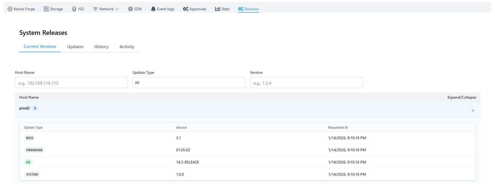
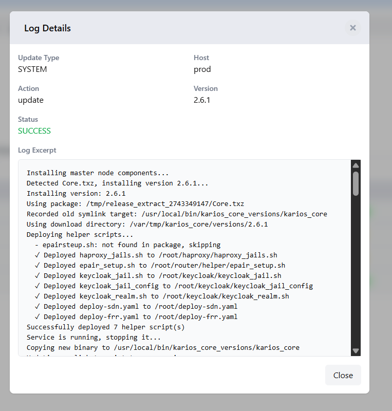
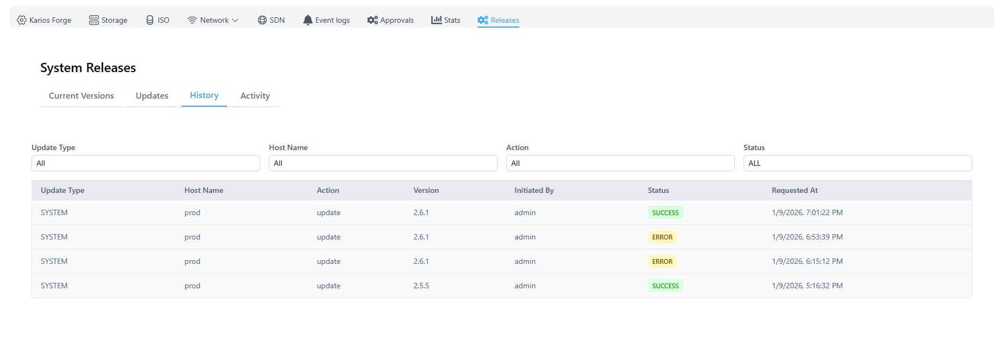
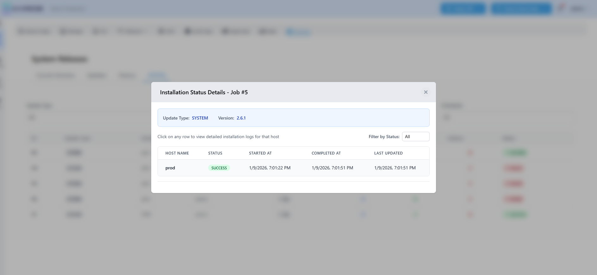

============================
System Updates and Releases
============================

.. contents:: Table of Contents
   :depth: 3
   :local:

Overview
========

The System Updates and Releases component provides update management across your entire Karios infrastructure. This system ensures seamless deployment of updates, patches, and new releases while maintaining system stability and providing complete visibility into the update process.

Update Management
=================

Update Notifications
--------------------

**Notification System:**

.. list-table::
   :widths: 30 70
   :header-rows: 1

   * - Notification Type
     - Description
   * - Dashboard Notifications
     - Update availability notifications displayed in the main interface
   * - Notification Banner
     - Prominent banner alerts for available updates
   * - Real-time Alerts
     - Immediate notification when new updates become available
   * - Update Status
     - Clear indication of update availability and urgency

   Update Notification Banner in Karios ATLAS Interface

Update Types
------------

Karios supports multiple categories of updates:

**System Updates:**

.. list-table::
   :widths: 25 75
   :header-rows: 1

   * - Update Type
     - Description
   * - OS Updates
     - Operating system patches and improvements
   * - Firmware Updates
     - Hardware firmware updates and patches
   * - BIOS Updates
     - System BIOS updates and security patches
   * - API Updates
     - API enhancements and security improvements
   * - Core Updates
     - Core system component updates and fixes

   Supported Update Types in Karios ATLAS

**Update Classifications:** 

.. list-table::
   :widths: 30 70
   :header-rows: 1

   * - Classification
     - Description
   * - Security Updates
     - Critical security patches and vulnerabilities fixes
   * - Feature Updates
     - New functionality and system enhancements
   * - Hotfixes
     - Urgent fixes for critical issues
   * - Maintenance Updates
     - Routine maintenance and optimization updates

   Update Classifications in Karios ATLAS

Update Discovery and Download
=============================

Update Detection
----------------

**Automatic Update Detection:**

.. list-table::
   :widths: 30 70
   :header-rows: 1

   * - Feature
     - Description
   * - Version Monitoring
     - Continuous monitoring of available updates
   * - Release Tracking
     - Automatic tracking of new releases and patches
   * - Compatibility Check
     - Verification of update compatibility with current system
   * - Update Metadata
     - Detailed information about each available update

   Automatic Update Detection in Karios ATLAS

Update Download Process
-----------------------

**Download Management:**

.. list-table::
   :widths: 30 70
   :header-rows: 1

   * - Feature
     - Description
   * - User-Initiated Downloads
     - Manual download triggering by administrators
   * - Secure Downloads
     - Cryptographically signed update packages
   * - Download Verification
     - Signature verification for security and integrity
   * - Storage Management
     - Efficient storage of downloaded update packages

**Download Features:**

* **Progress Tracking:** Real-time download progress monitoring
* **Retry Mechanism:** Automatic retry for failed downloads
* **Download History:** Complete history of downloaded updates

Update Installation
===================

Node Selection and Scheduling
-----------------------------

**Flexible Node Selection:**

.. list-table::
   :widths: 25 75
   :header-rows: 1

   * - Selection Type
     - Description
   * - All Nodes
     - Update all nodes simultaneously
   * - Batch Updates
     - Update nodes in configurable batches or groups
   * - Individual Selection
     - Select specific nodes for targeted updates
   * - Group Management
     - Organize nodes into logical groups for batch processing

**Scheduling Options:**

.. list-table::
   :widths: 30 70
   :header-rows: 1

   * - Schedule Type
     - Description
   * - Immediate Installation
     - Install updates immediately upon selection
   * - Scheduled Updates
     - Schedule updates for specific times and dates
   * - Maintenance Windows
     - Configure maintenance windows for planned updates
   * - Update Coordination
     - Coordinate updates across multiple nodes

Installation Process
--------------------

**Installation Management:**

.. list-table::
   :widths: 30 70
   :header-rows: 1

   * - Management Feature
     - Description
   * - Job Creation
     - Automatic creation of installation jobs for tracking
   * - Asynchronous Processing
     - Non-blocking installation process
   * - Status Tracking
     - Real-time status updates for each installation job
   * - Progress Monitoring
     - Detailed progress tracking per node

**Installation Features:**

* **Signature Verification:** Cryptographic verification of update packages
* **Staged Installation:** Controlled staged installation process
* **Installation Validation:** Post-installation validation and verification
* **Status Reporting:** Comprehensive status reporting throughout the process

Update Monitoring and Progress
==============================

Real-time Monitoring
--------------------

**Progress Tracking:**

.. list-table::
   :widths: 30 70
   :header-rows: 1

   * - Tracking Feature
     - Description
   * - Installation Logs
     - Real-time installation logs for each node
   * - Status Updates
     - Live status updates during installation process
   * - Node-specific Progress
     - Individual progress tracking per node
   * - Installation States
     - Clear indication of installation states (running, failed, success, error)

   Real-time Installation Monitoring in Karios ATLAS

**Monitoring Features:**

* **Live Log Streaming:** Real-time log streaming during installation
* **Error Detection:** Immediate error detection and reporting
* **Status Dashboard:** Centralized status dashboard for all installations
* **Progress Indicators:** Visual progress indicators for ongoing installations

Installation Control
--------------------

**Installation Management:**

.. list-table::
   :widths: 30 70
   :header-rows: 1

   * - Control Feature
     - Description
   * - Cancel Scheduled Updates
     - Ability to cancel scheduled but not yet started updates
   * - Installation Monitoring
     - Monitor active installations across all nodes
   * - Batch Control
     - Manage batch installations and dependencies
   * - Emergency Stop
     - Emergency controls for critical installation issues

Update History and Tracking
===========================

Installation History
--------------------

**Historical Tracking:**

.. list-table::
   :widths: 30 70
   :header-rows: 1

   * - History Feature
     - Description
   * - Per-Node History
     - Complete update history for each node
   * - Installation Logs
     - Detailed logs for all installation attempts
   * - Success/Failure Records
     - Comprehensive record of installation outcomes
   * - Version Tracking
     - Historical version information for each node

**History Features:**

* **Timeline View:** Chronological view of all update activities
* **Filtering Options:** Filter history by node, date, update type, or status
* **Search Capabilities:** Search through installation history and logs
* **Export Options:** Export history data for analysis and reporting

   Installation History Tracking in Karios ATLAS

Version Management
------------------

**Version Information:**

.. list-table::
   :widths: 30 70
   :header-rows: 1

   * - Version Feature
     - Description
   * - Current Versions
     - Display of current version for each node and component
   * - Version Comparison
     - Compare versions across nodes and components
   * - Version Compatibility
     - Compatibility information between different versions
   * - Update Paths
     - Clear update paths and version dependencies

   Version Management in Karios ATLAS

Update Coordination
===================

Multi-Node Updates
------------------

**Coordination Features:**

.. list-table::
   :widths: 30 70
   :header-rows: 1

   * - Feature
     - Description
   * - Cluster Coordination
     - Coordinated updates across cluster nodes
   * - Dependency Management
     - Handling of update dependencies between nodes
   * - Load Balancing
     - Maintain service availability during updates
   * - Service Continuity
     - Ensure service continuity during rolling updates

Security and Integrity
======================

Update Security
---------------

**Security Features:**

.. list-table::
   :widths: 30 70
   :header-rows: 1

   * - Security Feature
     - Description
   * - Cryptographic Signatures
     - Digital signatures for all update packages
   * - Integrity Verification
     - Verification of package integrity before installation
   * - Secure Distribution
     - Secure distribution of update packages
   * - Access Control
     - Role-based access control for update operations

Audit and Compliance
--------------------

**Audit Capabilities:**

.. list-table::
   :widths: 30 70
   :header-rows: 1

   * - Audit Feature
     - Description
   * - Update Auditing
     - Comprehensive auditing of all update activities
   * - Compliance Tracking
     - Track compliance with update policies
   * - Change Management
     - Integration with change management processes
   * - Regulatory Compliance
     - Support for regulatory compliance requirements

Configuration Management
------------------------

**Configuration Options:**

.. list-table::
   :widths: 30 70
   :header-rows: 1

   * - Configuration Option
     - Description
   * - Update Windows
     - Configurable maintenance windows for updates
   * - Notification Settings
     - Customizable notification preferences
   * - Retry Policies
     - Configurable retry policies for failed updates
   * - Bandwidth Limits
     - Network bandwidth management for downloads

Troubleshooting and Support
===========================

Troubleshooting
---------------

**Diagnostic Tools:**

.. list-table::
   :widths: 30 70
   :header-rows: 1

   * - Tool
     - Description
   * - Installation Diagnostics
     - Built-in diagnostic tools for installation issues
   * - Log Analysis
     - Comprehensive log analysis and troubleshooting
   * - Error Recovery
     - Automated error recovery and resolution
   * - Support Integration
     - Integration with support systems for issue resolution