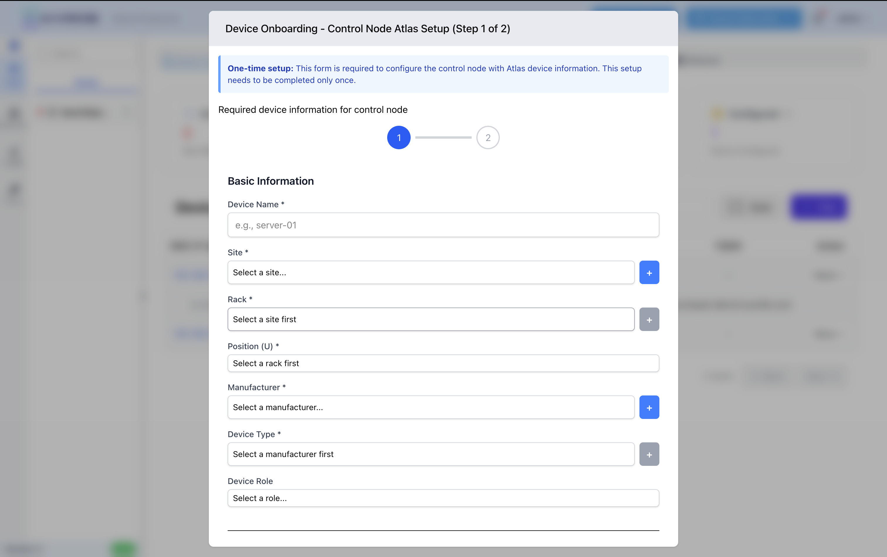
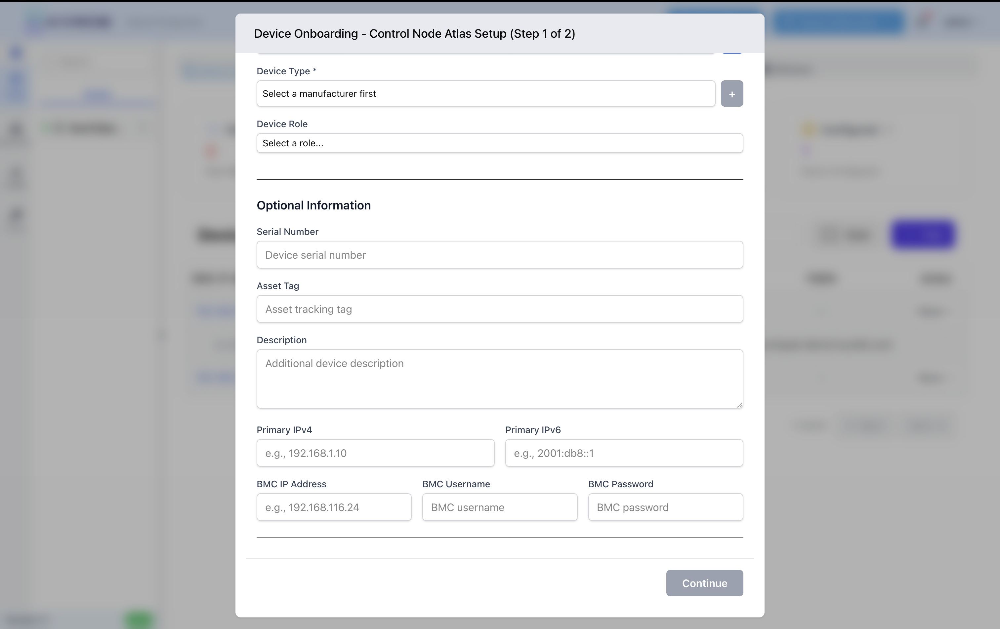

Control Node Registration
==========================

Overview
--------

After first login, Karios ATLAS requires a one-time control node registration. This mandatory setup must be completed before using the system.

.. important::
   This form appears only once after installation and must be completed to proceed. Once submitted, it will not appear again.

Prerequisites
-------------

Have this information ready:

* Device name, site, rack, and position
* Manufacturer and device type
* (Optional) Serial number, asset tag
* (Optional) Primary IPv4/IPv6 addresses
* (Optional) BMC IP, username, and password

Registration Steps
------------------

Step 1: Basic Information (Required)
~~~~~~~~~~~~~~~~~~~~~~~~~~~~~~~~~~~~~

   Control Node Registration Form - Step 1: Basic Information

**Required Fields:**

* **Device Name**: Unique identifier (e.g., ``server-01``)
* **Site**: Physical location (click + to add new)
* **Rack**: Rack location (select site first)
* **Position (U)**: Rack unit position
* **Manufacturer**: Device manufacturer (click + to add new)
* **Device Type**: Device model (select manufacturer first)

**Optional:**

* **Device Role**: Assign a role if needed

Step 2: Optional Information
~~~~~~~~~~~~~~~~~~~~~~~~~~~~~

   Control Node Registration Form - Step 2: Optional Information

**Device Details:**

* **Serial Number**: For asset tracking
* **Asset Tag**: Internal inventory tag
* **Description**: Additional notes

**Network Configuration:**

* **Primary IPv4**: e.g., ``192.168.1.10``
* **Primary IPv6**: e.g., ``2001:db8::1``

**BMC Configuration:**

* **BMC IP Address**: e.g., ``192.168.116.24``
* **BMC Username**: BMC login username
* **BMC Password**: BMC login password

.. tip::
   Providing BMC credentials enables remote power management, console access, and hardware monitoring.

Completing Registration
-----------------------

1. Fill all required fields (marked with \*)
2. Click **Continue** to move to Step 2
3. Complete optional fields as needed
4. Click **Submit** to finalize

After Registration
------------------

Once complete:

* Full access to Karios ATLAS interface
* Control node appears in device inventory
* BMC operations enabled (if credentials provided)
* Network interfaces configured

.. seealso::
   * Installation guide - Initial setup steps
   * User Guide - Managing devices and infrastructure
