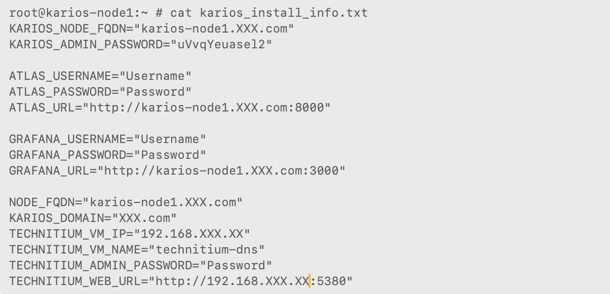
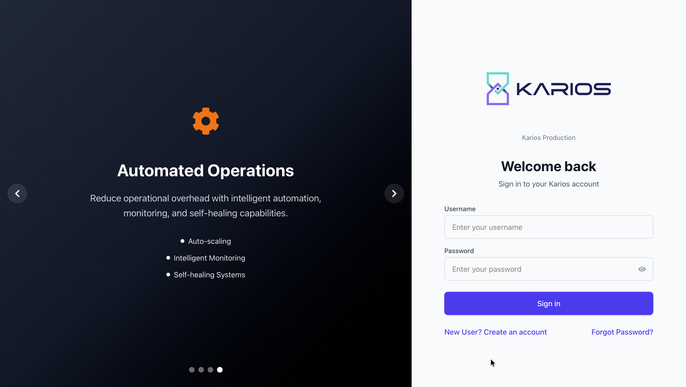

Installation
============

.. meta::
   :description: Complete installation guide for Karios hyper-converged infrastructure platform
   :keywords: Karios, installation, setup, FreeBSD, HCI, hypervisor

Overview
--------

Karios is built on the robust FreeBSD operating system, providing a complete hyper-converged infrastructure solution. The Karios installer contains all necessary packages and components pre-configured for optimal performance and security.

.. note::
   **Last Updated**: January 2026 - Simplified installation with automatic installer.

.. _system-requirements:

System Requirements
-------------------

Security Considerations
~~~~~~~~~~~~~~~~~~~~~~~

Mitigating Spectre & Meltdown Vulnerabilities
^^^^^^^^^^^^^^^^^^^^^^^^^^^^^^^^^^^^^^^^^^^^^

.. important::
   **Tech Tip: Mitigating Spectre & Meltdown Vulnerabilities**
   
   Spectre and Meltdown are hardware vulnerabilities that affect many processors. While mitigations have been implemented in software (kernel patches), they often come with a performance penalty. Newer CPUs generally offer better performance with the mitigations enabled, as they incorporate architectural improvements to reduce the impact.

.. note::
   For more information related to Spectre and Meltdown, please refer to https://meltdownattack.com/

Processor Recommendations
~~~~~~~~~~~~~~~~~~~~~~~~~

**Recommendation:** Avoid older Intel processors (pre-8th generation Core series and pre-Xeon Scalable 1st Generation) and AMD processors (pre-Zen/Zen+ architecture). While software patches can address these vulnerabilities, performance degradation is often significant on older hardware. If you must use an older processor, ensure that the latest microcode updates are installed and thoroughly test the impact on your workloads.

**Processors to Avoid:**

- Intel processors: pre-8th generation Core series
- Intel Xeon: pre-Scalable 1st Generation
- AMD processors: pre-Zen/Zen+ architecture

**If Using Older Processors:**

- Ensure latest microcode updates are installed
- Thoroughly test the impact on your workloads
- Consider performance degradation in capacity planning

Production Hardware Recommendations
~~~~~~~~~~~~~~~~~~~~~~~~~~~~~~~~~~~

.. important::
   We strongly recommend using high-quality server hardware when deploying Karios in production environments. Enterprise-grade hardware ensures reliability, performance, and long-term support for your critical infrastructure.

Minimum Requirements
^^^^^^^^^^^^^^^^^^^^

.. warning::
   These minimum requirements are intended for **evaluation and testing purposes only**. Do not use these specifications for production deployments.

.. list-table:: 
   :header-rows: 1
   :widths: 20 80

   * - Component
     - Specification
   * - **CPU**
     - Intel Core i5 or AMD Ryzen 5 series (6 cores / 12 threads minimum) with VT-x/AMD-V enabled. Clock speed: 3.0 GHz+
   * - **RAM**
     - 16 GB DDR4 2666 MHz. This is the absolute floor. You'll be very limited in VM sizes and concurrency
   * - **Storage**
     - 256GB NVMe SSD (for FreeBSD + VMs). Consider a second, smaller SSD for boot/root filesystem to isolate it from potential VM disk issues
   * - **Network Card**
     - Gigabit Ethernet
   * - **Notes**
     - This is barely sufficient for basic testing and experimentation. Performance will be constrained, and you'll need to carefully manage resources. Not suitable for anything approaching a mission-critical workload

Recommended Configuration
^^^^^^^^^^^^^^^^^^^^^^^^^

.. note::
   Quality Test Environment Essential - Use reliable hardware to ensure accurate testing results and valid performance assessments

.. list-table:: 
   :header-rows: 1
   :widths: 20 80

   * - Component
     - Specification
   * - **CPU**
     - Intel Core i7 or AMD Ryzen 7 series (8 cores / 16 threads minimum). Clock speed: 3.5 GHz+
   * - **RAM**
     - 32 GB DDR4 3200 MHz or faster. This provides more breathing room for VMs and the host OS
   * - **Storage**
     - 512GB - 1TB NVMe SSD (or a RAID-Z1/RAID-Z2 array of two NVMe drives) for data storage. A separate 128GB boot drive is highly recommended. Crucially, use ZFS
   * - **Network Card**
     - Dual Gigabit Ethernet ports configured in LACP (Link Aggregation Control Protocol) for increased bandwidth and redundancy
   * - **Notes**
     - This configuration allows you to run a reasonable number of VMs with acceptable performance. RAID-Z1/RAID-Z2 provides data protection against single drive failure. LACP adds network redundancy. Still, mission-critical workloads require more robust solutions

Ideal Configuration
^^^^^^^^^^^^^^^^^^^

.. important::
   Mission Critical - High Availability & Performance

.. list-table:: 
   :header-rows: 1
   :widths: 20 80

   * - Component
     - Specification
   * - **CPU**
     - Intel Xeon or AMD EPYC series (16+ cores / 32+ threads). Clock speed: 4.0 GHz+. Consider a dual-socket configuration for increased processing power and redundancy
   * - **RAM**
     - 64 GB DDR4/DDR5 3200 MHz or faster ECC Registered RAM. ECC (Error Correcting Code) is essential for data integrity in mission-critical environments. Registered RAM provides better stability with higher capacities
   * - **Storage**
     - 1TB - 2TB NVMe SSDs configured in a RAID-Z2/RAID-Z3 array. Consider using enterprise-grade drives designed for continuous operation. A separate boot drive with ZFS is highly recommended
   * - **Network Card**
     - Dual or Quad 10 Gigabit Ethernet ports configured in LACP with redundant switches
   * - **Power Supply**
     - Redundant power supplies (RPS) to ensure continuous operation even if one PSU fails
   * - **Hardware Watchdog**
     - Implement a hardware watchdog timer to automatically reboot the system in case of software hangs or crashes

Pre-Installation Planning
-------------------------

.. important::
   **MANDATORY REQUIREMENT**: Internet connectivity is required during installation.

Understanding Virtualization Constraints
~~~~~~~~~~~~~~~~~~~~~~~~~~~~~~~~~~~~~~~~

Critical Platform Dependencies
~~~~~~~~~~~~~~~~~~~~~~~~~~~~~~

.. warning::
   **Hardware Dependency Requirements**
   Understanding these constraints is essential for successful Karios deployment and optimal virtualization performance.

Bhyve Hardware Dependencies
~~~~~~~~~~~~~~~~~~~~~~~~~~~

.. important::
   **Bhyve is Hardware Dependent**
   Unlike some other virtualization solutions, Bhyve relies heavily on hardware features like Intel VT-x or AMD-V for efficient operation. Without these hardware features, performance will be abysmal and effectively unusable.

**Required Hardware Features:**

- **Intel VT-x**: Essential for Intel-based systems
- **AMD-V**: Required for AMD-based systems
- **Hardware Virtualization Support**: Must be enabled in BIOS/UEFI
- **Performance Impact**: Missing hardware support renders virtualization unusable

Resource Planning Considerations
~~~~~~~~~~~~~~~~~~~~~~~~~~~~~~~~

.. note::
   **Host System Resources are Shared**
   The host system (Karios) needs sufficient resources to function alongside the virtual machines (VMs) you create. When planning your deployment, ensure you calculate virtual machine overhead in addition to VM resource requirements.

**Resource Planning Guidelines:**

- Reserve adequate CPU cores for the host system
- Allocate sufficient RAM for host operations
- Account for storage I/O overhead
- Plan network bandwidth for host management traffic
- Consider hypervisor overhead in total resource calculations

Nested Virtualization Limitations
~~~~~~~~~~~~~~~~~~~~~~~~~~~~~~~~~~

.. warning::
   **Production Deployment Restrictions**
   While technically possible, nested virtualization (running Bhyve inside another hypervisor like VMware or VirtualBox) is generally not recommended for production use due to significant performance overhead.

**Nested Virtualization Constraints:**

- **Performance Overhead**: Substantial performance degradation
- **Not Production Ready**: Unsuitable for mission-critical workloads
- **Testing Only**: Acceptable for development and testing scenarios
- **Hardware Requirements**: These specifications assume direct hardware installation

**Deployment Recommendations:**

.. list-table:: 
   :header-rows: 1
   :widths: 30 35 35

   * - Scenario
     - Recommendation
     - Use Case
   * - **Direct Hardware Installation**
     - **Recommended** - Optimal performance
     - Production, mission-critical workloads
   * - **Nested Virtualization**
     - **Not Recommended** - Performance penalty
     - Development, testing, lab environments only
   * - **Cloud Infrastructure**
     - **Evaluate carefully** - Provider dependent
     - Ensure hypervisor or optimized virtualization

Planning Considerations
~~~~~~~~~~~~~~~~~~~~~~~

**Before Deployment:**

1. **Verify Hardware Compatibility**
   - Confirm VT-x/AMD-V support
   - Check BIOS/UEFI settings
   - Validate hardware feature availability

2. **Calculate Resource Requirements**
   - Host system overhead
   - Virtual machine resource needs
   - Network and storage I/O requirements
   - Management interface resources

3. **Avoid Nested Scenarios**
   - Plan for direct hardware installation
   - Consider performance implications
   - Evaluate alternative solutions for testing environments

Preparing Your Hardware and Software
~~~~~~~~~~~~~~~~~~~~~~~~~~~~~~~~~~~~~

Before you begin installing Karios, careful preparation is crucial for a smooth and successful deployment. This section outlines the necessary hardware checks, software downloads, and USB drive creation process.

Hardware Requirements Verification
^^^^^^^^^^^^^^^^^^^^^^^^^^^^^^^^^^^

.. note::
   For detailed hardware requirements, refer to the :ref:`system-requirements` section.

**Hardware Compatibility**

While Karios supports a wide range of hardware, we maintain a list of tested and validated configurations. Consult the hardware compatibility documentation before proceeding if you have specific concerns about hardware compatibility.

BIOS/UEFI Settings
^^^^^^^^^^^^^^^^^^

**Essential BIOS Settings for Bhyve with Advanced Features**

.. important::
   **GPU Pass-through and Advanced Virtualization Configuration**
   The following BIOS/UEFI settings are essential for optimal bhyve performance with advanced features such as GPU pass-through.

**Required Settings**

.. list-table:: 
   :header-rows: 1
   :widths: 30 70

   * - Setting
     - Configuration
   * - **Virtualization Technology (VT-x/AMD-V)**
     - **Enable** - Crucial for virtualization functionality
   * - **IOMMU (VT-d/AMD-Vi)**
     - **Enable** - Required for direct device assignment and GPU pass-through
   * - **Above 4G Decoding**
     - **Enable** - Necessary for larger memory addressing capabilities
   * - **SR-IOV**
     - **Enable** (Optional) - Improves performance when supported by hardware
   * - **Resizable BAR**
     - **Enable** (Optional) - Provides potential performance boost with compatible hardware
   * - **CSM (Compatibility Support Module)**
     - **Consider Disabling** - Try disabling for UEFI boot mode (proceed with caution)
   * - **Secure Boot**
     - **Consider Disabling** - May interfere with bhyve operation; disable if needed

Critical Configuration Notes
^^^^^^^^^^^^^^^^^^^^^^^^^^^^

.. warning::
   Incorrect BIOS/UEFI settings can prevent the system from booting. Always proceed with extreme caution when modifying these settings.

**Essential Preparation Steps:**

1. **Consult Motherboard Manual**
   - BIOS settings vary significantly by manufacturer and model
   - Refer to specific documentation for your hardware

2. **Update BIOS/UEFI Firmware**
   - Install latest BIOS version for improved compatibility
   - Recent updates often include bug fixes and enhanced virtualization support

3. **Research IOMMU Grouping**
   - Verify proper GPU isolation capabilities
   - Ensure IOMMU groups support your intended device pass-through configuration
   - Test IOMMU grouping before deployment

**Best Practices**

**Pre-Configuration Checklist:**

- Document current BIOS settings before making changes
- Update BIOS/UEFI to latest stable version
- Verify hardware compatibility with intended virtualization features
- Research motherboard-specific IOMMU limitations
- Plan rollback procedures in case of boot issues

**Post-Configuration Validation:**

- Verify successful boot after each setting change
- Test virtualization functionality incrementally
- Validate IOMMU device grouping
- Confirm GPU pass-through capabilities if required

Downloading the Karios ISO (Roadmap Ahead)
^^^^^^^^^^^^^^^^^^^^^^^^^^^^^^^^^^^^^^^^^^^^^^^^^

.. important::
   **Always Use Latest KariosBSD Release**
   
   Karios requires the latest stable KariosBSD release for optimal security, performance, and hardware compatibility. Always download KariosBSD 14.3 or the most current stable release available.

**Download Steps:**

1. Navigate to the official KariosBSD download page: https://
2. **Download KariosBSD 14.3** (or latest stable version)
3. **Recommended ISO**: Use `KariosBSD-14.3-RELEASE-amd64-disc1.iso` for complete offline installation
4. If unsure about architecture, consult with your system administrator

**Why Latest Release Matters:**

- **Security Updates**: Latest patches and vulnerability fixes
- **Hardware Support**: Improved driver support for newer hardware
- **Performance**: Optimized kernel and system components
- **Compatibility**: Best compatibility with Karios components
- **Long-term Support**: Extended maintenance and update lifecycle

Creating a Bootable USB Drive
^^^^^^^^^^^^^^^^^^^^^^^^^^^^^

**Recommended Software**

- **Rufus** (Windows)
- **Etcher** (Cross-platform) 
- **dd** command (Linux/macOS)

**Rufus Instructions (Windows)**

1. Download and run Rufus
2. Select your USB drive from the "Device" dropdown menu

.. warning::
   All data on the selected USB drive will be erased.

3. Click the "SELECT" button and browse to the downloaded KariosBSD 14.3 ISO file
4. Set partition scheme to "MBR" or "GPT" based on your system's BIOS/UEFI settings

.. tip::
   If unsure, try GPT first for newer systems.

5. Click "START" and confirm any warnings about data loss

**Etcher Instructions (Cross-Platform)**

1. Download and run Etcher
2. Click "Flash from file" and select the KariosBSD 14.3 ISO file
3. Select your USB drive as the target device
4. Click "Flash!"

**dd Command Instructions (Linux/macOS)**

.. code-block:: bash

   # Replace /dev/sdX with your USB drive identifier
   # Use 'lsblk' or 'fdisk -l' to identify the correct drive
   sudo dd if=KariosBSD-14.3-RELEASE-amd64-disc1.iso of=/dev/sdX bs=4M status=progress
   sudo sync

Installation Process
--------------------

**Complete Installation Overview**

For new users, here's the complete installation process from start to finish:

.. important::
   **Installation Summary Checklist**
   
   **Phase 1: Preparation**
   ✓ Download Karios BSD ISO from https://download.karios.ai/kariosbsd-14.3-custom.iso
   ✓ Verify checksum and create bootable USB drive
   ✓ Configure BIOS/UEFI settings (enable VT-x/AMD-V, IOMMU)
   
   **Phase 2: Karios BSD Installation**
   ✓ Boot from USB drive
   ✓ Follow the automated installer prompts
   ✓ **CRITICAL**: Select "Auto (ZFS)" - NOT UFS
   ✓ Configure ZFS with proper swap size formula: (RAM × 1.5) + 2GB
   ✓ Enable ALL security hardening options
   ✓ Create user account and add to wheel group
   ✓ Verify ZFS after reboot: `zpool status`
   ✓ Access web interface after completion

.. _filesystem-requirements:

Critical Filesystem Requirements
~~~~~~~~~~~~~~~~~~~~~~~~~~~~~~~~

.. important::
   **ZFS Filesystem Requirement**
   
   Karios requires ZFS to be installed and will not work on KariosBSD systems installed with UFS. Please ensure you select ZFS.

**Why ZFS is Required:**

- **Storage Management**: Karios storage pools depend on ZFS features
- **Snapshot Technology**: VM snapshots require ZFS snapshot capabilities  
- **Data Integrity**: ZFS checksumming is essential for data protection
- **Performance**: ZFS caching and compression optimize VM performance
- **Replication**: Backup and replication features require ZFS send/receive

.. warning::
   **Installation Failure Modes**
   
   Installing Karios on UFS will cause:
   - Storage pool creation failures
   - VM creation and management failures  
   - Backup and snapshot system failures
   - Complete system unusability requiring full reinstallation

Understanding ZFS RAID Levels and Configuration
~~~~~~~~~~~~~~~~~~~~~~~~~~~~~~~~~~~~~~~~~~~~~~~

**Critical Knowledge for Operators**

Before proceeding with installation, operators must understand ZFS RAID levels and their implications for system reliability, performance, and storage capacity.

.. important::
   **Hardware Requirements for ZFS RAID**
   
   For mirror and RAID configurations, disks **MUST** be:
   - **Same physical size** (exact same capacity in bytes)
   - **Same model and manufacturer** (identical part numbers recommended)
   - **Same interface type** (all SATA or all NVMe)
   - **Same performance characteristics** (RPM for spinning disks, similar specs for SSDs)

**ZFS Pool Types Explained:**

.. list-table:: ZFS RAID Configuration Guide
   :header-rows: 1
   :widths: 15 20 20 25 20

   * - RAID Type
     - Minimum Disks
     - Fault Tolerance
     - Storage Efficiency
     - Use Case
   * - **Stripe**
     - 1 disk
     - **None** - Single disk failure = total data loss
     - 100% of disk space
     - Testing, evaluation, single-disk systems
   * - **Mirror**
     - 2 identical disks
     - **1 disk failure** tolerated
     - 50% of total disk space
     - **Production recommended** - High reliability
   * - **RAIDZ1**
     - 3+ disks
     - **1 disk failure** tolerated
     - ~67-90% depending on disk count
     - General production use
   * - **RAIDZ2**
     - 4+ disks
     - **2 disk failures** tolerated
     - ~50-85% depending on disk count
     - **Mission-critical** systems
   * - **RAIDZ3**
     - 5+ disks
     - **3 disk failures** tolerated
     - ~40-80% depending on disk count
     - Ultra-high availability systems

**Stripe Configuration (Single Disk):**

.. warning::
   **No Redundancy - Data Loss Risk**
   
   Stripe configuration provides no protection against disk failure. Any disk failure results in complete data loss. Only use for testing or evaluation environments.

**Mirror Configuration (Recommended for Production):**

.. note::
   **Mirror Requirements for Optimal Performance**
   
   - **Identical disks required**: Use exact same model, capacity, and manufacturer
   - **Performance**: Reads are faster (load balanced), writes are slightly slower
   - **Capacity**: Only 50% of total disk space available
   - **Reliability**: System continues operating with one disk failure
   - **Recovery**: Failed disk can be replaced and automatically resilvered

**RAIDZ Configurations (Software RAID-5/6 equivalent):**

- **RAIDZ1**: Similar to RAID-5, requires minimum 3 disks, tolerates 1 failure
- **RAIDZ2**: Similar to RAID-6, requires minimum 4 disks, tolerates 2 failures  
- **RAIDZ3**: Advanced configuration, requires minimum 5 disks, tolerates 3 failures

**Disk Selection Best Practices:**

1. **Purchase identical disks in sets** - Same part number, same batch if possible
2. **Test disks before installation** - Run disk health checks
3. **Keep spare disk available** - For quick replacement in RAID configurations
4. **Document disk serial numbers** - For tracking and warranty purposes
5. **Avoid mixing disk types** - Don't mix SSDs with HDDs in same pool

ZFS Swap Calculation Formula
~~~~~~~~~~~~~~~~~~~~~~~~~~~~

**Critical for ZFS Root Installations**

ZFS requires specific swap calculations for optimal performance and system stability.

.. important::
   **ZFS Swap Calculation Formula**
   
   **Recommended Swap Size = 1.5 × RAM + 2GB**
   
   **Examples:**
   - 16GB RAM: (16 × 1.5) + 2 = **26GB swap**
   - 32GB RAM: (32 × 1.5) + 2 = **50GB swap**  
   - 64GB RAM: (64 × 1.5) + 2 = **98GB swap**
   - 128GB RAM: (128 × 1.5) + 2 = **194GB swap**

**Why This Formula:**

- **ZFS ARC Cache**: ZFS uses large amounts of RAM for caching
- **System Stability**: Prevents memory pressure during heavy VM loads  
- **Crash Dumps**: Ensures sufficient space for kernel crash dumps
- **VM Overcommit**: Allows for memory overcommitment in virtualization
- **Performance**: Reduces disk I/O during memory pressure

**Swap Configuration Notes:**

- **Mirror Swap**: In mirrored configurations, swap should also be mirrored
- **Performance Impact**: Insufficient swap can cause system instability
- **Monitoring**: Monitor swap usage in production environments

Karios BSD Installation with ZFS
~~~~~~~~~~~~~~~~~~~~~~~~~~~~~~~~~

**Step-by-Step ZFS Installation Process**

Follow these specific steps during the Karios BSD installation phase to ensure ZFS is properly configured:

**Phase 1: KariosBSD Base Installation with ZFS**

1. **Boot from USB Drive**
   - Insert the USB drive and boot from it

.. figure:: _static/images/freebsd-installation/welcome-menu.png
   :width: 600
   :alt: Karios BSD installer welcome menu

2. **Installer Welcome Screen**
   - Select "Install" from the KariosBSD installer menu
   - Press Enter to continue with installation

.. figure:: _static/images/freebsd-installation/welcome-menu_install.png
   :width: 600
   :alt: FreeBSD installer welcome menu

3. **Keymap Selection**
   - Select appropriate keymap for your region
   - Press Enter to continue

.. figure:: _static/images/freebsd-installation/key_map.png
   :width: 600
   :alt: FreeBSD installer welcome menu

4. **Hostname Configuration**
   - Enter your desired hostname (e.g., "karios-node01")
   - Press Enter to continue

.. figure:: _static/images/freebsd-installation/hostname-configuration.png
   :width: 600
   :alt: Hostname configuration screen

5. **Distribution Selection**
   - **Uncheck all optional components** or keep only "kernel-dbg" and "lib32" if desired
   - Use spacebar to select/deselect components
   - Press Enter to continue

.. figure:: _static/images/freebsd-installation/component-selection.png
   :width: 600
   :alt: Component selection screen

.. note::
   **Optional Components**
   
   You can optionally keep these components checked:
   - **kernel-dbg**: Kernel debug symbols for system analysis
   - **lib32**: 32-bit compatibility libraries for legacy applications
   
   All other components (base-dbg, ports, src) are not required for Karios operation.

6. **MANDATORY: Partitioning and ZFS Setup**

.. warning::
   **STOP: Critical Filesystem Selection**
   
   This is the most critical step. Selecting the wrong option will brick your Karios installation.

**Partitioning Menu Options:**

.. figure:: _static/images/freebsd-installation/partitioning-choices.png
   :width: 600
   :alt: Partitioning choices menu showing Auto (ZFS) option

.. code-block:: text

   Partitioning
   
   How would you like to partition your disk?
   
   [ ] Auto (UFS)         ← DO NOT SELECT THIS
   [X] Auto (ZFS)         ← SELECT THIS OPTION
   [ ] Manual
   [ ] Shell

**ZFS Configuration Steps:**

a. **Select "Auto (ZFS)"** - This is mandatory for Karios

b. **ZFS Configuration Menu:**

.. figure:: _static/images/freebsd-installation/zfs-configuration-menu.png
   :width: 600
   :alt: ZFS configuration menu with pool settings

   ZFS Configuration Menu

.. code-block:: text

   ZFS Configuration
   
   T Pool Type/Disks:    stripe: 1 disk
   - Rescan Devices
   - Disk Info  
   - Pool Name          zroot
   - Force 4K Sectors?  YES
   - Encrypt Disks?     NO (recommended for first installation)
   - Partition Scheme   GPT (UEFI)
   - Swap Size          [CALCULATE USING FORMULA]
   - Mirror Swap?       NO
   - Encrypt Swap?      NO

**Swap Size Configuration:**

.. important::
   **Use ZFS Swap Formula**
   
   **Calculate: (RAM in GB × 1.5) + 2GB**
   
   **Examples for common configurations:**
   - 16GB RAM → **26GB** swap (enter: 26g)
   - 32GB RAM → **50GB** swap (enter: 50g)
   - 64GB RAM → **98GB** swap (enter: 98g)
   - 128GB RAM → **194GB** swap (enter: 194g)

.. warning::
   **Critical Swap Sizing**
   
   Incorrect swap sizing can cause:
   - System instability under load
   - VM creation failures
   - Memory allocation errors
   - Poor ZFS performance

c. **Pool Type Selection** (choose based on your hardware):

.. figure:: _static/images/freebsd-installation/zfs-pool-type.png
   :width: 600
   :alt: ZFS pool type selection menu

   ZFS Pool Type Selection Menu

.. list-table:: 
   :header-rows: 1
   :widths: 25 75

   * - Configuration
     - When to Use
   * - **stripe: 1 disk**
     - Single disk installation (testing/evaluation)
   * - **mirror: 2 disks**  
     - Two identical disks (recommended for production)
   * - **raidz1: 3+ disks**
     - Three or more disks with single parity
   * - **raidz2: 4+ disks**
     - Four or more disks with double parity (high availability)

d. **Disk Selection:**
   - Use spacebar to select your target disk(s)
   - Verify correct disks are selected
   - **WARNING**: All data on selected disks will be destroyed

.. figure:: _static/images/freebsd-installation/zfs-disk-selection.png
   :width: 600
   :alt: ZFS disk selection screen

e. **Final ZFS Configuration:**
   - Review all settings carefully
   - Ensure "Pool Name" is set to "zroot"
   - Press Enter to proceed

f. **Confirmation:**
   - **LAST CHANCE**: Verify ZFS configuration is correct
   - Type "YES" to proceed with disk formatting
   - Installation will begin

.. figure:: _static/images/freebsd-installation/zfs-final-warning.png
   :width: 600
   :alt: ZFS final warning before installation begins

g. **Checksum Verification:**
   - Installer will verify ISO checksum
   - Wait for verification to complete

.. figure:: _static/images/freebsd-installation/checksum-verificaton.png
   :width: 600
   :alt: Checksum verification screen

h. **Archive Extraction:**
   - Installer will extract and install selected components
   - This may take several minutes

.. figure:: _static/images/freebsd-installation/extraction.png
   :width: 600
   :alt: Extraction progress screen

7. **Continue Standard Installation**
   - Set root password
   - Configure network interfaces  

.. figure:: _static/images/freebsd-installation/configure_network.png
   :width: 600
   :alt: Configure network interface screen

7a. **Continue Standard Installation**
   - Select time zone

.. figure:: _static/images/freebsd-installation/time_zone.png
   :width: 600
   :alt: Configure time zone screen

8. **Complete Installation**
   - Enable system services (sshd recommended)
   - Add users if desired
   - Apply configuration and exit installer

9. **Reboot Verification**
   - Remove USB drive when prompted
   - Allow system to reboot
   - Verify ZFS boot by checking: `zpool status`

**ZFS Verification Commands**

After KariosBSD installation completes, verify ZFS is properly configured:

.. code-block:: bash

   # Verify ZFS pool exists and is healthy
   zpool status
   
   # Should show output similar to:
   #   pool: zroot
   #   state: ONLINE
   
   # Verify ZFS filesystems
   zfs list
   
   # Should show zroot filesystem tree
   
   # Verify ZFS is mounted as root
   df -h /
   
   # Should show /dev/zvol/zroot/... as root filesystem

**Common ZFS Installation Issues**

.. list-table:: 
   :header-rows: 1
   :widths: 30 70

   * - Issue
     - Solution
   * - **"Auto (UFS)" was selected**
     - Restart installation from beginning, select "Auto (ZFS)"
   * - **ZFS pool won't create**
     - Verify disk has no existing partitions, use "Shell" to wipe disk with `gpart destroy -F ada0`
   * - **Boot failure after installation**
     - Verify UEFI boot mode is enabled in BIOS, check for GPT partition scheme
   * - **"zpool status" shows errors**
     - Restart installation, verify disk health before proceeding

Karios Bootstrap Auto-Installation
~~~~~~~~~~~~~~~~~~~~~~~~~~~~~~~~~~

The Karios installation follows a two-phase process:

**Phase 1: Karios BSD Base Installation with ZFS** ✓ Completed Above

**Phase 2: Karios Bootstrap**

.. figure:: _static/images/freebsd-installation/second_welcome.png
   :width: 600
   :alt: Second Bootstrap welcome screen

After KariosBSD installation is complete, bootstrap automatically installs and configures Karios components:

.. tip::
   **What is Bootstrap?** A bootstrap script is an automated installer that downloads and configures all necessary software components. It eliminates manual setup by handling package installation, configuration, and service initialization automatically.

**Understanding Privilege Escalation Security**

.. tip::
   **Why Privilege Escalation Matters**
   
   Running commands as root (superuser) provides unlimited system access, which creates significant security risks. Privilege escalation tools like sudo and doas allow users to execute specific commands with elevated privileges while maintaining security controls and accountability.

**Sudo: Industry Standard Privilege Escalation**

**Sudo (Superuser Do)** is the most widely used privilege escalation tool across Unix and Linux systems, providing comprehensive security features:

**Core Security Features:**

- **Audit Trails and Logging**: Every sudo command is logged with timestamps, user information, command executed, and working directory.

- **Time-Limited Sessions**: Sudo sessions expire automatically (default 5 minutes), requiring re-authentication for continued access. This minimizes the window of exposure if a session is compromised.

- **User Accountability**: Commands are always traced to specific user accounts, enabling forensic analysis and compliance reporting. Unlike direct root access, you always know who executed what command and when.

- **Granular Permission Control**: Administrators can precisely control which users can execute which commands, on which hosts, and under what conditions. This supports the principle of least privilege.

- **Environment Management**: Sudo can sanitize environment variables, preventing privilege escalation through environment manipulation attacks.

- **Plugin Architecture**: Supports plugins for advanced authentication (LDAP, Kerberos), logging, and policy enforcement.

**Security Recommendations:**

- **Use sudo for**: Complex environments requiring granular control, extensive logging, or plugin support
- **Avoid direct root for**: Any multi-user environment or production system where accountability and security are required

Auto-Bootstrap Installation 
~~~~~~~~~~~~~~~~~~~~~~~~~~~~~~~~~~~~~~~~~

After completing the KariosBSD installation with ZFS, the system will automatically initiate the Karios bootstrap process upon first boot.

.. figure:: _static/images/freebsd-installation/bootstrap1.png
   :width: 600
   :alt: Karios installation initiated  

.. figure:: _static/images/freebsd-installation/bootstrap2.png
   :width: 600
   :alt: Bootstrap installation initiated  

.. figure:: _static/images/freebsd-installation/bootstrap3.png
   :width: 600
   :alt: Bootstrap installation initiated  

.. figure:: _static/images/freebsd-installation/bootstrap4.png
   :width: 600
   :alt: Bootstrap installation initiated  

**User Account Creation Requirements**

.. important::
   **Administrative User Configuration**
   
   During FreeBSD installation, when prompted to create user accounts, **ALL** users must be added to the `wheel` group for proper administrative access in Karios environments.

**User Creation Best Practices:**

.. list-table:: User Account Requirements
   :header-rows: 1
   :widths: 30 70

   * - Setting
     - Required Configuration
   * - **Username**
     - Use descriptive, unique usernames (e.g., admin, karios-admin)
   * - **Full Name**
     - Complete administrator name for accountability
   * - **Login Group**
     - Leave blank (default user group will be created)
   * - **Additional Groups**
     - **MANDATORY**: Enter `wheel` for administrative privileges
   * - **Shell**
     - Recommend: `/bin/sh` or `/bin/tcsh` for reliability
   * - **Password**
     - Strong password required (complex, minimum 12 characters)
   * - **Account Status**
     - Do NOT lock account after creation

.. warning::
   **Wheel Group Requirement**
   
   Users **must** be added to the `wheel` group during installation. This provides:
   - `sudo` access capabilities
   - Administrative command execution
   - System configuration privileges
   - Karios management interface access
   
   **Without wheel group membership, users cannot perform administrative tasks required for Karios operation.**

.. code-block:: bash

   # Verify bootstrap installation logs
   cat /var/log/bootstrap_ansible.log
   
   # Verify network security configuration
   netstat -an | grep LISTEN

.. note::
   The bootstrap script automatically installs and configures all Karios components, security settings and service dependencies.

**Karios Configuration Completed**

.. figure:: _static/images/freebsd-installation/credentials.png
   :width: 600
   :alt: Bootstrap installation completed with credentials screen 

Upon successful completion of the bootstrap installation, you will see a configuration summary screen displaying all system credentials and access information:

.. important::
   **CRITICAL: Save These Credentials Immediately!**
   
   The configuration completion screen displays all default credentials for Karios components. **You must save these credentials before proceeding** as they are required to access and manage your Karios system.

**Credentials Displayed on Completion Screen:**

.. list-table:: Karios System Credentials
   :header-rows: 1
   :widths: 30 25 25 20

   * - Component
     - Username
     - Password
     - Port/URL
   * - **Karios HCI Admin**
     - admin
     - (displayed on screen)
     - https://karios-node01.XXX.com
   * - **Karios ATLAS (NetBox)**
     - admin
     - (displayed on screen)
     - http://karios-node01.XXX.com:8000
   * - **Grafana Monitoring**
     - admin
     - (displayed on screen)
     - http://karios-node01.XXX.com:3000

.. warning::
   **Security Best Practice**
   
   - **Save all credentials immediately** in a secure password manager
   - **Do not share credentials** via insecure channels (email, chat, etc.)
   - **Document the access URLs** with their respective ports for future reference

**Access Information:**

The completion screen will display:

- **Karios Management Interface**: Primary HCI administration portal
- **ATLAS/NetBox Interface**: Network and infrastructure documentation system
- **Grafana Monitoring Interface**: System metrics and performance dashboards

.. code-block:: text

   ================================================================
   ▣ Karios HCI Platform Successfully Deployed! ▣
   ================================================================
   
   ================================================================
                    SAVE THESE CREDENTIALS IMMEDIATELY!
   ================================================================
   
   Karios HCI Admin Credentials:
     Username: admin
     Password: [generated_password]
   
   Karios ATLAS (NetBox) Credentials:
     Username: admin
     Password: [generated_password]
   
   Grafana Monitoring Credentials:
     Username: admin
     Password: [generated_password]
   
   Karios Management Interface: https://karios-node01.XXX.com
   ATLAS/NetBox Interface: http://karios-node01.XXX.com:8000
   Grafana Monitoring Interface: http://karios-node01.XXX.com:3000
   
   ▣  CRITICAL: Save these credentials before proceeding!
   
   Press Enter to exit...

**Post-Credential Save Actions:**

1. **Document all credentials** in your organization's secure credential management system
2. **Test access** to each interface using the provided credentials

**Reinstallation Security Considerations**

If the system prompts about reinstallation during bootstrap execution:

.. warning::
   **Security Recommendation**: Change all default passwords immediately after first login. Store your credentials securely and restrict access to the ``karios_install_info.txt`` file.

Post-Installation Configuration
-------------------------------

**Installation Success Verification**

After installation completion, verify your Karios installation:

.. code-block:: bash

   # Verify all Karios services are running
   service karios_core status
   service karios_license status
   service karios_rms status
   service karios_rms_client status
   service kshield status
   
   # Check if all Karios services are listening on their ports
   sockstat -l | grep karios
   # Should show:
   # karios_core on port 8080 (main web interface)
   # karios_license on port 8069 (licensing service)
   # karios_rms on port 9094 (RMS management)
   # karios_rms_client on port 9096 (RMS client)
   
   # Check security shield service
   sockstat -l | grep kshield
   # Should show kshield on port 9592
   
   # Verify ZFS pools are healthy
   zpool status
   
   # Check system logs for any errors
   tail -n 50 /var/log/messages

**Expected Results:**
- All Karios services should show "running" status
- Ports 8080, 8069, 9094, 9096, and 9592 should be listening
- ZFS pool should show "ONLINE" status  
- No critical errors in system logs

Retrieving Saved Credentials
~~~~~~~~~~~~~~~~~~~~~~~~~~~~~

If you need to retrieve the system credentials after installation, all credentials are saved in a text file on the Karios node.

.. important::
   **Credential Storage Location**
   
   All installation credentials are automatically saved to ``/root/karios_install_info.txt`` for future reference.

**To View Saved Credentials:**

.. code-block:: bash

   # Login as root or use sudo to view the credentials file
   cat /root/karios_install_info.txt

**Credential File Contents:**

The ``karios_install_info.txt`` file contains all system access credentials and URLs:

.. code-block:: text

   KARIOS_NODE_FQDN="karios-node1.example.com"
   KARIOS_ADMIN_PASSWORD="[generated_password]"
   
   ATLAS_USERNAME="admin"
   ATLAS_PASSWORD="[generated_password]"
   ATLAS_URL="http://karios-node1.example.com:8000"
   
   GRAFANA_USERNAME="admin"
   GRAFANA_PASSWORD="[generated_password]"
   GRAFANA_URL="http://karios-node1.example.com:3000"
   
   NODE_FQDN="karios-node1.example.com"
   KARIOS_DOMAIN="example.com"
   TECHNITIUM_VM_IP="192.168.x.xx"
   TECHNITIUM_VM_NAME="technitium-dns"
   TECHNITIUM_ADMIN_PASSWORD="[generated_password]"
   TECHNITIUM_WEB_URL="http://192.168.x.xx:5380"

**Information Stored in Credentials File:**

.. list-table:: 
   :header-rows: 1
   :widths: 35 65

   * - Credential/Setting
     - Description
   * - **KARIOS_NODE_FQDN**
     - Fully Qualified Domain Name of the Karios node
   * - **KARIOS_ADMIN_PASSWORD**
     - Password for Karios HCI administrative interface
   * - **ATLAS_USERNAME**
     - Username for ATLAS/NetBox infrastructure documentation system
   * - **ATLAS_PASSWORD**
     - Password for ATLAS/NetBox system
   * - **ATLAS_URL**
     - Complete URL to access ATLAS interface (port 8000)
   * - **GRAFANA_USERNAME**
     - Username for Grafana monitoring dashboards
   * - **GRAFANA_PASSWORD**
     - Password for Grafana monitoring system
   * - **GRAFANA_URL**
     - Complete URL to access Grafana interface (port 3000)
   * - **NODE_FQDN**
     - Node Fully Qualified Domain Name
   * - **KARIOS_DOMAIN**
     - Domain name for the Karios deployment
   * - **TECHNITIUM_VM_IP**
     - IP address of the Technitium DNS virtual machine
   * - **TECHNITIUM_VM_NAME**
     - Name of the Technitium DNS VM
   * - **TECHNITIUM_ADMIN_PASSWORD**
     - Administrative password for Technitium DNS server
   * - **TECHNITIUM_WEB_URL**
     - Web interface URL for Technitium DNS (port 5380)

.. tip::
   **Quick Credential Retrieval**
   
   You can quickly search for specific credentials using grep:
   
   .. code-block:: bash
   
      # Find Karios admin password
      grep KARIOS_ADMIN_PASSWORD /root/karios_install_info.txt
      
      # Find all URLs
      grep URL /root/karios_install_info.txt
      
      # View Grafana credentials only
      grep GRAFANA /root/karios_install_info.txt

.. warning::
   **File Security**
   
   - The credentials file is stored in ``/root/`` directory with restricted access
   - Only root user can read this file by default
   - **Backup this file securely** to your password management system
   - **Do not share** this file via insecure channels
   - Consider **encrypting backups** of this file

Accessing the Karios Interface
~~~~~~~~~~~~~~~~~~~~~~~~~~~~~~

Once installation is complete, access the Karios management interface:

1. **Web Browser**: Open a web browser on a computer connected to the same network
2. **Management URL**: Navigate to the Karios management interface URL (typically ``https://<server-fqdn>``)
3. **Login Credentials**: Use the administrative credentials created during installation
4. **Initial Setup Wizard**: Complete the guided setup process

Supported Web Browsers
~~~~~~~~~~~~~~~~~~~~~~~

To access the web-based user interface, we recommend using one of the following browsers:

- **Chrome**: A release from the current year
- **Safari**: A release from the current year

Post-Installation Security Hardening
~~~~~~~~~~~~~~~~~~~~~~~~~~~~~~~~~~~~

Implement these security measures immediately after installation:

.. list-table:: 
   :header-rows: 1
   :widths: 30 70

   * - Security Measure
     - Implementation Steps
   * - **Change Default Passwords**
     - Modify all default administrative credentials immediately after first login
   * - **Enable Comprehensive Logging**
     - Configure system, security, and audit logging for compliance and monitoring
   * - **Network Security Configuration**
     - Implement firewall rules, network segmentation, and access controls
   * - **Update Management**
     - Establish procedures for regular security updates and patch management
   * - **User Access Control**
     - Implement proper user permissions, role-based access, and authentication policies

.. note::
   For detailed post-installation security hardening steps, refer to the Karios User Guide:
   https://docs.karios.ai/user-guide/index.html
   

Installation Troubleshooting
-----------------------------

.. note::
   For troubleshooting common installation issues, refer to the Appendices section of the Karios Documentation:
   https://docs.karios.ai/appendices/index.html

Getting Help
~~~~~~~~~~~~

If you need assistance with the installation process:

- **Documentation**: Refer to the comprehensive Karios documentation and security guides
- **Support Resources**: Access available support channels and community forums  
- **Log Files**: Review installation and security logs for detailed error information

**Common Log Locations**

.. code-block:: bash

   # Installation logs
   /var/log/bootstrap_ansible.log
   
   # System logs
   /var/log/messages
   
   # sudo/doas activity logs
   /var/log/secure

Next Steps
----------

**Immediate Post-Installation Tasks**

After successful installation, complete these essential tasks in order:

1. **Access Web Interface**
   - Open browser and navigate to: `https://YOUR_SERVER_FQDN`
   - Accept SSL certificate warning (self-signed)
   - Login with credentials created during FreeBSD installation

2. **Install Karios Root CA Certificate** (Recommended)
   - See :ref:`browser-certificate-setup` below to eliminate browser security warnings

3. **Complete Initial Setup**
   - Follow the Karios setup wizard
   - Configure network settings
   - Set up storage pools
   - Create initial virtual machine

3. **Documentation Review**
   - **User Guide**: Navigate to the user guide for detailed Karios operation
   - **Management Configuration**: Review network and storage configuration options
   - **Security Configuration**: Implement additional security measures for production

4. **System Validation**
   - Create a test virtual machine
   - Verify network connectivity  
   - Test snapshot functionality
   - Validate backup procedures

**If Installation Failed**

Common failure recovery steps:

.. list-table:: 
   :header-rows: 1
   :widths: 30 70

   * - Problem
     - Solution
   * - **UFS was installed instead of ZFS**
     - **Complete reinstall required** - Boot from USB, start over with ZFS
   * - **Bootstrap script fails**
     - Check internet connectivity, verify bootstrap URL, check logs in /tmp/bootstrap.log
   * - **Web interface not accessible**
     - Verify services with `sockstat -l | grep karios`, check firewall settings
   * - **ZFS errors after installation**
     - Run `zpool scrub zroot`, check disk health, verify BIOS settings

**Getting Additional Help**

- **Documentation**: https://docs.karios.ai/
- **Support Portal**: Contact information provided in your welcome package
- **Community Forums**: Access through your customer portal
- **Emergency Support**: Phone numbers provided with your license

.. _browser-certificate-setup:

Browser Certificate Setup
-------------------------

Karios uses a private Certificate Authority (CA) to secure HTTPS communications. To avoid browser security warnings, install the Karios Root CA certificate on your workstation.

.. note::
   You only need to install the Root CA certificate **once**. After installation, all Karios nodes (master and slaves) will be automatically trusted.

Download the Root CA Certificate
~~~~~~~~~~~~~~~~~~~~~~~~~~~~~~~~

**Option 1: SCP from Master Node** (Recommended)

.. code-block:: bash

   scp root@<master-ip>:/usr/local/share/ca-certificates/karios-root-ca.crt .

**Option 2: SSH and Copy**

.. code-block:: bash

   ssh root@<master-ip> cat /usr/local/etc/step/certs/root_ca.crt
   # Copy the output (including BEGIN/END lines) and save as karios-root-ca.crt

Install on Windows
~~~~~~~~~~~~~~~~~~

1. Double-click the ``karios-root-ca.crt`` file
2. Click **"Install Certificate..."**
3. Select **"Local Machine"** → Next
4. Select **"Place all certificates in the following store"**
5. Click **"Browse..."** → Select **"Trusted Root Certification Authorities"**
6. Click **Next** → **Finish**
7. **Restart your browser**

Install on macOS
~~~~~~~~~~~~~~~~

1. Double-click the ``karios-root-ca.crt`` file
2. Keychain Access will open → Select **"System"** keychain → Click **"Add"**
3. Find the certificate (search "Karios") → Double-click → Expand **"Trust"**
4. Set **"When using this certificate"** to **"Always Trust"**
5. Close and enter your password
6. **Restart your browser**

Install on Linux (Ubuntu/Debian)
~~~~~~~~~~~~~~~~~~~~~~~~~~~~~~~~

.. code-block:: bash

   sudo cp karios-root-ca.crt /usr/local/share/ca-certificates/
   sudo update-ca-certificates
   # Restart your browser

Install on Linux (RHEL/CentOS/Fedora)
~~~~~~~~~~~~~~~~~~~~~~~~~~~~~~~~~~~~~

.. code-block:: bash

   sudo cp karios-root-ca.crt /etc/pki/ca-trust/source/anchors/
   sudo update-ca-trust
   # Restart your browser

Mozilla Firefox (All Platforms)
~~~~~~~~~~~~~~~~~~~~~~~~~~~~~~~

Firefox uses its own certificate store:

1. Open Firefox → **Settings** → Search for **"certificates"**
2. Click **"View Certificates..."** → **"Authorities"** tab
3. Click **"Import..."** → Select ``karios-root-ca.crt``
4. Check **"Trust this CA to identify websites"** → Click **OK**

Verification
~~~~~~~~~~~~

After installation, navigate to ``https://<master-node-ip>`` - you should see a secure connection (padlock icon) without warnings.

.. tip::
   **Troubleshooting**: If you still see warnings, ensure you installed the **Root CA** (not a node certificate), installed it to **Trusted Root Certification Authorities**, and restarted your browser.

Next Steps
----------

After installation:

1. Access the web interface at the configured IP address
2. Retrieve the admin password from ``/root/karios_install_info.txt``
3. **Complete the mandatory control node registration** - See :ref:`Control Node Registration <control-node-registration>`

.. important::
   On first login, you must complete the control node registration form before using Karios ATLAS. This is a one-time requirement.
   