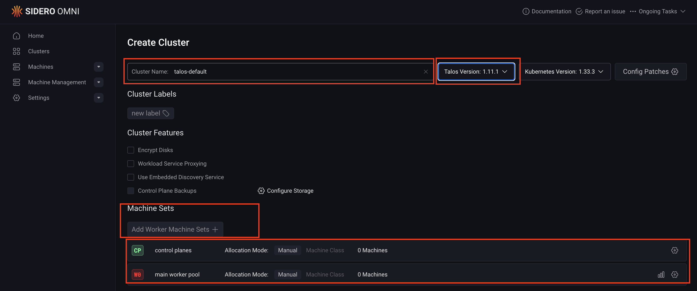
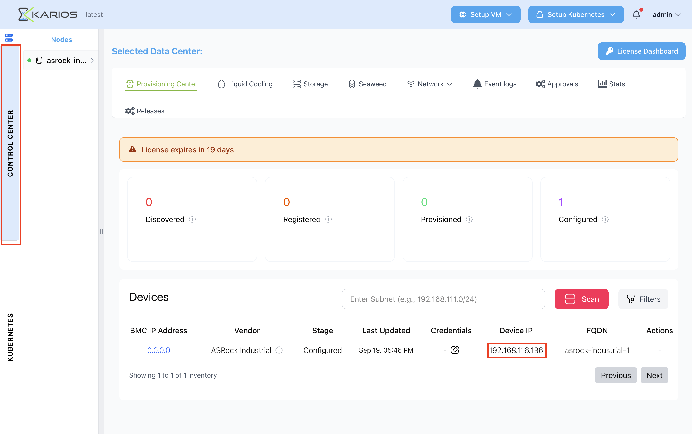
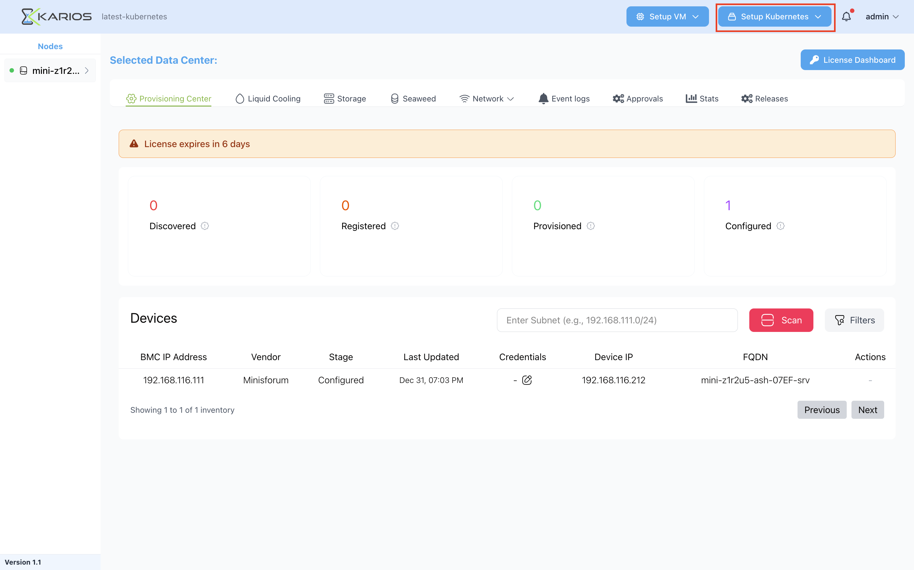

Kubernetes on Karios
====================

Introduction
------------

Kubernetes infrastructure doesn't have to be painful. Traditional approaches to spinning up clusters, managing complex dashboards, and debugging failures can feel like solving a puzzle with missing pieces. Karios transforms this experience by making Kubernetes infrastructure modular, swappable, and refreshingly simple.

Built like a stack of building blocks on the robust FreeBSD foundation, Karios lets you define your requirements, ship your configuration, and you're done. Need to spin up a new Kubernetes cluster? The process becomes straightforward and repeatable. Adding specialized workloads like GPU-intensive applications? Simply select the appropriate node type and assign it instantly.

The FreeBSD foundation provides significant performance advantages, delivering faster throughput for critical network and storage operations that are essential for modern Kubernetes workloads. This performance edge becomes particularly important in high-throughput scenarios and data-intensive applications.

Karios supports any version of Kubernetes with both virtual machine and bare metal worker deployments. The platform's intelligent filtering model enables you to select hypervisor nodes based on specific criteria—whether you need to optimize for power efficiency, cost, performance, or GPU capabilities. You can even mix different hardware types within the same cluster without compatibility issues or downtime.

One of the most compelling advantages is Karios' ability to easily deploy single-node Kubernetes clusters at the edge. This capability proves invaluable for remote datacenter scenarios where you need Kubernetes orchestration capabilities but have limited infrastructure resources. Instead of complex multi-node deployments, you can quickly establish lightweight Kubernetes clusters that serve your edge computing requirements with minimal overhead.

Whether you're deploying enterprise-scale multi-node clusters or lightweight edge installations, Karios eliminates the traditional pain points of Kubernetes infrastructure management, making virtualized infrastructure a stackable, manageable experience.

Sidero Kubernetes Overview
--------------------------

Sidero is a bare-metal provisioning system designed specifically for Kubernetes clusters. Built on Talos Linux, Sidero provides a GitOps-driven approach to managing bare-metal Kubernetes infrastructure with enterprise-grade security and immutable operating system principles.

**Key Features:**

* Immutable infrastructure with Talos Linux
* GitOps-based cluster lifecycle management  
* Secure by default with no SSH access required
* Automated bare-metal provisioning
* Integration with Cluster API for declarative cluster management

**Overview:**

Sidero simplifies the complexity of bare-metal Kubernetes deployments by providing automated discovery, provisioning, and lifecycle management of physical servers. The platform uses a **management cluster** that orchestrates deployment and management of workload clusters across your bare-metal infrastructure.

OmniServer Deployment
--------------------------

**Step 1.1.1: Create OmniServer VM**

- Click **Setup Kubernetes** in the Karios UI.

.. image:: _static/images/omni/om-1.png
   :alt: Setup Kubernetes Button

**Step 1.1.2: Setup Keycloak**

- Click **Keycloak** in the UI.

.. image:: _static/images/omni/om-2.png
   :alt: Setup Keycloak Button

- This creates a **Keycloak instance** in a FreeBSD jail.  
- Wait for the Keycloak jail to finish creation.

.. image:: _static/images/omni/om-3.png
   :alt: Keycloak Setup Complete

.. note::
   Keycloak is an open-source identity and access management solution.  
   It provides single sign-on (SSO), user federation, identity brokering, and social login.  
   In Sidero, Keycloak manages authentication and authorization for Kubernetes clusters.

   Default credentials:  
   - **Master realm** → ``admin / adminadmin``  
   - **Omni realm** → ``user@karios.ai / Omni12345``

**Step 1.1.3: Upload TLS Certificate and Key**

- Click **Upload Certificates** in the UI.

.. image:: _static/images/omni/om-4.png
   :alt: Upload Certificates Button

- Upload the **wildcard TLS certificate and key** for your domain.

.. image:: _static/images/omni/om-5.png
   :alt: TLS Certificate Upload

.. note::
   TLS secures communication between Sidero components and Kubernetes clusters.  
   Ensure the certificate covers ``omni.<basedomain>``.  
   Combine the CA bundle and certificate into one file before upload.

**Step 1.1.4: Setup OmniServer VM**

- Click **Setup Omni Server**.  
- Enter OmniServer VM details (username and password).  
- Attach an **Ubuntu cloud image (.img)**.  

.. image:: _static/images/omni/om-6.png
   :alt: Setup Omni Server Button

.. note::
   The Ubuntu image must already be uploaded to the **Control Center** in the Karios UI.

- Select **Server**, **Storage**, and **Network switch**.  
- Enter VM specs **CPU's, Memory(GB), Disk Size(GB)** and click **Save**.

.. image:: _static/images/omni/om-7.png
   :alt: OmniServer VM Config

**Step 1.1.5: Access the OmniServer Dashboard**

- Once created, access the OmniServer dashboard at:

  ``https://omni.<basedomain>``

- You will be redirected to the Keycloak login page for the **omni realm**.

.. image:: _static/images/omni/om-9.png
   :alt: Omni Dashboard
.. image:: _static/images/omni/om-10.png
   :alt: Keycloak Login

- After login, you will be redirected to the **OmniServer Dashboard**.

.. note::
   Use credentials: ``user@karios.ai / Omni12345``

Cluster Installation
--------------------------

**Step 1.2.1: Download the ISO**

- In OmniServer dashboard, click **Download ISO**.  

.. image:: _static/images/omni/omd-1.png
   :alt: Generate ISO

- Select ISO type, Talos version, and click **Generate ISO**.

.. image:: _static/images/omni/omd-2.png
   :alt: Generate ISO

.. note::
   For demos, use ISO type: ``amd64-iso``.  
   please use v1.11.1 of Talos.
   For VM clusters, add the following kernel argument to avoid ``kexec`` issues:  
   ``sysctl.kernel.kexec_load_disabled=1``

**Step 1.2.2: Upload the ISO in Karios UI**

- Navigate to: **Control Center → ISO tab**.  
- Click **Choose File**, select the ISO, then **Upload**.

.. note::
   The uploaded ISO will appear under **Available ISOs**.  
   Refer to the Upload ISO section in Karios documentation for details.

**Step 1.2.3: Create Cluster Machines in Karios UI**

- Click **Setup Kubernetes**. 
- Click on **OmniServer** 

.. image:: _static/images/omni/om-1.png
   :alt: Cluster Deta

- Enter cluster details and select the uploaded ISO.

.. image:: _static/images/omni/om-12.png
   :alt: Cluster Details

.. note::
   Use the prefix ``om`` in the cluster name to identify Omni clusters.

- Select **Server**, **Storage Pool**, and **Network Switch**.  
- Enter VM specs **CPU's, Memory(GB), Disk Size(GB)** and click **Update**.

.. image:: _static/images/omni/om-13.png
   :alt: Add VM Config 

- Use the "+" button to add multiple VMs.  
- Click **Omni VMs** to create the machines.  

.. image:: _static/images/omni/om-14.png
   :alt: Omni VM Creation

- Start all VMs from the Karios UI.

.. image:: _static/images/omni/omd-3.png
   :alt: Omni VM Creation

**Step 1.2.4: VM Discovery in OmniServer Dashboard**

- Power on the VMs.  
- They will appear under the **Machines** tab.

.. image:: _static/images/omni/om-15.png
   :alt: Machines Tab

**Step 1.2.5: Create the Cluster in OmniServer Dashboard**

- Click on the **Clusters** tab.

.. image:: _static/images/omni/om-16.png
   :alt: Create Cluster Button 

- Click on **Create Cluster**.

.. image:: _static/images/omni/om-17.png
   :alt: Cluster Role Assignment

- Enter **cluster name**, **select Talos version**, and **machine set configuration**. 

..note::
  Select the same Talos version used to generate the ISO.
  Machine Set is a grouping of machines that are managed together. Select the different machine sets based on the roles you want to assign to the machines.

- Assign roles: **CP0 (control plane)**, **W0 (worker)**.

.. image:: _static/images/omni/om-18.png
   :alt: Cluster Role Assignment

.. note::
   Minimum requirements:  
   - 1 control plane node (CP0)  
   - 1 worker node (W0)

**Step 1.2.6: Monitor Cluster Installation**

- In **Clusters**, click the cluster name.  
- Monitor installation progress.

.. image:: _static/images/omni/om-19.png
   :alt: Cluster Installation Progress

- When complete, the cluster status changes to **Ready** and nodes show **Running**.

.. note::
   Installation may take several minutes.  
   If VMs are stuck in provisioning, reboot them from the Karios UI.  
   Download the ``kubeconfig`` file from OmniServer dashboard to access the cluster.

.. image:: _static/images/omni/om-20.png
   :alt: Cluster Ready

1.3 Manual Removal of Keycloak Jail Deployment
-----------------------------------------------

Overview
--------

**Keycloak** is an open-source identity and access management (IAM) solution.  
It provides authentication, authorization, and user management capabilities for applications and services.  

In the context of **OmniServer (SideroLabs Omni Dashboard)**, Keycloak is used as the **authentication and identity provider**.  
It ensures secure login, centralized user control.

When OmniServer is uninstalled or removed from a node, the Keycloak jail is **not automatically removed**. 

Therefore, Keycloak needs to be removed manually from the node.

Removal Procedure
-----------------

To manually remove the Keycloak jail, follow these steps:

Step 1.3.1 Click on the **Control Center** in the Karios UI. under the **Devices** section,  you can find the **Device IP** of the node. 

Step 1.3.2 Using the Terminal, SSH into the node using the Device IP.

.. code-block:: bash

   ssh root@<Device-IP>
   # Example:
   ssh root@192.168.1.100
   # Password: karios12345

Step 1.3.3 Remove the Keycloak Jail

. **Run the following commands in sequence:**

.. code-block:: bash

   jls
   jail -R karios-keycloak
   zfs umount -f zroot/jails/karios-keycloak
   zfs destroy -r zroot/jails/karios-keycloak

Command Explanation
-------------------
- ``jls``  
  Lists all running jails on the system. Confirm that the ``karios-keycloak`` jail is present.

- ``jail -R karios-keycloak``  
  Removes the running jail instance named ``karios-keycloak``.

- ``zfs umount -f zroot/jails/karios-keycloak``  
  Forcefully unmounts the ZFS dataset associated with the jail.

- ``zfs destroy -r zroot/jails/karios-keycloak``  
  Recursively destroys the dataset and all of its child datasets, permanently removing the jail’s data.

Post-Removal Notes
------------------

- After performing these steps, the Keycloak jail and its associated datasets are fully removed.  
- Any configurations, users, or authentication data stored in this jail are **not recoverable** unless previously backed up.  
- If OmniServer or other services were relying on Keycloak, ensure that an **alternative identity provider** is configured to avoid authentication issues.

OpenShift Overview
--------------------------------

OpenShift on Karios combines the **operational simplicity of Karios infrastructure management** with the **enterprise capabilities of OpenShift**.  
This provides a powerful foundation for containerized application development and deployment, offering both the flexibility of Kubernetes and the operational maturity expected in enterprise environments.

The platform includes integrated CI/CD capabilities, service mesh options, and comprehensive security policies, enabling organizations to adopt cloud-native practices while maintaining governance and compliance requirements.  

Creating the OpenShift Cluster
----------------------------------

**Step 2.1.1: Create the Cluster Machine in Karios UI**

- Click **Setup Kubernetes** in the Karios UI.

- Select **OpenShift**.

.. image:: _static/images/openshift/op-2.png
   :alt: Setup Kubernetes Button

**Step 2.1.2: Enter the Cluster Details**

- **Cluster name**: Enter a DNS-compliant name (e.g., ``op-test``).

.. note::
   The ``op`` prefix is recommended to uniquely identify OpenShift clusters.  

.. image:: _static/images/openshift/op-3.png
   :alt: Cluster Details

**Step 2.1.3: Add Control Plane Nodes**

- Click **Add Control Plane**.  

- Select the server and configure VM specs **CPU's**, **Memory(GB)** , **Disk Size(GB)**.

- Click **Save** to confirm configuration. 

.. image:: _static/images/openshift/op-4.png
   :alt: Control Plane Config

.. note::
   Minimum requirements:  
   - 4 vCPUs  
   - 4 GB memory  
   - 80 GB disk space  

   Recommended: **3 control plane nodes** for high availability.  
   Control plane nodes must be **odd in number** to avoid split-brain issues.  

- Use the "+" button to add more control plane nodes. 

.. image:: _static/images/openshift/op-5.png
   :alt: Control Plane Config
 

**Step 2.1.4: Add Worker Nodes**

- Click **Add Worker Node**.  

.. image:: _static/images/openshift/op-6.png
   :alt: Control Plane Config

_ Select the **Server** , **Storage Pool** , and **Network Switch**._

- Select the server and configure VM specs **CPU's**, **Memory(GB)** , **Disk Size(GB)**.

.. image:: _static/images/openshift/op-7.png
   :alt: Worker Node Config

.. note::
   Minimum requirements:  
   - 4 vCPUs  
   - 4 GB memory  
   - 80 GB disk space  

   Recommended: At least **1 worker node**.  
   Worker nodes can be an even or odd number depending on workload needs.  

- Click **Save**.  
- Use the "+" button to add additional worker nodes.  

.. image:: _static/images/openshift/op-8.png
   :alt: Worker Node Config

**Step 2.1.5: Configure HAProxy**

During cluster configuration, you will see the **HAProxy Setup** option.

- **Setup HAProxy (checkbox)**:  
  Selecting this enables HAProxy for your cluster. 

.. image:: _static/images/openshift/op-9.png
   :alt: HAProxy Setup

.. note::
   Enabling HAProxy creates **two HAProxy instances** in FreeBSD jails.  
   These handle load balancing between control plane nodes in high-availability setups.  

- For **high availability deployments**, ensure the HAProxy option is **checked**.  
- For test or single-node clusters, HAProxy can remain unchecked.  

- Once configuration is complete, click **Create OpenShift Cluster** to finalize deployment.  

OpenShift Without DHCP
--------------------------

For enterprise environments requiring **static networking** and full control over network configuration, OpenShift can be deployed on Karios without DHCP. This approach provides enhanced security, predictable networking, and better integration with enterprise networks.

Prerequisites
~~~~~~~~~~~~~~~~~~~

Before starting installation, ensure you have:

* Valid Red Hat account with OpenShift subscription  
* Karios infrastructure with designated nodes for OpenShift  
* Static IP addressing plan including DNS, gateway, and subnet configuration  
* SSH public key for cluster access and troubleshooting  

Installation Steps
~~~~~~~~~~~~~~~~~~~~~~~~

**Step 2.2.1: Navigate to Red Hat Console**

- Go to: https://console.redhat.com/openshift/create/datacenter  

**Step 2.2.2: Authentication**

- Log in with your **Red Hat credentials**.  

.. warning::
   Ensure your account has the required permissions to create OpenShift clusters.  

**Step 2.2.3: Platform Selection**

- Select **"Platform agnostic (x86_64)"**.  

.. image:: _static/images/openshift/Redhat-4.png
   :alt: Platform Agnostic Selection

**Step 2.2.4: Installation Method**

- Select **"Interactive"** (guided setup).  

.. image:: _static/images/openshift/Redhat-5.png
   :alt: Interactive Installation Selection

**Step 2.2.5: Configure Cluster Details**

- Fill out the installer form:  

  * Cluster name: e.g., ``op-test1``  
  * Base domain: e.g., ``karios.ai``  
  * OpenShift version: e.g., 4.19.6  
  * CPU architecture: ``x86_64``  

.. image:: _static/images/openshift/Redhat-6.png
   :alt: Cluster Details

.. important::
   The cluster name must follow DNS requirements. See:  
   `DNS requirements documentation <https://docs.redhat.com/en/documentation/openshift_container_platform/4.19/html/installing_an_on-premise_cluster_with_the_agent-based_installer/preparing-to-install-with-agent-based-installer#agent-install-dns-none_preparing-to-install-with-agent-based-installer>`_

**Step 2.2.6: Configure Additional Settings**

- Platform: **No platform integration**  
- Control Plane: **3 nodes (HA)**  
- Networking: **Static IP, bridges, and bonds**  

.. image:: _static/images/openshift/Redhat-7.png
   :alt: Additional Settings

**Step 2.2.7: Configure Static Networking**

- Use **Form view**.  
- Example:  
  * Subnet: ``192.168.116.0/24``  
  * Gateway: ``192.168.116.253``  
  * DNS: ``192.168.116.240``  

.. image:: _static/images/openshift/Redhat-8.png
   :alt: Static Network Configuration

**Step 2.2.8: Map Hosts (MAC to IP)**

- Host 1 → 58:9c:fc:01:4f:a1 → 192.168.116.30
- Host 2 → 58:9c:fc:0f:66:4c → 192.168.116.31
- Host 3 → 58:9c:fc:0e:6f:55 → 192.168.116.32
- Host 4 → 58:9c:fc:08:2e:26 → 192.168.116.36
- Host 5 → 58:9c:fc:0e:00:09 → 192.168.116.39  

.. image:: _static/images/openshift/op-10.png
   :alt: Host-Specific Config

.. important::
   After modifying network settings, regenerate the Discovery ISO.  

**Step 2.2.9: Generate Discovery ISO**

- Select **Full image file - self-contained ISO**.  
- Paste SSH public key.  
- Click **Generate Discovery ISO**.  

.. image:: _static/images/openshift/op-12.png
   :alt: Generate Discovery ISO

**Step 2.2.10: Download ISO in Karios UI**

- Copy wget link from Red Hat console. 

.. image:: _static/images/openshift/op-13.png
   :alt: Download Discovery ISO

- In **Karios → Control Center → ISO tab**, paste link.  
- Click **Download**.  

**Step 2.2.11: Attach ISO and Boot Nodes**

- Click on the Vm. 

.. image:: _static/images/openshift/op-14.png
   :alt: Download Discovery ISO

- Attach ISO to nodes. 

.. image:: _static/images/openshift/op-15.png
   :alt: Download Discovery ISO

.. image:: _static/images/openshift/Redhat-12.png
   :alt: Download Discovery ISO

- Ensure ISO is primary boot device.  
- Power on nodes.  

.. image:: _static/images/openshift/op-14.png
   :alt: Attach ISO to Nodes

**Step 2.2.12: Node Discovery**

- Go Back to the OpenShift Console page and wait for the nodes to show up.
- Nodes boot into CoreOS Live.  
- Static IPs are applied.  
- Nodes appear in OpenShift console.  

.. image:: _static/images/openshift/Redhat-10.png
   :alt: Node Discovery

**Step 2.2.13: Configure Storage**

- Assign persistent volumes.  

.. image:: _static/images/openshift/Redhat-11.png
   :alt: Storage Configuration

**Step 2.2.14: Networking**

- Select **User-Managed Networking** (required).  

.. image:: _static/images/openshift/Redhat-13a.png
   :alt: Networking Settings

**Step 2.2.15: Review and Create**

- Review all configurations.  
- Click **Install cluster**.

.. image:: _static/images/openshift/Redhat-14.png
   :alt: Installation Complete

**Step 2.2.16: Monitor Installation**

- Track progress in OpenShift console.  
- Configure external load balancers after completion.  

.. image:: _static/images/openshift/Redhat-17.png
   :alt: Post Installation

Configuration Summary
-------------------------

**Completed Configuration:**

* Cluster details set  
* Static networking configured  
* Nodes discovered and validated  
* User-managed networking enabled  

**Key Benefits:**

* Custom load balancer support  
* Full control over networking  
* Seamless enterprise integration  

**Deployment Ready:**

Your OpenShift cluster on Karios is now ready for production workloads.

Open Source Kubernetes Overview
-------------------------------

Open source Kubernetes provides the foundational container orchestration platform without vendor-specific additions. Running Kubernetes on **Ubuntu** through Karios gives you complete control over your cluster configuration while benefiting from Ubuntu’s extensive package ecosystem and long-term support options.

**Key Features:**

* Pure upstream Kubernetes experience  
* Full customization and configuration control  
* Ubuntu LTS support and security updates  
* Extensive community ecosystem and tooling  
* Cost-effective solution for diverse workloads  

**Overview:**

This deployment option offers maximum flexibility for organizations that want to build their Kubernetes infrastructure using open source components. By leveraging Ubuntu as the base operating system within Karios, you gain access to a mature Linux distribution with comprehensive hardware support and a rich ecosystem of tools and packages.

This approach is ideal for organizations that prefer to implement their own operational tooling around Kubernetes or have specific compliance requirements that benefit from a fully open source stack. The combination provides **enterprise-ready infrastructure capabilities** while maintaining **transparency and control** over the technology stack.

Create the Ubuntu Kubernetes Cluster
----------------------------------------

**Step 3.1.1: Create the Cluster Machine in Karios UI**

- Click **Setup Kubernetes** in the Karios UI, and Select **Ubuntu**.

.. figure:: _static/images/UbuntuKubernetes/ubuntu-1.png
   :alt: Setup Kubernetes Button

**Step 3.1.2: Enter Cluster Details**

- **Cluster name**: Enter a DNS-compliant name (e.g., ``ub-test1``).  

.. note::
   The ``ub`` prefix helps uniquely identify Ubuntu-based clusters.  

- **Username and password**: Enter credentials for SSH access.  

.. note::
   Avoid using reserved usernames like **root** or **admin**.  

- **Attach the image**: Select an **Ubuntu cloud image (.img)**.  

.. note::
   The Ubuntu image must be uploaded to the **Control Center** in Karios beforehand.  

.. figure:: _static/images/UbuntuKubernetes/ubuntu-3.png
   :alt: Attach Ubuntu Image

**Step 3.1.3: Add a Bootstrap Node**

- Click **Add Control Node**.  

.. figure:: _static/images/UbuntuKubernetes/ubuntu-3.png
   :alt: Bootstrap Node Config

.. note::
   In many setups, the bootstrap node is also the master node. This means it not only helps other nodes join the cluster but also takes on the responsibility of controlling and managing cluster operations like scheduling, orchestration, and resource allocation.

- Select **Server**, **CPU's**, **Memory(GB)**, and **Disk Size(GB)**.  

.. note::
   Minimum requirements for the bootstrap/control node:  
   - 4 vCPUs  
   - 4 GB memory  
   - 80 GB disk space  

- Optionally, enable tech stack components such as:  
   - **Prometheus & Grafana** (monitoring)  
   - **ArgoCD** (GitOps workflows)  

.. image:: _static/images/UbuntuKubernetes/ubuntu3a.png
   :alt: Bootstrap Node Config

**Step 3.1.4: Add Control Plane Nodes**

- Click **Add Control Plane**.  

.. image:: _static/images/UbuntuKubernetes/ubuntu-4.png
   :alt: Control Plane Config

.. note::
   Control plane nodes manage the Kubernetes cluster state and handle API requests.  
   For high availability, it is recommended to have multiple control plane nodes.

- Select **Server**, **CPU's**, **Memory(GB)**, and **Disk Size(GB)**. 

.. note::
   Minimum requirements per control plane node:  
   - 4 vCPUs  
   - 4 GB memory  
   - 80 GB disk space  

   Recommended: **3 control plane nodes** for high availability.  
   Control plane nodes must be **odd in number** to prevent split-brain.  

.. figure:: _static/images/UbuntuKubernetes/ubuntu-5.png
   :alt: Control Plane Config

- Save the configuration and add more nodes as required.  

.. figure:: _static/images/UbuntuKubernetes/ubuntu-6.png
   :alt: Control Plane Config

**Step 3.1.5: Add Worker Nodes**

- Click **Add Worker Node**.  

.. figure:: _static/images/UbuntuKubernetes/ubuntu-7.png
   :alt: Worker Node Config

.. note::
   Worker nodes run the applications and workloads in the cluster.

- Select **Server** and configure VM specs.  

.. note::
   Minimum requirements per worker node:  
   - 4 vCPUs  
   - 4 GB memory  
   - 80 GB disk space  

   Recommended: At least **1 worker node**.  

.. figure:: _static/images/UbuntuKubernetes/ubuntu-8.png
   :alt: Worker Node Config

- Save and add more workers as needed.  

SSH and Join VMs to the Cluster
-----------------------------------

**Step 3.2.1: SSH into the Bootstrap Node**
- Using the Terminal, SSH into the node using the Device IP.
.. code-block:: bash

   ssh <username>@<bootstrap-node-ip>
   # Example:
   ssh ubuntu@192.168.1.100         
   # Password: yourpassword

**Step 3.2.2: Check Cluster Status**

.. code-block:: bash

   sudo k8s status

.. image:: _static/images/UbuntuKubernetes/ubuntu-9.png
   :alt: Kubernetes Status

**Step 3.2.3: Get Join Token for Control Nodes**

- From the bootstrap node, get the join token for control plane nodes:

.. code-block:: bash

   sudo k8s get-join-token <vmname>

.. note::
   Replace ``<vmname>`` with the actual name of the control plane node you want to join.  
   The command will output a token and instructions for joining the cluster.
   The Only a bootstrap node can be the one to generate the join token.

**Step 3.2.4: Join Control Plane Node**

- Using the Terminal SSH into control plane node:

.. code-block:: bash

   ssh <username>@<control-plane-ip>

- Join the cluster:

.. code-block:: bash

   sudo k8s join-cluster <token>

.. note::
   Replace ``<token>`` with the actual token obtained in Step 3.2.3. 
   Repeat Steps 3.2.3 and 3.2.4 for all control plane nodes to join them in the cluster.

.. figure:: _static/images/UbuntuKubernetes/ubuntu-10.png
   :alt: Control Plane Join

**Step 3.2.5: Get Join Token for Worker Nodes**

- From the bootstrap node, get the join token for worker nodes:

.. code-block:: bash

   sudo k8s get-join-token <vmname> --worker

.. figure:: _static/images/UbuntuKubernetes/ubuntu-11.png
   :alt: Worker Join Token

**Step 3.2.6: Join Worker Nodes**

- SSH into each worker node:

.. code-block:: bash

   ssh <username>@<worker-node-ip>

- Join the cluster:

.. code-block:: bash

   sudo k8s join-cluster <token>

.. note::
   Replace ``<token>`` with the actual token obtained in Step 3.2.5. 
   Repeat steps 3.2.5 and 3.2.6 for all worker nodes to join them in the cluster.

**Step 3.2.7: Verify Cluster High Availability**

.. code-block:: bash

   sudo k8s status

.. figure:: _static/images/UbuntuKubernetes/ubuntu-13.png
   :target: _static/images/UbuntuKubernetes/ubuntu-13.png
   :alt: HA Cluster Status

Accessing the Tech Stack
----------------------------

3.3.1 Prometheus and Grafana
~~~~~~~~~~~~~~~~~~~~~~~~~~~~

**Step 3.3.1.1: Verify Deployment**

.. code-block:: bash

   sudo k8s kubectl get pods -n observability
   sudo k8s kubectl get svc -n observability

.. figure:: _static/images/UbuntuKubernetes/ubuntu-14.png
   :alt: Observability Namespace

.. note::
   - Namespace: ``observability``  
   - Grafana → port ``30090``  
   - Prometheus → port ``30091``  

**Step 3.3.1.2: Access Grafana Dashboard**

.. code-block:: none

   http://<node-ip>:30090
   http://<fqdn>:30090

**Step 3.3.1.3: Access Prometheus Dashboard**

.. code-block:: none

   http://<node-ip>:30091
   http://<fqdn>:30091

.. note::
   you can access the dashboards using the bootstrap/control plane node IP or any worker node IP.
   The default credentials for Grafana are:
   - User: ``admin``
   - Password: ``prom-operator``

3.3.2 ArgoCD
~~~~~~~~~~~~

**Step 3.3.2.1: Verify Deployment**

.. code-block:: bash

   sudo k8s kubectl get pods -n argocd
   sudo k8s kubectl get svc -n argocd

.. image:: _static/images/UbuntuKubernetes/ubuntu-15.png
   :alt: ArgoCD Namespace

.. note::
   - Namespace: ``argocd``  
   - Dashboard → port ``31800``  

**Step 3.3.2.2: Access ArgoCD Dashboard**

.. code-block:: none

   http://<node-ip>:31800
   http://<fqdn>:31800

.. note::
   you can access the dashboard using the bootstrap/control plane node IP or any worker node IP.

Next Steps
--------------

After selecting and deploying your preferred Kubernetes distribution, consider the following operational aspects:

* **Monitoring and Observability**: Implement comprehensive monitoring solutions for both the Karios infrastructure and Kubernetes workloads  
* **Backup and Disaster Recovery**: Establish backup procedures for both cluster state and persistent data  
* **Security Hardening**: Apply security best practices specific to your chosen Kubernetes distribution  
* **Day-2 Operations**: Plan for ongoing maintenance, updates, and scaling operations  

For additional support and advanced configuration options, refer to the respective documentation for your chosen Kubernetes distribution and consult the Karios operational guides.

- **Sidero Omni documentation**: https://docs.siderolabs.com/omni/overview/what-is-omni  
- **OpenShift documentation**: https://docs.openshift.com/container-platform/latest/welcome/index.html  
- **Ubuntu Kubernetes documentation**: https://documentation.ubuntu.com/canonical-kubernetes/latest/about/  
- **ArgoCD documentation**: https://argo-cd.readthedocs.io/en/stable/  
- **Prometheus documentation**: https://prometheus.io/docs/introduction/overview/  
- **Grafana documentation**: https://grafana.com/docs/grafana/latest/ 
