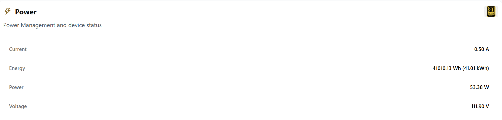

============================
Power Monitoring and Metrics
============================

.. contents:: Table of Contents
   :depth: 3
   :local:

Overview
========

The Power Monitoring system provides comprehensive tracking of power consumption, efficiency analysis, and predictive power management for optimal data center operations. It enables real-time and historical visibility into energy usage, supporting both operational monitoring and analytics.

Monitoring Architecture
=======================

Power Sensors
-------------

**Hardware:** Power Link device

Data Collection
---------------

**Process:**

* The power link device reads voltage, current, power, and cumulative energy from CT channels every second.
* Each reading is timestamped and formatted.
* Data is sent via HTTP to the server for storage and visualization.

Metrics Processing
------------------

**Real-time Processing:**

* The backend continuously acquires measurements from the database
* Computes derived metrics (power, energy, voltage, current)
* Streams and analyzes data for dashboards and reporting

Installation and Configuration
==============================

Hardware Setup
--------------

* Install Karios PowerLink
* Ensure PowerLink is connected and powered

Software Configuration
----------------------
* **Karios PowerLink** web configuration interface:
  
  - Set Wi-Fi credentials (SSID and password)
  - Specify the node to associate with
  - Enter the database host IP address

Calibration
-----------

* Use the provided code to read voltage, current, and power for each CT channel
* Validate readings against reference measurements
* Confirm data consistency in the InfluxDB power_metrics table

Power Monitoring
================

Real-time Monitoring
--------------------

* The system streams live power, voltage, current, and energy data to InfluxDB
* Real-time dashboards visualize these metrics for each node

   **Figure 1**: Landing page Power stats

Historical Analysis
-------------------

* Historical data is stored in InfluxDB
* The backend provides endpoints to query and visualize power consumption trends over time

Reporting and Analytics
=======================

Dashboard
---------

* Real-time dashboard visualizes current, voltage, power, and efficiency
* Supports live data streams, historical trends, and power profile events
* Interactive graphs and filters by time range or node

Reports
-------

* Automated and custom reports summarize power usage, efficiency, and cost savings
* Reports can be scheduled or generated on demand
* Export options include PDF and CSV

Integration
-----------

* RESTful APIs and WebSocket endpoints allow external systems to access real-time and historical power data
* Enables integration with third-party monitoring and analytics platforms

API Endpoints
=============

The following RESTful and WebSocket endpoints are provided for power monitoring, management, and analytics. All endpoints are grouped under ``/power/node``.

Real-time Metrics
-----------------

.. list-table::
   :widths: 30 20 50
   :header-rows: 1

   * - Endpoint
     - Method
     - Description
   * - ``/power/node/data/ws``
     - GET
     - Establishes a WebSocket connection for streaming real-time system metrics (voltage, current, power, etc.)

Power Supply Management
-----------------------

.. list-table::
   :widths: 35 15 50
   :header-rows: 1

   * - Endpoint
     - Method
     - Description
   * - ``/power/node/power-supply``
     - POST
     - Create a new power supply entry
   * - ``/power/node/power-supply``
     - GET
     - List all power supplies, optionally filtered by node IP
   * - ``/power/node/power-supply/:id``
     - GET
     - Retrieve details for a specific power supply by ID
   * - ``/power/node/power-supply/:id``
     - PUT
     - Update an existing power supply entry by ID
   * - ``/power/node/power-supply/:id``
     - DELETE
     - Delete a power supply entry by ID

Power Profile Management
------------------------

.. list-table::
   :widths: 35 15 50
   :header-rows: 1

   * - Endpoint
     - Method
     - Description
   * - ``/power/node/power-profile``
     - POST
     - Set the power profile for a node
   * - ``/power/node/power-profile/events``
     - GET
     - Retrieve a list of power profile change events

Node Power Ratings
------------------

.. list-table::
   :widths: 30 20 50
   :header-rows: 1

   * - Endpoint
     - Method
     - Description
   * - ``/power/node/ratings``
     - GET
     - Retrieve power consumption ratings for nodes over a specified time period

Power Metrics History
---------------------

.. list-table::
   :widths: 35 15 50
   :header-rows: 1

   * - Endpoint
     - Method
     - Description
   * - ``/power/node/metrics/history``
     - GET
     - Retrieve historical power metrics for a node, supporting time range queries for analysis and reporting

**Backend Processing:**

* Aggregates and analyzes data from InfluxDB
* Computes efficiency, cost, and energy savings
* Provides recommendations for power profiles based on workload

Security and Maintenance
========================

* Wi-Fi credentials are configured securely via the Karios PowerLink Portal
* OTA updates are supported for firmware maintenance
* Data validation and error handling are implemented in both firmware and backend
