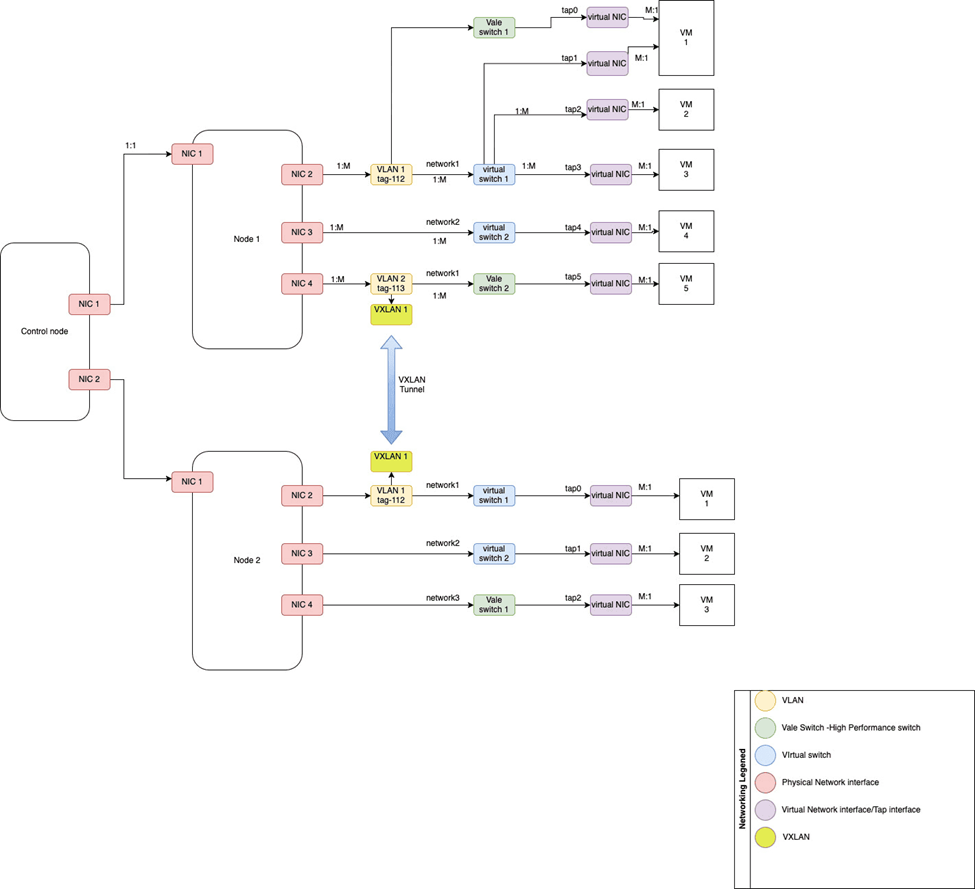
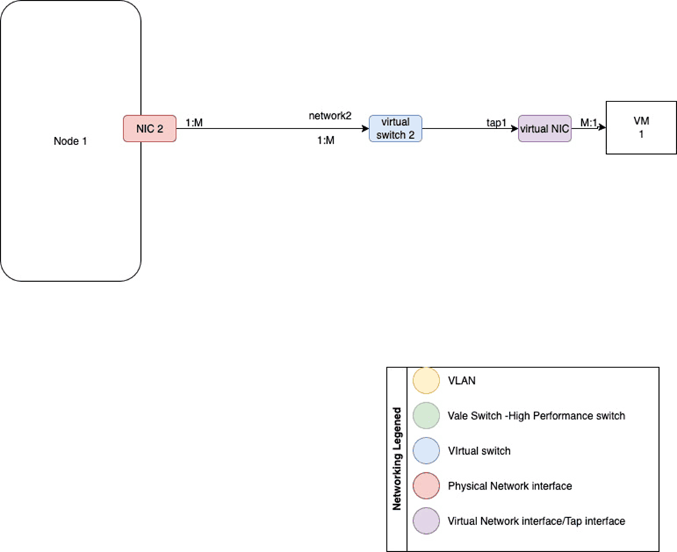
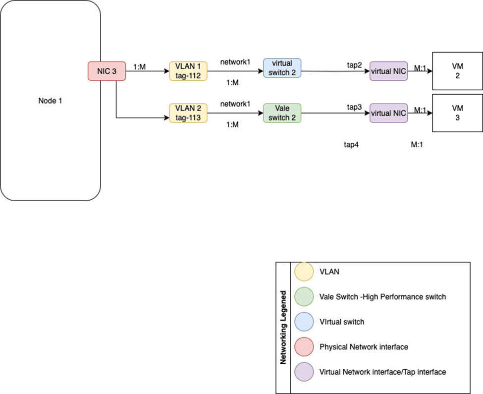
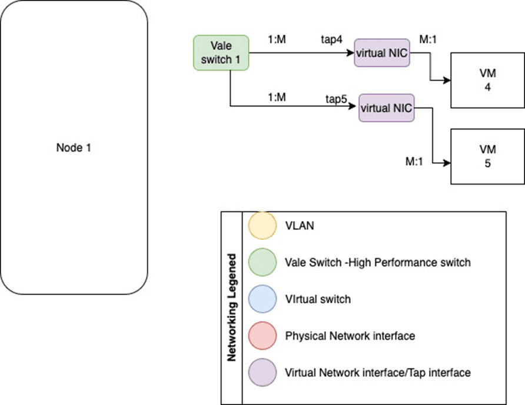

========================
Karios Flexible Network
========================

.. contents:: Table of Contents
   :depth: 3
   :local:

Overview
========

Karios Flexible Network delivers comprehensive network virtualization capabilities built on advanced FreeBSD networking technologies. The platform implements a robust, high-performance networking stack that seamlessly integrates virtual switches, VALE high-speed packet switching, VLANs, VXLANs, and sophisticated networking capabilities to create a unified network infrastructure solution.

**Key Advantages:**

* **Network Virtualization Architecture:** Complete programmability and centralized control
* **High Performance:** Zero-copy packet processing with microsecond latency
* **Scalability:** Support for thousands of virtual ports and network segments
* **Multi-Tenancy:** Isolated network environments with strong security boundaries
* **Flexibility:** Dynamic network topology creation and modification
* **Integration:** Seamless integration with virtualization and containerization platforms

**Core Technologies:**

* FreeBSD's advanced networking stack with kernel-level optimization
* VALE (Virtual Abstraction Layer for Ethernet) switching framework
* IEEE 802.1Q VLAN implementation with advanced features
* VXLAN overlay networking with multi-site support
* Netgraph modular framework for custom topologies

**Performance Characteristics:**

.. list-table::
   :widths: 30 70
   :header-rows: 1

   * - Metric
     - Specification
   * - Throughput
     - Up to 100 Gbps line-rate forwarding
   * - Latency
     - Sub-microsecond switching delays
   * - Concurrent Connections
     - Support for tens of thousands of simultaneous connections
   * - Virtual Ports
     - Thousands of virtual ports per switch
   * - Network Segments
     - Thousands of isolated VXLAN segments

Network Architecture
====================

Virtual Networking Components
-----------------------------

The Karios networking architecture is built on several interconnected core components that work together to provide comprehensive network virtualization capabilities.

   Figure 1: Full Network Topology

**Core Components Overview:**

Karios networking is built on several core components:

* **Physical NIC:** Physical Network interface card
* **VLAN:** Virtual Local Area Network implementation
* **VXLAN:** Virtual Extensible LAN for overlay networks
* **Virtual Switch:** Software-defined network switches for VM connectivity
* **VALE Switch:** High-performance packet switching framework
* **TAP:** Virtual Network interface

**Physical NIC**

A Physical Network Interface Card (NIC) is a hardware component that connects a system to a network. It enables data transmission and reception over Ethernet or wireless links and serves as the foundation for creating VLANs, virtual switches, and other network interfaces in virtualized environments.

.. list-table:: Physical NIC Advanced Features
   :widths: 30 70
   :header-rows: 1

   * - Feature
     - Description
   * - Multi-Queue Support
     - Parallel packet processing across multiple CPU cores
   * - Hardware Acceleration
     - TCP/UDP checksum offloading, segmentation offloading
   * - Jumbo Frames
     - Support for 9000-byte frames for improved efficiency
   * - Energy Efficiency
     - Advanced power management and green networking features
   * - Flow Control
     - IEEE 802.3x flow control for congestion management
   * - Link Aggregation
     - IEEE 802.3ad LACP for bandwidth aggregation and redundancy

**VLAN**

A Virtual Local Area Network (VLAN) is a network segmentation technique that allows multiple isolated networks to coexist on the same physical interface. By assigning VLAN tags to traffic, it enables logical grouping of devices, improves security, and simplifies network management across virtual machines and physical infrastructure.

.. list-table:: VLAN Enterprise Features
   :widths: 30 70
   :header-rows: 1

   * - Feature
     - Description
   * - IEEE 802.1Q Compliance
     - Standard VLAN tagging with 12-bit VLAN ID
   * - Priority Tagging
     - IEEE 802.1p Quality of Service integration
   * - VLAN Stacking
     - IEEE 802.1ad Provider Bridges for service provider networks
   * - Inter-VLAN Routing
     - Layer 3 routing between VLAN segments
   * - Management VLAN
     - Isolated management traffic for network devices

**VXLAN**

Virtual Extensible LAN (VXLAN) is an overlay networking protocol that enables the creation of isolated Layer 2 networks across Layer 3 infrastructure. It encapsulates Ethernet frames in UDP packets, allowing scalable network virtualization across data centers and cloud environments. VXLAN is ideal for connecting VMs or containers across distributed systems.

.. list-table:: VXLAN Technical Specifications
   :widths: 30 70
   :header-rows: 1

   * - Specification
     - Details
   * - 24-bit VNI
     - Support for 16,777,216 unique network segments
   * - UDP Encapsulation
     - Standard UDP port 4789 for VXLAN traffic
   * - Multicast Support
     - Efficient flooding using multicast groups
   * - Unicast Mode
     - Point-to-point VXLAN tunnels for security
   * - VTEP Integration
     - VXLAN Tunnel Endpoints for encapsulation/decapsulation
   * - MTU Optimization
     - Automatic MTU discovery and fragmentation handling
   * - Security Integration
     - IPsec encryption for secure VXLAN tunnels

**Virtual Switch**

A Virtual Switch is a software-defined network switch that enables communication between virtual machines (VMs) and connects them to physical or virtual network interfaces. It operates like a physical Ethernet switch, handling traffic forwarding, VLAN tagging, and MAC address learning, all within the host system.

.. list-table:: Virtual Switch Advanced Capabilities
   :widths: 30 70
   :header-rows: 1

   * - Capability
     - Description
   * - VLAN Processing
     - IEEE 802.1Q VLAN tagging and untagging
   * - Spanning Tree Protocol
     - STP, RSTP, and MSTP for loop prevention
   * - Link Aggregation
     - Port bonding and LACP for redundancy
   * - Quality of Service
     - Traffic shaping and priority queuing
   * - Access Control
     - Port-based security and MAC address filtering
   * - Flow Control
     - Congestion management and flow regulation

**VALE Switch**

The VALE Switch is a high-performance software switch designed for fast packet forwarding in virtualized environments. Built on the Netmap framework, it enables low-latency, high-throughput communication between virtual machines or applications running on the same host.

.. list-table:: VALE Performance Optimizations
   :widths: 30 70
   :header-rows: 1

   * - Optimization
     - Description
   * - Zero-Copy Processing
     - Direct packet buffer access without memory copying
   * - Batched Operations
     - Processing multiple packets in single system calls

**TAP Interface**

A TAP interface is a virtual network device that operates at Layer 2 (Ethernet level), simulating a physical NIC. It is commonly used to bridge virtual machines or containers to real networks, allowing them to send and receive raw Ethernet frames for full network emulation.

.. list-table:: TAP Interface Advanced Features
   :widths: 30 70
   :header-rows: 1

   * - Feature
     - Description
   * - Full Ethernet Emulation
     - Complete Layer 2 protocol stack support
   * - Promiscuous Mode
     - Packet capture and analysis capabilities
   * - MTU Configuration
     - Flexible Maximum Transmission Unit settings
   * - Traffic Shaping
     - Rate limiting and bandwidth control
   * - Security Features
     - MAC address filtering and access control
   * - Performance Tuning
     - Buffer size optimization and interrupt handling

Network Topology Architecture
-----------------------------

**Hierarchical Network Design**

The Karios platform supports hierarchical network architectures with multiple tiers for scalability and performance. The following are possible network topologies with the present network core components:

**Network Connection with Physical NIC**

Virtual machines will have access to public network and can be assigned IP via DHCP or be given a static IP address. Virtual machines are connected to one Virtual switch with any Physical NIC as parent interface.

   Network topology showing VMs connected through a virtual switch to a physical NIC

**Network Connection with VLAN**

Virtual machines will have access to public network and can be assigned IP via DHCP or be given a static IP address. All network traffic will be VLAN tagged, ideal for assigning VLAN specific PF rule set.

* Virtual machines are connected to one Vale switch with any VLAN interface as parent interface
* Virtual machines are connected to one Virtual switch with any VLAN interface as parent interface

   Network topology showing VMs connected through VLAN interfaces

**Isolated Network**

Virtual Machines will be isolated from the public network. Virtual machines will have to be assigned static IP addresses in the same subnet. Ideal private network for test cases. Virtual machines are connected to 1 Vale switch without any parent interface.

   Isolated network configuration without external connectivity

**Network Layer Architecture:**

* **Access Layer:**
  
  * VM and container connectivity
  * Port-based security and access control
  * VLAN access port configuration
  * Local traffic switching and forwarding

* **Distribution Layer:**
  
  * VLAN routing and inter-VLAN communication
  * Policy enforcement and filtering
  * Load balancing and traffic distribution
  * Aggregation of access layer traffic

* **Core Layer:**
  
  * High-speed backbone connectivity
  * External network integration
  * Service provider interconnection

Network Configuration
=====================

Initial Network Setup
---------------------

Network administrators can configure the comprehensive networking environment through the intuitive Karios web interface and command-line tools:

**IP Address Management (IPAM):**

.. list-table::
   :widths: 30 70
   :header-rows: 1

   * - Feature
     - Description
   * - Address Pool Management
     - Dynamic and static IP address pools
   * - DHCP Integration
     - Automatic IP address assignment and management
   * - DNS Integration
     - Automatic DNS record creation and updates
   * - Usage Tracking
     - Real-time IP address utilization monitoring

**Network Segmentation Strategy:**

.. list-table::
   :widths: 30 70
   :header-rows: 1

   * - Segment Type
     - Description
   * - Security Zones
     - DMZ, internal, and management network segments
   * - Traffic Isolation
     - Complete isolation between network segments
   * - Micro-segmentation
     - Fine-grained network isolation for applications
   * - Compliance Zones
     - Dedicated segments for regulatory compliance
   * - Performance Zones
     - High-performance segments for critical applications

**Switch Creation and Management**

Create and configure virtual switches with comprehensive management capabilities:

**Switch Configuration Wizard:**

* **Basic Configuration:** Switch name, description, and basic parameters
* **VLAN Configuration:** VLAN support, trunking, and inter-VLAN routing
* **Validation and Testing:** Connectivity testing and performance validation

**Switch Templates:**

.. list-table::
   :widths: 30 70
   :header-rows: 1

   * - Template Type
     - Description
   * - Standard Switch Template
     - General-purpose switching with basic features
   * - High-Performance Template
     - Optimized for maximum throughput and low latency
   * - Management Template
     - Dedicated management switch configuration
   * - Development Template
     - Isolated development and testing environment

**VLAN Setup and Configuration**

Implement comprehensive VLAN segmentation with advanced management features:

**VLAN Configuration Process:**

* **VLAN Planning:** ID assignment, naming conventions, and subnet allocation
* **Trunk Configuration:** Inter-switch VLAN communication setup
* **Security Configuration:** VLAN-based access control and filtering
* **QoS Integration:** Priority tagging and traffic shaping

**Advanced VLAN Features:**

* **VLAN Stacking:** Provider bridge configuration for service providers
* **Private VLANs:** Isolated, community, and promiscuous port types
* **Management VLANs:** Isolated management traffic for network devices

Network Management Interface
----------------------------

The network management interface provides comprehensive control through multiple access methods:

**Web-Based Management Interface**

Intuitive web interface with comprehensive network management capabilities:

**Dashboard and Monitoring:**

* **Real-time Network Topology:** Interactive network topology visualization
* **Performance Metrics:** Real-time throughput, latency, and utilization metrics
* **Alert Management:** Centralized alert monitoring and management
* **Configuration Status:** Real-time configuration and operational status

**Configuration Management:**

* **Guided Wizards:** Step-by-step configuration wizards for complex setups
* **Template Management:** Reusable configuration templates
* **Bulk Operations:** Mass configuration changes across multiple devices
* **Configuration Validation:** Automatic validation before deployment

**API Integration**

RESTful API for programmatic access and automation:

.. list-table:: API Capabilities
   :widths: 30 70
   :header-rows: 1

   * - Capability
     - Description
   * - Full Feature Coverage
     - Complete API coverage of all management features
   * - Authentication
     - OAuth 2.0 and API key-based authentication
   * - Rate Limiting
     - Configurable rate limiting for API protection
   * - Versioning
     - API versioning for backward compatibility
   * - Documentation
     - Comprehensive API documentation and examples
   * - SDK Support
     - Software development kits for popular languages

Switch Operations and Management
--------------------------------

**Lifecycle Management Operations:**

**Switch Creation Workflow:**

#. **Requirements Analysis:** Determine switch requirements and specifications
#. **Resource Allocation:** Allocate CPU, memory, and network resources
#. **Configuration Generation:** Create switch configuration from templates
#. **Validation and Testing:** Validate configuration and test connectivity
#. **Deployment:** Deploy switch configuration to production environment
#. **Monitoring Setup:** Configure monitoring and alerting systems

**Switch Modification and Updates:**

* **Live Configuration Changes:** Zero-downtime configuration updates
* **Incremental Updates:** Partial configuration changes without full restart
* **Configuration Backup:** Automatic backup before changes
* **Rollback Capabilities:** Quick rollback to previous configurations
* **Change Validation:** Automatic validation of configuration changes
* **Impact Assessment:** Analysis of change impact on network operations

**Switch Deletion and Cleanup:**

* **Dependency Verification:** Check for dependent configurations and connections
* **Graceful Shutdown:** Orderly shutdown of switch services
* **Resource Cleanup:** Release allocated resources and cleanup configurations

VALE High-Speed Switching
=========================

VALE Architecture and Design
----------------------------

VALE (Virtual Abstraction Layer for Ethernet) provides industry-leading high-performance packet switching capabilities:

**VALE Core Architecture:**

**Netmap Framework Integration**

VALE is built on the Netmap framework, providing direct access to network hardware:

.. list-table:: Netmap Architecture Benefits
   :widths: 30 70
   :header-rows: 1

   * - Benefit
     - Description
   * - Kernel Bypass
     - Direct userspace access to network hardware
   * - Zero-Copy Operations
     - Packet processing without memory copying
   * - Batched System Calls
     - Multiple packets processed per system call
   * - Hardware Queue Access
     - Direct access to network interface queues
   * - Interrupt Mitigation
     - Reduced interrupt overhead through polling
   * - CPU Affinity
     - Dedicated CPU cores for packet processing

**VALE Switching Engine:**

* **Hash-Based Forwarding:** Efficient packet forwarding using hash tables
* **Lock-Free Operations:** Atomic operations for concurrent access
* **Batch Processing:** Multiple packets processed simultaneously
* **Cache Optimization:** CPU cache-friendly data structures

**Performance Characteristics:**

.. list-table:: Throughput and Latency
   :widths: 30 70
   :header-rows: 1

   * - Metric
     - Performance
   * - Line-Rate Performance
     - Full wire-speed forwarding up to 100 Gbps
   * - Packet Processing Rate
     - 148 million packets per second (64-byte packets)
   * - Switching Latency
     - Sub-microsecond forwarding delays
   * - Jitter Performance
     - Less than 100 nanoseconds variation
   * - CPU Efficiency
     - Less than 5% CPU utilization at line rate
   * - Memory Bandwidth
     - Optimized memory access patterns

.. list-table:: Scalability Metrics
   :widths: 30 70
   :header-rows: 1

   * - Metric
     - Capability
   * - Virtual Ports
     - Thousands of virtual ports per VALE switch
   * - Connection Tracking
     - Efficient connection state management
   * - Table Sizes
     - Large forwarding tables with fast lookup
   * - Memory Footprint
     - Minimal memory overhead per connection
   * - Linear Scaling
     - Performance scales linearly with resources

VALE Configuration and Management
---------------------------------

**VALE Switch Configuration:**

**Switch Creation and Setup:**

.. list-table:: Switch Configuration Parameters
   :widths: 30 70
   :header-rows: 1

   * - Parameter
     - Description
   * - Port Count
     - Number of virtual ports (up to 65536)
   * - Memory Allocation
     - Buffer sizes and memory pools
   * - CPU Affinity
     - Dedicated CPU cores for packet processing
   * - NUMA Node
     - Memory allocation on specific NUMA nodes
   * - Queue Sizes
     - Transmit and receive queue configurations
   * - Polling Mode
     - Interrupt vs. polling-based operation

VLAN Implementation
===================

VLAN Architecture and Standards
--------------------------------

Virtual Local Area Networks provide comprehensive network segmentation capabilities:

**VLAN Technical Standards:**

**IEEE 802.1Q Standard:**

* **VLAN Tagging:** 12-bit VLAN ID field (4094 unique VLANs)
* **Priority Tagging:** 3-bit priority field for QoS
* **Ethernet Frame Format:** Modified Ethernet frame with VLAN tag

**IEEE 802.1ad (Provider Bridges):**

* **VLAN Stacking:** Multiple VLAN tags for service providers
* **Service VLAN:** Outer VLAN tag for service identification
* **Customer VLAN:** Inner VLAN tag for customer traffic
* **Tag Protocol Identifier:** 0x88A8 for service provider tags

VXLAN Overlay Networks (Future Scope)
======================================

VXLAN Architecture and Components
---------------------------------

Virtual Extensible LAN provides advanced overlay network capabilities:

**VXLAN Configuration**

Set up sophisticated overlay networks for multi-tenant environments:

**VXLAN Deployment Models:**

* **Centralized Gateway:** Single gateway for all VXLAN traffic
* **Distributed Gateway:** Multiple gateways for load distribution
* **Hybrid Gateway:** Combination of centralized and distributed gateways

**VXLAN Network Services:**

* **DHCP Relay:** DHCP services across VXLAN segments
* **DNS Services:** Name resolution for VXLAN networks
* **Security Services:** Firewall and intrusion detection integration

Network Topology Options
========================

Available Network Architectures
--------------------------------

**Network Connection with Physical NIC**

Direct physical network connectivity for virtual machines:

**Configuration Benefits:**

* **Native Performance:** Full hardware performance without virtualization overhead
* **Direct Internet Access:** Immediate connectivity to external networks
* **Simplified Configuration:** Straightforward setup without complex virtualization
* **Hardware Acceleration:** Full utilization of hardware features
* **Monitoring Integration:** Direct integration with network monitoring tools

**Use Cases:**

* Production environments requiring maximum performance
* Direct external connectivity requirements
* Legacy applications with specific network requirements
* High-throughput applications and services
* External monitoring and management integration

**Network Connection with VLAN**

VLAN-based network segmentation with enhanced security:

**Security Integration:**

* **VLAN-Specific Firewalls:** Dedicated firewall rules per VLAN
* **Micro-segmentation:** Fine-grained network isolation
* **Access Control:** VLAN-based access control policies
* **Traffic Isolation:** Complete traffic separation between VLANs
* **Monitoring Segmentation:** VLAN-specific monitoring and alerting

**Isolated Network**

Completely isolated networks for secure environments:

**Isolation Benefits:**

* **Maximum Security:** Complete isolation from external networks
* **Controlled Environment:** Predictable network behavior
* **Testing Safety:** Safe environment for testing and development
* **Compliance:** Meets strict security and compliance requirements
* **Resource Protection:** Protection of critical resources

Hybrid Network Architectures
----------------------------

**Multi-Tier Network Design:**

**Three-Tier Architecture:**

* **Presentation Tier:** Web servers and load balancers
* **Application Tier:** Application servers and middleware
* **Data Tier:** Database servers and storage systems

Advanced Networking Features (Future Scope)
============================================

Netgraph Implementation
-----------------------

**Netgraph Framework Architecture**

Powerful modular networking framework for custom topologies:

**Node Types and Capabilities:**

.. list-table:: Interface Nodes
   :widths: 20 80
   :header-rows: 1

   * - Node Type
     - Description
   * - ng_iface
     - Virtual network interfaces with full IP stack
   * - ng_ether
     - Ethernet interface integration and management
   * - ng_fec
     - Fast EtherChannel for link aggregation
   * - ng_vlan
     - VLAN processing and tagging
   * - ng_bridge
     - Layer 2 bridging with STP support
   * - ng_hub
     - Simple packet replication hub

.. list-table:: Protocol Nodes
   :widths: 20 80
   :header-rows: 1

   * - Node Type
     - Description
   * - ng_ppp
     - Point-to-Point Protocol implementation
   * - ng_l2tp
     - Layer 2 Tunneling Protocol
   * - ng_pppoe
     - PPP over Ethernet implementation
   * - ng_mppc
     - Microsoft Point-to-Point Compression
   * - ng_pred1
     - Predictor-1 compression algorithm
   * - ng_deflate
     - Deflate compression for PPP

.. list-table:: Utility Nodes
   :widths: 20 80
   :header-rows: 1

   * - Node Type
     - Description
   * - ng_tee
     - Packet duplication and analysis
   * - ng_pipe
     - Traffic shaping and rate limiting
   * - ng_socket
     - Socket-based communication
   * - ng_hole
     - Packet sink for testing
   * - ng_echo
     - Packet echo for testing
   * - ng_source
     - Packet generation for testing

SDN Implementation (Future Scope)
---------------------------------

**Software-Defined Networking Architecture**

Future SDN capabilities for centralized network control:

**Planned SDN Components:**

**SDN Controller:**

* **Centralized Control:** Single point of network control
* **Policy Management:** Unified policy definition and enforcement
* **Topology Discovery:** Automatic network topology discovery
* **Flow Programming:** Dynamic flow rule programming
* **Service Orchestration:** Automated service deployment
* **Multi-Tenant Support:** Isolated tenant environments

**OpenFlow Integration:**

* **Flow Table Management:** Dynamic flow table programming
* **Switch Communication:** Secure controller-switch communication
* **Packet Processing:** Flexible packet processing rules
* **Quality of Service:** Dynamic QoS policy enforcement
* **Load Balancing:** Intelligent traffic distribution
* **Security Integration:** Automated security policy enforcement

**Network Virtualization:**

* **Virtual Networks:** Isolated virtual network environments
* **Network Slicing:** Dynamic network resource allocation
* **Service Chaining:** Automated service function chaining
* **Edge Computing:** Distributed network processing
* **Cloud Integration:** Seamless cloud connectivity
* **Automation:** Fully automated network operations

**Key Features of SDN on FreeBSD**

**Decoupled Control & Data Planes**

In SDN, decoupled control and data planes separate the logic that makes network decisions (control plane) from the devices that forward traffic (data plane). This architecture allows centralized controllers to manage and program network behavior in real time, improving flexibility, automation, and scalability across the network infrastructure.

**Netgraph Framework**

The Netgraph Framework is a modular, kernel-level graph architecture in FreeBSD that enables flexible, low-latency packet processing. It allows dynamic creation and linking of protocol modules (nodes) to build custom network paths, ideal for advanced routing, bridging, tunneling, and virtual networking scenarios.

**FRRouting (FRR) Integration**

FRRouting (FRR) brings advanced dynamic routing capabilities to FreeBSD with support for protocols like BGP, OSPF, and EVPN. It enables SDN-controlled routing by allowing centralized policy enforcement and real-time route updates across physical and virtual networks.

**VXLAN & EVPN Support**

VXLAN and EVPN enable scalable Layer 2 overlays across Layer 3 networks. VXLAN handles data-plane encapsulation using UDP, while EVPN provides a controller-driven control plane using BGP for MAC/IP route distribution. Together, they support multi-tenant isolation, VM mobility, and seamless network extension across distributed environments.

**Virtual Private Cloud (VPC)**

A Virtual Private Cloud (VPC) is a logically isolated, software-defined network environment within a shared infrastructure (such as a data center or cloud platform). It allows users to define custom IP ranges, subnets, routing tables, firewalls, and gateways—offering full control over traffic flow, security, and connectivity between virtual machines or services. VPCs are foundational for building secure, multi-tenant, and scalable cloud-native architectures.

Security and Compliance
=======================

Network Security Framework
--------------------------

**Multi-Layer Security Architecture:**

**Physical Layer Security:**

* **Port Security:** MAC address limiting and sticky MAC
* **Physical Access Control:** Secure physical access to network devices

**Data Link Layer Security:**

* **MAC Address Filtering:** Whitelist/blacklist MAC address control
* **VLAN Security:** VLAN hopping prevention and isolation
* **Spanning Tree Security:** BPDU guard and root guard protection
* **Traffic Isolation:** Complete traffic separation between segments

Integration and Interoperability
--------------------------------

**Platform Integration**

**Virtualization Platform Integration:**

* **Container Platforms:** Docker and Kubernetes networking

Conclusion
==========

The Karios Flexible Network represents a comprehensive, enterprise-grade networking solution that combines the robust foundation of FreeBSD's advanced networking capabilities with modern network virtualization and management principles. Through its sophisticated architecture, extensive feature set, and seamless integration capabilities, organizations can build highly scalable, secure, and efficient network infrastructures that meet the demanding requirements of modern applications and services.

The platform's emphasis on high performance, flexibility, and security makes it an ideal choice for organizations across all sizes and industries. From small businesses requiring simple network connectivity to large enterprises needing complex, multi-tenant network environments with stringent security and compliance requirements, Karios Flexible Network provides the comprehensive tool set and capabilities needed to build next-generation network infrastructures.

With its advanced features including VALE high-speed switching, comprehensive VLAN support, overlay networking capabilities, and planned SDN integration, the platform is positioned to evolve and adapt to future networking requirements. The strong focus on performance optimization, security, monitoring, and automation ensures that organizations can maintain operational excellence while scaling their network infrastructure to meet growing demands.

The integration capabilities, comprehensive API framework, and support for Infrastructure as Code practices make Karios Flexible Network an ideal choice for organizations pursuing digital transformation and modern IT operations. As networking requirements continue to evolve, the platform's extensible architecture and commitment to innovation ensure that it will continue to deliver cutting-edge networking capabilities that enable business success.
