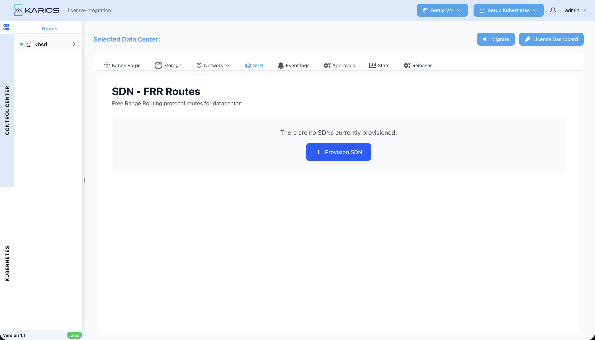
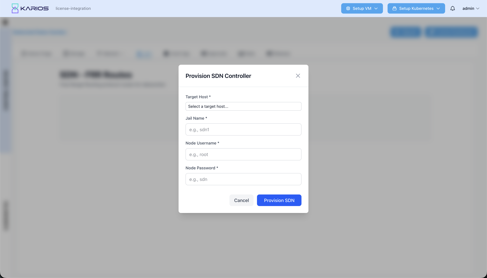
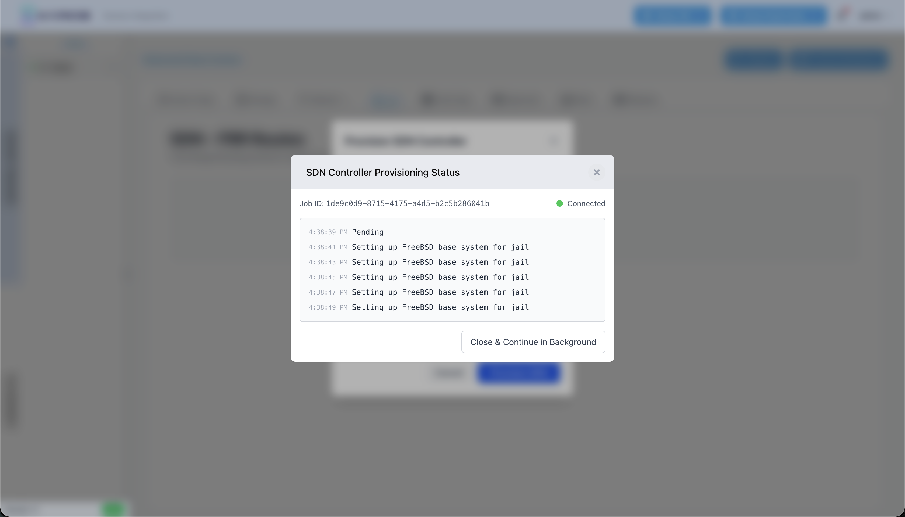
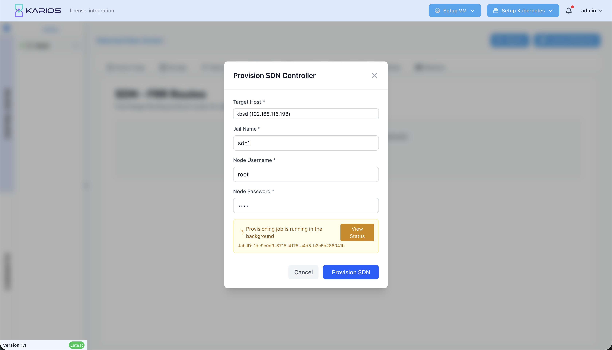
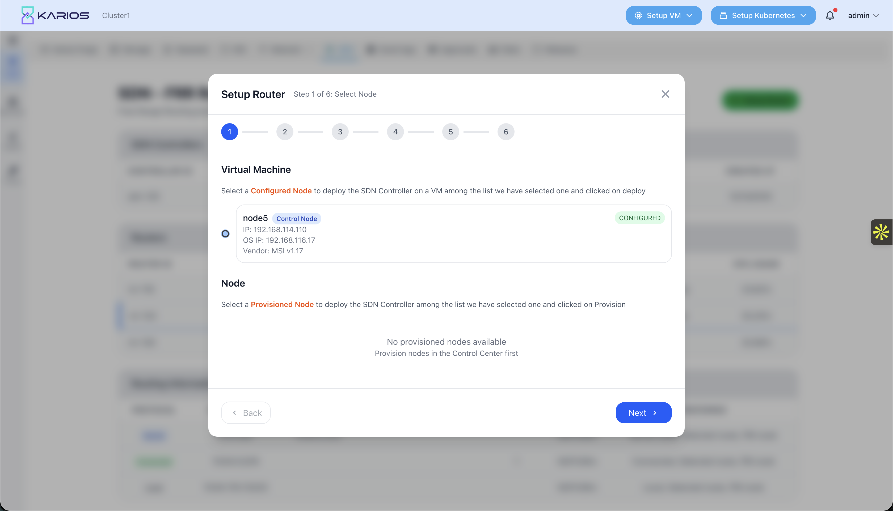
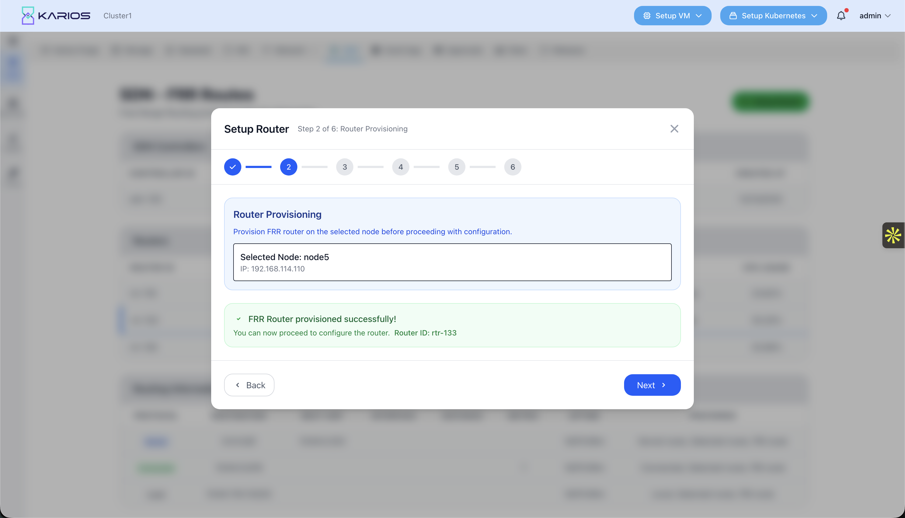
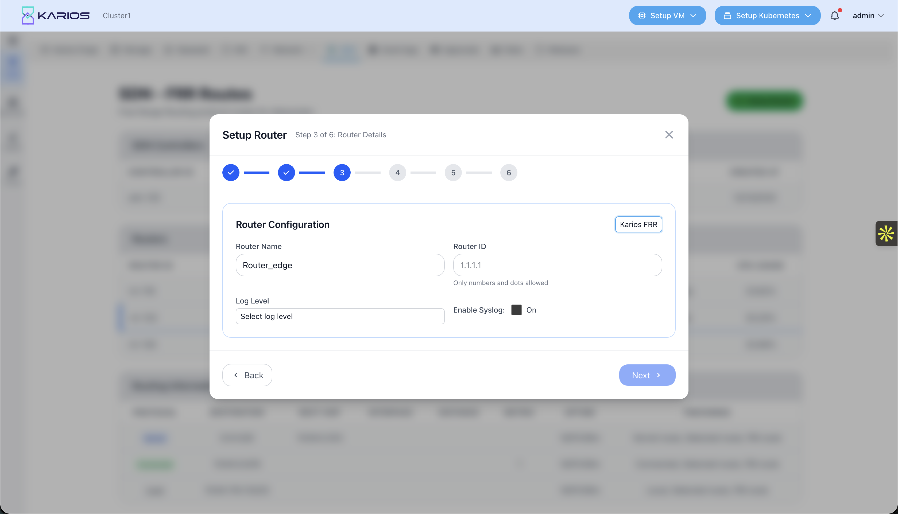
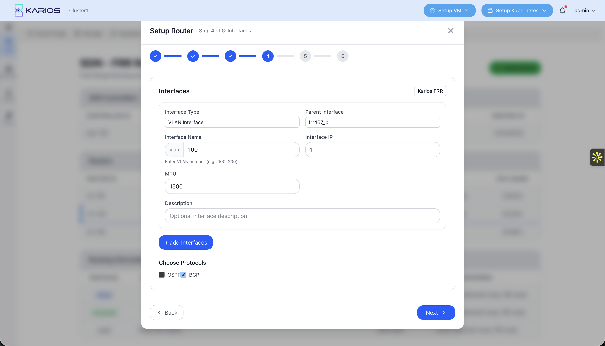
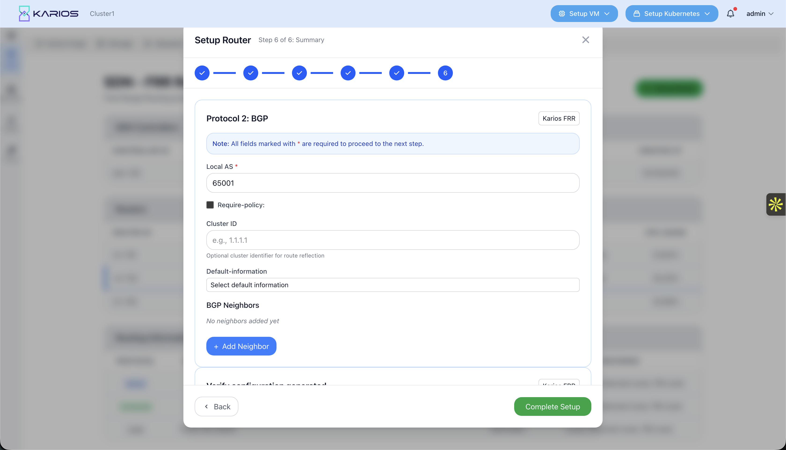
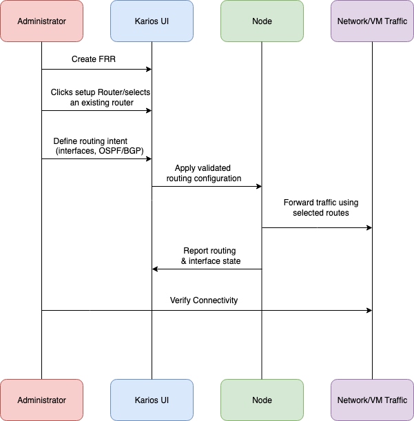

===========================
Software-Defined Networking
===========================

.. contents:: Table of Contents
   :depth: 3
   :local:

Overview
========

Karios SDN provides a centralized, web-managed way to define and operate routing across a Karios cluster without requiring operators to log into individual nodes or manually maintain routing configuration.

Challenges Without Karios SDN
-----------------------------

Organizations often face challenges when managing routing at scale:

.. list-table::
   :widths: 35 65
   :header-rows: 1

   * - Challenge
     - Impact
   * - **Distributed Routing State**
     - Routing information is scattered across nodes, making it difficult to understand the overall routing behavior.
   * - **Limited Visibility**
     - Operators lack a clear view into active routes, protocol state, and forwarding decisions.
   * - **High Operational Risk**
     - Manual routing changes increase the chance of misconfiguration and service disruption.
   * - **Slow Troubleshooting**
     - Diagnosing routing issues requires logging into individual nodes and inspecting state manually.

How Karios Transforms SDN Routing
---------------------------------

Karios addresses these challenges while preserving the performance of the FreeBSD routing stack:

.. list-table::
   :widths: 35 65
   :header-rows: 1

   * - Feature
     - Benefit
   * - **Centralized Routing Visibility**
     - View routers, interfaces, routes, and protocol state from a single UI.
   * - **Unified Router Management**
     - Manage routing instances consistently across nodes.
   * - **Validated Configuration Workflows**
     - Prevents inconsistent or partial routing state before changes are applied.
   * - **Operational Clarity**
     - Routing decisions, selected paths, and interface state are clearly observable.
   * - **Real-Time Insight**
     - Live visibility into route stability, interface traffic, and router health.

What Makes Karios SDN Essential
-------------------------------

* A centralized SDN routing platform that simplifies multi-node routing while preserving FreeBSD’s native performance.

* Unified visibility and control over routers, interfaces, and routing protocols across the cluster.

* Built-in validation and coordinated operations to reduce routing-related risk.

* Full routing lifecycle management: configure, observe, validate, and troubleshoot—from one place.
SDN Landing Page and Controller Provisioning
============================================

SDN Landing Page (UI Overview)
------------------------------

The **SDN – FRR Routes** landing page serves as the entry point for managing
software-defined routing in Karios.

It presents the current SDN provisioning state for the selected data center
and provides a controlled starting point for introducing routing intelligence
using FRR-based routing components.

When no SDN controller is present, the page displays an explicit empty state
along with a **Provision SDN** action, ensuring that routing control is
intentionally and explicitly initialized.

   Figure: SDN landing page showing FRR-based SDN routing status and provisioning entry point

SDN Controller Provisioning
---------------------------

Provisioning an SDN controller is the first operational step in enabling
software-defined routing in Karios.

This process establishes the control-plane foundation required to define
routing intent, coordinate FRR-based routers, and provide centralized routing
visibility across the data center.

When an administrator selects **Provision SDN** from the landing page,
Karios presents a controlled provisioning interface that defines where
and how the SDN controller will run.

   Figure: SDN controller provisioning dialog for initializing routing control

Provisioning Parameters
~~~~~~~~~~~~~~~~~~~~~~~

The provisioning dialog captures the minimum information required to safely
deploy the SDN controller:

* **Target Host**  
  Identifies the node on which the SDN controller will be deployed.

* **Jail Name**  
  Defines an isolated FreeBSD jail that hosts the controller runtime.

* **Node Credentials**  
  Allow Karios to securely install, initialize, and manage the controller
  environment on the selected node.

All inputs are validated prior to execution to prevent misconfiguration
or unauthorized access.

Provisioning Execution and Status
---------------------------------

Once provisioning is initiated, Karios executes the operation as a background
job and exposes real-time progress through a dedicated status view.

The provisioning status view provides:

* A unique **Job ID** for operational traceability
* Live execution logs
* Current connectivity state of the SDN controller

Provisioning tasks such as jail creation, FreeBSD base system setup, and
controller service initialization are performed sequentially and reported
back to the UI.

   Figure: SDN controller provisioning status and execution logs

Provisioning in Progress (Background Execution)
-----------------------------------------------

During SDN controller provisioning, Karios allows the operation to continue
as a background job without blocking the user interface.

When provisioning is already in progress, the provisioning dialog reflects
the active state instead of restarting the process. The UI clearly indicates
that the controller setup is running asynchronously.

   Figure: SDN controller provisioning running as a background job

Setting Up an FRR Router
=======================

After the SDN controller is successfully provisioned, Karios enables administrators to deploy and configure FRR routers through a guided, multi-step workflow.
This workflow ensures routers are provisioned correctly, validated incrementally, and aligned with the intended routing design before becoming operational.

The router setup process consists of six sequential steps, each focused on a specific aspect of router deployment and configuration.

Step 1: Select Node
-------------------

The first step determines where the router will run.

Administrators select a configured node or virtual machine from the available inventory.
Only nodes that meet the required prerequisites are selectable.

This step establishes:

- The physical or virtual host for the FRR router
- The execution context for routing services

   Figure: Selecting a configured node for FRR router deployment

Step 2: Router Provisioning
---------------------------

Once a node is selected, Karios provisions the FRR router runtime on that node.

During this step, administrators provide:

- Target Host (auto-selected from Step 1)
- Jail Name to isolate the FRR router
- Node credentials for secure installation

Karios installs and initializes the FRR router inside an isolated jail and validates the environment before proceeding.

   Figure: FRR router provisioning on the selected node

Upon successful provisioning, the router is assigned a unique Router ID and becomes ready for configuration.

Step 3: Router Configuration
----------------------------

In this step, administrators define logical router attributes.

Configurable parameters include:

- Router Name
- Router ID
- Logging level
- Syslog enablement

These settings control router identity, diagnostics, and observability behavior.

   Figure: Defining router identity and logging configuration

Step 4: Interface Configuration
-------------------------------

This step defines how the router connects to the network.

Administrators can configure one or more interfaces, including:

- Interface type (e.g., VLAN interface)
- Parent interface
- VLAN ID
- IP address
- MTU
- Optional description

At this stage, routing protocols (OSPF, BGP) are also selected for the router.

   Figure: Configuring router interfaces and selecting routing protocols

Karios validates interface definitions to prevent misconfiguration before advancing.

Step 5: Routing Protocol Configuration
--------------------------------------

Based on the protocols selected in the previous step, Karios presents protocol-specific configuration screens.

For BGP, administrators configure:

- Local AS number
- Optional cluster ID
- Default route handling
- BGP neighbors and policies

For OSPF, area and interface participation settings are configured.

These definitions represent the routing intent, which Karios later translates into FRR configuration.

   Figure: Configuring BGP routing parameters

Step 6: Review and Complete Setup
---------------------------------

The final step presents a consolidated summary of:

- Node selection
- Router identity
- Interface definitions
- Routing protocol settings

Once confirmed, Karios applies the validated configuration to the router and activates it.

.. .. figure:: _static/images/setup_router_summary_step6.png
..    :alt: Router setup summary
..    :width: 650
..    :align: center

..    Figure: Final review and completion of router setup

Outcome
-------

Upon successful setup:

- The FRR router is fully operational
- Routing intent is enforced consistently
- Traffic forwarding begins using selected routes
- Real-time visibility is available through the Karios UI

This structured workflow ensures routers are deployed safely, predictably, and in alignment with SDN best practices.

SDN Architecture
================

Karios SDN is structured as a layered system that provides centralized routing visibility and controlled configuration, while keeping packet forwarding fast and predictable on each node.

At a high level, SDN behavior in Karios is represented in the UI through three connected views:

* **SDN Controllers** – control-plane service visibility and health
* **Routers** – routing instances and protocol state
* **Routes / Interfaces / Traffic** – effective routing and operational behavior

High-Level Layers
=================

Control Layer
-------------

The **Control Layer** is represented by the **SDN Controller**. It provides a centralized point to coordinate SDN operations and to present a consistent view of SDN health in the UI.

In Karios, the controller is displayed with identity and reachability information (ID, status, IP, MAC, creation time) so operators can confirm that SDN control services are online before debugging routing.

Routing Layer
-------------

The **Routing Layer** consists of **Routers**. Each router maintains routing state, exposes protocol sections such as **OSPF** and **BGP**, and provides health indicators such as **Status**, **Uptime**, and **CPU Usage**.

This layer is where routing decisions are formed (which destinations are reachable and which next-hops should be selected).

Forwarding and Visibility Layer
-------------------------------

The **Forwarding and Visibility Layer** is surfaced through:

* **Routing Information Base** (routes, protocol source, next-hop, uptime, preferred/selected state)
* **Interfaces** (interface IPs, status, parent relationship)
* **Interface Traffic** (RX/TX visibility)

This layer shows what routing and interface state traffic depends on and supports fast correlation between routing decisions and observed traffic behavior.

End-to-End Runtime Flow
=======================

At runtime, the SDN architecture follows a simple flow:

1. The **SDN Controller** provides centralized coordination and health visibility.
2. A selected **Router** maintains routing state and protocol participation.
3. Routing outcomes are reflected through **Routes**, **Interfaces**, and **Interface Traffic** in the UI.

   Figure: Example SDN user flow showing UI-driven routing configuration and execution

This architecture ensures operators can validate control-plane availability, inspect routing behavior, and observe forwarding-related outcomes from a single place.

Core SDN Components
===================

SDN Controllers
---------------

Overview
~~~~~~~~
The **SDN Controller** represents the control-plane service visible in the **SDN - FRR Routes** page. It is responsible for coordinating and validating routing-related operations and for presenting a consolidated view of routing health in the UI.

In Karios, the controller is shown as a managed runtime instance with a stable identity, reachability information, and a health indicator. This allows operators to quickly confirm that SDN control services are online before troubleshooting routers or routing state.

Monitoring Capabilities
~~~~~~~~~~~~~~~~~~~~~~~~
The **SDN Controllers** panel displays runtime and reachability information:

.. list-table::
   :widths: 30 70
   :header-rows: 1

   * - Field
     - What You See in Karios
   * - **Controller ID**
     - Unique identifier for the controller instance (used to distinguish controller lifecycles).
   * - **Name**
     - System-generated controller name displayed for operational identification.
   * - **Type**
     - Runtime isolation type (for example, **jail**), indicating where the controller is hosted.
   * - **Status**
     - Health indicator (for example, **Active**) confirming the controller is running.
   * - **IP Address**
     - Controller IP used for reachability and internal control-plane communication.
   * - **MAC Address**
     - Controller interface MAC used for Layer-2 visibility and troubleshooting.
   * - **Created At**
     - Creation timestamp, useful to correlate controller restarts with routing events.

Notes
~~~~~
* **Active** indicates the controller is currently running and participating in SDN operations.
* Controller information provides a fast way to validate that the control-plane is available before investigating router state.

Routers
-------

Overview
~~~~~~~~
The **Routers** panel lists routing instances managed and monitored through Karios. These routers represent the routing control services that maintain routing protocol state and publish routes that can be installed for forwarding.

Routers are presented as operational entities with identity, reachability, health, and resource usage so operators can quickly determine which router is active, stable, and healthy.

Router Inventory in Karios
~~~~~~~~~~~~~~~~~~~~~~~~~~
The **Routers** table provides a cluster-level view of router instances:

.. list-table::
   :widths: 30 70
   :header-rows: 1

   * - Field
     - What You See in Karios
   * - **Router ID**
     - Unique identifier for the router instance (for example, ``rtr-133``).
   * - **Hostname**
     - DNS-style name used to identify the router instance (for example, ``frr467.karios.ai``).
   * - **Type**
     - Router implementation type shown in the UI (for example, **frr**).
   * - **Status**
     - Health indicator (for example, **Healthy**) confirming the router is operational.
   * - **Role**
     - Functional placement label (for example, **edge**) indicating its routing position in the topology.
   * - **IP Address**
     - Router IP address used for management reachability and protocol adjacency.
   * - **Uptime**
     - How long the router instance has been running without restart.
   * - **CPU Usage**
     - Current CPU utilization for the router instance.

Notes
~~~~~
* **Healthy** indicates the router is responding and providing routing state to the UI.
* **Uptime** helps correlate routing changes with router restarts.
* **CPU Usage** provides quick visibility into load conditions during routing instability or convergence.

Routing Information Base
------------------------

Overview
~~~~~~~~
The **Routing Information Base** section displays the active routing entries currently visible on the selected router. This table provides visibility into what destinations are reachable, where routes originate, and which routes are selected for forwarding.

Karios surfaces these routes in a way that helps operators confirm correct default gateways, directly connected networks, and router-local identities.

Route Visibility in Karios
~~~~~~~~~~~~~~~~~~~~~~~~~~
The **Routing Information Base** table summarizes the routing state:

.. list-table::
   :widths: 25 75
   :header-rows: 1

   * - Field
     - What You See in Karios
   * - **Protocol**
     - Route source category shown in the UI (for example, **Kernel**, **Connected**, **Local**).
   * - **Destination**
     - Destination prefix in CIDR notation (for example, ``0.0.0.0/0`` or ``10.64.0.0/16``).
   * - **Next Hop**
     - Next-hop gateway IP used to reach the destination (when applicable).
   * - **Interface**
     - Interface associated with the route (when displayed).
   * - **Distance**
     - Administrative distance value used to rank route sources (when applicable).
   * - **Metric**
     - Metric value used to rank routes within a protocol (when applicable).
   * - **Uptime**
     - Duration the route has been present and stable.
   * - **Preferred**
     - Selection status shown by the UI (for example, **Selected route**, **FIB route**).

Notes
~~~~~
* A route marked **Selected route** indicates it is the chosen best route among candidates.
* A route marked **FIB route** indicates it is installed for forwarding decisions.
* **Kernel**, **Connected**, and **Local** help distinguish gateway routes vs. directly attached networks vs. router-specific addresses.

Router Configuration
--------------------

Overview
~~~~~~~~
Selecting a router opens the **Configuration** section. This view is the operational drill-down that ties together:

* Router identity (Router ID and IP)
* Router **Interfaces**
* **Interface Traffic** visibility
* Protocol sections for **OSPF** and **BGP**

This layout allows operators to correlate routing outcomes (routes installed) with the underlying interfaces and protocol configuration.

Interfaces
~~~~~~~~~~
The **Interfaces** panel lists the network interfaces associated with the selected router and shows their operational state.

.. list-table::
   :widths: 30 70
   :header-rows: 1

   * - Field
     - What You See in Karios
   * - **Name**
     - Interface name (for example, ``lo0`` or ``frr467_b``).
   * - **IP**
     - Interface IP address in CIDR notation.
   * - **Status**
     - Link/operational state shown in the UI (for example, **up**).
   * - **Current Interface Action**
     - Current interface state/action label shown in the UI (for example, **active**).
   * - **Parent Interface**
     - Parent interface relationship when applicable (otherwise shown as ``N/A``).

Notes
~~~~~
* Interfaces in **up** state are available for protocol participation and routing.
* Interface details help correlate routing reachability issues with interface status and IP assignment.

Interface Traffic
~~~~~~~~~~~~~~~~~
The **Interface Traffic** panel provides visibility into real-time traffic for the selected interface. The interface selector allows you to switch between interfaces (for example, ``lo0`` vs. a routed interface) to compare traffic behavior.

Notes
~~~~~
* **RX** and **TX** represent received and transmitted traffic rate for the selected interface.
* If the UI shows **No data available**, it typically indicates traffic telemetry is not present for the selected interface or there is currently no measurable traffic on that interface.

OSPF
~~~~
The **OSPF** section appears under router configuration and supports assigning an **OSPF Area** to a selected interface through the UI workflow.

Notes
~~~~~
* OSPF is associated with **interfaces** in the UI because routing protocol participation occurs on specific network links.
* The OSPF panel may show **No OSPF data available** when OSPF is not configured or when no OSPF neighbors/routes are currently learned.

BGP
~~~
The **BGP** section appears under router configuration and provides a dedicated area for BGP visibility and configuration.

Notes
~~~~~
* The UI may show **Loading BGP data...** while retrieving runtime state.
* BGP state is presented per-router to support visibility into peering and route exchange behavior.

FRR Configuration Templates
============================

Overview
--------

This section provides sample FRR configuration templates for common routing scenarios. These templates are based on real-world Karios deployments and can be used as a starting point when configuring FRR routers through the Karios SDN interface or when manually configuring FRR.

.. important::
   **Before Using These Templates:**
   
   - Replace all IP addresses with your actual router IPs
   - Update interface names to match your network interfaces
   - Modify router hostnames and router-ids
   - Adjust AS numbers if using different BGP autonomous systems
   - Ensure loopback IPs are unique for each router

.. note::
   These templates demonstrate a complete multi-router topology with iBGP and OSPF. You can use individual configurations as needed for your deployment.

Template 1: Internal IGP Router (frrIGP)
-----------------------------------------

This template configures an internal IGP router that participates in both OSPF and iBGP within the autonomous system.

**Use Case:**
   Internal router providing routing connectivity between edge routers and other internal routers using OSPF for IGP and iBGP for route distribution.

**Network Topology Role:**
   - Participates in OSPF Area 0 (backbone)
   - iBGP peer with other internal routers
   - Redistributes OSPF and connected routes into BGP

**Configuration:**

.. code-block:: text

   # /usr/local/etc/frr/frr.conf for frrIGP

   frr version 10.1
   frr defaults traditional
   hostname frrIGP
   log syslog informational
   no ipv6 forwarding
   service integrated-vtysh-config

   # Interfaces
   interface lo0
    description Loopback
    ip address 12.11.10.2/32
    no shutdown
   !

   interface frrIGP_b
    description Management Interface
    # Update this with actual IP if different
    ip address 192.168.113.132/24
    no shutdown
   !

   # OSPF Configuration
   router ospf
    ospf router-id 12.11.10.2
    network 12.11.10.2/32 area 0.0.0.0
    network 192.168.113.0/24 area 0.0.0.0
    passive-interface lo0
   !

   # BGP Configuration - Internal Router
   router bgp 65001
    bgp router-id 12.11.10.2
    no bgp ebgp-requires-policy
    neighbor INTERNAL peer-group
    neighbor INTERNAL remote-as 65001
    neighbor INTERNAL update-source lo0
    
    # iBGP peers using loopback IPs
    neighbor 11.11.10.2 peer-group INTERNAL
    neighbor 11.11.10.2 description frrEDGE
    neighbor 10.11.10.2 peer-group INTERNAL
    neighbor 10.11.10.2 description frr103
    
    address-family ipv4 unicast
     redistribute connected
     redistribute ospf
     neighbor INTERNAL activate
     neighbor INTERNAL soft-reconfiguration inbound
    exit-address-family
   !

   line vty
   !

**Key Parameters to Update:**

.. list-table::
   :widths: 35 65
   :header-rows: 1

   * - Parameter
     - What to Change
   * - **hostname frrIGP**
     - Replace with your router's hostname
   * - **ip address 12.11.10.2/32** (lo0)
     - Replace with your unique loopback IP address
   * - **ip address 192.168.113.132/24** (frrIGP_b)
     - Replace with your management interface IP address
   * - **interface frrIGP_b**
     - Replace with your actual interface name
   * - **ospf router-id 12.11.10.2**
     - Replace with your unique router ID (typically matches loopback IP)
   * - **bgp router-id 12.11.10.2**
     - Replace with your unique BGP router ID (typically matches loopback IP)
   * - **router bgp 65001**
     - Replace with your autonomous system number if different
   * - **neighbor 11.11.10.2**
     - Replace with your edge router's loopback IP
   * - **neighbor 10.11.10.2**
     - Replace with your other internal router's loopback IP
   * - **network 192.168.113.0/24**
     - Replace with your management network subnet

Template 2: Internal Router (frr103)
-------------------------------------

This template configures another internal router similar to frrIGP, demonstrating how multiple internal routers connect.

**Use Case:**
   Additional internal router in the network, participating in the same OSPF area and iBGP mesh.

**Network Topology Role:**
   - Second internal router in OSPF Area 0
   - iBGP peer with edge and other internal routers
   - Provides redundancy and alternate paths

**Configuration:**

.. code-block:: text

   # /usr/local/etc/frr/frr.conf for frr103

   frr version 10.1
   frr defaults traditional
   hostname frr103
   log syslog informational
   no ipv6 forwarding
   service integrated-vtysh-config

   # Interfaces
   interface lo0
    description Loopback
    ip address 10.11.10.2/32
    no shutdown
   !

   interface frr103_b
    description Management Interface
    ip address 192.168.113.128/24
    no shutdown
   !

   # OSPF Configuration
   router ospf
    ospf router-id 10.11.10.2
    network 10.11.10.2/32 area 0.0.0.0
    network 192.168.113.0/24 area 0.0.0.0
    passive-interface lo0
   !

   # BGP Configuration - Internal Router
   router bgp 65001
    bgp router-id 10.11.10.2
    no bgp ebgp-requires-policy
    neighbor INTERNAL peer-group
    neighbor INTERNAL remote-as 65001
    neighbor INTERNAL update-source lo0
    
    # iBGP peers using loopback IPs
    neighbor 11.11.10.2 peer-group INTERNAL
    neighbor 11.11.10.2 description frrEDGE
    neighbor 12.11.10.2 peer-group INTERNAL
    neighbor 12.11.10.2 description frrIGP
    
    address-family ipv4 unicast
     redistribute connected
     redistribute ospf
     neighbor INTERNAL activate
     neighbor INTERNAL soft-reconfiguration inbound
    exit-address-family
   !

   line vty
   !

**Key Parameters to Update:**

.. list-table::
   :widths: 35 65
   :header-rows: 1

   * - Parameter
     - What to Change
   * - **hostname frr103**
     - Replace with your router's hostname
   * - **ip address 10.11.10.2/32** (lo0)
     - Replace with your unique loopback IP address
   * - **ip address 192.168.113.128/24** (frr103_b)
     - Replace with your management interface IP address
   * - **interface frr103_b**
     - Replace with your actual interface name
   * - **ospf router-id 10.11.10.2**
     - Replace with your unique router ID
   * - **bgp router-id 10.11.10.2**
     - Replace with your unique BGP router ID
   * - **router bgp 65001**
     - Replace with your autonomous system number if different
   * - **neighbor 11.11.10.2**
     - Replace with your edge router's loopback IP
   * - **neighbor 12.11.10.2**
     - Replace with your IGP router's loopback IP

Template 3: Edge Router (frrEDGE)
----------------------------------

This template configures an edge router that serves as the network boundary and default route originator.

**Use Case:**
   Edge router that connects internal network to external networks, originating default routes and managing external connectivity.

**Network Topology Role:**
   - Edge router in OSPF Area 0
   - Originates default route (0.0.0.0/0) into OSPF
   - iBGP peer with all internal routers
   - Uses next-hop-self for iBGP routes

**Configuration:**

.. code-block:: text

   # /usr/local/etc/frr/frr.conf for frrEDGE

   frr version 10.1
   frr defaults traditional
   hostname frrEDGE
   log syslog informational
   no ipv6 forwarding
   service integrated-vtysh-config

   # Interfaces
   interface lo0
    description Loopback
    ip address 11.11.10.2/32
    no shutdown
   !

   interface frrEDGE_b
    description Management Interface
    ip address 192.168.113.131/24
    no shutdown
   !

   # OSPF Configuration
   router ospf
    ospf router-id 11.11.10.2
    network 11.11.10.2/32 area 0.0.0.0
    network 192.168.113.0/24 area 0.0.0.0
    passive-interface lo0
    default-information originate always
   !

   # BGP Configuration - Edge Router
   router bgp 65001
    bgp router-id 11.11.10.2
    no bgp ebgp-requires-policy
    bgp bestpath as-path multipath-relax
    neighbor INTERNAL peer-group
    neighbor INTERNAL remote-as 65001
    neighbor INTERNAL update-source lo0
    neighbor INTERNAL next-hop-self
    
    # iBGP peers using loopback IPs
    neighbor 10.11.10.2 peer-group INTERNAL
    neighbor 10.11.10.2 description frr103
    neighbor 12.11.10.2 peer-group INTERNAL
    neighbor 12.11.10.2 description frrIGP
    
    address-family ipv4 unicast
     redistribute connected
     redistribute ospf
     neighbor INTERNAL activate
     neighbor INTERNAL soft-reconfiguration inbound
    exit-address-family
   !

   line vty
   !

**Key Parameters to Update:**

.. list-table::
   :widths: 35 65
   :header-rows: 1

   * - Parameter
     - What to Change
   * - **hostname frrEDGE**
     - Replace with your edge router's hostname
   * - **ip address 11.11.10.2/32** (lo0)
     - Replace with your unique loopback IP address
   * - **ip address 192.168.113.131/24** (frrEDGE_b)
     - Replace with your management interface IP address
   * - **interface frrEDGE_b**
     - Replace with your actual interface name
   * - **ospf router-id 11.11.10.2**
     - Replace with your unique router ID
   * - **bgp router-id 11.11.10.2**
     - Replace with your unique BGP router ID
   * - **router bgp 65001**
     - Replace with your autonomous system number if different
   * - **neighbor 10.11.10.2**
     - Replace with your first internal router's loopback IP
   * - **neighbor 12.11.10.2**
     - Replace with your second internal router's loopback IP

**Edge Router Specific Features:**

.. list-table::
   :widths: 35 65
   :header-rows: 1

   * - Feature
     - Description
   * - **default-information originate always**
     - Injects default route (0.0.0.0/0) into OSPF, making this router the gateway
   * - **bgp bestpath as-path multipath-relax**
     - Allows BGP to use multiple paths for load balancing
   * - **neighbor INTERNAL next-hop-self**
     - Modifies next-hop to itself for all iBGP peers (required for edge routers)

Network Topology Overview
--------------------------

These three templates work together to create a complete routing topology:

.. code-block:: text

                        ┌─────────────┐
                        │  frrEDGE    │
                        │ 11.11.10.2  │
                        │  (Edge)     │
                        └──────┬──────┘
                               │
                     ┌─────────┴─────────┐
                     │                   │
              ┌──────┴──────┐     ┌─────┴──────┐
              │   frrIGP    │     │   frr103   │
              │ 12.11.10.2  │────►│ 10.11.10.2 │
              │ (Internal)  │◄────│ (Internal) │
              └─────────────┘     └────────────┘

   - All routers participate in OSPF Area 0.0.0.0
   - Full iBGP mesh between all routers
   - frrEDGE originates default route
   - All routers share management network 192.168.113.0/24

**Connectivity:**
   - OSPF provides IGP routing and reachability between loopbacks
   - iBGP exchanges external routes and provides policy control
   - Each router has a unique loopback IP used as router-id and BGP update-source

Critical Configuration Steps
-----------------------------

When deploying these templates, follow this sequence:

**1. IP Address Planning**

.. code-block:: text

   Router      Loopback IP        Management IP           Interface Name
   ─────────────────────────────────────────────────────────────────────
   frrEDGE     11.11.10.2/32      192.168.113.131/24      frrEDGE_b
   frrIGP      12.11.10.2/32      192.168.113.132/24      frrIGP_b
   frr103      10.11.10.2/32      192.168.113.128/24      frr103_b

.. warning::
   **All loopback IPs must be unique!** These serve as router-ids for both OSPF and BGP.

**2. Update Each Router's Configuration**

For each router, update the following in sequence:

a. **Hostname and Router IDs:**
   
   .. code-block:: text
   
      hostname YOUR_ROUTER_NAME
      ospf router-id YOUR_LOOPBACK_IP
      bgp router-id YOUR_LOOPBACK_IP

b. **Loopback Interface:**
   
   .. code-block:: text
   
      interface lo0
       ip address YOUR_LOOPBACK_IP/32

c. **Management Interface:**
   
   .. code-block:: text
   
      interface YOUR_INTERFACE_NAME
       ip address YOUR_MANAGEMENT_IP/24

d. **OSPF Networks:**
   
   .. code-block:: text
   
      router ospf
       network YOUR_LOOPBACK_IP/32 area 0.0.0.0
       network YOUR_MANAGEMENT_NETWORK/24 area 0.0.0.0

e. **BGP Neighbors:**
   
   .. code-block:: text
   
      router bgp YOUR_AS_NUMBER
       neighbor PEER1_LOOPBACK_IP peer-group INTERNAL
       neighbor PEER1_LOOPBACK_IP description PEER1_NAME
       neighbor PEER2_LOOPBACK_IP peer-group INTERNAL
       neighbor PEER2_LOOPBACK_IP description PEER2_NAME

**3. Verification Checklist**

Before applying configurations, verify:

.. list-table::
   :widths: 10 40 50
   :header-rows: 1

   * - ✓
     - Check
     - Command to Verify
   * - [ ]
     - All loopback IPs are unique
     - Review all configurations side-by-side
   * - [ ]
     - All router-ids match loopback IPs
     - Check ospf router-id and bgp router-id
   * - [ ]
     - Interface names match your network
     - Verify with ``ifconfig`` or Karios UI
   * - [ ]
     - BGP AS numbers are consistent
     - All internal routers must use same AS (65001 in templates)
   * - [ ]
     - BGP neighbors use loopback IPs
     - Check neighbor statements use loopback, not management IPs
   * - [ ]
     - Management IPs are on same subnet
     - All should be in 192.168.113.0/24 or your subnet

Applying Templates in Karios
-----------------------------

**Method 1: Through Karios UI (Recommended)**
   
   - Use the **Router Setup Wizard** (Steps 1-6) to configure routers
   - The UI will generate FRR configuration based on your inputs
   - These templates serve as reference for the expected configuration structure

2. **Direct Configuration:**

   - SSH into the FRR router jail
   - Access the FRR shell: ``vtysh``
   - Enter configuration mode: ``configure terminal``
   - Copy and paste the template configuration
   - Customize parameters for your network
   - Save configuration: ``write memory``
   - Exit: ``exit``

3. **Configuration Files:**

   - Templates can be saved to ``/usr/local/etc/frr/frr.conf``
   - Restart FRR services to apply changes
   - Validate configuration through Karios UI

.. warning::
   Always backup your current configuration before applying changes. Test new configurations in a non-production environment first to avoid network disruptions.
