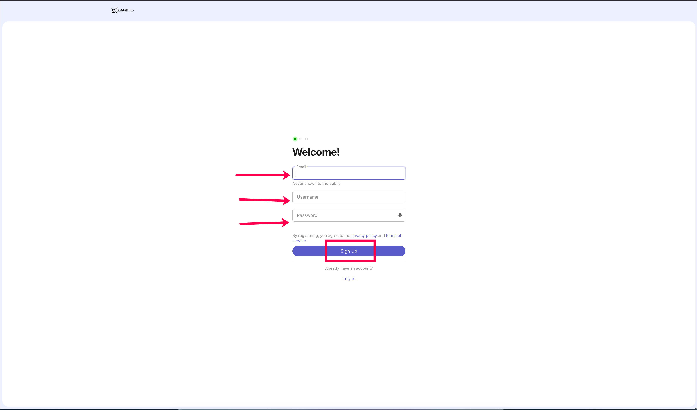
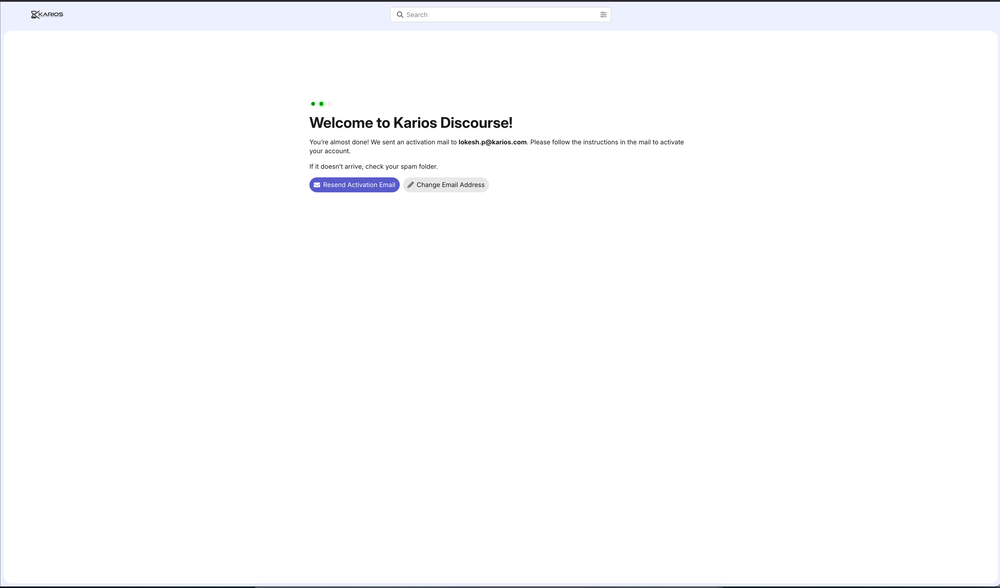
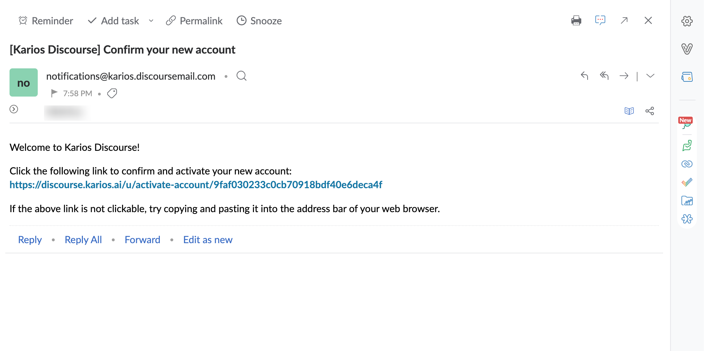
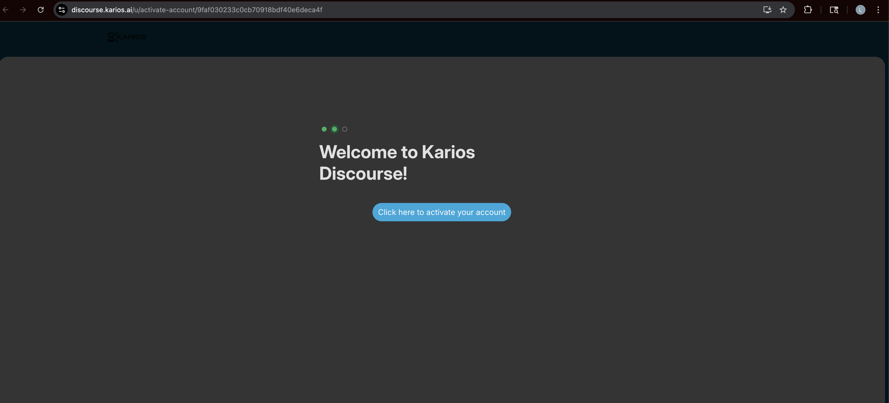
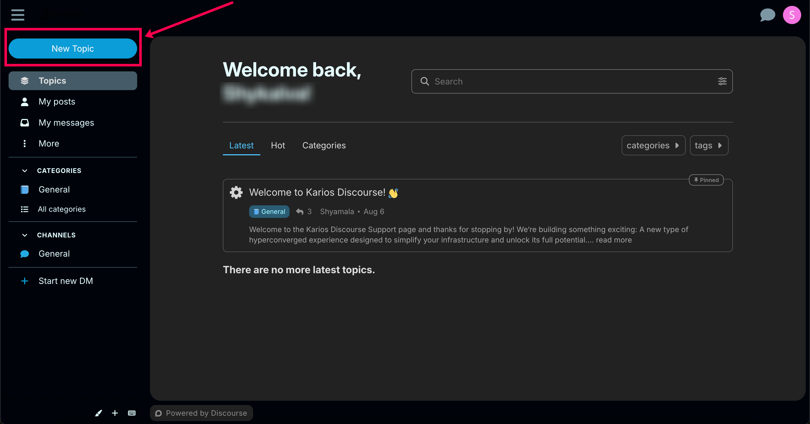
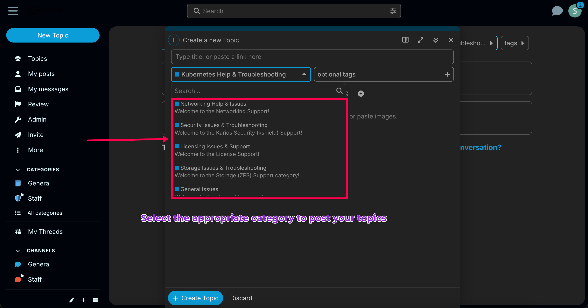
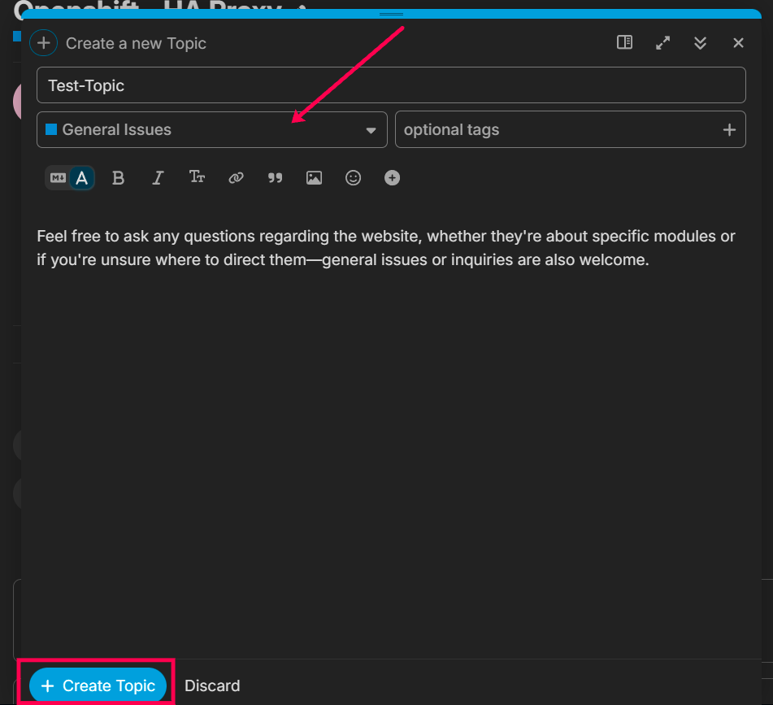

.. _getting_support:

Getting Support
===============

We strive for a consistently smooth experience with Karios, anticipating minimal need for direct support. However, should you encounter any challenges, our community Discourse forum offers a dedicated platform for questions, feedback, and issue reporting. This guide provides step-by-step instructions for creating an account and submitting a support ticket, ensuring you can readily access the assistance you need.

Overview
~~~~~~~~~

The Karios Discourse forum at https://discourse.karios.ai is the primary channel for:

* Reporting issues and bugs
* Requesting technical support
* Asking questions about Karios features
* Sharing feedback and feature requests
* Connecting with other Karios users and administrators

Anyone can create a Discourse account to submit support tickets, regardless of whether they are an existing Karios platform user.

Creating a Discourse Account
~~~~~~~~~~~~~~~~~~~~~~~~~~~~~

Step 1: Navigate to Discourse
^^^^^^^^^^^^^^^^^^^^^^^^^^^^^

Open your web browser and navigate to:

.. code-block:: text

   https://discourse.karios.ai

Step 2: Begin Registration
^^^^^^^^^^^^^^^^^^^^^^^^^^

1. Click the **Sign Up** button on the welcome page
2. You will be presented with a registration form
3. Fill in the required information:

* **Email**: Enter your email address (this will not be shown publicly)
* **Username**: Choose a unique username for the forum
* **Password**: Create a secure password for your account

Review and accept the privacy policy and terms of service by checking the agreement box.

   Figure 1: Filled Karios Discourse Registration Form

Click the **Sign Up** button to submit your registration.

4. You will be prompted to Go to your email to complete the registration process.

   Figure 2: Karios Discourse Registration Submitted

Step 3: Email Verification
^^^^^^^^^^^^^^^^^^^^^^^^^^^

After submitting your registration:

1. Check your email inbox for an activation email from Karios Discourse
2. The email will be sent to the address you provided during registration
3. If you don't see the email within a few minutes, check your spam folder

   Figure 3: Karios Discourse Activation Email

2. Click the activation link provided in the email
3. You will be redirected to the Discourse forum

   Figure 4: Karios Discourse Activation Link

.. tip::
   The activation email is sent from ``notifications@karios.discoursemail.com``. You may want to add this to your contacts to ensure delivery.

.. important::
   You must activate your account via email before you can create support tickets or participate in discussions.

Creating a Support Ticket
~~~~~~~~~~~~~~~~~~~~~~~~~~

Once your account is activated, you can create support tickets:

Access the Forum
^^^^^^^^^^^^^^^^^

1. Navigate to https://discourse.karios.ai
2. Log in with your username and password if not already logged in

Create New Topic
^^^^^^^^^^^^^^^^^^

1. Click the **New Topic** button (usually located in the upper right corner)

   Figure 5: Karios Discourse New Topic Button

2. Select the appropriate category for your issue:
   
   * **Support** - For technical support requests
   * **Bug Reports** - For reporting bugs in Karios
   * **Feature Requests** - For suggesting new features
   * **General** - For general questions and discussions

   Figure 6: Karios Discourse Category Selection

Submit Your Ticket
^^^^^^^^^^^^^^^^^^^^^

1. Review your post for clarity and completeness
2. Add relevant tags if available
3. Click **Create Topic** to submit your support ticket

.. tip::
   If the category does not match your request, choose "**General Issues**"

   Figure 7: Karios Discourse Submit Topic Button

What Happens Next
~~~~~~~~~~~~~~~~~~

* Support team members and community experts will review your ticket
* You will receive email notifications when someone responds
* You can return to the forum to view responses and provide additional information
* Continue the conversation in the thread until your issue is resolved

Best Practices for Support Tickets
~~~~~~~~~~~~~~~~~~~~~~~~~~~~~~~~~~~

To get the fastest and most effective support:

**Be Specific**

Provide exact error messages, version numbers, and configuration details rather than general descriptions.

**Include Context**

Explain what you were trying to accomplish when the issue occurred and what troubleshooting steps you've already attempted.

**Use Appropriate Formatting**

* Use code blocks for logs and configuration files
* Use bullet points for lists
* Attach screenshots for UI-related issues
* Keep the formatting clean and readable

**Follow Up Promptly**

Respond to questions from support staff in a timely manner to help resolve your issue quickly.

**Search First**

Before creating a new ticket, search the forum to see if your issue has already been reported or resolved.

**One Issue Per Ticket**

Create separate tickets for different issues to keep discussions focused and organized.

**Privacy**

**Protecting Sensitive Information**

.. warning::
   Do not include sensitive information in public support tickets:
   
   * Passwords or API keys
   * Private IP addresses (unless necessary)
   * Personal identifying information
   * Customer data

If your issue requires sharing sensitive information, note this in your ticket and a support team member will contact you through a private channel.

**Account Protection**

* Use a strong, unique password for your Discourse account
* Enable two-factor authentication if available
* Log out from shared or public computers

Getting Help with Discourse
~~~~~~~~~~~~~~~~~~~~~~~~~~~~~~

If you encounter issues with the Discourse platform itself:

* Visit the Discourse help section within the forum
* Check the official Discourse documentation at https://meta.discourse.org
* Contact the Karios support team through alternative channels (email, etc.)

Additional Support Channels
~~~~~~~~~~~~~~~~~~~~~~~~~~~~

While Discourse is the primary support channel, you may also reach the Karios team through:

* **Email**: support@karios.ai
