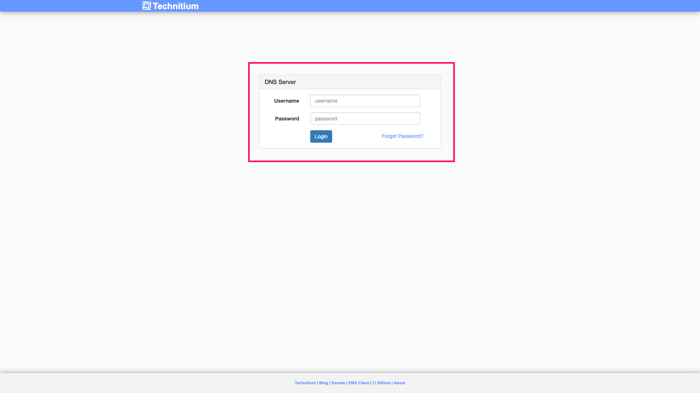
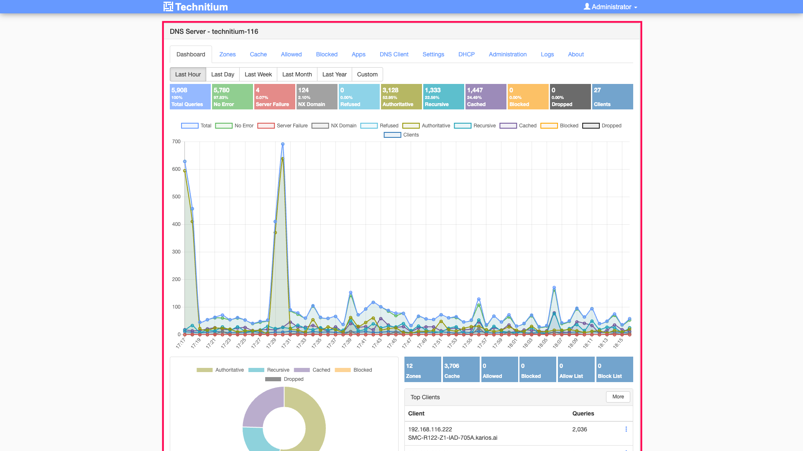

Network Setup Prerequisites
---------------------------

.. important::
   **Dedicated Network Required**
   
   Karios deploys Technitium as a **system VM** that provides DNS/DHCP services for all nodes. Your Karios deployment must be on a **dedicated network segment** (VLAN or physical) where Technitium will be the sole DHCP/DNS provider.
   
   **After installation**, you must disable any upstream DHCP server on the Karios network to prevent IP conflicts.

**Why Technitium is Required**

Technitium is not optional—it's a core Karios dependency:

- **FQDN Generation**: All nodes and VMs receive automatic fully-qualified domain names
- **Service Discovery**: Internal Karios services locate each other via DNS
- **Kubernetes Support**: K8s clusters depend on DNS for pod and service resolution
- **Node Provisioning**: DHCP assigns IPs to newly provisioned bare-metal nodes and VMs

Karios includes a bundled Technitium DNS-DHCP Server that provides comprehensive network management capabilities. This standalone service is pre-configured to an extent and ready to use immediately upon installation, with DHCP scopes automatically configured to match your discovered node IP ranges.

.. note::
   **Network Management**

   Technitium DNS/DHCP Server comes bundled with Karios to simplify network management tasks. Key pre-configured features include:

   - Default administrator credentials
   - DHCP scope matching your node's discovered IP range
   - DNS forwarding to reliable public DNS servers
   - Standalone web interface accessible at port 5380

.. note::
   The console interface for Technitium DNS Server virtual machines will not be accessible through the standard VM console view. This is due to the headless nature of DNS server deployments, which typically operate without graphical interfaces. For Technitium VM management and configuration, use SSH access or the web-based DNS administration interface instead of the console tab.

Technitium Overview
~~~~~~~~~~~~~~~~~~~~

**Pre-Configured Network Services**

Your Karios installation includes a fully configured Technitium DNS-DHCP Server with:

- **Automatic DHCP Scope Setup**: Automatically configured based on the node's discovered IP range (e.g., if the node gets 192.168.116.50, the DHCP scope adjusts to the 192.168.116.x network)
- **Standalone Web Interface**: Accessible at `[YOUR-IP]:5380`
- **Pre-Configured DNS Forwarders**: Set to reliable public DNS servers (e.g., Google DNS, Cloudflare)

Migration Recommendations (Recommended)
~~~~~~~~~~~~~~~~~~~~~~~~~~~~~~~~~~~~~~~~~~~~~~~

While Karios includes bundled Technitium DNS-DHCP Server, **it is recommended** to migrate from existing network infrastructure to take full advantage of Karios.

Pre-Migration Network Assessment
^^^^^^^^^^^^^^^^^^^^^^^^^^^^^^^^^

When migrating from existing DHCP/DNS infrastructure, perform a comprehensive network assessment:

**Current Network Discovery**

1. **Document Existing DHCP Server**
   
   - Identify your current DHCP server (router, Windows Server, Linux server)
   - Note the IP range being used (e.g., 192.168.1.100-192.168.1.200)
   - Document any existing static IP reservations
   - Record DNS server settings currently in use

2. **Network Infrastructure Assessment**

   - Map all connected devices (servers, workstations, printers, IoT devices)
   - Identify devices with static IP addresses
   - Document any port forwarding rules or network policies
   - Note VLAN configurations if applicable

3. **Service Dependencies**

   - Identify services dependent on current DNS/DHCP configuration
   - Document any custom DNS records or local domains
   - List applications using specific IP addresses or hostnames

**Pre-Migration Checklist**

   * [ ] Current DHCP server identified and documented
   * [ ] IP address range and reservations catalogued
   * [ ] Static IP devices inventory completed
   * [ ] DNS forwarders and custom records documented
   * [ ] Service dependencies mapped
   * [ ] Backup of current network configuration created
   * [ ] Planned downtime window scheduled
   * [ ] Rollback procedure documented

Migrating from Existing DHCP Server
^^^^^^^^^^^^^^^^^^^^^^^^^^^^^^^^^^^^

**Migration Strategy Overview**

The migration process involves transitioning DHCP services to the bundled Technitium while maintaining network continuity:

**Phase 1: Configuration Preparation**

1. **Access Bundled Technitium**

   - Navigate to `[NODE-IP]:5380`
   - Log in with pre-configured administrator credentials
   - Review current DHCP scope configuration (automatically configured during Karios installation)

2. **Replicate Current Configuration**

   - Copy DHCP scope settings from existing server
   - Import static IP reservations through Technitium web interface
   - Configure DNS forwarders to match current setup if different from defaults
   - Test configuration without activating DHCP service

**Phase 2: Technitium Integration**

1. **Customize DHCP Scope** (if needed)

   .. code-block:: text

      Network: x.y.z.0/24
      Start IP: x.y.z.[SCOPE_RANGE_START]
      End IP: x.y.z.[SCOPE_RANGE_END]
      Gateway: x.y.z.[GATEWAY]
      DNS Servers: [Technitium IP], 8.8.8.8, 1.1.1.1

2. **Import Existing Reservations**

   - Export reservations/leases from current DHCP server
   - Import into Technitium using the web interface
   - Verify all critical devices have reservations/leases 

**Phase 3: Migration Guidelines**

1. **Schedule Maintenance Window**

   - Notify users of planned network changes
   - Prepare rollback procedures
   - Ensure physical access to network equipment

2. **Disable Old DHCP Server(If any)**

   - Stop DHCP service on existing server
   - Monitor for any conflicts or issues
   - Keep server available for quick rollback if needed

Getting Started with Technitium DNS Server
~~~~~~~~~~~~~~~~~~~~~~~~~~~~~~~~~~~~~~~~~~~

Accessing the Technitium Web Interface
^^^^^^^^^^^^^^^^^^^^^^^^^^^^^^^^^^^^^^^

**Standalone Access**

Technitium DNS Server runs as a separate service alongside your Karios infrastructure and is accessed through its dedicated web interface:

- **Dedicated Web Interface**: Available at port 5380 on your Karios node
- **Pre-configured Credentials**: Administrator access ready for immediate use
- **Automatic Network Discovery**: DHCP scope pre-configured based on node discovery

**Access Method**

Access the Technitium interface directly at:

.. code-block:: text

   [NODE-IP]:5380

Replace ``[NODE-IP]`` with the actual IP address of your Karios node.

.. tip ::

    **Where to find your Node IP Address**
    You can find your Karios node's IP address by navigating to the Karios Control Center dashboard itself.

    .. figure::  ../user-guide/_static/images/web_interface_management/control_center_overview.png
       :width: 600
       :alt: Karios Control Center Dashboard

       Figure : Karios Control Center Dashboard showing Node IP Address

**Login Information**

Use the pre-configured administrator credentials provided in your Karios installation documentation:

- **Username**: ``admin``
- **Password**: [Provided during Karios installation]

      Figure : Technitium DNS Server Login Interface

**Pre-configured Settings Overview**

Your Technitium installation includes:

- **DHCP Scope**: Automatically configured to match discovered node IP ranges
- **DNS Forwarders**: Set to reliable public DNS servers (8.8.8.8, 1.1.1.1)
- **Network Integration**: Optimized for Karios VM and infrastructure requirements
- **Administrative Access**: Ready-to-use credentials for immediate management

DHCP Server Configuration
-------------------------

This section provides comprehensive, step-by-step instructions for configuring the bundled Technitium DNS Server's DHCP functionality. Follow these steps to customize your network configuration according to your specific requirements.

Initial Access and Navigation
~~~~~~~~~~~~~~~~~~~~~~~~~~~~~~

**Navigate to Main Dashboard**

After successful login, you'll see the main dashboard with several navigation sections:

- **Dashboard**: Overview and statistics
- **Zones**: DNS zone management
- **Cache**: DNS cache management
- **Allowed Zones**: DNS allow list management
- **Blocked Zones**: DNS block list management
- **Block List Zones**: Automated block list management
- **DHCP**: DHCP server configuration **(Primary focus)**
- **Settings**: Global server settings
- **Logs**: Server logs and monitoring
- **Apps**: DNS application management

   Figure : Technitium DNS Server Main Dashboard

DHCP Server Configuration
~~~~~~~~~~~~~~~~~~~~~~~~~

**Navigate to DHCP Configuration**

1. **Access DHCP Section**
   
   - Click on **"DHCP"** in the main navigation menu
   - The DHCP management interface will load

   .. figure:: _static/images/technitium/dhcp_navigation.png
      :width: 600
      :alt: Navigate to DHCP Section

      Figure : Navigate to DHCP Configuration Section

2. **DHCP Interface Overview**
   
   The DHCP interface contains several key sections:
   
   - **Scopes**: Configure IP address ranges and network settings
   - **Leases**: View current IP address assignments

   .. figure:: _static/images/technitium/dhcp_interface_overview.png
      :width: 600
      :alt: DHCP Interface Overview

      Figure : DHCP Configuration Interface Overview

Managing DHCP Scopes
~~~~~~~~~~~~~~~~~~~~

**Configure DHCP Scopes**

1. **Access Scope Management**
   
   - In the DHCP interface, locate the **"Scopes"** section
   - You should see your automatically configured scope based on node discovery
   - Click **"Add Scope"** to create additional scopes or **"Edit"** to modify existing scope

   .. tip ::
    **Pre-configured DHCP scope**
        The DHCP scope is automatically configured during Karios installation to match your node's discovered IP range. You can modify this scope as needed.

   .. figure:: _static/images/technitium/dhcp_scopes_list.png
      :width: 600
      :alt: DHCP Scopes List

      Figure : DHCP Scopes Management List

2. **Edit Existing Scope**
   
   - Click the **"Edit"** button next to your automatically configured scope
   - The scope configuration dialog will open

   .. figure:: _static/images/technitium/dhcp_edit_scope_button.png
      :width: 600
      :alt: Edit DHCP Scope Button

      Figure : Edit DHCP Scope Button

**Scope Configuration Parameters**

The scope configuration dialog contains the following critical settings:

1. **Basic Scope Settings**
   
   - **Scope Name**: Descriptive name for the scope (e.g., "Karios Network")
   - **Network Address**: Network subnet (e.g., x.y.z.0)
   - **Subnet Mask**: Network mask (e.g., 255.255.255.0 or /24)
   - **Start IP Address**: Beginning of DHCP range (e.g., x.y.z.[SCOPE_RANGE_START])
   - **End IP Address**: End of DHCP range (e.g., x.y.z.[SCOPE_RANGE_END])

   .. figure:: _static/images/technitium/dhcp_basic_scope_settings.png
      :width: 600
      :alt: Basic DHCP Scope Settings

      Figure : Basic DHCP Scope Configuration

2. **Gateway and DNS Configuration**
   
   - **Default Gateway**: Router IP address (usually .1 of your network)
   - **Primary DNS Server**: Technitium DNS Server IP (your Karios node IP)
   - **Secondary DNS Server**: Backup DNS (e.g., 8.8.8.8 or 1.1.1.1)
   - **Domain Name**: Local domain name (optional)

   .. figure:: _static/images/technitium/dhcp_gateway_dns_settings.png
      :width: 600
      :alt: Gateway and DNS Settings

      Figure : Gateway and DNS Configuration

3. **Advanced Lease Settings**
   
   - **Lease Duration**: How long IP addresses are assigned (default: 24 hours)
   - **Offer Delay**: Delay before responding to DHCP requests (usually 0)
   - **Ping Check**: Test IP availability before assignment (recommended: enabled)

   .. figure:: _static/images/technitium/dhcp_lease_settings.png
      :width: 600
      :alt: Advanced Lease Settings

      Figure : Advanced DHCP Lease Settings

**Enable or Disable DHCP Scope**

1. **Scope Status Control**
   
   - At the top of the scope configuration, you'll see the **"Enable Scope"** toggle
   - **Enable**: Click to activate DHCP service for this scope
   - **Disable**: Click to deactivate DHCP service (useful for testing or maintenance)

   .. figure:: _static/images/technitium/dhcp_enable_disable_scope.png
      :width: 600
      :alt: Enable/Disable DHCP Scope

      Figure : Enable/Disable DHCP Scope Toggle

DHCP Lease Management
~~~~~~~~~~~~~~~~~~~~~

**Step 8: Monitor Active Leases**

1. **Access Active Leases**
   
   - Click on the **"Leases"** tab in the DHCP interface
   - View all currently assigned IP addresses

   .. figure:: _static/images/technitium/dhcp_leases_tab.png
      :width: 600
      :alt: DHCP Leases Tab

      Figure : DHCP Active Leases Tab

2. **Add Reserved Lease Manually**

   - Navigate to **Scopes** -> **Edit Scope**
   - Scroll to the **"Reserved Leases"** section
   - Click **"Add"** to create a new reservation
   - Enter MAC address, desired IP, and optional hostname
   - Click **"Save"** to create the lease

   .. figure:: _static/images/technitium/dhcp_add_lease.png
      :width: 600
      :alt: Add DHCP Lease

      Figure : Add New DHCP Lease Manually
3. **Save Configuration**
   
   - After making changes, click **"Save"** or **"Update Scope"**
   - The system will apply the new configuration
   - Scroll down to see the save button if not visible
   - You'll see a confirmation message indicating successful update

   .. figure:: _static/images/technitium/dhcp_save_scope_config.png
      :width: 600
      :alt: Save Scope Configuration

      Figure : Save DHCP Scope Configuration

Advanced DHCP Configuration
~~~~~~~~~~~~~~~~~~~~~~~~~~~

**Configure Advanced DHCP Options**

**Access DHCP Options**

   - In the Edit Scope configuration, scroll to **"check out sub sections in the form "** section

   Configure additional DHCP options as needed:
   
   - **Option 6 (DNS Servers)**: Specify multiple DNS servers
   - **Option 15 (Domain Name)**: Set local domain name
   - **Option 42 (NTP Servers)**: Configure time servers
   - **Option 121 (Static Routes)**: Define custom routing

   .. figure:: _static/images/technitium/dhcp_advanced_options.png
      :width: 600
      :alt: DHCP Advanced Options

      Figure : DHCP Advanced Options Section

** Multiple Scope Management**

1. **Adding Additional Scopes**
   
   For complex networks, you may need multiple DHCP scopes:
   
   - Click **"Add Scope"** in the main DHCP interface
   - Configure each scope for different network segments
   - Ensure no IP range overlaps between scopes

   .. figure:: _static/images/technitium/dhcp_multiple_scopes.png
      :width: 600
      :alt: Multiple DHCP Scopes

      Figure : Multiple DHCP Scopes Management

**Best Practices Summary**

- **Backup Configuration**: Export DHCP configuration before major changes
- **Regular Health Checks**: Monitor DHCP service status and performance
- **Access Controls**: Implement appropriate network access controls

.. warning::
   **Configuration Change Impact**
   
   - DHCP scope changes may require network device restarts
   - Disabling scopes will prevent new IP assignments
   - Changing IP ranges may cause connectivity issues for existing devices
   - Always plan maintenance windows for significant DHCP changes

DNS Configuration
-------------------------------

This section provides detailed configuration for all DNS functionality in Technitium DNS Server, covering zones, records, and advanced DNS features.

DNS Zones Management
~~~~~~~~~~~~~~~~~~~~

**Step 1: Creating DNS Zones**

1. **Navigate to Zone Management**
   
   - Click **"Zones"** in the main navigation menu
   - The DNS zones interface will display existing zones

   .. figure:: _static/images/technitium/dns_zones_navigation.png
      :width: 600
      :alt: DNS Zones Navigation

      Figure : Navigate to DNS Zones Management

2. **Add Primary Zone**
   
   - Click **"Add Zone"** button
   - Select **"Primary Zone"** for zones you'll manage directly

   .. figure:: _static/images/technitium/dns_add_primary_zone.png
      :width: 600
      :alt: Add Primary DNS Zone

      Figure : Add Primary DNS Zone

**Step 2: Secondary Zone Configuration**

1. **Add Secondary Zone**
   
   For backup DNS servers:

   .. code-block:: text

      Zone Name: karios.local
      Zone Type: Secondary Zone
      Primary Server: [Primary DNS Server IP]
      Zone Transfer: From Primary Server

   .. figure:: _static/images/technitium/dns_secondary_zone.png
      :width: 600
      :alt: Secondary DNS Zone

      Figure : Secondary DNS Zone Configuration

2. **Zone Transfer Settings**
   
   - **Access Zone Transfer Settings**: Click **"Zone Transfer"** tab
   - **Allow Zone Transfers**: Enable for secondary servers
   - **Restrict Transfers**: Limit to specific IP addresses

   .. code-block:: text

      Allowed Servers:
      192.168.1.10 (Secondary DNS Server)
      10.0.0.5 (Backup DNS Server)

   .. figure:: _static/images/technitium/dns_zone_transfer.png
      :width: 600
      :alt: DNS Zone Transfer Configuration

      Figure : DNS Zone Transfer Configuration

DNS Records Management
~~~~~~~~~~~~~~~~~~~~~~

**Step 3: A Records Configuration**

Navigate to your created zone (e.g., **karios.local**) to add DNS records.

1. **Add A Records**
   
   - Navigate to your zone (e.g., **karios.local**)
   - Click **"Add Record"**
   - Select **"A Record"**

2. **A Record Configuration**

   .. code-block:: text

      Record Type: A
      Name: karios-node-01
      IP Address: 192.168.1.50
      TTL: 3600 (1 hour)
      
      Record Type: A
      Name: ipmi-node-01
      IP Address: 192.168.1.10
      TTL: 3600
3. **Add CNAME Records**
   
   - Click **"Add Record"**
   - Select **"CNAME Record"**

   
   .. figure:: _static/images/technitium/dns_cname_record.png
      :width: 600
      :alt: DNS CNAME Record

      Figure : DNS CNAME Record

   .. code-block:: text

      Record Type: CNAME
      Name: www
      Target: karios-node-01.karios.local
      TTL: 3600
      
      Record Type: CNAME
      Name: admin
      Target: karios-node-01.karios.local
      TTL: 3600

   .. figure:: _static/images/technitium/dns_cname_record_config.png
      :width: 600
      :alt: CNAME Record Configuration

      Figure : CNAME Record Configuration

**Step 5: PTR Records for Reverse DNS**

1. **Create Reverse DNS Zone**
   
   - Click **"Add Zone"**
   - Select **"Primary Zone"**
   - Enter reverse zone name

   .. code-block:: text

      Zone Name: 1.168.192.in-addr.arpa
      Zone Type: Primary Zone
      Description: Reverse DNS for 192.168.1.x network

   .. figure:: _static/images/technitium/dns_reverse_zone.png
      :width: 600
      :alt: DNS Reverse Zone

      Figure : DNS Reverse Zone Creation

2. **Add PTR Records**
   
   - Navigate to the reverse zone
   - Click **"Add Record"**
   - Select **"PTR Record"**

   .. code-block:: text

      Record Type: PTR
      Name: 50 (for 192.168.1.50)
      Target: karios-node-01.karios.local
      TTL: 3600
      
      Record Type: PTR
      Name: 10 (for 192.168.1.10)
      Target: ipmi-node-01.karios.local
      TTL: 3600

   .. figure:: _static/images/technitium/dns_ptr_record_config.png
      :width: 600
      :alt: PTR Record Configuration

      Figure : PTR Record Configuration

DNS Zone Operations
~~~~~~~~~~~~~~~~~~~

**Step 7: Zone Enable/Disable Operations**

1. **Enable/Disable Zones**
   
   - Navigate to **"Zones"** main interface
   - Use toggle switches to enable/disable zones
   - Disabled zones stop responding to DNS queries

   .. figure:: _static/images/technitium/dns_zone_enable_disable.png
      :width: 600
      :alt: DNS Zone Enable/Disable

      Figure : DNS Zone Enable/Disable Operations

2. **Zone Status Monitoring**
   
   - **Active Zones**: Currently responding to queries
   - **Disabled Zones**: Temporarily offline
   - **Zone Health**: Check for configuration errors

   .. figure:: _static/images/technitium/dns_zone_status.png
      :width: 600
      :alt: DNS Zone Status

      Figure : DNS Zone Status Monitoring

Advanced DNS Configuration
~~~~~~~~~~~~~~~~~~~~~~~~~~

**Step 9: DNS Forwarders Configuration**

1. **Configure DNS Forwarders**
   
   - Navigate to **"Settings"** → **"DNS Settings"**
   - Configure upstream DNS servers

   .. code-block:: text

      Primary Forwarders:
      8.8.8.8 (Google DNS)
      1.1.1.1 (Cloudflare DNS)
      
      Secondary Forwarders:
      8.8.4.4 (Google DNS Secondary)
      1.0.0.1 (Cloudflare DNS Secondary)

   .. figure:: _static/images/technitium/dns_forwarders_config.png
      :width: 600
      :alt: DNS Forwarders Configuration

      Figure : DNS Forwarders Configuration

View MAC Addresses and DHCP Information
~~~~~~~~~~~~~~~~~~~~~~~~~~~~~~~~~~~~~~~~

**Step 14: Comprehensive DHCP and MAC Address Monitoring**

1. **View All DHCP Leases with MAC Addresses**
   
   - Navigate to **"DHCP"** → **"Leases"**
   - View comprehensive lease information:

   .. code-block:: text

      Lease Information Display:
      IP Address: 192.168.1.101
      MAC Address: 00:1B:21:8B:1A:2F
      Host Name: laptop-user01
      Lease Start: 2025-09-11 09:00:00
      Lease Expiry: 2025-09-12 09:00:00
      Scope: Karios-Main-Network
      Vendor Class: MSFT 5.0

   .. figure:: _static/images/technitium/dhcp_mac_addresses_view.png
      :width: 600
      :alt: DHCP MAC Addresses View

      Figure : DHCP Leases with MAC Addresses

**Complete Configuration Checklist**

   * [ ] DNS Zones created and configured
   * [ ] A Records added for all infrastructure devices
   * [ ] CNAME Records configured for service aliases
   * [ ] PTR Records configured for reverse DNS
   * [ ] Zone transfers configured between DNS servers
   * [ ] DHCP scopes enabled and properly configured
   * [ ] DHCP reservations added for critical devices
   * [ ] Dynamic DNS updates enabled for DHCP integration
   * [ ] DNS forwarders configured for external resolution
   * [ ] Query logging enabled for monitoring
   * [ ] MAC address monitoring configured
   * [ ] Configuration backup completed

.. tip::
   **DNS and DHCP Best Practices**
   
   - Use consistent naming conventions for all DNS records
   - Configure reverse DNS (PTR records) for all A records
   - Enable zone transfers only to trusted secondary servers
   - Monitor DHCP lease utilization regularly
   - Keep DNS TTL values appropriate for your environment (3600 seconds recommended)
   - Document all static IP reservations and their purposes

.. warning::
   **Configuration Considerations**

   - Restrict zone transfers to authorized servers only
   - Enable DNS query logging for monitoring
   - Use strong passwords for Technitium administrative access
   - Regularly backup DNS zone files and DHCP configuration
   - Monitor for unauthorized devices using MAC address tracking
