User Guide
==========

.. meta::
   :description: Comprehensive user guide for Karios hyper-converged infrastructure platform
   :keywords: Karios, user guide, virtualization, management, API

Getting Started as a User
-------------------------

This section guides you through accessing and validating your Karios system.

Accessing the System - Logging In & Registration
~~~~~~~~~~~~~~~~~~~~~~~~~~~~~~~~~~~~~~~~~~~~~~~~~

**Logging In**

To access the Karios management interface, open a supported web browser (Chrome or Safari – current year release recommended). Navigate to the Karios management URL and you'll see a login screen.

**Default Administrator Account**

- **Username**: ``admin``
- **Password**: Use the generated password

.. note::
   The system-generated password can be retrieved directly from your node using the steps below.

**Alternative Password Retrieval Method**

1. **SSH Access to Node**

   Access your node via command line using SSH:

   .. code-block:: bash

      ssh root@192.168.xxx.xxx

   Password: ``your-root-password``

2. **Retrieve Generated Password**

   Once logged in, execute the following command to display the GUI password:

   .. code-block:: bash

      cat /root/karios_install_info.txt

3. **Access GUI with Retrieved Password**

   - Copy the password displayed in the file
   - Navigate to the Karios web interface in your browser
   - Enter credentials:
     
     - Username: ``admin``
     - Password: Paste the copied password from the file
   
   - Access Level: Full administrative privileges (complete system access)

.. important::
   Use these credentials initially to explore the application's full capabilities, but immediately change them after your first login.

**Login Process**

1. **Open Web Browser**: Launch a supported web browser (Chrome or Safari current year release)
2. **Navigate to Karios**: Enter the Karios management interface URL
3. **Enter Credentials**: Input username and password in the login form
4. **Sign In**: Click the "Sign in" button to access the system

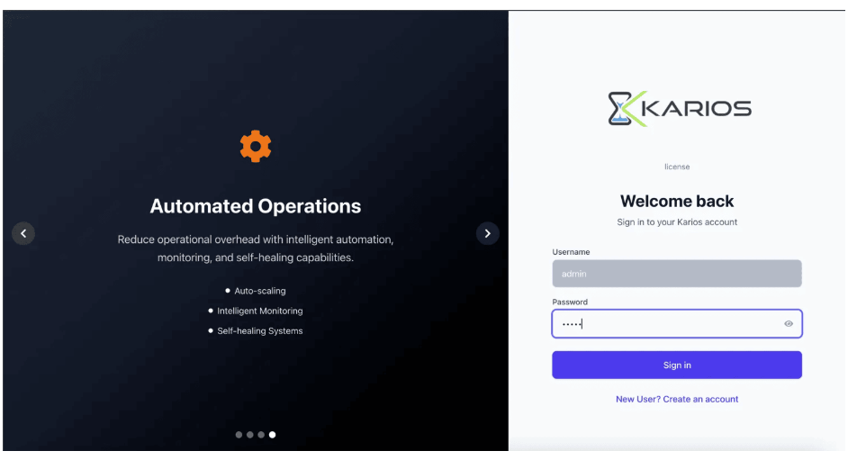

      Figure : Login Process

**New User Registration**

1. **Sign Up Option**: Click "New User? Sign Up" link on the login page
2. **Complete the registration form** with required details:

   - Username: A unique username for system identification
   - Email Address: A valid email address (used for account verification)
   - First Name: Your first name
   - Last Name: Your last name
   - Password: A strong, secure password that meets the system requirements
   - Confirm Password: Re-enter your password to verify it

3. **Account Creation**: Click "Sign Up" to create the new user account

.. note::
   New users are granted read-only access by default. Contact a system administrator for permission upgrades if needed.

**Access Level Considerations**

- **Read-Only Access**: New registered users have limited read-only permissions
- **Administrative Access**: Full system capabilities require administrative privileges
- **Permission Management**: Contact system administrators for permission upgrades
- **Security Best Practice**: Use administrative accounts only when necessary

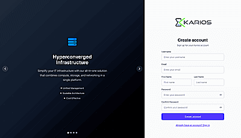

      Figure : New User Registration

**Account Management & Security**

- To return to the login page, click "Existing User? Login."
- **Password Security is Critical**: Implement strong password policies for all accounts. Change your password regularly.
- **Account Recovery**: If you forget your password, contact a system administrator for assistance.
- **Administrative Account Usage**: Use administrative accounts only when necessary and change the default admin credentials immediately after initial login.

License Validation (Mandatory)
~~~~~~~~~~~~~~~~~~~~~~~~~~~~~~~

License validation is required before you can access all Karios features.

**License Validation Process**

After successful login, the system will display the "Access Karios" license validation modal with the following steps:

**Step 1: Copy License Token**

1. After logging in, a "Access Karios" license validation modal will appear
2. The system displays a unique license token
3. Click the "Copy" button to copy this token to your clipboard. Keep this token secure
4. Click on the highlighted link to access the "license request portal"

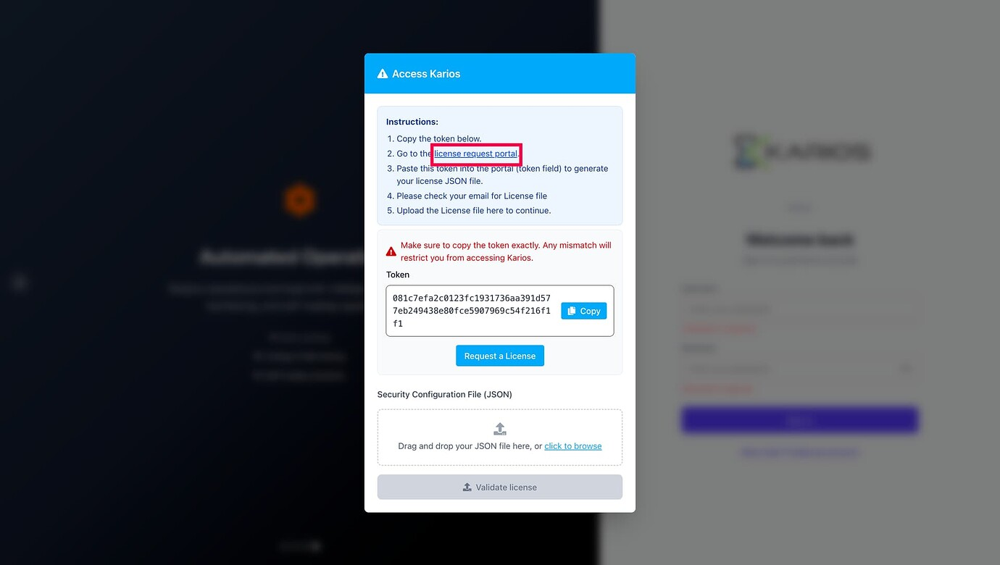

      Figure : License Request Portal

**Step 2: Generate License File**

1. Navigate to the Karios payment portal website to request license
2. Verify the payment details and click "proceed"

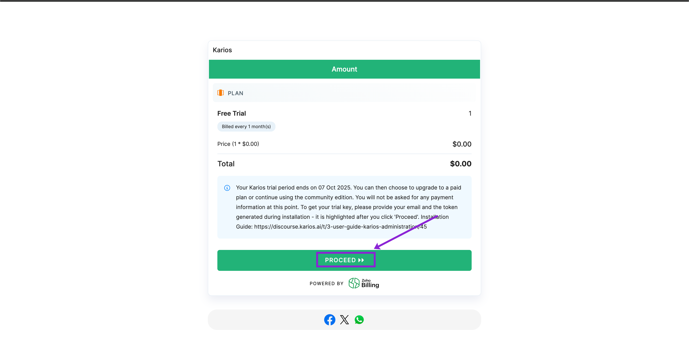

      Figure : Proceed After Payment

3. Locate the "License Token" or "Token" input field and paste the copied license token

   **Necessary details:**
   
   - First Name: Your first name
   - Email: Unique email id
   - Token: Your copied token from karios GUI
   
   Click "proceed"

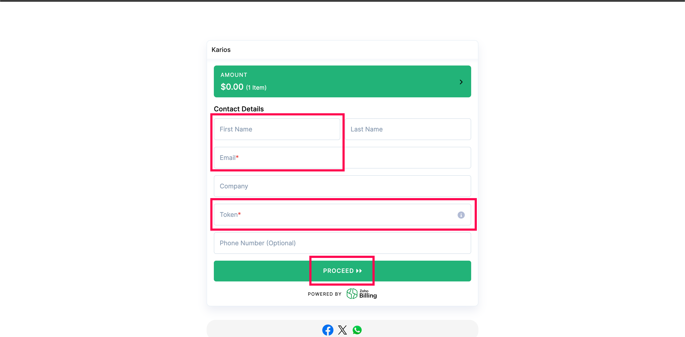

      Figure : Enter User Details

4. Review the contact details and click "proceed"

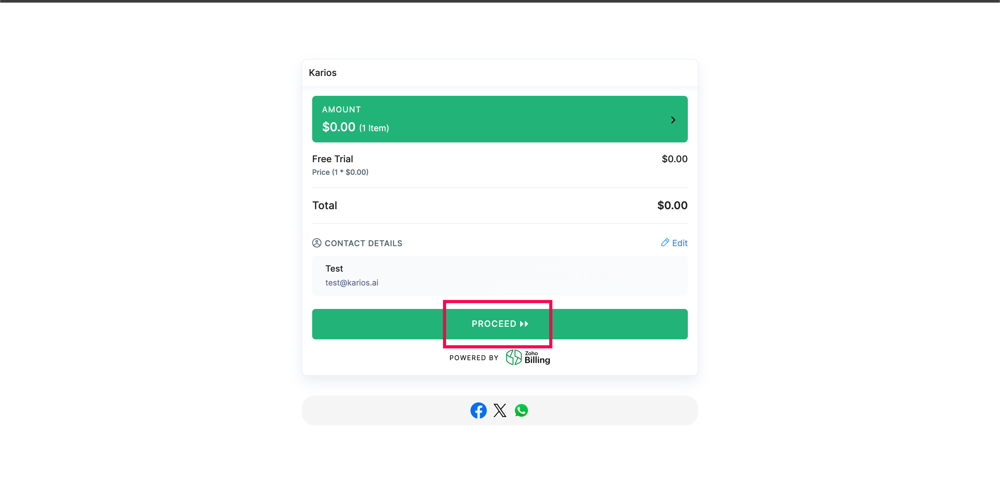

      Figure : Click Proceed

5. Enter the CAPTCHA code and click "Start Trial"

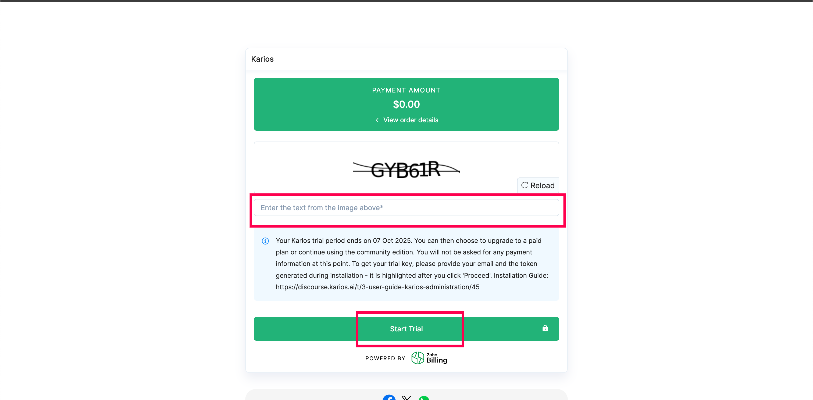

      Figure : Enter CAPTCHA

6. A confirmation page appears, indicating that you have successfully subscribed to the plan

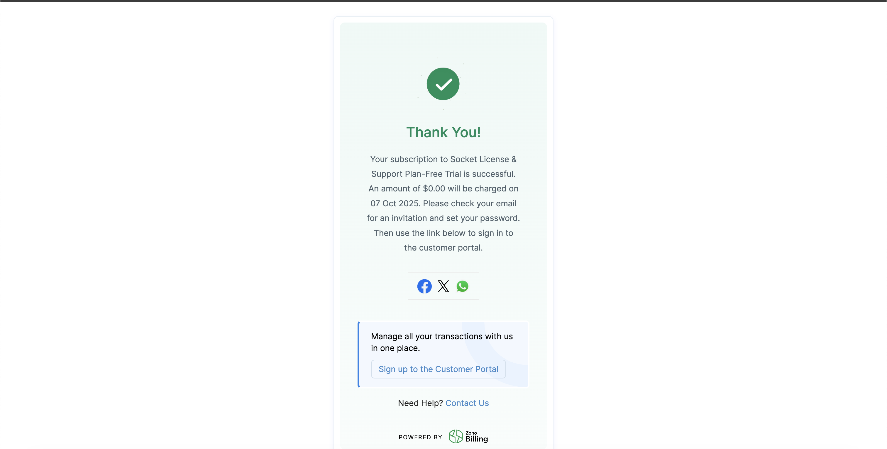

      Figure : License Confirmation

7. After successful subscription, a license file will be sent to your registered email address. Download the file from your inbox

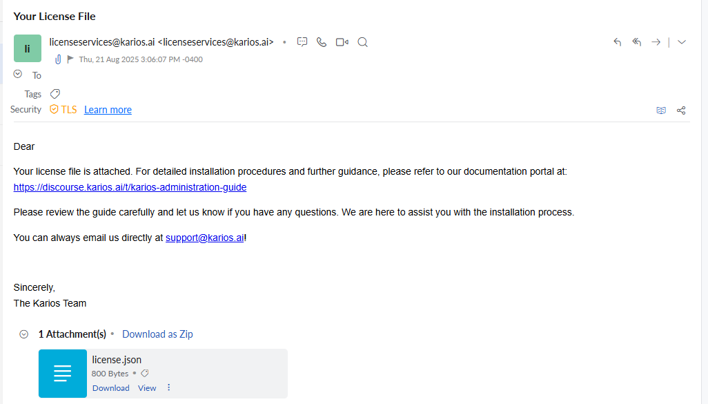

      Figure : Download License File

**Step 3: Upload License File**

1. Return to the Karios interface (the validation modal)
2. In the "Security Configuration File (JSON)" section, upload your downloaded license file using one of these methods:

   - Drag and drop the file into the designated area
   - Click "click to browse" and select the file from your computer

3. Verify that the file is uploaded correctly, you should see its filename and size displayed

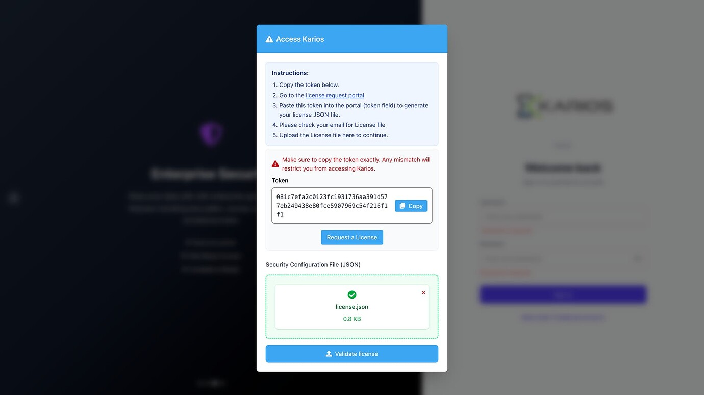

      Figure : Uploaded License File

**Step 4: Validate License**

1. Click the "Validate license" button
2. The system will process and validate your license file
3. Upon successful validation, you'll be redirected to the main dashboard

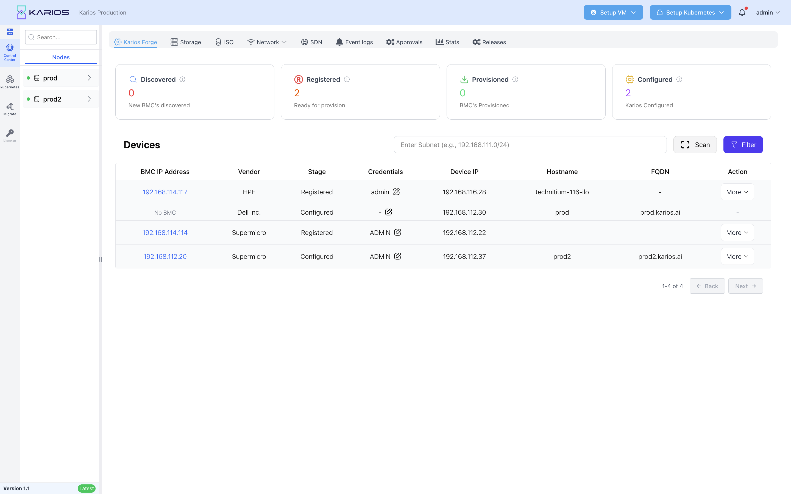

      Figure : License Validation Success

**License Information Display**

- **File Confirmation**: Successfully uploaded files show filename and file size
- **Validation Status**: Green checkmark indicates successful file upload
- **Error Handling**: The system will display errors if the license file is invalid or corrupted

.. note::

   It is critical to set BMC credentials for the node to enable fetching system updates and performing essential system calls.

**BMC Security Configuration**

.. danger::
   **CRITICAL SECURITY NOTICE**
   
   Before connecting your BMCs to the Provisioning Center, **secure their credentials immediately**. Using default passwords creates serious security vulnerabilities.

**Password Security Requirements**

.. warning::
   **Password Configuration - Critical Security Step**
   
   **Strong Password Requirements:**
   - At least 12 characters long
   - Mix of uppercase, lowercase, numbers, and symbols  
   - Avoid common words or personal information
   - Change regularly (recommended every 90 days)

.. error::
   **Do not skip this crucial security step!**
   
   Failure to secure BMC credentials before network connection exposes your infrastructure to potential compromise.

**Step 5: Set BMC Credentials**
How to set BMC credentials:

1. Navigate to the Provisioning Center, located at the top of the control node interface.
2. Edit the first node, which is automatically added during bootstrap.

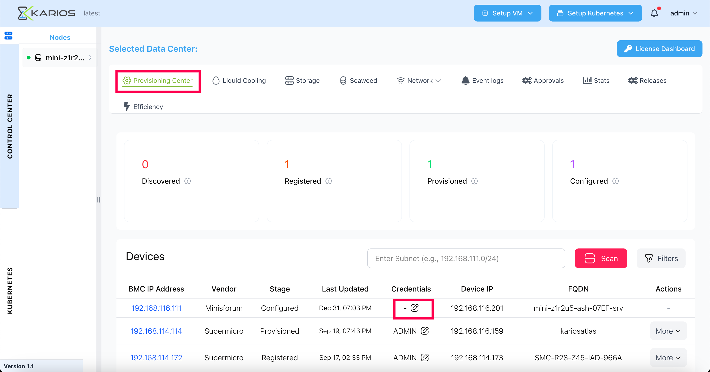

      Figure : Navigate to set BMC Credentials

3. Update the node with the actual BMC credentials and click save.

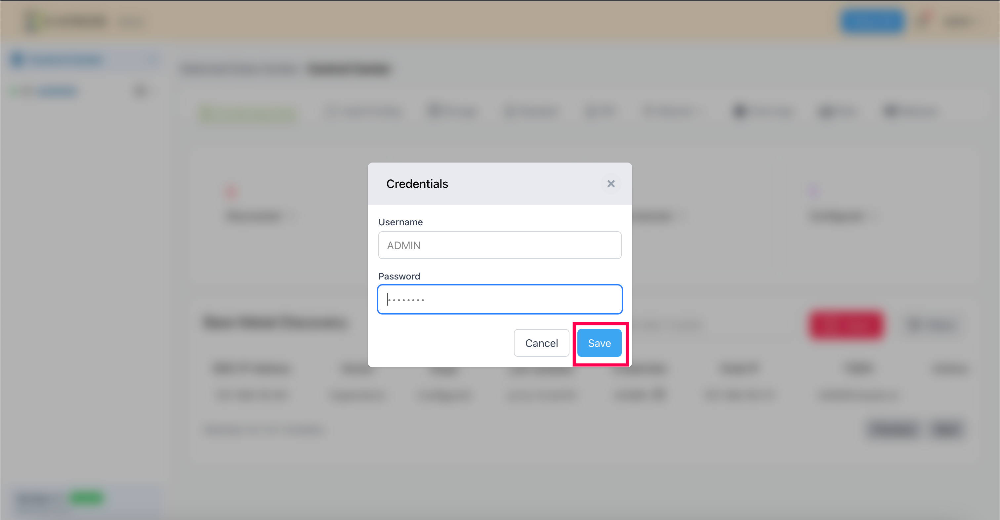

      Figure : Update BMC Credentials

These credentials are essential for various system operations and updates.

Post-License Validation and Resource Management
~~~~~~~~~~~~~~~~~~~~~~~~~~~~~~~~~~~~~~~~~~~~~~~

Upon successful license validation, you'll access the Karios Provisioning Center dashboard.

**Dashboard Overview**

- **Control Center**: Provides access to the main control center interface
- **Navigation Menu**: Offers quick access to key system components (Provisioning Center, Storage, Seaweed, ISO, Network, Event logs, Stats, Releases)
- **License Status**: Displays your license expiration date in the top banner
- **User Profile**: Allows you to manage your user settings and profile information
- **System Statistics**: Provides real-time system status and resource counters

**License Management and Monitoring**

The License Features modal provides three main tabs for comprehensive license management:

**License Dashboard Access**

Access detailed license information through the "License Dashboard" button located in the top banner of the interface.

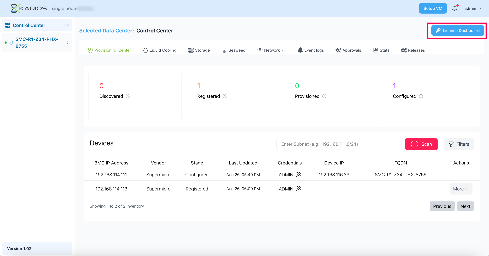

   Figure : License Dashboard Interface   

**License Features Management**

The License Features popup provides three main tabs for comprehensive license management:

1. **Available Quota Tab**
   
   Monitor available resources and quota allocations

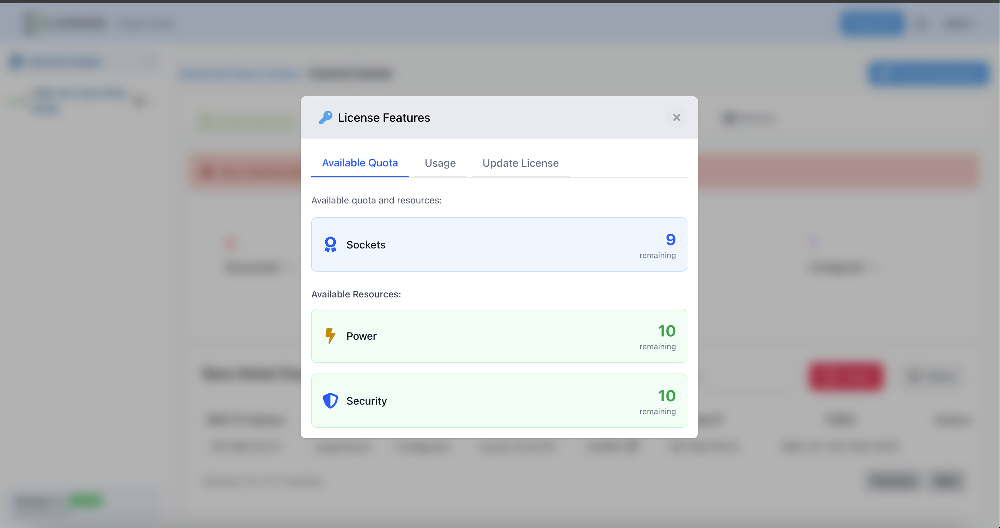

.. list-table::
   :widths: 20 50 30
   :header-rows: 1
   :align: center

   * - Resource Type
     - Description
     - Example Allocation
   * - Sockets
     - CPU sockets available for cluster-wide allocation
     - x remaining
   * - Power
     - Power management feature availability
     - x remaining
   * - Security
     - Security feature availability
     - x remaining

Available Resources Overview:

- **Total Sockets**: Total CPU sockets licensed for the cluster
- **Used Sockets**: Number of CPU sockets currently allocated to nodes
- **Available Sockets**: Remaining CPU sockets available for allocation
- **Power Features**: Total, used, and available Power features
- **Security Features**: Total, used, and available Security features

2. **Usage Tab**
   
   Current License Usage Tracking:
   
   - **Sockets Usage**: Total CPU sockets currently in use across the cluster
   - **Usage Display**: Shows actual socket consumption

   .. figure:: _static/images/getting_started/license_usage.png
      :alt: Usage Display
      :align: center

3. **Update License Tab**
   
   License Renewal and Upgrades:
   
   - **Token Generation**: Copy token for license updates
   - **Portal Access**: Use token at payment portal to generate updated license
   - **File Upload**: Upload new JSON license file for updates
   - **License Processing**: System processes and applies license updates

   .. figure:: _static/images/getting_started/update_license.png
      :alt: Update License Tab
      :align: center

   **Node-Level License Management**

   **Add Licensed Features**

   Each registered node displays an “Add licensed features” button, allowing you to allocate specific features to individual nodes.

   .. figure:: _static/images/getting_started/add_license_features.png
      :alt: Add Features Tab
      :align: center

   **License Management for Nodes**

   Access node-level license management via the “License Management - [node-name]” modal. This modal provides two main tabs:

   - **Currently Used Tab**: Displays the current resource allocation for the selected node.

   .. figure:: _static/images/getting_started/currently_used.png
      :alt: Currently Used Tab
      :align: center

   - **Add Features Tab**: Allows allocation of available cluster resources (such as CPU sockets, Power, and Security features) to the node.

   .. figure:: _static/images/getting_started/add_features_tab.png
      :alt: Add Features Tab
      :align: center

   If all resources have been allocated, the interface will display “No features available to add.”

   To add a feature, select the toggle next to the desired feature and click “Add Feature.”

   License Monitoring and Alerts
   The system continuously monitors license status and resource allocation:

   - **License Status Indicators**: Proactive notifications show days remaining until license expiration.
   - **License Dashboard Access**: Quickly access detailed license information from the dashboard
   - **Resource Tracking**: Monitor real-time resource usage versus available quota.

   Resource Allocation Management

   - **Cluster-Wide Licensing**: License resources are shared across the entire cluster.
   - **CPU Socket Allocation**: Distribute available CPU sockets among multiple nodes.
   - **Feature Distribution**: Allocate Power and Security features to required nodes.
   - **Usage Monitoring**: Track actual resource consumption across the infrastructure.

   License Renewal Process
 

   Renew your license in the following scenarios:

   - **Expiration Approach**: When license expiration warnings appear in the dashboard.
   - **Feature Upgrades**: When additional resources or features are needed.
   - **Capacity Expansion**: When adding new nodes that require licensing.

   **Renewal Steps** (Please Refer to “Update License Tab”):

   1. Access the Update License tab: Navigate to License Features → Update License.
   2. Generate Token: Copy the system-generated token.
   3. Portal Processing: Use the token at the payment portal for renewal or upgrade.
   4. Download New License: Obtain the updated JSON license file.
   5. Upload and Validate: Upload the new license file and validate it.
   6. Resource Availability: Newly licensed resources become immediately available for allocation.

Interface Overview
~~~~~~~~~~~~~~~~~~

**Main Dashboard Components**

After license validation and resource allocation, users have access to the following interface elements:

**Navigation Elements**

- **Control Center**: Main system management interface
- **Provisioning Center**: VM and resource provisioning tools
- **Storage**: Storage management and configuration
- **Seaweed**: Distributed file system
- **ISO**: Operating system image management and virtual media mounting
- **Network**: Network configuration and monitoring
- **Event Logs**: System event monitoring, and log management
- **Stats**: System statistics and performance metrics
- **Releases**: System release and update management

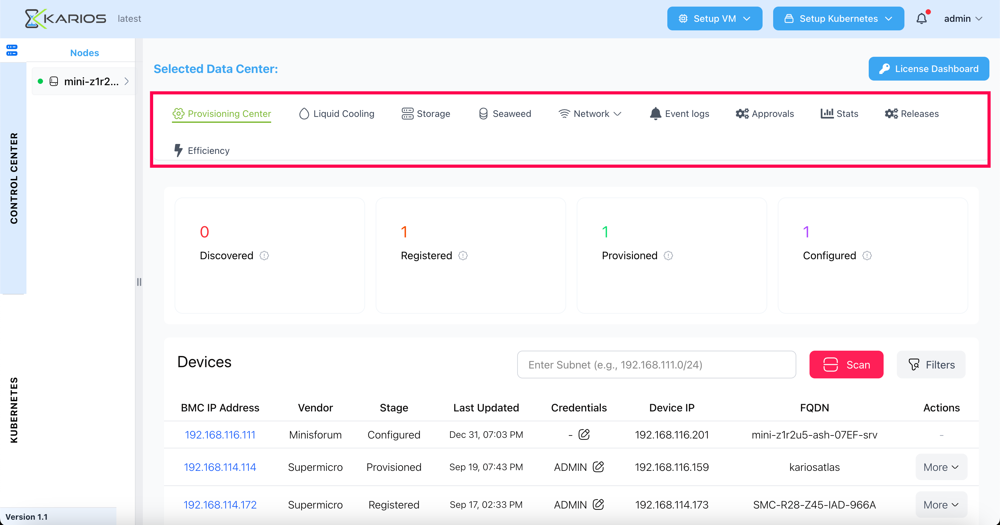

**System Status Indicators**

- **Discovered**: Number of discovered hardware components
- **Registered**: Number of registered systems
- **Provisioned**: Number of provisioned resources
- **Configured**: Number of configured systems

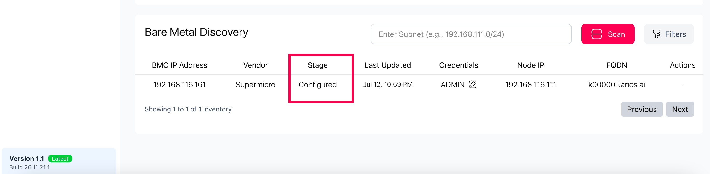

**Node Management**

- **Selected Server**: Current server selection
- **Server Information**: System details including make, model, and network configuration
- **Add-in Cards**: PCIe device information and availability
- **Power Management**: Power consumption and efficiency metrics
- **Network Interfaces**: Physical and virtual interface management

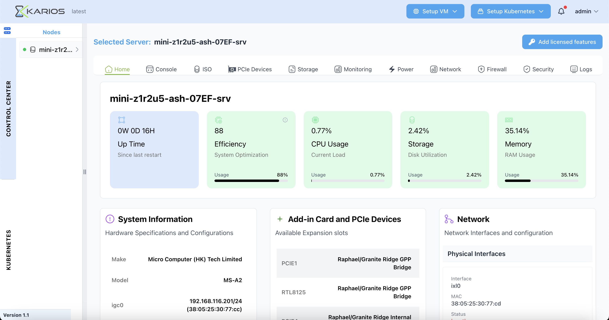

Basic Operations
~~~~~~~~~~~~~~~~

**Common User Tasks**

- **Dashboard Navigation**: Navigate between different system components using the main navigation menu
- **Status Monitoring**: Monitor real-time system status and health indicators
- **Information Viewing**: Access system information, documentation, and help resources
- **Search and Filters**: Use search and filtering tools for efficient navigation

**License Management**

- **License Monitoring**: Regular monitoring of license expiration dates
- **Renewal Planning**: Proactive license renewal to avoid service interruption
- **License Dashboard**: Access detailed license information and history
- **Compliance Tracking**: Ensure ongoing license compliance and usage

**System Monitoring**

- **Performance Metrics**: Monitor system performance and resource utilization
- **Alert Management**: Review and respond to system alerts and notifications
- **Health Indicators**: Monitor system health and operational status
- **Resource Tracking**: Track resource usage and capacity planning

Getting Full Access
~~~~~~~~~~~~~~~~~~~~

**Upgrading User Permissions**

To access the full capabilities of the Karios platform:

1. **Administrative Login**: Use the default admin credentials for complete access
2. **Permission Request**: Contact system administrators to upgrade user account permissions
3. **Role Assignment**: Request appropriate role assignment based on job responsibilities
4. **Access Validation**: Verify upgraded permissions through system access testing

**Security Considerations**

- **Principle of Least Privilege**: Request only the minimum permissions necessary for job functions
- **Regular Access Review**: Periodically review and validate user access permissions
- **Security Compliance**: Follow organizational security policies for account management
- **Administrative Coordination**: Coordinate with system administrators 

Best Practices
--------------

Account Security
~~~~~~~~~~~~~~~~~

- **Strong Passwords**: Use strong, unique passwords for account security.
- **Regular Updates**: Update passwords regularly according to security policies.
- **Session Management**: Log out properly when finished using the system.
- **Access Monitoring**: Monitor account access and report suspicious activity.

License Compliance
~~~~~~~~~~~~~~~~~~

- **Renewal Tracking**: Monitor license expiration dates proactively.
- **Compliance Documentation**: Maintain records of license validation and renewals.
- **Usage Monitoring**: Ensure system usage complies with license terms.
- **Renewal Planning**: Plan license renewals well in advance of expiration dates.

System Usage
~~~~~~~~~~~~

- **Resource Management**: Use system resources efficiently and responsibly.
- **Documentation**: Keep personal documentation of system configurations and procedures.
- **Change Management**: Follow proper change management procedures for system modifications.
- **Support Utilization**: Utilize available support resources and documentation effectively.

Web Interface Navigation   
------------------------

Dashboard Overview
~~~~~~~~~~~~~~~~~~

The Karios web interface provides a comprehensive management dashboard with the following key areas:

- **Datacenter Hierarchy**: Navigate between different datacenters and control nodes using the left sidebar
- **Component Tabs**: Access major system components via the top navigation bar
- **Status Indicators**: Real-time status information and metrics displayed prominently
- **Action Buttons**: Primary actions like "Setup VM" accessible from the main interface

Datacenter Management
~~~~~~~~~~~~~~~~~~~~~

- **Datacenter Selection**: Use the datacenter dropdown to select and manage different datacenter environments
- **Control Center Overview**: The selected datacenter displays the active control node and provides access to all managed infrastructure components

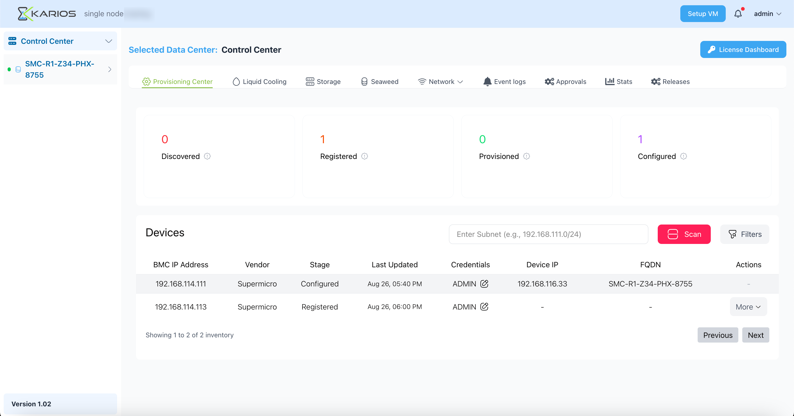

Hypervisor Server Management
----------------------------

Server Discovery Process
~~~~~~~~~~~~~~~~~~~~~~~~

Karios provides automated hypervisor server discovery through network scanning:

1. **Subnet Scanning**: Navigate to the scan section and enter the target subnet (e.g., ``192.168.111.0/24``)
2. **Initiate Scan**: Click the "Scan" button to begin automatic server discovery
3. **Discovery Results**: Discovered servers appear in the "Hypervisor Discovery" section

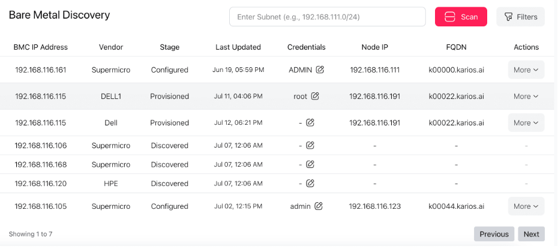

Server Lifecycle Management
~~~~~~~~~~~~~~~~~~~~~~~~~~~

Servers progress through distinct stages in the Karios management lifecycle:

**Stage 1: Discovered**
- Servers detected during network scanning
- Basic hardware information collected (BMC IP, Vendor)
- No management capabilities yet established
- Ready for credential configuration and registration

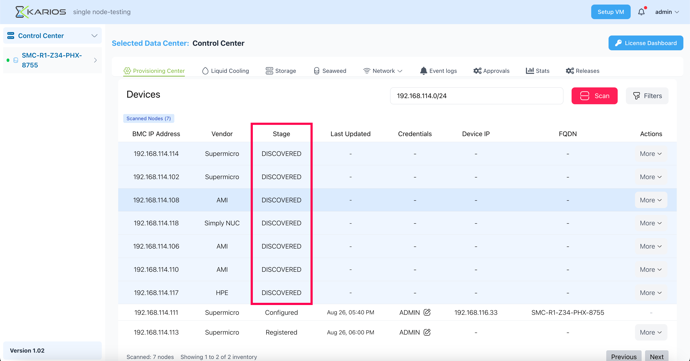

**Stage 2: Creds Set**
- Intermediate stage after credential configuration
- BMC credentials have been set but registration not yet complete
- Transitional state before full registration

**Steps to set credentials:**

1. Click on the highlighted edit icon for your discovered node

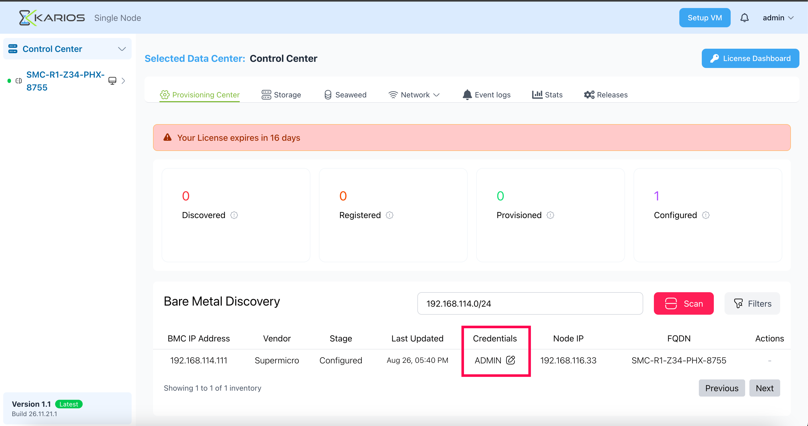

2. Enter the BMC credentials for your node
3. Click save to complete the registration process

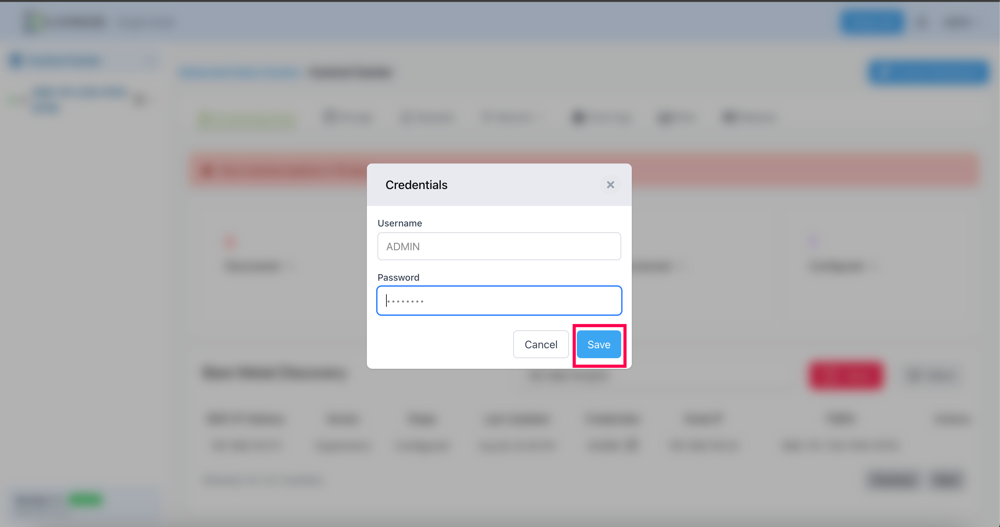

**Stage 3: Registered**
- Servers added to the Karios management system
- BMC (Baseboard Management Controller) connectivity established
- Credentials configured and validated
- Ready for provisioning and configuration operations

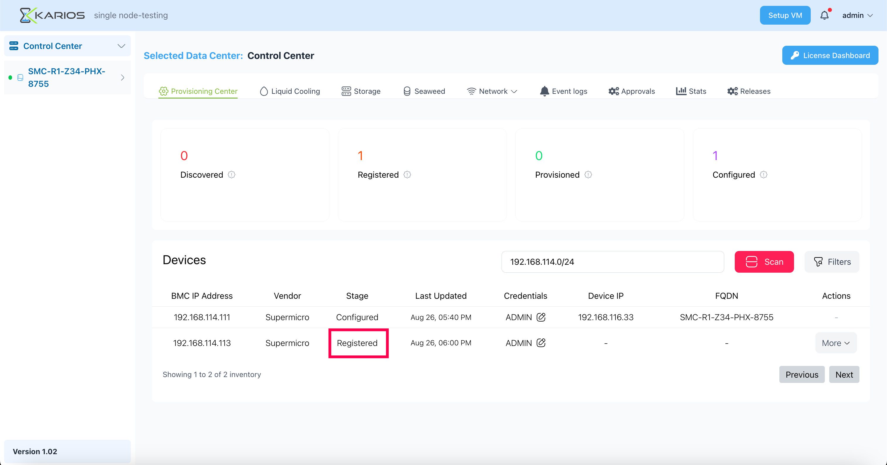

**Stage 4: Provisioned and Configured**
- Management credentials are configured
- Remote management capabilities are enabled
- Server is ready for operating system deployment
- Operating system is installed and configured
- Server is ready for workload deployment
- Full management capabilities are available

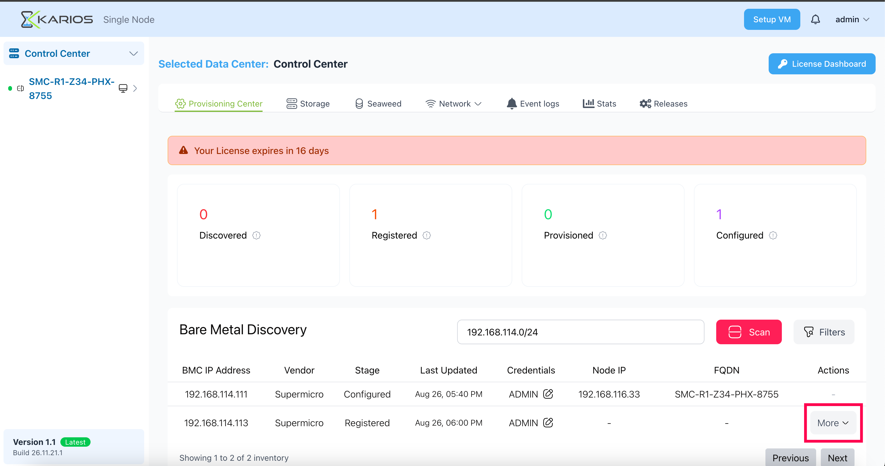

**Management Actions**

Click on "more" to select actions:

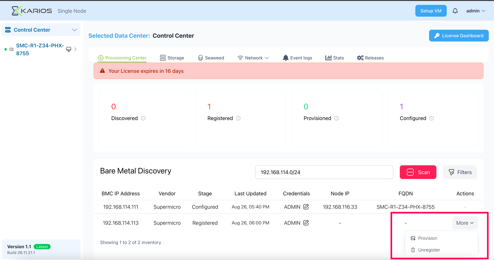

- **Configure**: Installing all required services and packages to provide a ready-to-use node
- **Override BMC Status**: Cleans the existing file system and allows you to reprovision your node
- **Unregister**: The node will be removed from the GUI. Run the scan again to discover the node

Server Information Display
~~~~~~~~~~~~~~~~~~~~~~~~~~

The server management table provides comprehensive information:

- **BMC IP Address**: Management interface IP address
- **Vendor**: Hardware manufacturer (Dell, Supermicro, etc.)
- **Stage**: Current management stage
- **Last Updated**: Timestamp of last status update
- **Credentials**: Management credential status
- **Node IP**: Production network IP address
- **FQDN**: Fully qualified domain name
- **Actions**: Available management actions dropdown menu

Server Registration and Management
----------------------------------

Server Registration Process
~~~~~~~~~~~~~~~~~~~~~~~~~~~

To register a discovered server:

1. **Select Discovered Server**: Choose a server in "Discovered" stage
2. **Set Credentials**: Configure BMC credentials for remote management
3. **Credential Validation**: System validates BMC connectivity
4. **Registration Completion**: Server moves to "Registered" stage
5. **Management Access**: Server is now available for provisioning operations

Server Management Operations
~~~~~~~~~~~~~~~~~~~~~~~~~~~~

Once a server is registered, administrators can perform various management operations:

**Provision**
- Purpose: Provision and configure the registered server
- Process: Initiates the provisioning workflow including OS deployment
- Result: Server progresses through Provisioned to Configured stage

**Override BMC Status**
- Purpose: Reset server to previous management state
- Process: Deprovisions the server and reverts to registered state
- Use Case: Troubleshooting, reconfiguration, or maintenance operations

**Unregister**
- Purpose: Remove server from Karios inventory
- Process: Removes server registration and management capabilities
- Impact: Loss of remote management and monitoring capabilities

Control Center Level Management
-------------------------------

Administrators can access various control center management features. The control center provides centralized management capabilities for the entire Karios infrastructure.

Component Navigation Process
~~~~~~~~~~~~~~~~~~~~~~~~~~~~

**Control Node Components:** The control node interface provides access to key system components:

- **Provisioning Center**: Central management and configuration hub
- **Storage**: Storage pool and volume management
- **Seaweed**: Distributed file system
- **ISO**: Operating system image management
- **Network**: Network configuration and management
- **Event logs**: System event monitoring, and log management
- **Stats**: Performance metrics and monitoring
- **Releases**: System updates and patch management

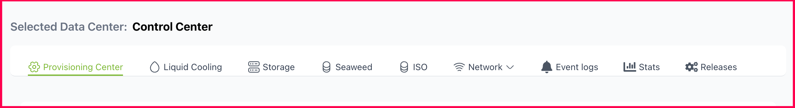

**Navigation Best Practices:**

- **Tab Organization**: Use tabs to organize different management functions
- **Context Awareness**: Understand the current context (control node vs. worker node)
- **Permission Levels**: Ensure appropriate permissions for accessing different components

Liquid Cooling Management Operations - (Special Feature. Contact Sales)
~~~~~~~~~~~~~~~~~~~~~~~~~~~~~~~~~~~~~~~~~~~~~~~~~~~~~~~~~~~~~~~~~~~~~~~~

.. note::
   **Preview Feature Notice**
   This section on Liquid Cooling is currently reflecting the preview version of the feature. Expect updates and enhancements as it progresses towards general availability (GA).

**Karios Cool Integration:** The Liquid Cooling tab provides access to the Karios Cool thermal management system for monitoring and controlling liquid cooling infrastructure across your deployment.

**Liquid Cooling Interface:** The interface provides two main management categories:
Immersion Cooling and Rack Level.

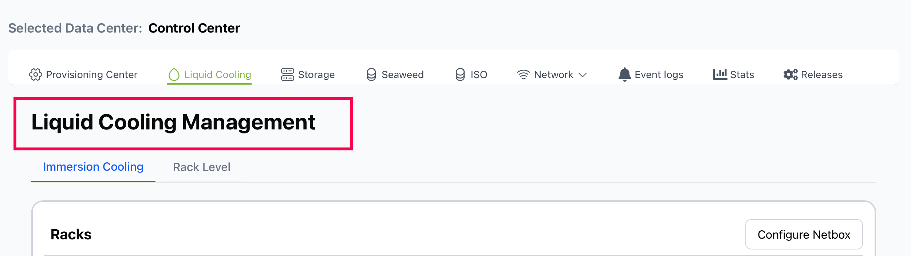

Immersion Cooling Tab
^^^^^^^^^^^^^^^^^^^^^

**Immersion Cooling Systems:** The Immersion Cooling tab provides comprehensive management of immersion cooling systems and components:

**Netbox Configuration:**

Netbox is a system that acts as a central repository ("single source of truth") for all information about your datacenter. It runs in the background (backend) to manage and track assets and configurations.

**How does it work with Karios?**

Karios uses Netbox by creating connections (northbound/southbound APIs) to pull data from and send data to Netbox. This allows Karios to retrieve information about your datacenter.

**Integration Benefits:**

- Centralized asset management and tracking
- Automated configuration synchronization
- Real-time datacenter information access
- Unified infrastructure visibility

To connect Karios to Netbox, follow these configuration steps:

- **Click "Configure Netbox"**
   Initiates the setup process within the Karios interface

- **Enter the Netbox URL**
   Provide the web address where your Netbox instance is located (e.g., http://example.com:8000)

- **Enter an API Token**
   This token acts as authentication credentials for Karios to access and modify data within Netbox

- **Click "Save Configuration"**
   Applies the settings and establishes the connection between Karios and Netbox

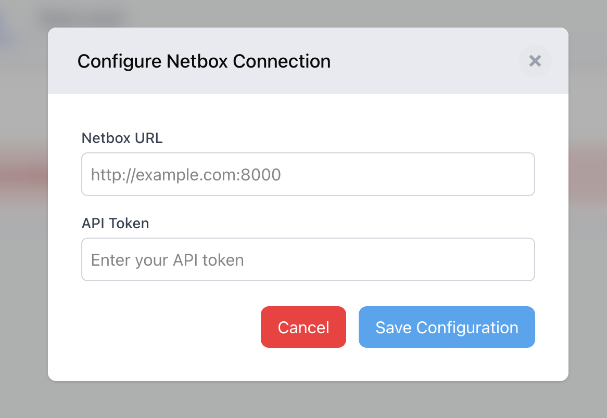

**Rack Selection:** After configuring Netbox, administrators can select and manage available racks:

- **DEV Rack**: Active rack with detailed specifications
- **Physical Specifications**: View rack dimensions, device counts, and power requirements
- **Rack Management**: Access rack-level cooling controls and monitoring

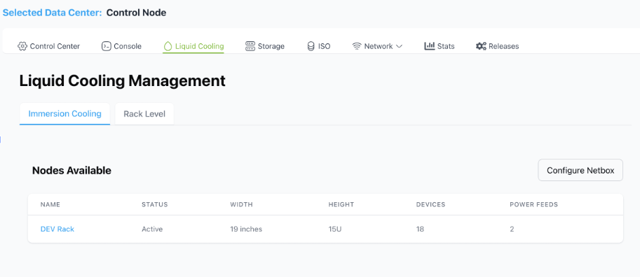

**Immersion Cooling Loop Control:** The system provides visual control of the immersion cooling loop:

- **Tank**: Coolant tank with visual fluid level indicators
- **Pump**: Circulation pump with control capabilities
- **Servers**: Server units (U1-U10) with cooling connections
- **Chiller**: Cooling chiller with temperature control
- **Coolant Flow**: Visual representation of coolant flow paths

**Coolant Flow Management:**

- **Flow Control**: ON/OFF button to control coolant flow
- **Flow Direction**: Visual indicators showing coolant flow from Tank → Pump → Servers → Chiller → Tank
- **Flow Status**: Real-time status of coolant circulation
- **Temperature Zones**: Cold water (blue) and warm water (red) flow indicators

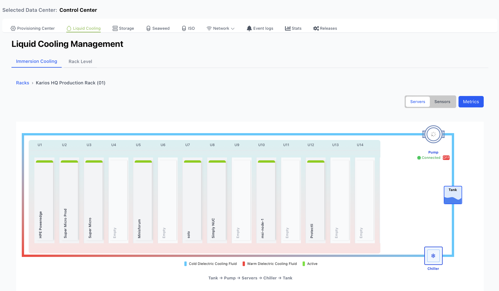

**Server Information Display:** Individual server information within the immersion cooling system:

- **Server Status**: Active/inactive status for each server unit
- **Server Identification**: Unit positions (U1, U2, U3, etc.)
- **Temperature Monitoring**: Per-server temperature monitoring

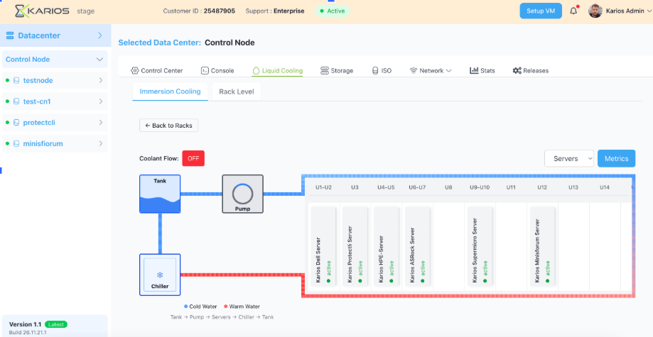

**Monitoring Controls:**

- **Sensors Dropdown**: Select "Sensors" to view different available sensors

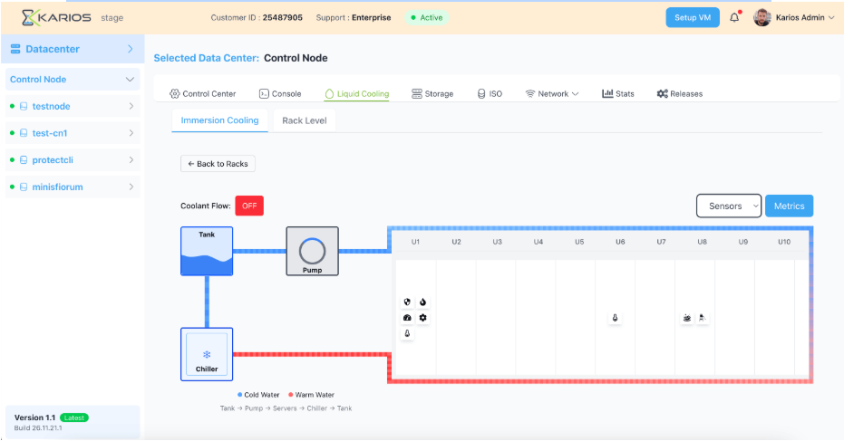

**Sensor Types and Monitoring:** The system provides comprehensive sensor monitoring with 8 different sensor types:

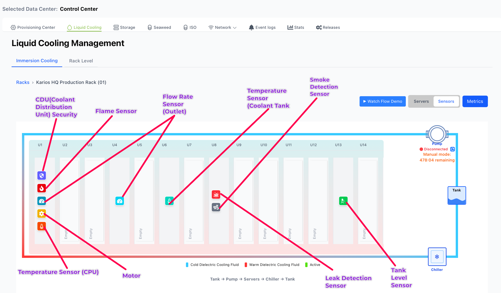

**Flame Sensor:** Fire detection and safety monitoring for the cooling system

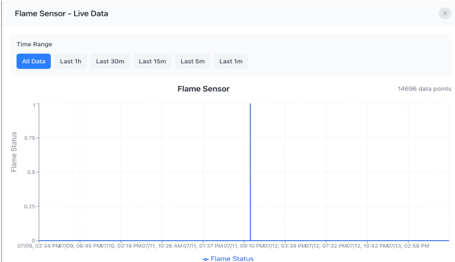

**Motor:** Motor status and performance monitoring for pumps and fans

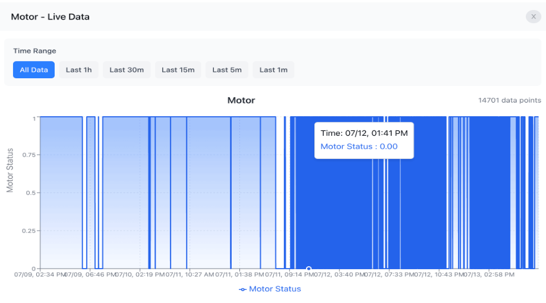

**Temperature Sensor (CPU):** CPU temperature monitoring for thermal management

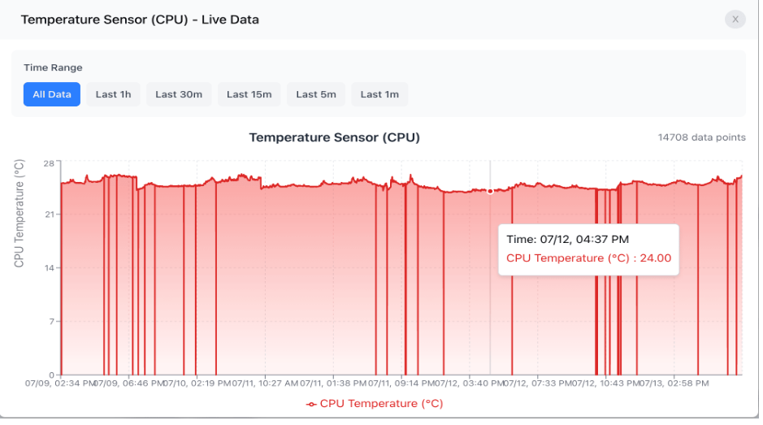

**Flow Rate Sensor (Outlet):** Coolant flow rate monitoring at outlet points

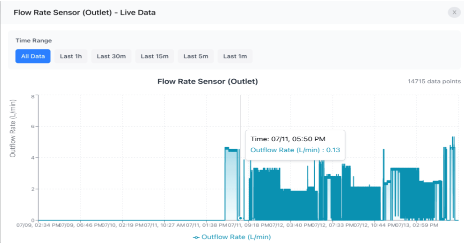

**CDU (Coolant Distribution Unit) Security:** Security monitoring for coolant distribution systems

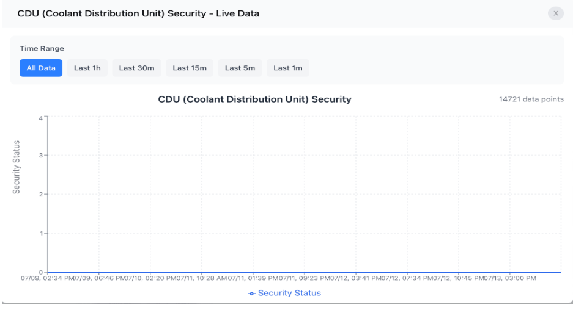

**Temperature Sensor (Coolant Tank):** Coolant tank temperature monitoring

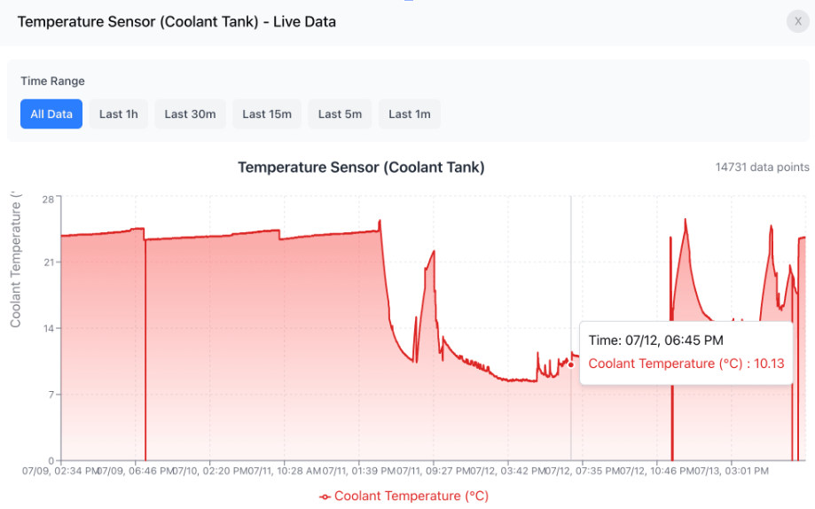

**Leak Detection Sensor:** Leak detection and prevention monitoring

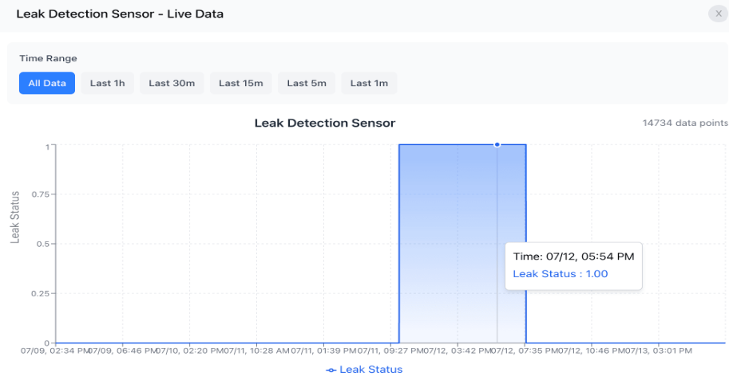

**Tank Level Sensor:** Coolant tank level monitoring and management

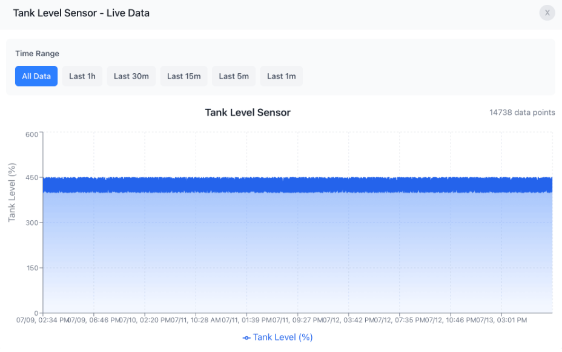

**Sensor Capabilities:**

- **Real-time Monitoring**: Live sensor data collection and display
- **Alert Generation**: Automatic alerts for sensor threshold breaches
- **Historical Data**: Sensor data history and trend analysis
- **Safety Monitoring**: Critical safety sensors including flame and leak detection
- **Performance Tracking**: Operational sensors for flow, temperature, and motor performance

**Metrics Button:** Click "Metrics" to access real-time performance data

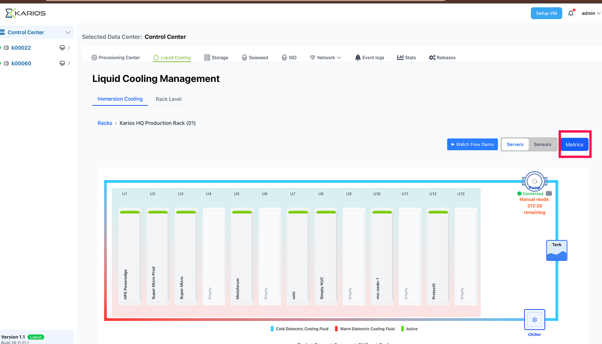

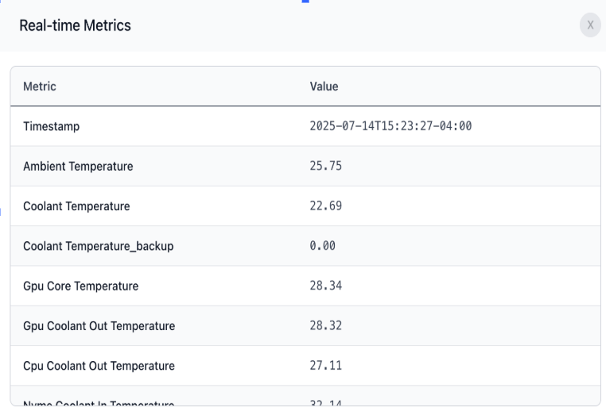

**Real-time Updates:** Live monitoring of cooling system performance

Rack Level Tab
^^^^^^^^^^^^^^

**Rack-Level Cooling Management:** The Rack Level tab provides detailed rack-level cooling management:

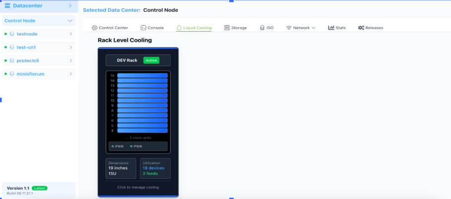

**Available Nodes Display:** The system shows available nodes with comprehensive information:

- **Name**: Node identifier (e.g., "DEV Rack")
- **Status**: Operational status (Active/Inactive)
- **Physical Dimensions**: Width (19 inches) and Height (15U) specifications
- **Device Count**: Number of devices in the rack (18 devices)
- **Power Feeds**: Number of power connections (2 power feeds)

Real-time Monitoring and Metrics
^^^^^^^^^^^^^^^^^^^^^^^^^^^^^^^^

**Sensor Information:** Access detailed sensor information through the Sensors tab

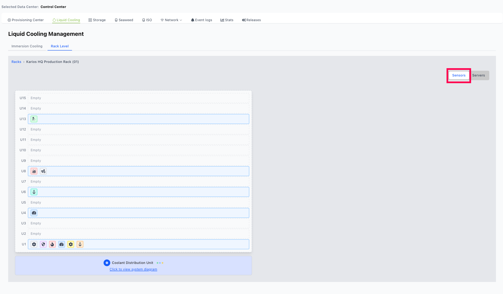

**Coolant Distribution System:**

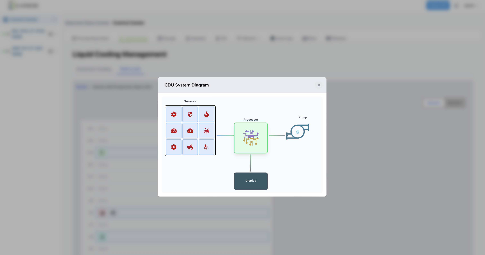

**Interactive Monitoring:**

- **Real-time Graphs**: Access real-time graphical data for each metric
- **Historical Data**: View historical trends and patterns
- **Alert Thresholds**: Configure alert thresholds for temperature and flow parameters
- **Performance Analysis**: Analyze cooling system performance over time

Operational Controls
^^^^^^^^^^^^^^^^^^^^

**Cooling System Control:**

- **Flow Control**: Start/stop coolant circulation with ON/OFF controls
- **Temperature Management**: Monitor and control temperature across the system
- **Pump Management**: Control pump operation and speed
- **Chiller Control**: Manage chiller operation and temperature settings

**System Status Monitoring:**

- **Visual Status Indicators**: Real-time visual indicators for system components
- **Component Health**: Monitor health status of pumps, chillers, and sensors
- **Flow Visualization**: Visual representation of coolant flow throughout the system
- **Temperature Mapping**: Visual temperature mapping across server units

**Navigation and Usage:**

- **Tab Navigation**: Switch between Immersion Cooling and Rack Level tabs
- **Back to Racks**: Return to rack overview with "Back to Racks" button
- **Node Selection**: Select specific nodes for detailed management
- **Configuration Access**: Access configuration options for cooling systems
- **Status Monitoring**: Monitor cooling system status and performance

For detailed information regarding liquid cooling functionality, configuration options, and advanced features, please refer to Section 5: Liquid Cooling Management.

Storage Management Operations
~~~~~~~~~~~~~~~~~~~~~~~~~~~~~

**Storage Tab Overview:** The Storage tab provides comprehensive storage management capabilities for all supported storage protocols and systems. This centralized interface allows administrators to configure, monitor, and manage various storage types through a unified dashboard.

**Storage Protocol Support:** The storage interface provides access to multiple storage protocols with dropdown selection:

MooseFS Storage
^^^^^^^^^^^^^^^

**MooseFS Distributed Storage:**
MooseFS is a distributed file system that provides scalable, fault-tolerant storage across multiple servers with a unified namespace. It offers high availability and automatic data replication for enterprise storage requirements.

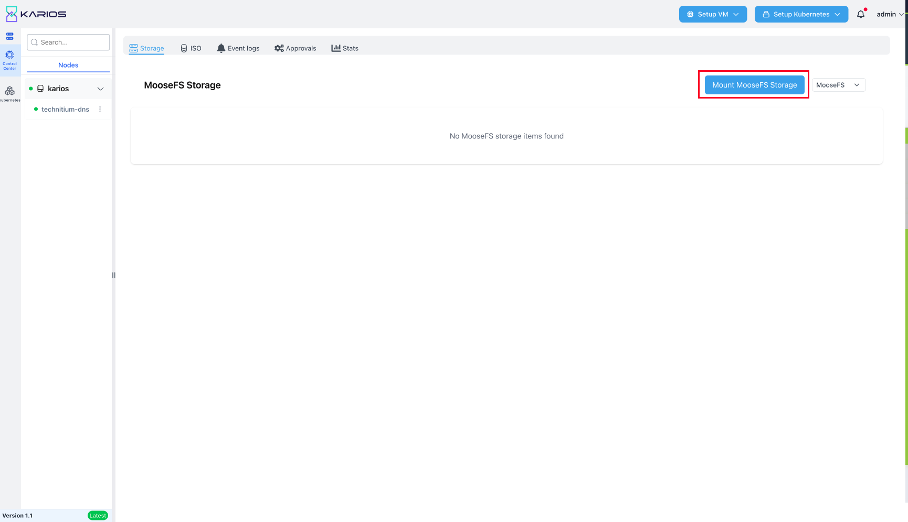

**Mount MooseFS Storage:** Click "Mount MooseFS Storage" to configure MooseFS connections

**Server Information:** View MooseFS server details (e.g., 192.168.111.92)

**Port Configuration:** Configure MooseFS port settings (e.g., 9421)

**Storage Metrics:** Monitor storage usage and capacity

- **Size**: Total storage capacity (e.g., 49G)
- **Used**: Currently used storage (e.g., 11G)
- **Available**: Available storage space (e.g., 38G)
- **Capacity**: Storage utilization percentage (e.g., 22%)
- **Mount Point**: View mount directory (e.g., /mnt/moosefs/karios)

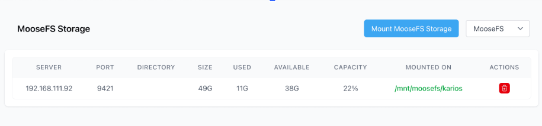

To mount MooseFS storage, follow these steps:

**Step 1: Gather MooseFS Server Information**
Before configuring, obtain the following details

- MooseFS server IP address
- Server port number (usually 9421)
- Available directory/namespace to mount

**Step 2: Configure MooseFS Mount**

**ID:** Enter a name to identify this storage mount (e.g., "main-storage")

.. tip::
   A MooseFS ID is a unique identifier used for user authentication, access control, and quota management within the distributed MooseFS file system.

**Server:** Enter the IP address of your MooseFS server (e.g., 192.168.111.92)

.. tip::
   A MooseFS server is any computer running the MooseFS software and fulfilling a specific role like managing metadata (master), storing data chunks (data), or facilitating discovery (listen) within a distributed file system cluster.

**Port:** Enter the MooseFS port number (default is 9421)

.. tip::
   MooseFS ports are network doorways used by the master, data, and listen servers to communicate with each other and clients, with default values like 10001 (master), 10003 (data), and 10005 (listen).

**Directory:** Enter the MooseFS directory path you want to access (e.g., "moosefs")

.. tip::
   A MooseFS directory is a hierarchical structure within the distributed file system, similar to traditional directories, that organizes files and subdirectories across multiple servers for storage and access.

**Step 3: Configure Options**

- ✓ **Auto Mount on Restart**: Check this to automatically connect to storage when system restarts
- ✓ **Add to Datastore**: Check this to make the storage available for virtual machines

**Step 4: Complete Setup**
Click Submit to save the configuration and mount the S3 storage.

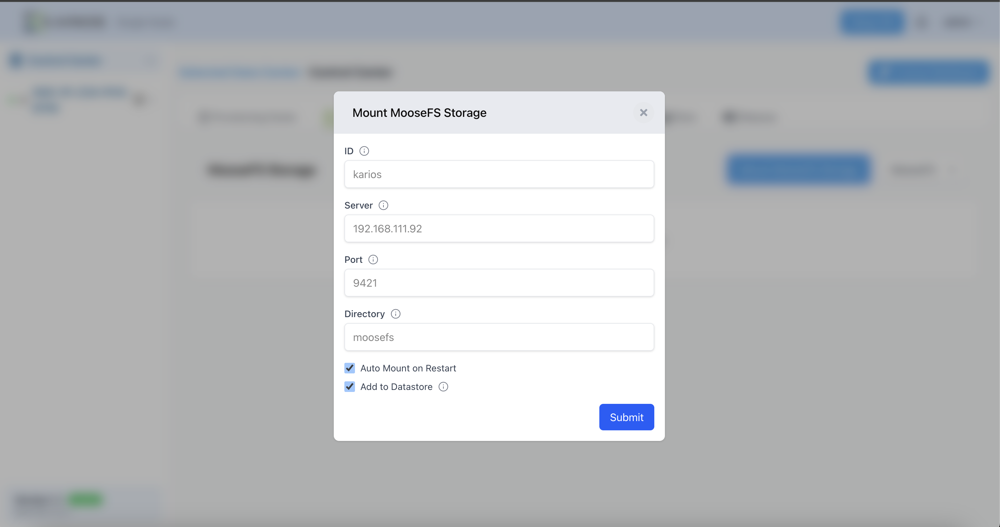

**MooseFS Storage Management**

**Actions:** Unmount and manage MooseFS storage

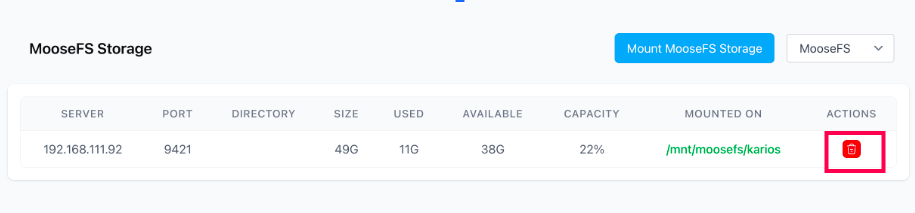

Click Delete icon to unmount the moosefs storage. It will prompt you for a confirmation. Click "unmount" to remove the moosefs mount.

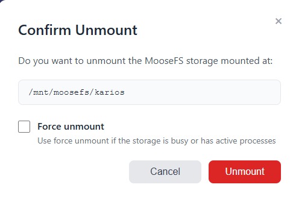

S3 Storage
^^^^^^^^^^
S3 (Simple Storage Service) provides scalable object storage for backup, archival, and cloud-native applications. It offers cost-effective storage with global accessibility and integration with modern DevOps workflows.

**Why S3 is Useful for Hypervisors - Core Benefits**

**Centralized Storage for VM Images and Disks**

The most common and significant use case involves storing VM disk images (`.raw` files) in S3 buckets instead of local hypervisor storage. This approach provides:

- **Scalability:** Easily scale storage capacity as needed without being limited by the physical hardware of the hypervisor host

- **Cost-Effectiveness:** S3 is often cheaper than traditional SAN or NAS solutions for large amounts of data

**Data Durability & Redundancy:** S3 provides extremely high levels of data durability and redundancy, protecting against data loss

**Additional Use Cases**

- **Backup and Disaster Recovery:** S3 serves as an ideal target for VM backups. Regular VM backups to S3 ensure quick restoration in case of disaster or hardware failure

- **VM Migration & Replication:** Moving VMs between Karios hosts becomes easier when VM images are stored centrally in S3. This simplifies copying images between locations and enables streamlined disaster recovery replication

**Content Delivery:** For VMs hosting web applications or content-serving services, S3 can serve as a staging area or directly serve static assets

**Specific Advantages for Karios**

**Flexibility:** S3 allows Karios to operate more independently of the underlying storage hardware

**Cloud-Native Integration:** For Karios deployments in cloud environments, S3 integration provides natural architectural alignment

**Simplified Management:** Centralized storage simplifies management and reduces complexity compared to managing multiple local storage devices

.. important::
   **Summary**
   S3 enables a more scalable, resilient, and flexible Karios environment by separating VM images from the hypervisor's physical storage infrastructure.

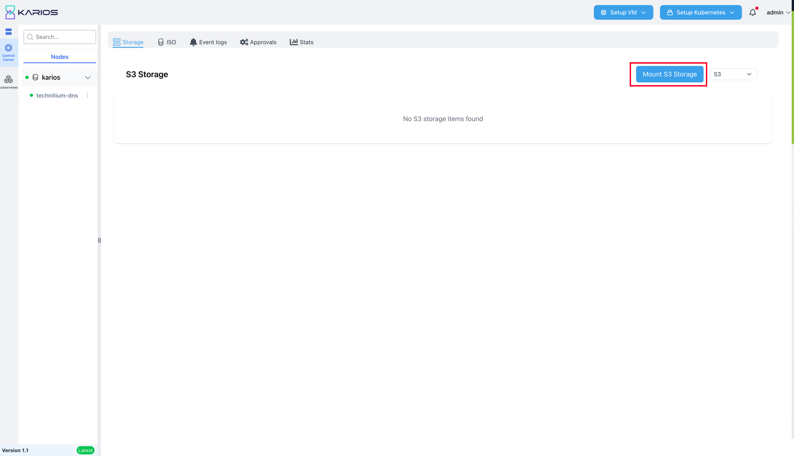

To mount S3 storage, follow these steps:

**Step 1: Gather S3 Storage Information**
Before configuring, obtain the following details:

- S3 bucket name
- Access credentials (Access Key and Secret Key)
- S3 endpoint URL or region information

**Step 2: Configure S3 Mount**

**Bucket Name:** Enter the name of your S3 bucket you want to access

.. tip::
   An AWS bucket is a container within Amazon S3 that securely stores objects (files and their metadata) in the cloud, offering scalability, durability, and various configuration options for different use cases.

**Access Key:** Enter your S3 access key ID for authentication

.. tip::
   A bucket access key is a unique set of credentials, an Access Key ID and Secret Access Key that allows users or applications to authenticate and interact with an AWS S3 bucket.

**Secret Key:** Enter your S3 secret access key for authentication

.. tip::
   The bucket secret key, also known as the Secret Access Key, is a confidential string of characters paired with an Access Key ID that authenticates requests made to your AWS S3 bucket.

**Endpoint:** Enter the S3 endpoint URL (e.g., s3.amazonaws.com)

.. tip::
   The URL of the S3 service endpoint for your region (e.g., s3.amazonaws.com for global, or s3.us-west-2.amazonaws.com for specific regions). For S3-compatible services, this would be the custom endpoint URL

**Region:** Enter the S3 region (e.g., us-east-1) or leave default

.. tip::
   An S3 region is a geographical location where your Amazon S3 bucket's data is physically stored, impacting latency, cost, and compliance considerations.

**ID:** Enter a name to identify this storage mount (e.g., "karios")

.. tip::
   An S3 Access Key ID is a public identifier that acts as the first part of your credentials for authenticating requests to access your Amazon S3 bucket.

**Step 3: Configure Options**

- ✓ **Auto Mount on Restart**: Check this to automatically connect to storage when system restarts
- ✓ **Add to Datastore**: Check this to make the storage available for virtual machines

**Step 4: Complete Setup**
Click Submit to save the configuration and mount the S3 storage.

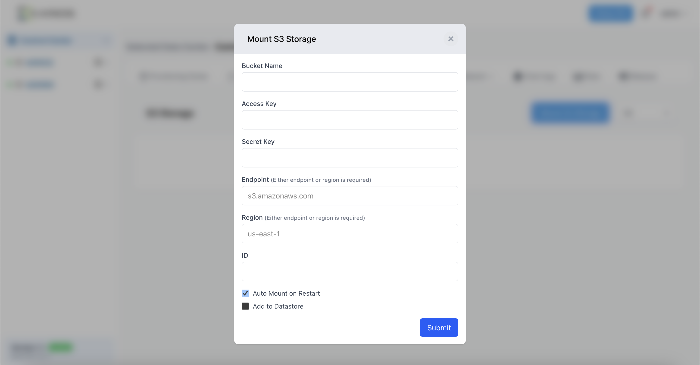

**Storage Status:** Monitor S3 storage availability and connection status

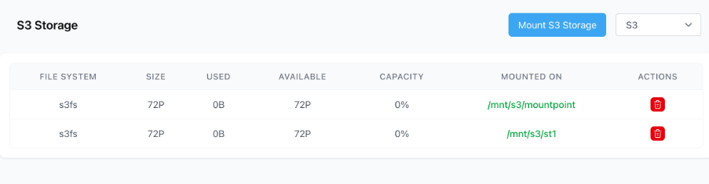

Click Delete to unmount the S3 storage. Click "unmount" to confirm the removal of S3 storage.

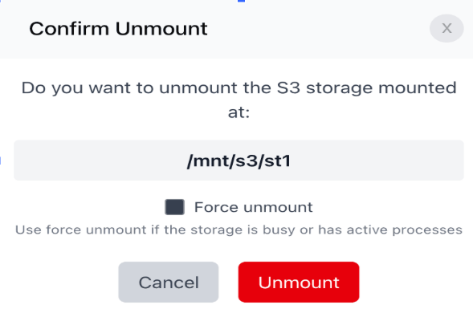

iSCSI Storage
^^^^^^^^^^^^^

**iSCSI Block Storage:**
iSCSI provides block-level storage access over IP networks, enabling remote storage to appear as locally attached disks. It's commonly used for shared storage in virtualization environments and high-performance database applications.

iSCSI integration provides Karios with flexible, centralized block storage that delivers:

- Improved performance through dedicated storage networks
- Enhanced reliability via centralized storage management  
- Better manageability with unified storage administration
- Scalable architecture supporting infrastructure growth

**Storage Benefits**

.. list-table:: 
   :header-rows: 1
   :widths: 25 75

   * - Benefit
     - Description
   * - **Centralized Storage**
     - Simplifies management and enables easy scaling of storage capacity as infrastructure grows
   * - **High Availability**
     - Supports live VM migration between hosts without data loss, ensuring continuous operations
   * - **Cost-Effective**
     - Provides SAN functionality at a lower cost than traditional Fibre Channel solutions

**Understanding iSCSI Terms:**

**Target:** An iSCSI target is the storage device or service on the remote server that provides the actual storage space. It's identified by an IQN (iSCSI Qualified Name) and contains one or more LUNs (Logical Unit Numbers).

**Mount:** Mounting makes the connected iSCSI storage accessible to the operating system as a usable disk or file system. After mounting, the remote storage appears as a local disk that can be used for data storage.

**Connect to iSCSI Target:** Click "Connect to iSCSI Target" to establish iSCSI connections

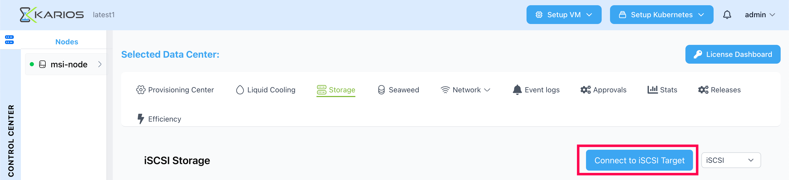

**Step 1: Gather iSCSI Target Information**
Before configuring, obtain the following details:

- iSCSI target server IP address
- Target name (IQN - iSCSI Qualified Name)
- Authentication credentials (username and password)

**Step 2: Configure iSCSI Connection**

**Portal:** Enter the IP address of your iSCSI target server (e.g., 192.168.116.113)

.. tip::
   An iSCSI portal is the combination of an IP address and TCP port (typically 3260) that defines a specific endpoint for initiating or accepting iSCSI connections, essentially acting as the doorway for communication between an initiator and target.

**Target:** Enter the iSCSI target name (e.g., iqn.store.ai.karios:storage.lun1)

**Username:** Enter the authentication username for the iSCSI target (e.g., admin)

.. tip::
   An iSCSI username is a credential used for authentication when connecting to an iSCSI target, ensuring only authorized initiators can access the shared storage.

**Password:** Enter the authentication password for the iSCSI target

.. tip::
   An iSCSI password, paired with a username, provides secure authentication for clients accessing an iSCSI target, verifying their identity before granting storage access.

**Step 3: Complete Connection**
Click Submit to establish the iSCSI connection and make the storage available as a block device.

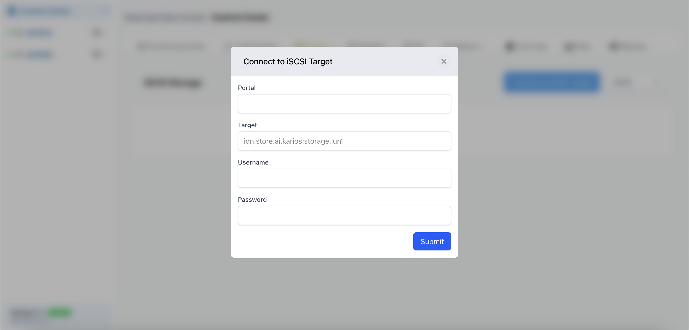

To mount iSCSI devices, follow these steps:

After connecting to an iSCSI target, you need to mount the discovered devices to make them accessible for storage operations.

**Step 1: Configure Multipath Settings**

**Multipath Name:** Enter a name for the multipath device (e.g., "mp_disk")

.. tip::
   The Multipath Name is essentially the logical name you assign to the multipath device created from multiple iSCSI paths.

**Select Devices:** Choose the iSCSI devices you want to include in the multipath configuration

**Device Selection:** Check the boxes for available devices (e.g., "da1")

**Verify Selection:** Confirm your selected devices are listed correctly

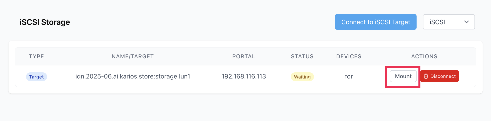

**Step 2: Complete Mount Process**
Click Mount to mount the selected iSCSI devices and make them available for use.

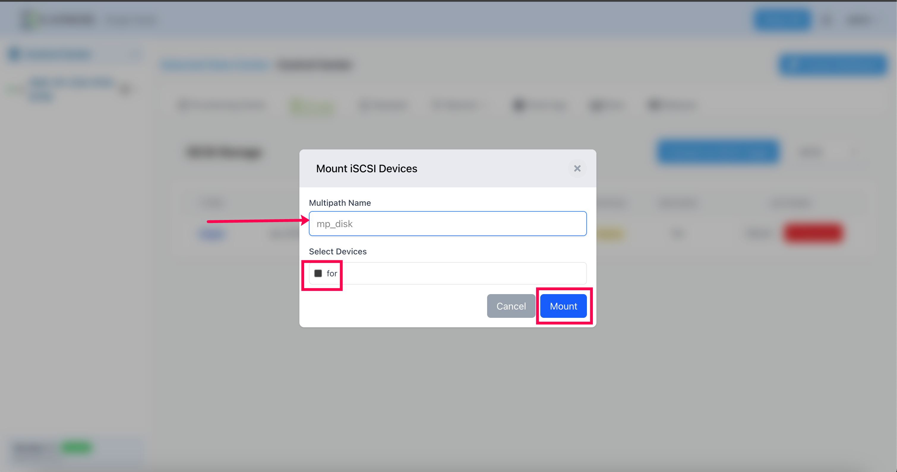

**Device Actions:** These are the following actions that can be performed on an iSCSI storage device.

- **Mount**: Makes the iSCSI storage accessible to the system as a usable disk drive
- **Disconnect**: Terminates the connection to the iSCSI target while preserving configuration
- **Remove Device**: Completely removes the device from the system configuration
- **Destroy Path**: Removes the multipath configuration and destroys the path mapping

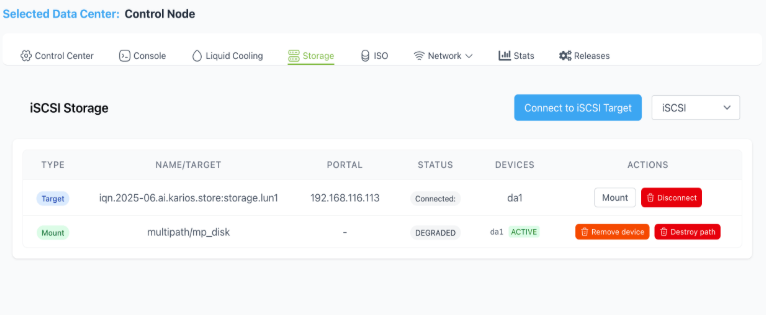

NFS Storage
^^^^^^^^^^^

**NFS File Storage:**
NFS (Network File System) allows you to access files on remote servers as if they were stored locally on your system. It's commonly used for shared storage in Unix/Linux environments and virtualization platforms.

**NFS Advantages for Hypervisors**

For hypervisors like Karios, NFS offers several crucial advantages:

**Shared Storage**
   The primary benefit of NFS integration. NFS allows multiple Karios hosts to access and use the same VM disk images (`.raw` files). This shared access is essential for advanced hypervisor features like live migration.

**Live Migration Support (Future)**
   Moving a running virtual machine from one Karios host to another becomes feasible with NFS. Since both hosts access the same storage, the VM's data remains accessible during migration, minimizing downtime.

**Centralized Management**
   Simplifies storage administration by consolidating management at the NFS server level rather than managing storage individually on each hypervisor host.

**Scalability & Flexibility**
   Enables easier storage capacity scaling by adding resources to the NFS server without modifying individual Karios hosts. This approach also provides flexibility in storage hardware selection, removing dependency on directly attached storage.

**Cost-Effectiveness**
   Can provide more economical storage solutions compared to dedicated SAN implementations, particularly beneficial for smaller deployments.

**Implementation Benefits**

**Operational Advantages:**

- Unified storage management across multiple hypervisor hosts
- Simplified backup and disaster recovery procedures
- Reduced storage hardware complexity per host
- Enhanced resource utilization through shared storage pools

**Technical Considerations:**

- Network bandwidth requirements for storage traffic
- NFS server performance impact on VM operations  
- Network reliability requirements for storage availability
- Security considerations for network-attached storage

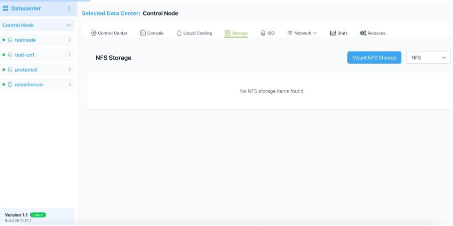

To mount NFS storage, follow these steps: Click "Mount NFS Storage" to configure NFS connections

**Step 1: Select NFS Server**

**NFS Server:** Enter the IP address or hostname of your NFS server (e.g., 192.168.116.113)

Click Next to proceed to mount configuration

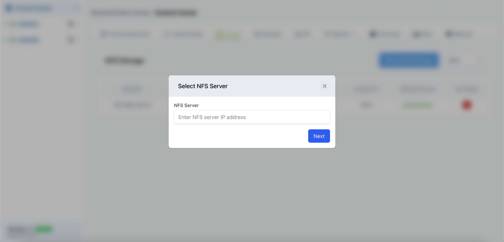

**Step 2: Configure NFS Mount**

**ID:** Enter a name to identify this storage mount

.. tip::
   An NFS ID (Network File System Identifier) is a unique identifier assigned to each client accessing an NFS server, used for access control and tracking.

**Server:** Enter the IP address or hostname of your NFS server (e.g., 192.168.1.100)

.. tip::
   A network file server that runs the Network File System daemon (nfsd) and exports (shares) directories to remote client systems over a network. The NFS server manages file access permissions, handles client requests for file operations (read, write, create, delete), and maintains the shared file systems that clients can mount and access as if they were local storage.

**Export Path:** Enter the directory path exported by the NFS server (e.g., /exports/shared)

.. tip::
   The directory path on the NFS server that has been configured and made available for sharing to client systems. This is the actual folder location on the server (e.g., /exports/shared, /home/data) that contains the files you want to access remotely.

.. tip::
   **Mount Point:** The local directory path on the client system where the remote NFS share will be attached and accessed. This is an empty directory on your local system (e.g., /mnt/nfs-storage, /data/shared) that serves as the access point for the remote files.

   **Mount Options:** Configuration parameters that control how the NFS file system is mounted and behaves, including NFS protocol version (NFSv3, NFSv4), read/write permissions, timeout settings, cache behavior, and security options. These options determine the performance characteristics and access rules for the mounted file system.

**Step 3: Configure Options**

- ✓ **Auto Mount on Restart**: Check this to automatically mount NFS storage when system restarts
- ✓ **Add to Datastore**: Check this to make the storage available for virtual machines
- ✓ **Enable pNFS**: Check this to enable parallel NFS for improved performance (if supported)

.. tip::
   An extension to NFSv4 that allows clients to access file data directly from multiple storage servers simultaneously, rather than routing all data through a single NFS server. This parallel access significantly improves performance and scalability by distributing I/O operations across multiple storage devices, reducing bottlenecks and enabling higher throughput for large file operations.

**Step 4: Complete Setup**
Click Submit to save the configuration and mount the NFS storage.

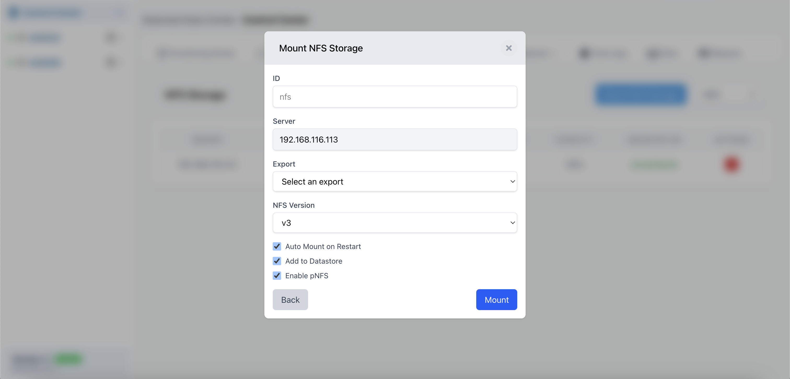

To unmount the NFS storage, please click on the delete icon

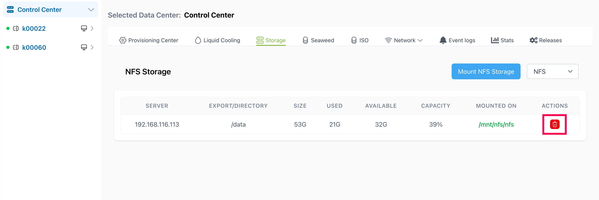

SMB Storage
^^^^^^^^^^^

**SMB/CIFS Storage:**

SMB (Server Message Block), formerly known as CIFS (Common Internet File System), is a network file sharing protocol primarily used by Windows environments. It allows computers to access files over a network as if they were local drives, similar to NFS functionality.

**Importance for Hypervisors**

For hypervisors like Karios, SMB offers valuable benefits, particularly in mixed or Windows-integrated environments:

**Windows Integration**
   Simplifies integration in infrastructures that heavily utilize Windows servers and Active Directory, leveraging existing expertise and tools

**Shared Storage Capabilities**
   Similar to NFS, SMB enables multiple Karios hosts to access the same VM disk images (`.raw` files), which is crucial for live migration and high availability

**Live Migration Support (Future)**
   Allows seamless movement of running VMs between Karios hosts since both access the same storage location, minimizing downtime during migrations

**Administrative Familiarity**
   For administrators experienced with Windows environments, SMB setup and management are often more straightforward than NFS alternatives

**Cost-Effective Implementation**
   SMB solutions can be economical, especially when leveraging existing Windows servers for file sharing

**Protocol Comparison**

.. list-table:: 
   :header-rows: 1
   :widths: 20 40 40

   * - Protocol
     - Best Use Case
     - Key Characteristics
   * - **SMB/CIFS**
     - Windows-centric environments
     - Native Windows integration, familiar management
   * - **NFS**
     - Linux/Unix-centric setups
     - POSIX compliance, Unix-native features
   * - **SAN**
     - High-performance requirements
     - Superior performance but higher cost and complexity

**Storage Decision Factors**

**Choose SMB when:**

- Infrastructure has strong Windows presence
- Existing Windows file sharing infrastructure available
- Administrative team has Windows storage expertise
- Integration with Active Directory is required

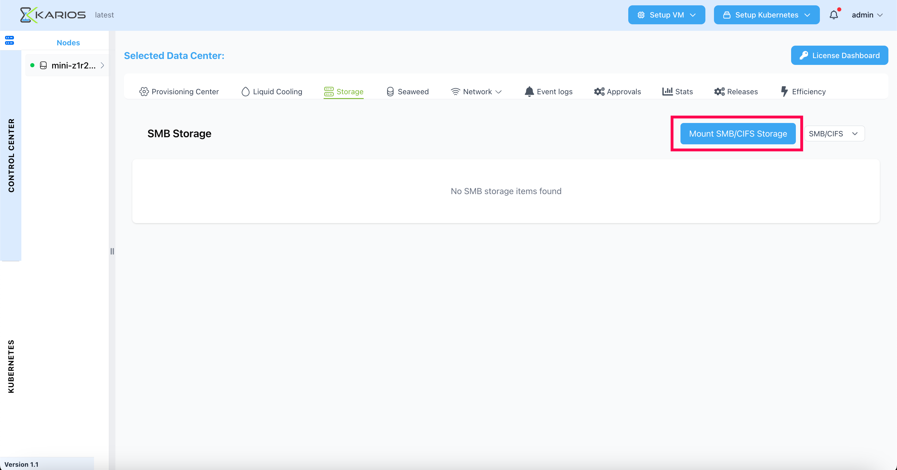

**Mount SMB/CIFS Storage:** Click "Mount SMB/CIFS Storage" to configure SMB connections and follow these steps:

**Step 1: Gather SMB Server Information**
Before configuring, obtain the following details:

- SMB server IP address or NetBIOS name
- Share name on the SMB server
- Authentication credentials (username and password)

**Step 2: Configure SMB Mount**

**ID:** Enter a name to identify this SMB mount (e.g., "karios")

**NetBIOS Name:** Enter the Windows computer name or NetBIOS name (e.g., "DESKTOP-FHPF4OS")

.. tip::
   A NetBIOS name is a legacy computer name used in Windows networking that can be utilized when specifying the server address for mounting SMB/CIFS shares.

**Server:** Enter the IP address of your SMB server (e.g., 192.168.111.230)

.. tip::
   An SMB (Server Message Block) / CIFS (Common Internet File System) server allows users on a network to share files, printers, and other resources using the Windows networking protocol.

**Share:** Enter the name of the shared folder (e.g., "shared-folder")

.. tip::
   An SMB share is a designated folder on an SMB/CIFS server that's made accessible to other computers on the network for file sharing.

**Username:** Enter your SMB authentication username (e.g., "smbuser")

.. tip::
   An SMB username is a specific account name used to authenticate and access resources (like files and folders) on an SMB/CIFS share, separate from your local computer's login.

**Password:** Enter your SMB authentication password

.. tip::
   An SMB password is the secret credential associated with an SMB username, required for authentication when accessing shared resources on an SMB/CIFS server.

**Step 3: Configure Options**

- ✓ **Auto Mount on Restart**: Check this to automatically mount SMB storage when system restarts
- ✓ **Add to Datastore**: Check this to make the storage available for virtual machines

**Step 4: Complete Setup**
Click Submit to save the configuration and mount the SMB storage.

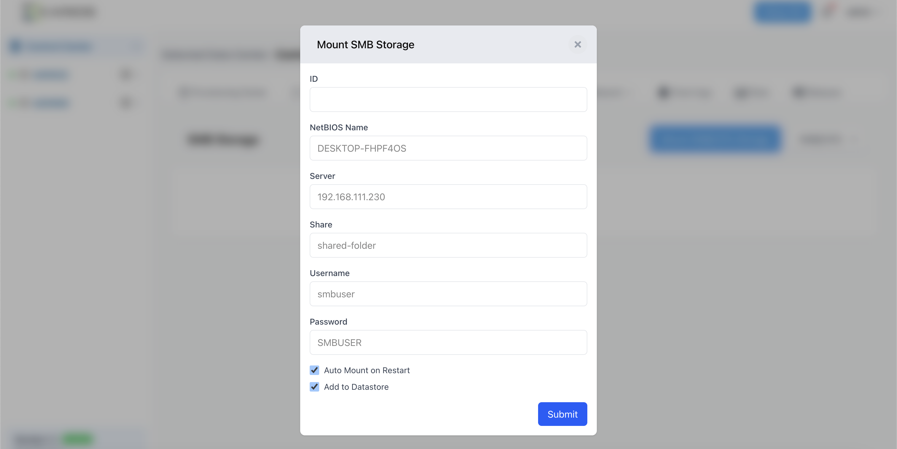

**SMB Server Configuration:** SMB/CIFS server connections.

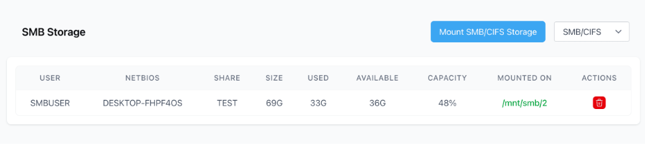

**Unmount:** Click on the "delete" icon to unmount SMB storage.

Storage Operations
^^^^^^^^^^^^^^^^^^

**Common Storage Operations:**

- **Mount/Unmount**: Mount and unmount storage systems
- **Connection Management**: Connect and disconnect from storage targets
- **Capacity Monitoring**: Real-time storage usage and capacity monitoring
- **Status Tracking**: Monitor connection status and storage health
- **Configuration Management**: Configure storage protocol settings

**Storage Management Features:**

- **Protocol Selection**: Dropdown selection for different storage protocols
- **Unified Interface**: Single interface for all storage protocol management
- **Real-time Monitoring**: Live storage metrics and status updates
- **Action Controls**: Direct action buttons for storage operations
- **Storage Analytics**: Detailed storage usage and performance metrics

For detailed information regarding storage protocols, configuration options, advanced features, and comprehensive storage management, please refer to Flexible Storage.

SeaweedFS Storage
^^^^^^^^^^^^^^^^^

**SeaweedFS Distributed Object Storage:**
SeaweedFS is a distributed file system that provides scalable object and file storage with automatic replication. It offers both S3-compatible object storage and POSIX file system interfaces for flexible data access.

**SeaweedFS Terms:**

**Master Server:** Controls the distributed file system by managing metadata, coordinating volume servers, and handling file location requests. It acts as the central coordinator for the entire SeaweedFS cluster.

**Volume Server:** Stores the actual file data and handles read/write operations. Multiple volume servers work together to provide distributed storage capacity and redundancy.

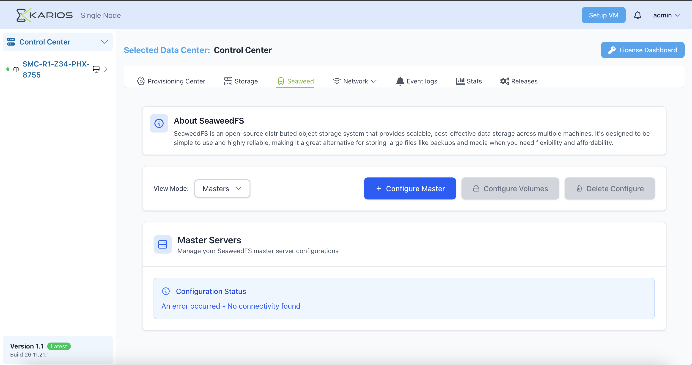

**Master Server Management:** Configure and manage SeaweedFS master servers

To configure SeaweedFS Master, follow these steps:

**Step 1: Access SeaweedFS Configuration**

Navigate to the SeaweedFS section in your Karios interface

Click Configure Master to begin master server setup

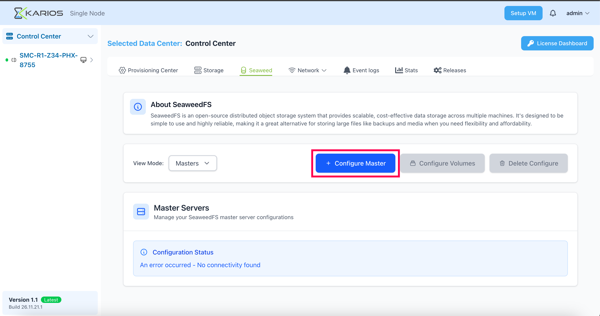

**Step 2: Configure Master Server**

**Datacenter:** Enter datacenter identifier (e.g., "dc0")

.. tip::
   A logical identifier that represents a physical data center or geographic location where SeaweedFS nodes are deployed. This helps SeaweedFS understand the physical topology and make intelligent replication decisions to ensure data copies are distributed across different locations for disaster recovery.

**Rack:** Enter rack identifier (e.g., "r0")

.. tip::
   A logical identifier that represents a physical server rack within a datacenter. SeaweedFS uses rack information to ensure data replicas are stored on servers in different racks, providing protection against rack-level failures such as power loss, network switch failures, or cooling issues affecting an entire rack.

**Default Replication:** Set replication factor (e.g., "000")

.. tip::
   A three-digit configuration that defines how many copies of data SeaweedFS automatically creates and where they are stored. The format is "XYZ" where X = copies across datacenters, Y = copies across racks, Z = copies across volume servers. For example, "001" means 1 copy on different volume servers, "010" means 1 copy on different racks, and "100" means 1 copy across different datacenters.

.. note::
   SeaweedFS replication 000: Stores only a single copy of each chunk (no replicas). Use this setting only when durability isn't required as any volume/node failure may result in data loss.

   In a single-node deployment, SeaweedFS replication is disabled and has no effect. Replication is only applicable when multiple volume servers (nodes) are configured.

**Select Node for Master Configuration:** Choose which node will serve as the master server

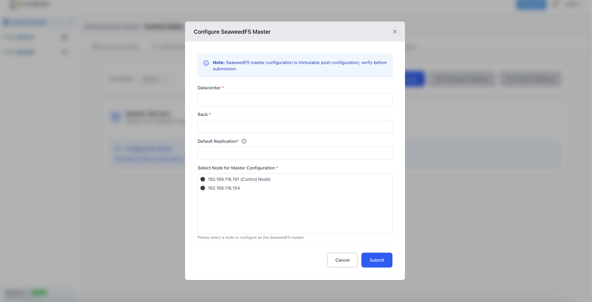

**Configure Volumes:** Click "Configure Volumes" to manage storage volumes and select a server IP address from the available list.

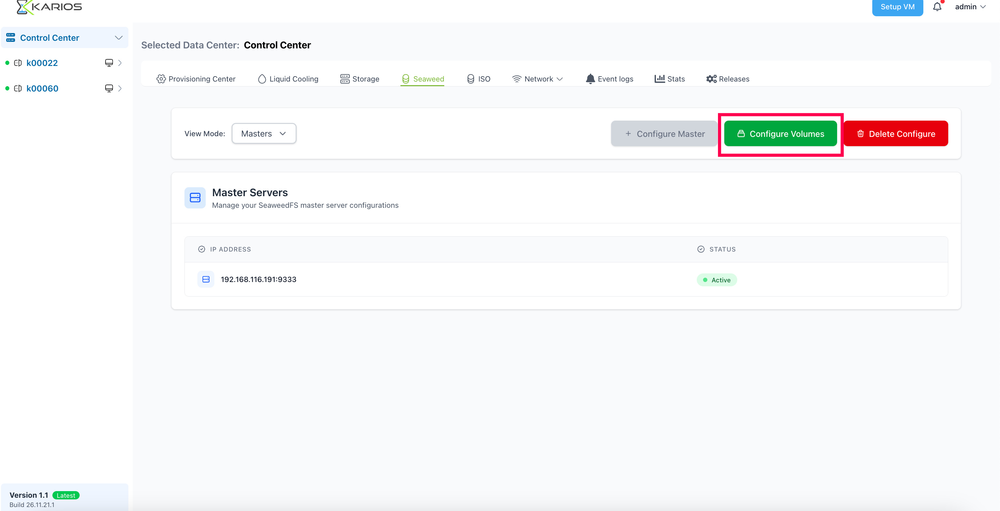

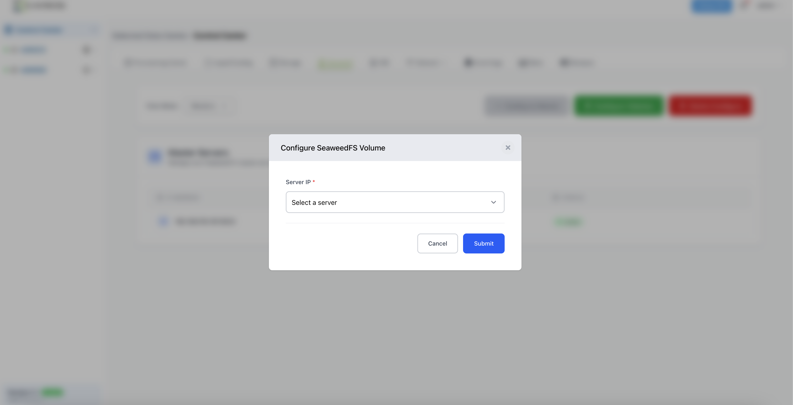

**Unmount Volumes:** Click on Unmount button to remove the volume servers

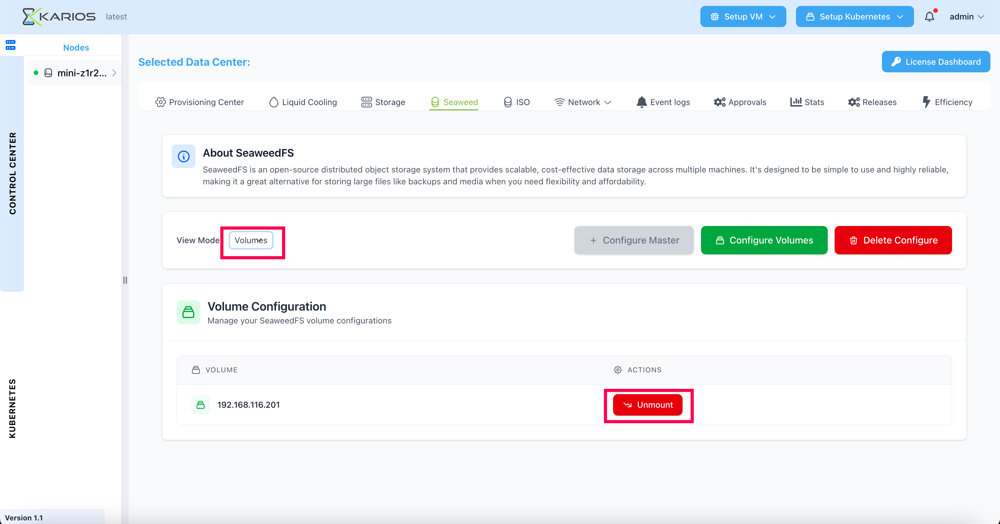

**Master Servers Display:** View active master servers with IP addresses and status

- **IP Address**: Master server addresses (e.g., 192.168.116.137:9333)
- **Status**: Active status for all master servers
- **Multi-Master Support**: Multiple master servers for high availability

**Delete Configure:** Removes the entire seaweed configuration.

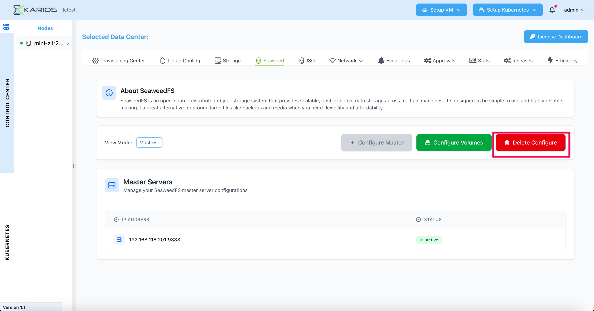

ISO Management Operations
~~~~~~~~~~~~~~~~~~~~~~~~~

.. note::
   Control Center level ISO section is only enabled if seaweed is configured. If you don't wish to configure seaweed, please navigate to the node level ISO section to upload or download ISO.

**Understanding Basic Terms:**

**ISO:** A disk image file format that contains an exact copy of data from an optical disc (CD/DVD). In virtualization, ISO files are used as virtual installation media to install operating systems or software on virtual machines, eliminating the need for physical discs.

**RAW:** An uncompressed disk image format that contains a bit-for-bit copy of a storage device or partition. RAW images provide maximum compatibility and performance but consume more storage space since they don't use compression, making them ideal for high-performance virtual machine storage.

ISO Operations:
^^^^^^^^^^^^^^^

- **Download ISO**: Download ISO files using FQDN URL with appended ISO file path
- **Upload ISO**: Upload valid ISO files to the data center storage
- **RAW File Support**: Upload and manage RAW disk image files
- **File Selection**: Browse and select from available ISO and RAW files
- **Availability Tracking**: Real-time view of available ISO and RAW files

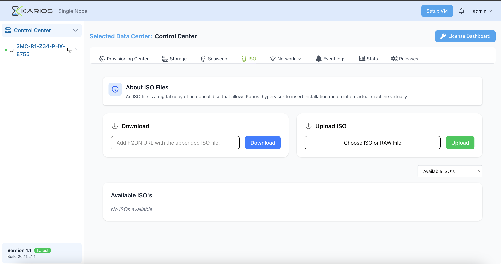

ISO Management Features:
^^^^^^^^^^^^^^^^^^^^^^^^

- **Dual Upload Support**: Support for both ISO and RAW file formats
- **URL-based Downloads**: Download ISO files directly from FQDN URLs
- **File Browser Integration**: Integrated file selection interface
- **Availability Dropdown**: Dropdown menu displaying all available ISO and RAW files
- **Upload Status Monitoring**: Real-time upload progress and completion status
- **File Validation**: Automatic validation of uploaded ISO and RAW files

**ISO Management Interface:**

**Download Section:** FQDN URL input field with download button for remote ISO retrieval (e.g., https://download.freebsd.org/ftp/releases/ISO-IMAGES/14.2/FreeBSD-14.2-RELEASE-amd64-bootonly.iso)

Please give a valid FQDN URL in the input field and click "download"

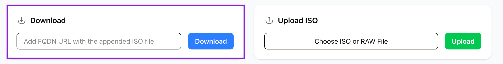

**Upload Section:** File selection interface with upload button for local ISO/RAW files

Select a valid iso or raw file and click "upload"

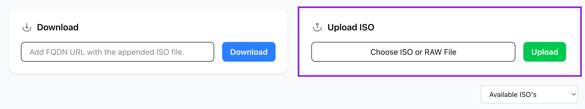

**Available Files Dropdown:** Comprehensive list of all available ISO and RAW files (cloud images)

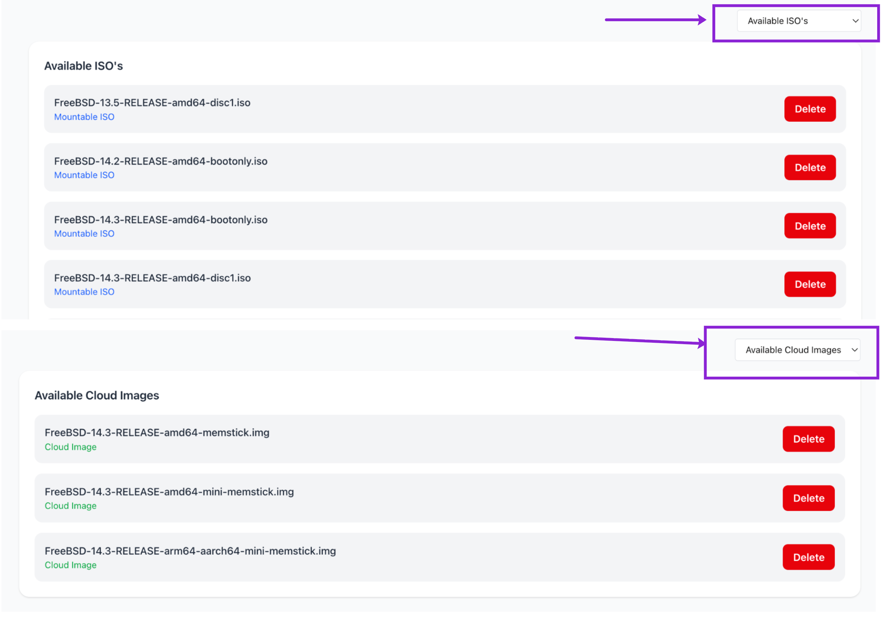

**Status Indicators:** Visual indicators for file availability and upload status

**File Management Controls:** Direct access to file operations and management functions

**Supported File Types:**

- **ISO Files**: Standard ISO 9660 disk image files
- **RAW Files**: Raw disk image files and virtual machine disk formats
- **Validation**: Automatic file format validation during upload process

Network Management Operations
~~~~~~~~~~~~~~~~~~~~~~~~~~~~~

Network Navigation Structure
^^^^^^^^^^^^^^^^^^^^^^^^^^^^

- **Network Tab Selection:** Access network management by selecting the Network tab from the main navigation
- **Dropdown Menu Options:** Choose between "Switches" and "Interface" from the network options dropdown
- **Search Functionality:** Search network options using the integrated search bar
- **Server Selection:** Select target server from the server dropdown menu

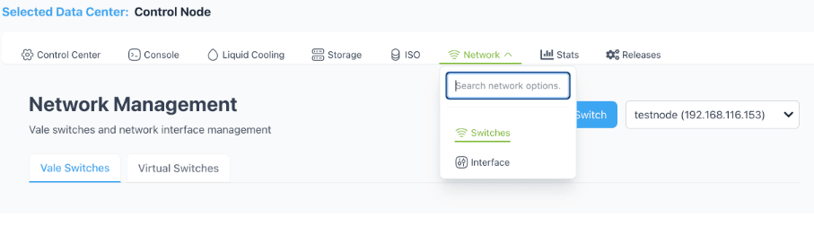

Switches Section (Selected from Network dropdown)
^^^^^^^^^^^^^^^^^^^^^^^^^^^^^^^^^^^^^^^^^^^^^^^^^
- **Virtual Switch:** A software-based network switch that operates within the host system, enabling communication between virtual machines and connecting them to physical or virtual network interfaces. It functions like a physical Ethernet switch by learning MAC addresses, forwarding traffic, and managing network connections entirely in software.
- **Interface:** A network connection point that allows systems to communicate over a network. This can be a physical network interface (like an Ethernet port) or a virtual interface (like a VM's network adapter), serving as the entry and exit point for network traffic.

Vale Switches Tab
^^^^^^^^^^^^^^^^^^

**A High performance networking (software) switch** that delivers packet delivery with low latency and high throughput compared to regular software switches.

After navigating to Switches and Select Vale Switch.

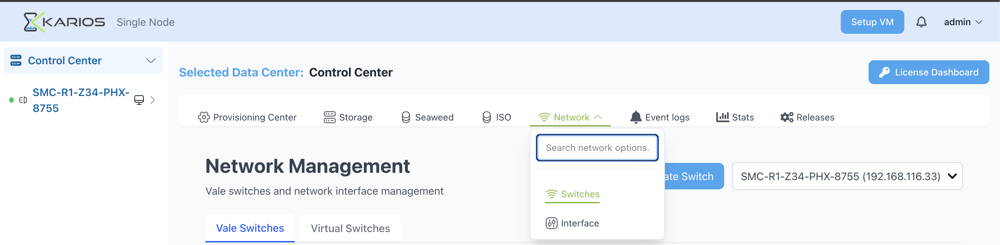

To create a Vale switch, please click on this.

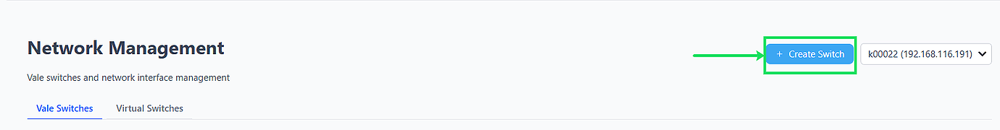

Please enter the following fields for the vale switch configuration:

**Vale Switch Number (not greater than 4094):** An identifier to each VALE switch.

.. tip::
   VALE Switch Number: A unique numerical identifier assigned to each VALE switch instance within the system. This number distinguishes between multiple VALE switches running on the same host, allowing the system to route traffic to the correct high-performance switch instance (e.g., vale0, vale1, vale2).

**Tap Interface & VM Mapping field:** Select a tap interface of your desired vm from the available list for vale connection

**Network Interface:** Select the network interface from the available list of interfaces.

.. tip::
   **TAP Interface:** A virtual network interface that operates at Layer 2 (Ethernet level), simulating a complete network card that can send and receive raw Ethernet frames. It's commonly used to connect virtual machines to networks by creating a virtual ethernet adapter that appears as a real network device to the operating system.

   **VLAN:** A Virtual Local Area Network that logically segments a physical network into multiple isolated networks using VLAN tags. VLANs allow you to create separate network segments on the same physical infrastructure, improving security and organization by grouping devices logically rather than physically.

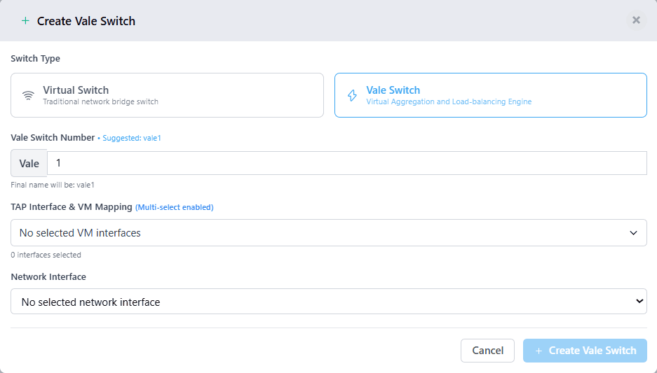

**The VALE switches module has 3 types of Network topologies.**

**a) Fully connected network:** parent interface - VALE - tap interface(s)

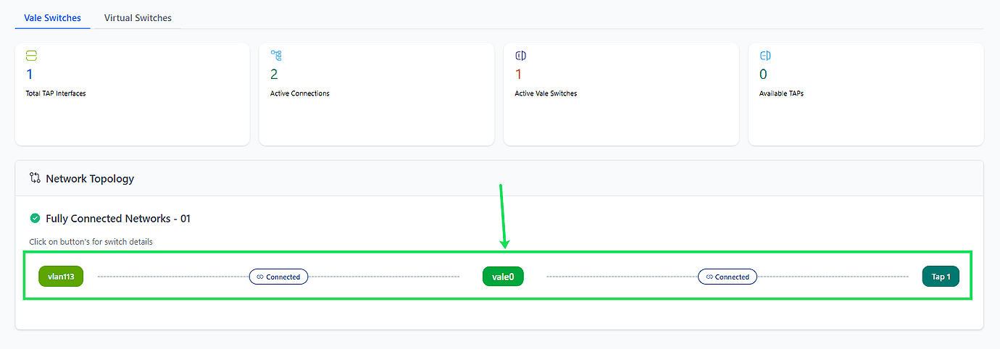

**b) Unused Networks:** parent interface - vale

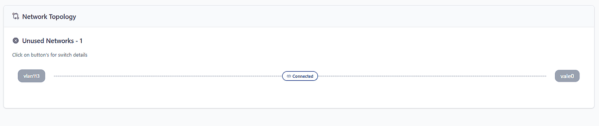

**c) Isolated Networks:** VALE - tap interface(s)

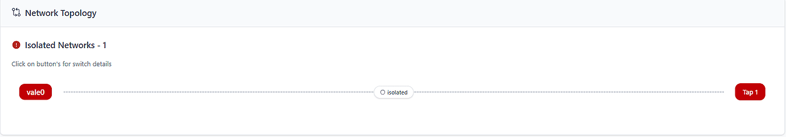

Clicking on any topology element displays a detailed view showing the complete network hierarchy: the parent physical interface, the VALE switch configuration, and all connected virtual machine TAP interfaces.

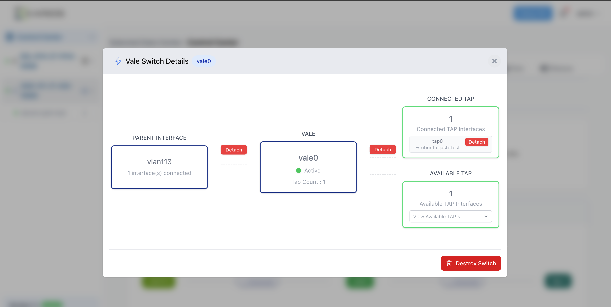

An option to detach the parent interface is available, which will convert the network into an isolated network. A warning will be displayed before performing this destructive action.

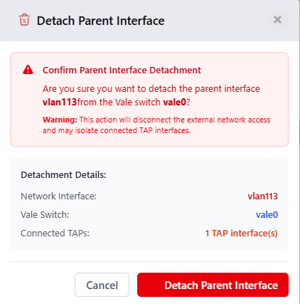

You will find two detach options on the right side of the VALE switch:

- **Bulk detach all TAP interfaces**: Removes all connected virtual machine interfaces at once
- **Detach individual TAP interfaces**: Selectively remove specific virtual machine interfaces

If available interfaces exist, you can add them to the VALE switch.

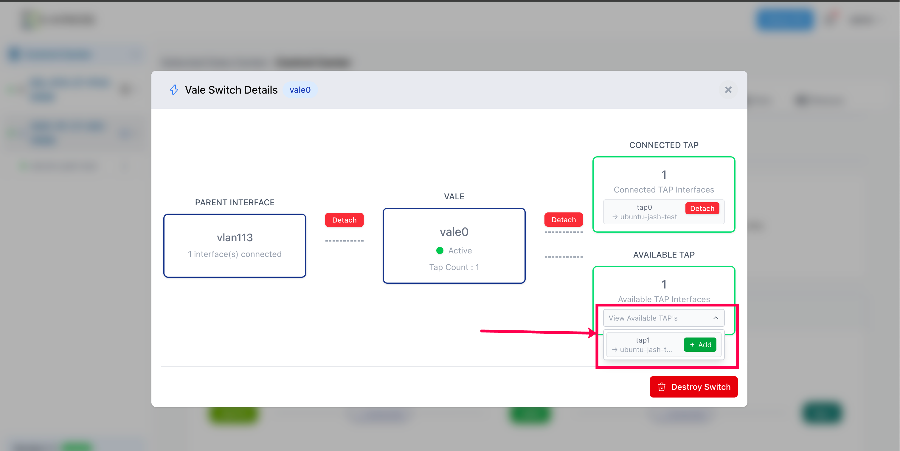

A destroy switch option is available with a warning that displays the potential impact of destroying the VALE switch before executing the destructive action.

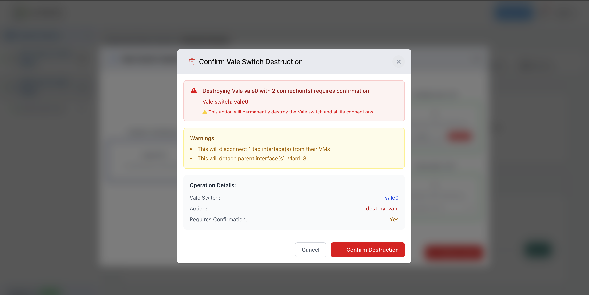

Virtual Switches Tab
^^^^^^^^^^^^^^^^^^^^

Access traditional network bridge switch management

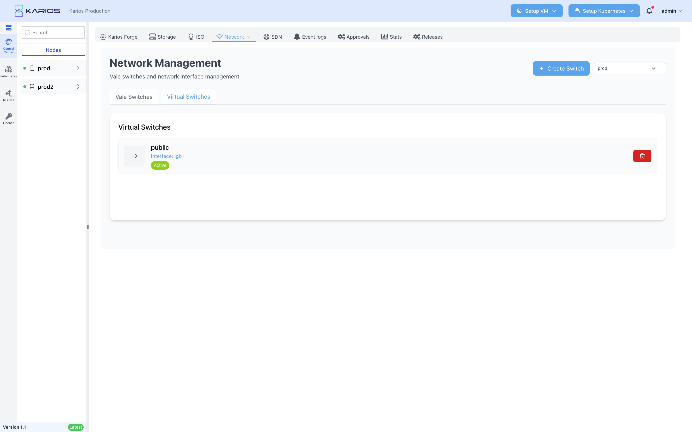

**Create Switch Button:** Create new switches with type selection and configuration options

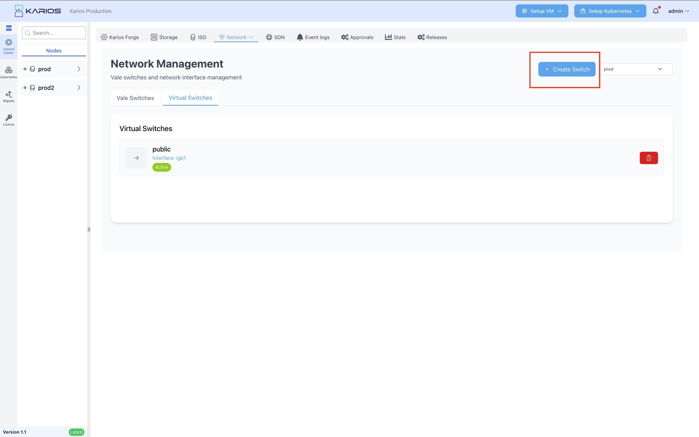

To create a new switch

**Switch name:** Give a unique alphanumeric name to the switch

.. tip::
   A unique identifier assigned to distinguish and manage individual virtual switches within the Karios network infrastructure.
   

**Select interface:** Select the desired interface for switch configuration

.. tip::
   A network connection point that allows systems to communicate over a network. This can be a physical network interface (like an Ethernet port) or a virtual interface (like a VM's network adapter), serving as the entry and exit point for network traffic.

Click "Create Network Switch" button

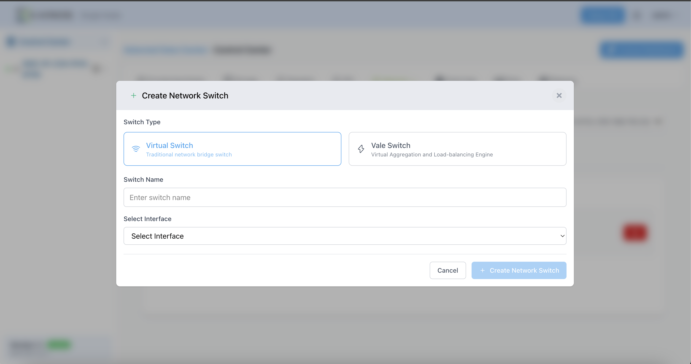

Interface Section (Selected from Network dropdown)
^^^^^^^^^^^^^^^^^^^^^^^^^^^^^^^^^^^^^^^^^^^^^^^^^^

- **Physical Tab:** Access physical network interface management and monitoring
- **Virtual Tab:** Access virtual network interface and VLAN configuration

Overview: You will be able to manage 2 kinds of interfaces:

Physical Interface
^^^^^^^^^^^^^^^^^^

This is the landing page which allows you to view your Network Interface Cards (NIC) and their status.

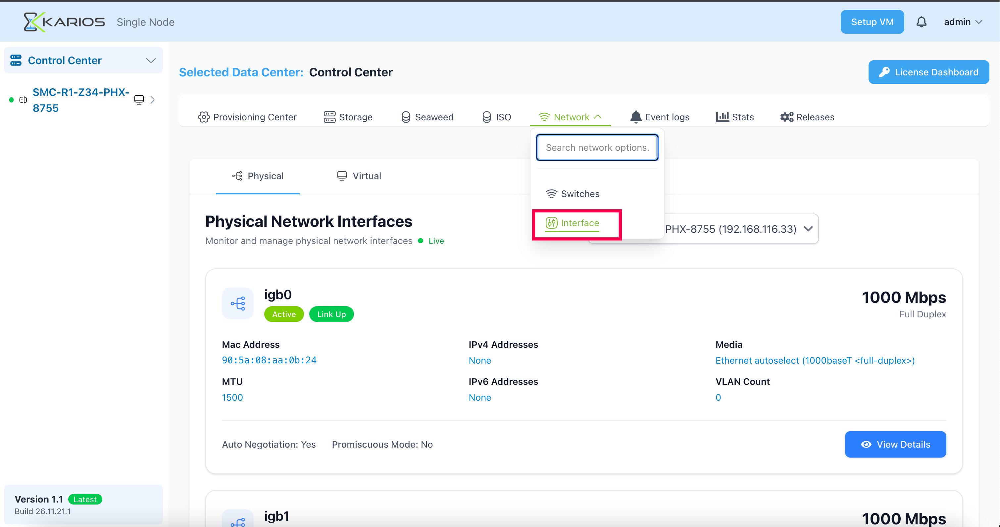

The Interface panel also gives the MAC address, IP address, media, VLAN's connected to the NIC, etc.

.. tip::
   **MAC Address:** A unique 48-bit hardware identifier assigned to network interfaces, displayed in hexadecimal format (e.g., 00:50:56:12:34:56). It serves as the physical address for network communication at the data link layer.

   **IP Address:** A numerical address assigned to devices on a network for identification and communication. It can be IPv4 (e.g., 192.168.1.100) or IPv6 format, used for routing traffic across networks.

   **Media:** The physical transmission medium or connection type used by a network interface, such as Ethernet copper cables, fiber optic cables, or wireless connections.

   **NIC:** Network Interface Card - a hardware component that connects a computer to a network, providing the physical interface for sending and receiving network data over Ethernet or other network protocols

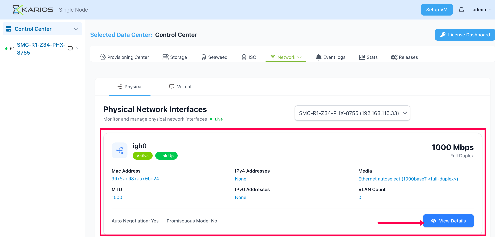

Click on 'View Details' to view the Received & Transmitted packets.

.. note::
   View Details is only available for active interfaces.

**Interface Monitoring:** Real-time monitoring of physical network adapters (igc0, igc1, etc.)

**Speed and Duplex:** Display interface speed (1000 Mbps) and duplex settings (Full Duplex)

**MAC Address Information:** View MAC addresses and network interface identifiers

**IP Configuration:** Monitor IPv4 and IPv6 address assignments and CIDR notation

**MTU Settings:** View and manage Maximum Transmission Unit settings

**Status Indicators:** Active, Link Up, and Editable status monitoring

**View Details:** Access detailed interface configuration and statistics

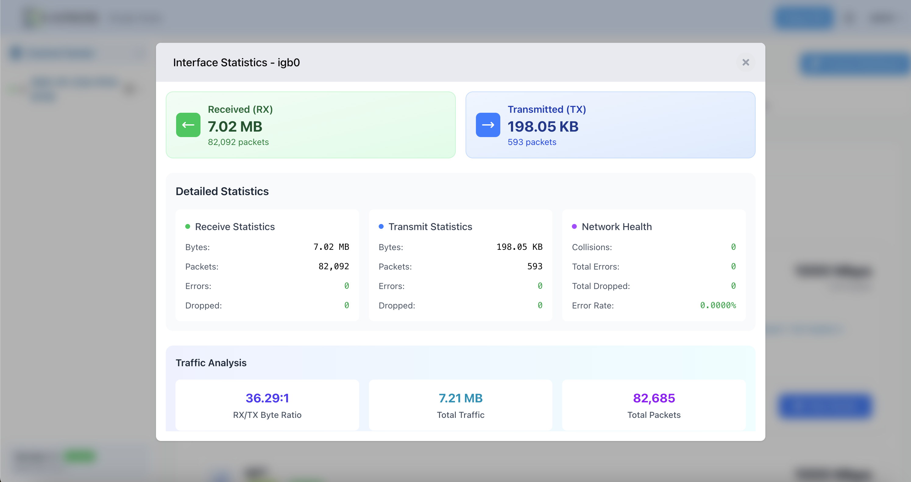

Virtual Interfaces
^^^^^^^^^^^^^^^^^^
**Virtual Network Interfaces (VLANs):**
In the Network Interfaces tab, like shown below, please navigate to Virtual.

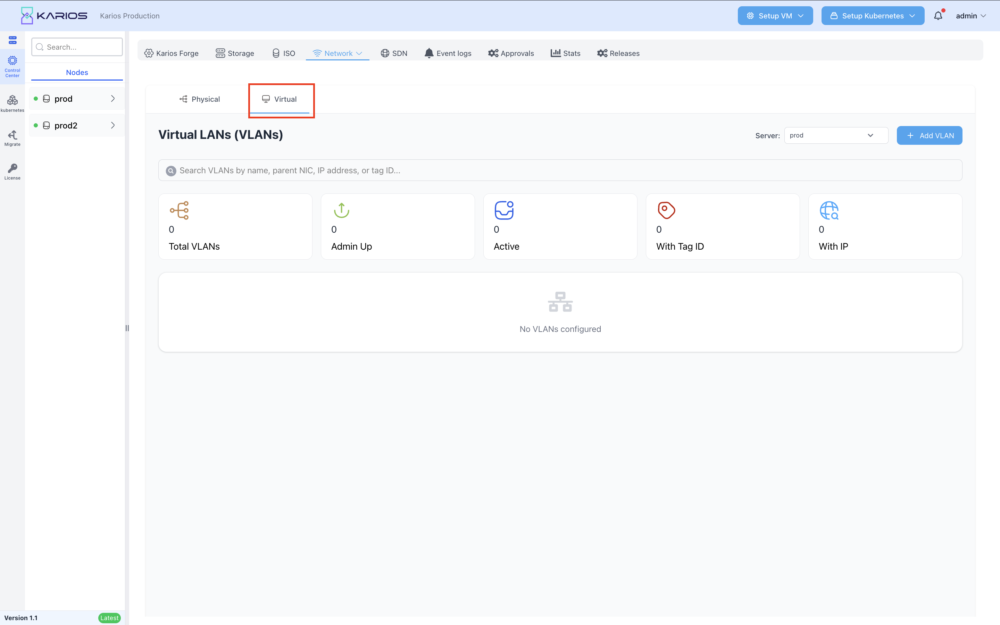

We have Virtual lans (VLAN's) currently supported and the landing page shows you the metrics associated with VLANs like count, status, VLANs with IP and Tag ID.

In each VLAN, you will get basic information like its MAC address, IP, status, parent interface.(usually the physically interface which is seen above)

Under the Virtual Interface - Virtual Lans (VLANs), you will be able to find an option to create a VLAN - 'Add VLAN'

**VLAN Management:** Configure and manage Virtual LANs with comprehensive settings

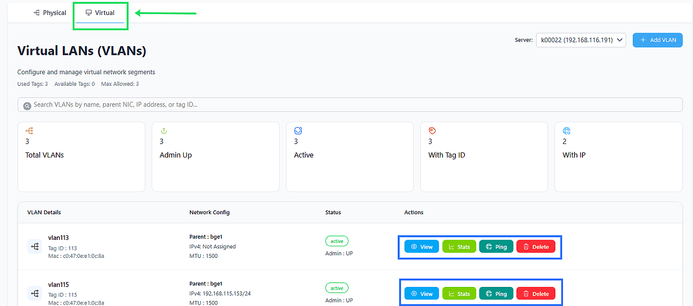

**Add VLAN Button:** Click on 'Add VLAN', it redirects you to a vlan configuration popup.

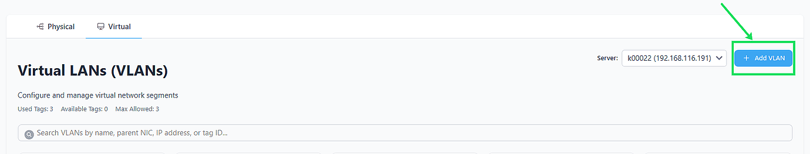

**VLAN Configuration Process:**

Provide all the information given below and click "Create VLAN"

- **Tag ID Assignment:** Enter VLAN tag ID within valid range (1-4094) with duplicate avoidance

.. tip::
   - **Tag ID Assignment:** A unique numerical identifier (1-4094) assigned to VLAN traffic for network segmentation. The tag is added to Ethernet frames to identify which VLAN the traffic belongs to, enabling logical network separation on shared physical infrastructure.

- **Parent NIC Selection:** Choose parent network interface from available interfaces dropdown (Parent network interface is usually from the Network → physical Interfaces, an "active" parent interface is provided).

- **Selecting IP:** If you choose to allow Dynamic IP assignment based on the Tag ID you entered, you can skip entering the Static IP address and Subnet Mask. (It will either automatically assign an IP within 15 seconds or asks you to enter Static IP While Entering Static IP addresses it is recommended to enter IP as per the tag ID, and the subnet (the recommended formats are entered in the place holders).

.. tip::
   - **Subnet:** A logical subdivision of an IP network that groups devices within a specific IP address range using subnet masks (e.g., 192.168.1.0/24). Subnets organize network traffic and improve security by creating logical network boundaries.
   - **Dynamic IP:** An IP address automatically assigned to a device by a DHCP server from a predefined pool of available addresses. The address can change when the device reconnects or when the lease expires.
   - **Static IP:** A permanently assigned IP address that remains constant and is manually configured on a device. Static IPs provide consistent network identity and are essential for servers and network infrastructure that need predictable addressing.

.. note::
  It is recommended that you have your L2 network configurations ready as per your requirements.

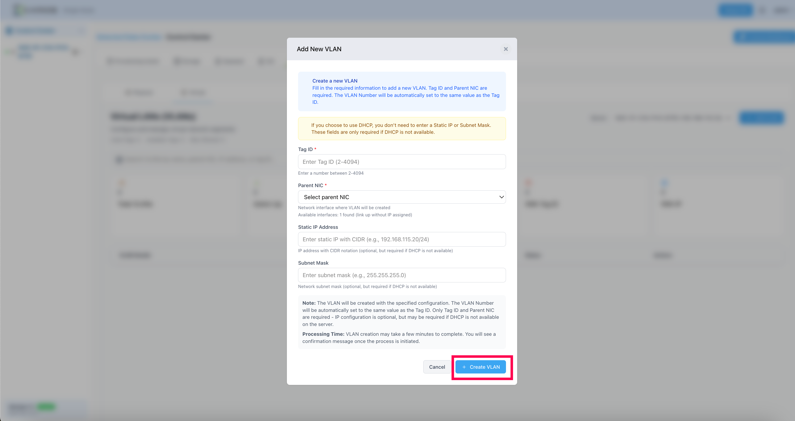

**VLAN Management Module:**

- **VLAN Details:** Display VLAN name, Tag ID, MAC address information
- **Network Configuration:** Show Parent NIC, IPv4 addresses, and MTU settings

.. tip::
  MTU Settings: Maximum Transmission Unit - the largest size of data packet that can be transmitted over a network interface, measured in bytes. 
  
  Standard Ethernet MTU is 1500 bytes, while jumbo frames can support up to 9000 bytes for improved performance on high-speed networks.
  
  Status Monitoring: Active status, admin up/down state, and connectivity indicators

**Action Controls:** View, Stats, Ping, and Delete functionality for each VLAN

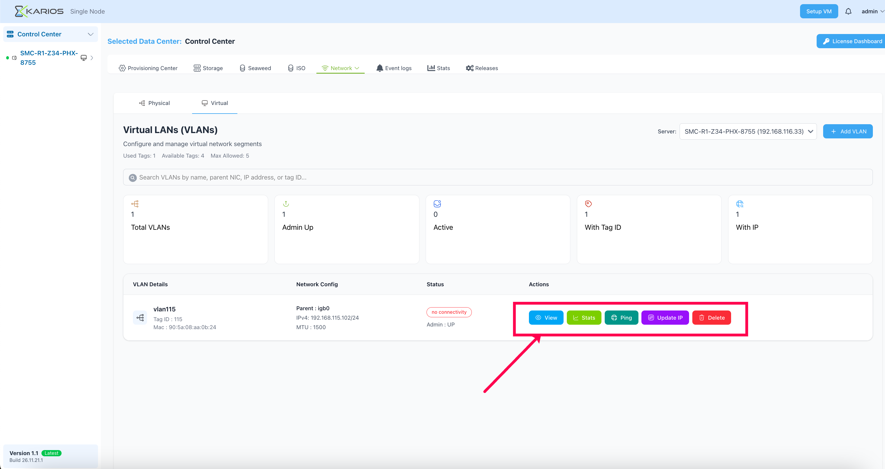

You can perform all the 4 actions mentioned above per VLAN:

**View:** This gives you details such as Parent NIC, MAC address, Status, Virtual Switches connected, Routing Table. (Please scroll down to find them)

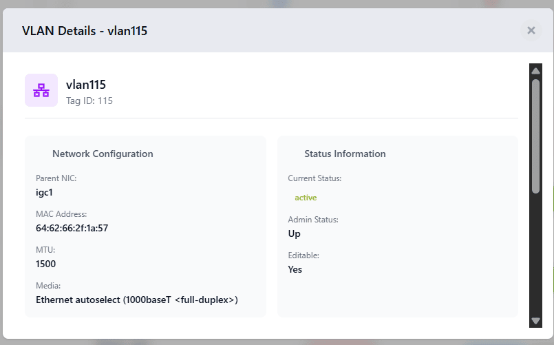

**Stats:** The packets VLAN receives and transmits is displayed here.

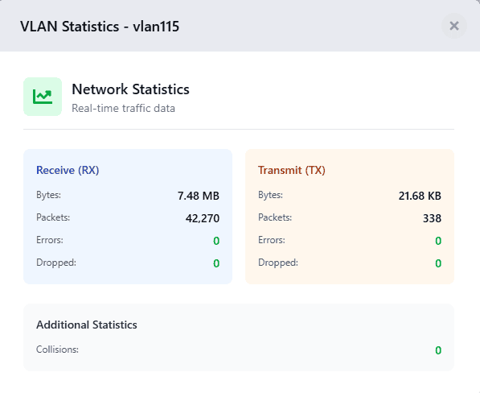

**Ping:** For an Active VLAN, a ping is possible to its gateway. In this case VLAN with Tag ID 115 is connecting to its interface 115.253.

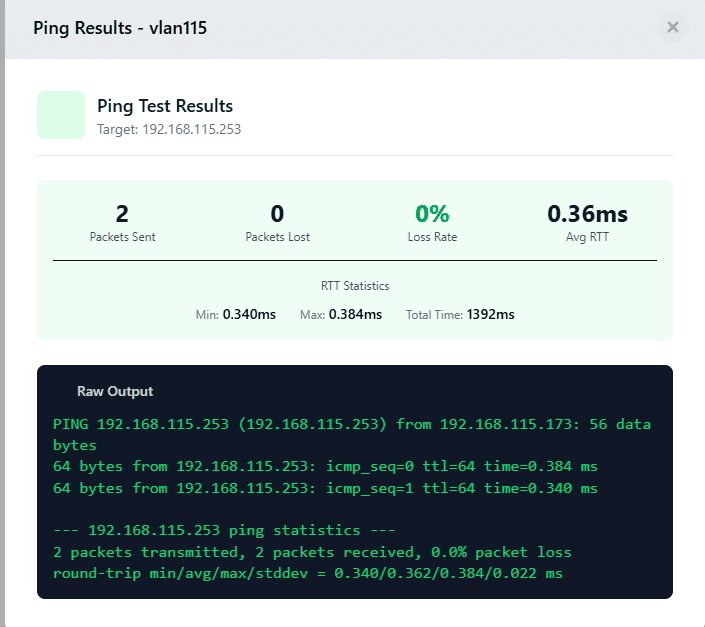

**Delete:** Before you delete a VLAN, you will be given a warning on the connected switches that will be isolated if the VLAN is deleted.

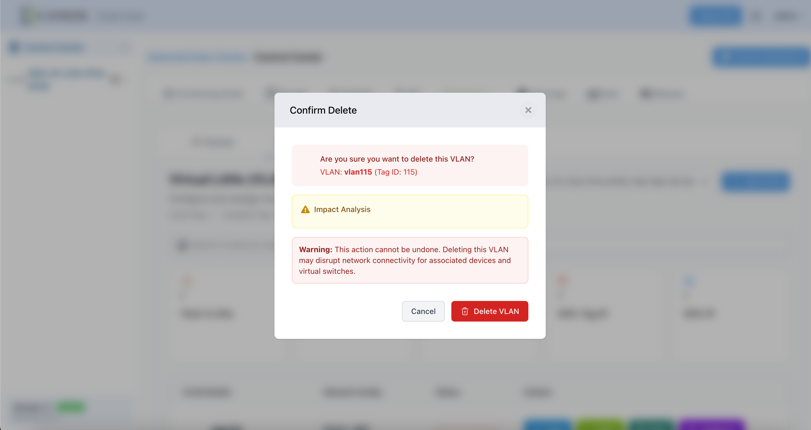

Stats Management Operations
~~~~~~~~~~~~~~~~~~~~~~~~~~~

Stats Navigation Structure
^^^^^^^^^^^^^^^^^^^^^^^^^^

- **Stats Tab Selection**: Access statistics and monitoring by selecting the Stats tab from the main navigation
- **Live and Recommendations Tabs**: Toggle between real-time monitoring and system recommendations
- **Node & VM Stats Overview**: Comprehensive monitoring of both physical nodes and virtual machines
- **Real-time Data Updates**: Live statistics with automatic refresh capabilities

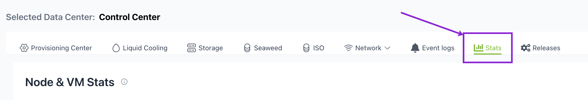

Live Statistics Monitoring
^^^^^^^^^^^^^^^^^^^^^^^^^^

- **Node Performance Metrics**: Real-time monitoring of CPU percentage, memory usage, power consumption, and uptime
- **VM Performance Tracking**: Individual virtual machine CPU usage, memory consumption, and operational status
- **Status Indicators**: Visual status indicators showing NORMAL, Running, or Stopped states
- **Multi-Node Support**: Monitor multiple nodes simultaneously with consolidated view
- **Resource Utilization**: Track resource allocation and usage patterns across the infrastructure

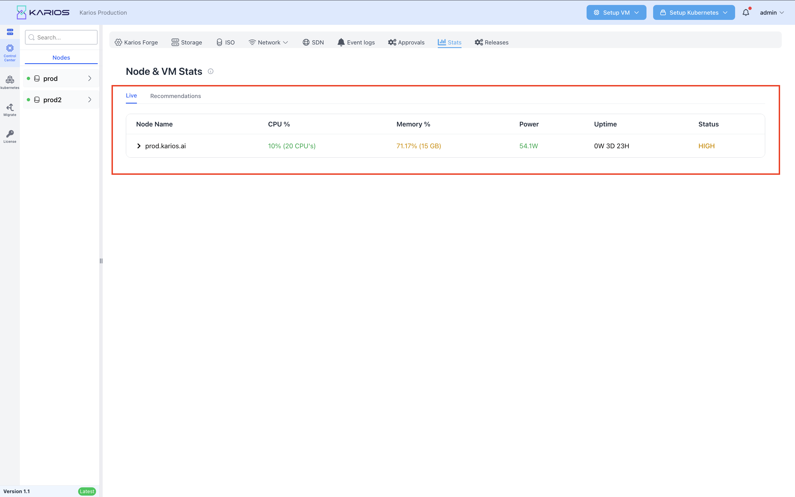

Node Statistics Display
^^^^^^^^^^^^^^^^^^^^^^^

- **Node Name**: Display of node identifiers and hostnames
- **CPU Usage**: Real-time CPU utilization percentage with core count information
- **Memory Usage**: Memory consumption percentage with total available memory in GB
- **Power Consumption**: Current power usage in watts with power status indicators
- **Uptime Information**: Node uptime tracking with days, hours, and minutes format
- **Status Monitoring**: Overall node health status with color-coded indicators

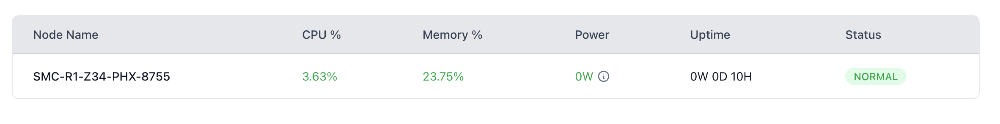

Virtual Machine Statistics
^^^^^^^^^^^^^^^^^^^^^^^^^^

- **VM Name**: Individual virtual machine identification and naming
- **CPU Usage**: Per-VM CPU utilization with allocated CPU core information
- **Memory Usage**: VM memory consumption with allocated memory in GB
- **VM Status**: Current operational status (Running, Stopped) with color coding
- **Uptime Tracking**: Individual VM uptime monitoring with precise time formatting
- **Status Health**: VM health status indicators with NORMAL operational states

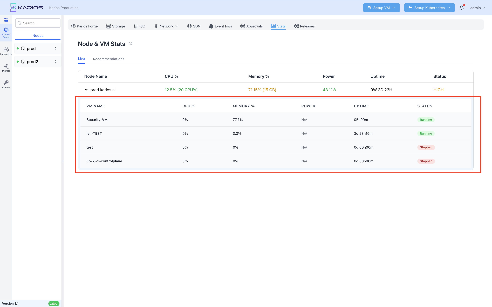

Recommendations System
^^^^^^^^^^^^^^^^^^^^^^

- **Time Range Selection**: Configurable time range dropdown for recommendation analysis (1 Week default)
- **Apply Button**: Apply selected time range for recommendation generation
- **Expandable Recommendations**: Click on any node row to expand detailed VM recommendations
- **Resource Optimization**: Intelligent recommendations for resource allocation and scaling
- **Performance Insights**: Detailed analysis and suggestions for infrastructure optimization

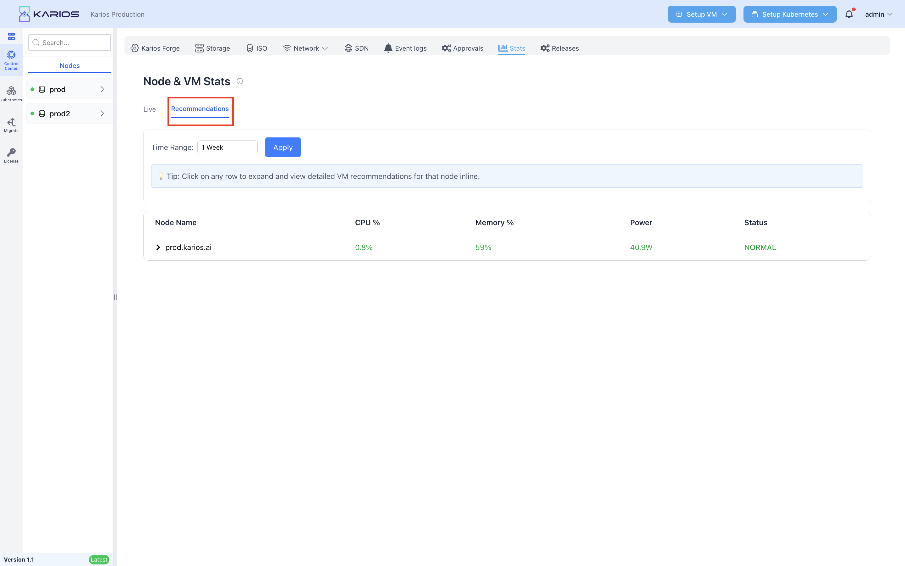

Recommendation Details
^^^^^^^^^^^^^^^^^^^^^^

- **VM-Level Recommendations**: Individual virtual machine optimization suggestions
- **CPU Recommendations**: CPU scaling recommendations with specific core adjustments
- **Memory Recommendations**: Memory optimization suggestions with GB-level adjustments
- **Action Suggestions**: Specific actions like "scale-down" for underutilized resources
- **Justification**: Detailed explanations for each recommendation with reasoning
- **Resource Efficiency**: Recommendations to free up capacity and optimize resource usage

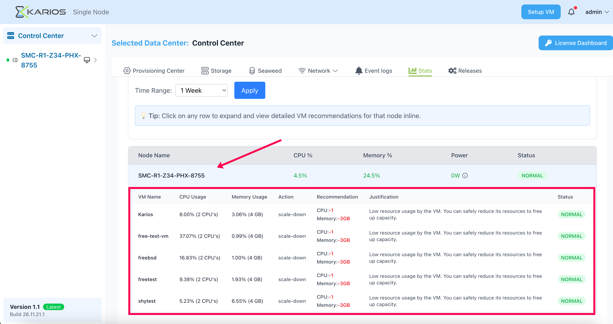

Statistics Table Features
^^^^^^^^^^^^^^^^^^^^^^^^^^

- **Sortable Columns**: Sort by node name, CPU usage, memory usage, power, uptime, and status
- **Color-Coded Status**: Visual status indicators for quick health assessment
- **Expandable Rows**: Click to expand nodes and view detailed VM statistics
- **Real-time Updates**: Automatic refresh of statistics data
- **Multi-Level Monitoring**: Both node-level and VM-level statistics in unified view

Performance Monitoring Capabilities
^^^^^^^^^^^^^^^^^^^^^^^^^^^^^^^^^^^

- **Resource Utilization Tracking**: Monitor CPU, memory, and power consumption patterns
- **Capacity Planning**: Resource usage insights for infrastructure planning
- **Health Monitoring**: Continuous monitoring of system health and operational status
- **Optimization Insights**: Data-driven recommendations for performance improvements

System Releases Operations
~~~~~~~~~~~~~~~~~~~~~~~~~~

Releases Navigation Structure
^^^^^^^^^^^^^^^^^^^^^^^^^^^^^^

- **Releases Tab Selection**: Access system releases and updates by selecting the Releases tab from the main navigation
- **Four Main Sections**: Navigate between Versions, Updates, History, and Install Jobs tabs
- **Host Management**: Filter and search functionality for managing multiple hosts and nodes
- **Remote Server Integration**: Fetch updates from remote servers with timestamp tracking

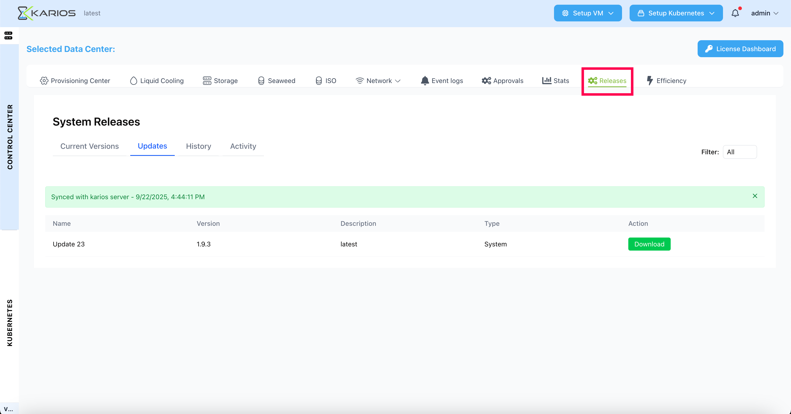

Versions Tab
^^^^^^^^^^^^

Click on versions tab and select any node to view the update versions.

- **Host Listing**: Display all available hosts with expandable rows for detailed version information
- **Version Count Indicators**: Show number of available versions per host with numeric badges
- **Search and Filter**: Filter by Host Name, Update Type (All/Core/OS), and Version numbers
- **Expandable Interface**: Click on host names to expand and view detailed version information
- **Version Details**: View specific update types (CORE, OS) with version numbers and request timestamps

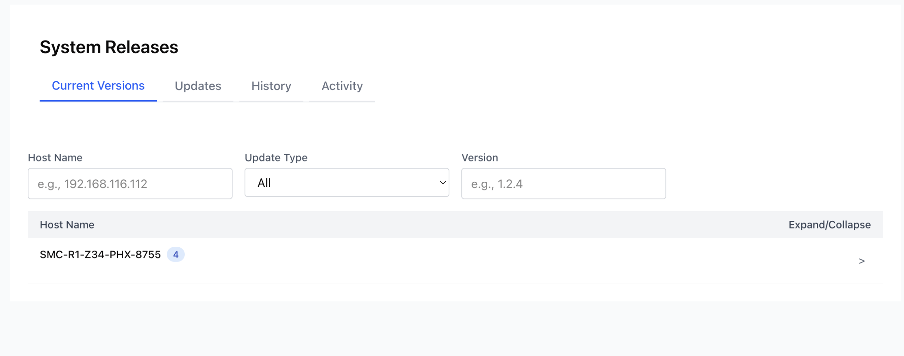

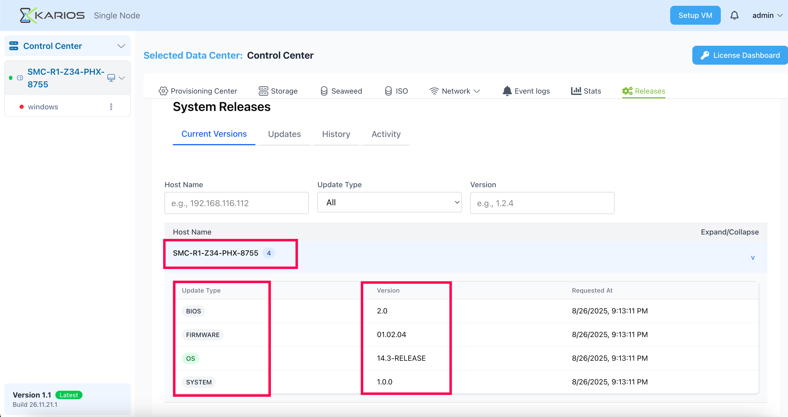

Updates Tab
^^^^^^^^^^^

**Available Updates:** Click on the updates tab to display all available system updates with comprehensive details

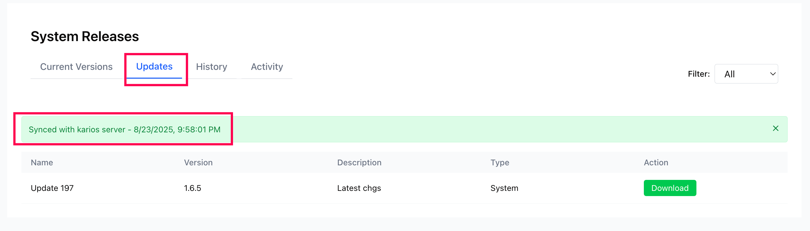

- **Remote Server Sync**: Shows "Fetched from remote server" status with last fetch timestamp
- **Update Information**: Display update name, version, description, type, and available actions
- **Download and Install**: Direct download and install buttons for each available update

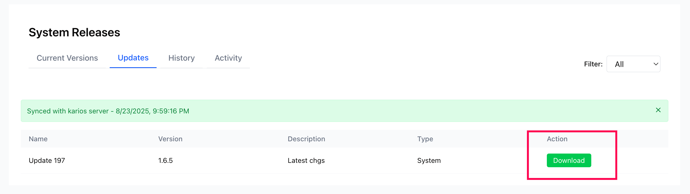

Once you click the Download button, the update package will be downloaded to the system. When the download is complete, the Install button will become active, allowing you to proceed with the installation. Click on "install" button to open the install update dialog.

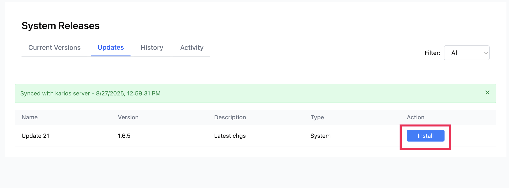

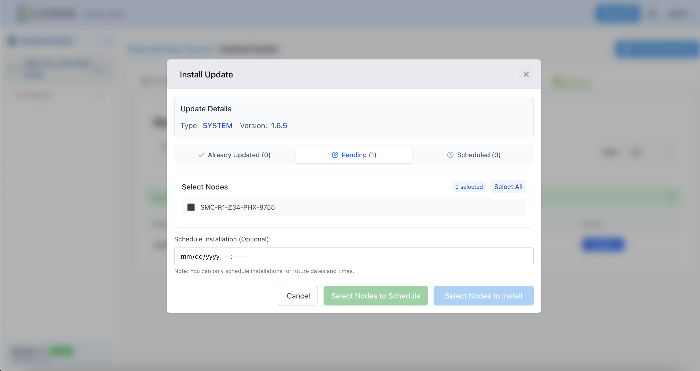

- **Update Categories**: Filter updates by type (Core, OS, Security) and priority levels
- **Action Controls**: Install, Download, and Logs buttons for update management

Update Installation Process
^^^^^^^^^^^^^^^^^^^^^^^^^^^

**Install Update Dialog:** Comprehensive installation interface with multiple configuration options
- **Update Details**: Display update type (CORE, OS, UI) and version information
- **Node Selection**: Multi-select interface for choosing target nodes for installation
- **Installation Status**: Track Already Updated, Pending, and Scheduled installation states
- **Schedule Management**: Optional scheduling with date/time picker for future installations

**Steps to install an update:**

1. Select a node from the available list.
2. Choose between immediate installation or scheduled deployment
3. Click on "install now" for immediate installation.

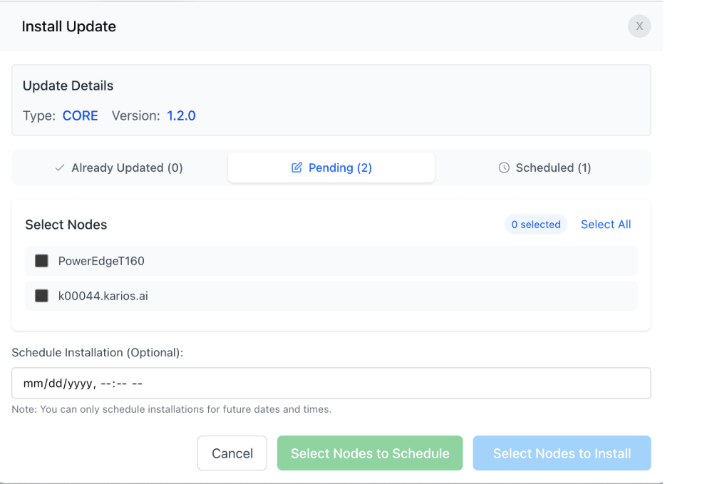

.. note::
   We have two update install options i.e., "install now" for instant installation and "set schedule time" for later installation.

Installation Scheduling
^^^^^^^^^^^^^^^^^^^^^^^

- **Schedule Options**: Set specific date and time for update installation
- **Future Date Validation**: Ensure scheduled installations are set for future dates and times
- **Schedule Management**: Click on "Set Schedule Time" for scheduled update deployment.

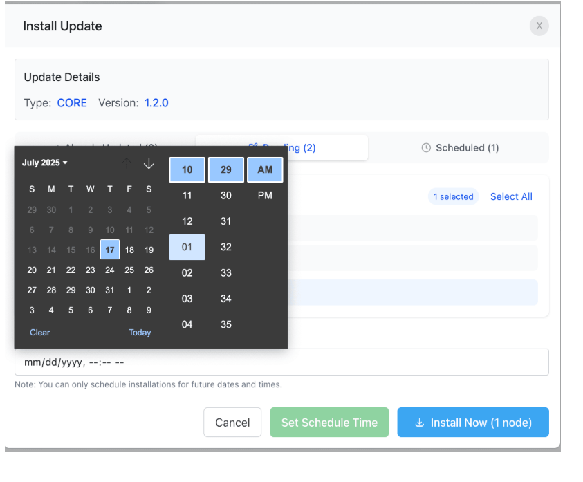

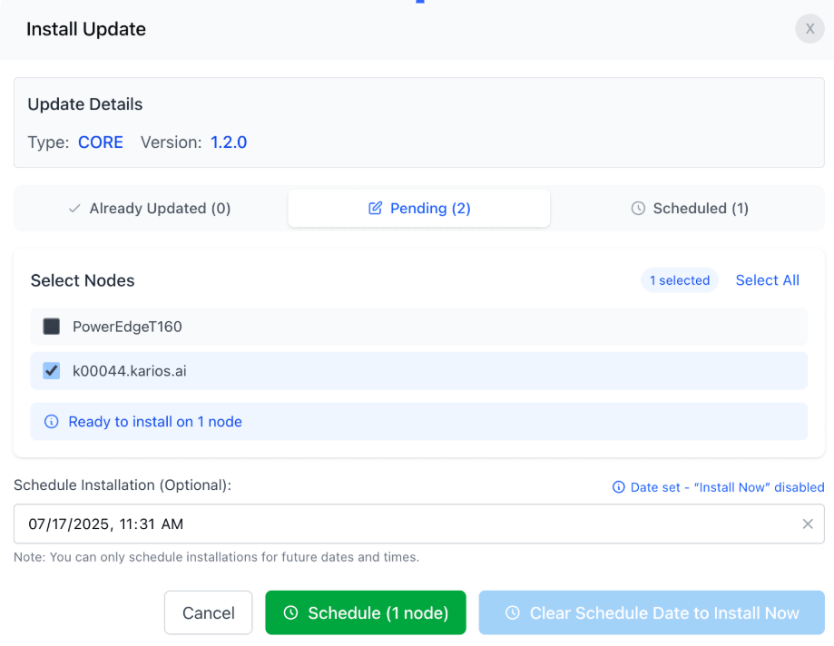

- **Clear Schedule**: Option to clear scheduled time and install immediately
- **Multi-Node Support**: Schedule installations across multiple selected nodes

History Tab
^^^^^^^^^^^

Click on "history" tab to view

- **Update History**: Complete historical record of all system updates and installations
- **Filter Options**: Filter by Update Type, Host Name, Action, and Status
- **Detailed Records**: View update type, host name, action, version, initiated by, status, and request timestamp
- **Status Tracking**: Track SUCCESS, ERROR, and other status indicators for historical updates
- **User Attribution**: Show which user initiated each update or installation
- **Chronological View**: Updates displayed in chronological order with timestamps

.. figure:: _static/images/control_center/releases_and_updates/update_history.png
   :alt: Update History
   :width: 600

Install Jobs Tab
^^^^^^^^^^^^^^^^

Click on the "install jobs" tab

- **Job Management**: Monitor and manage all installation jobs and their current status
- **Job Filtering**: Filter by Update Type, Status, Requested By, and Scheduled status
- **Job Details**: Display Job ID, Update Type, Version, Requested By, Scheduled status, Nodes count, Success/Failure counts, and overall Status
- **Status Monitoring**: Track PENDING, FAILED, SUCCESS, and other job statuses
- **Scheduled Jobs**: Identify and manage scheduled installations with "Yes/No" indicators
- **Job Statistics**: View success and failure counts for each installation job

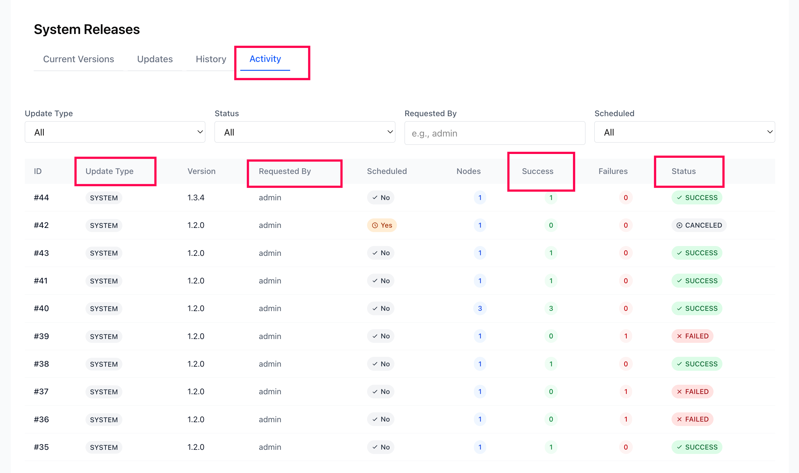

Installation Monitoring
^^^^^^^^^^^^^^^^^^^^^^^

- **Install Summary**: Comprehensive installation summary with timestamp, Job ID, and node count
- **Status Tracking**: Real-time status updates (FAILED, SUCCESS, PENDING, IN PROGRESS)
- **Success and Failure Counts**: Track installation success and failure statistics

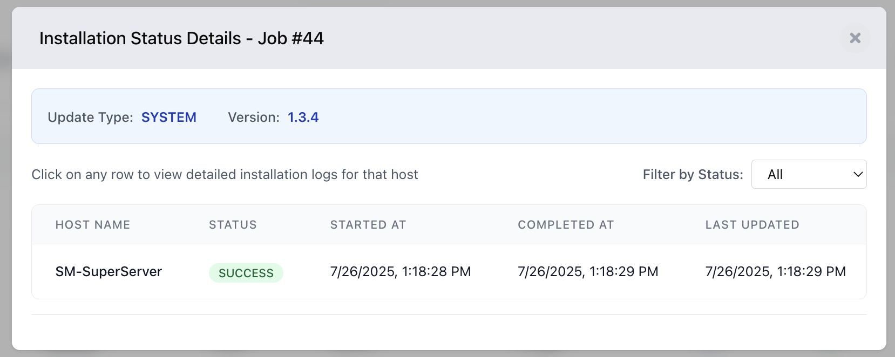

- **Detailed Status View**: Click on installation jobs to view detailed status information
- **Host-Level Details**: View individual host installation status with timestamps
- **Error Logging**: Access detailed installation logs for troubleshooting failed installations

Installation Logs and Details
^^^^^^^^^^^^^^^^^^^^^^^^^^^^^
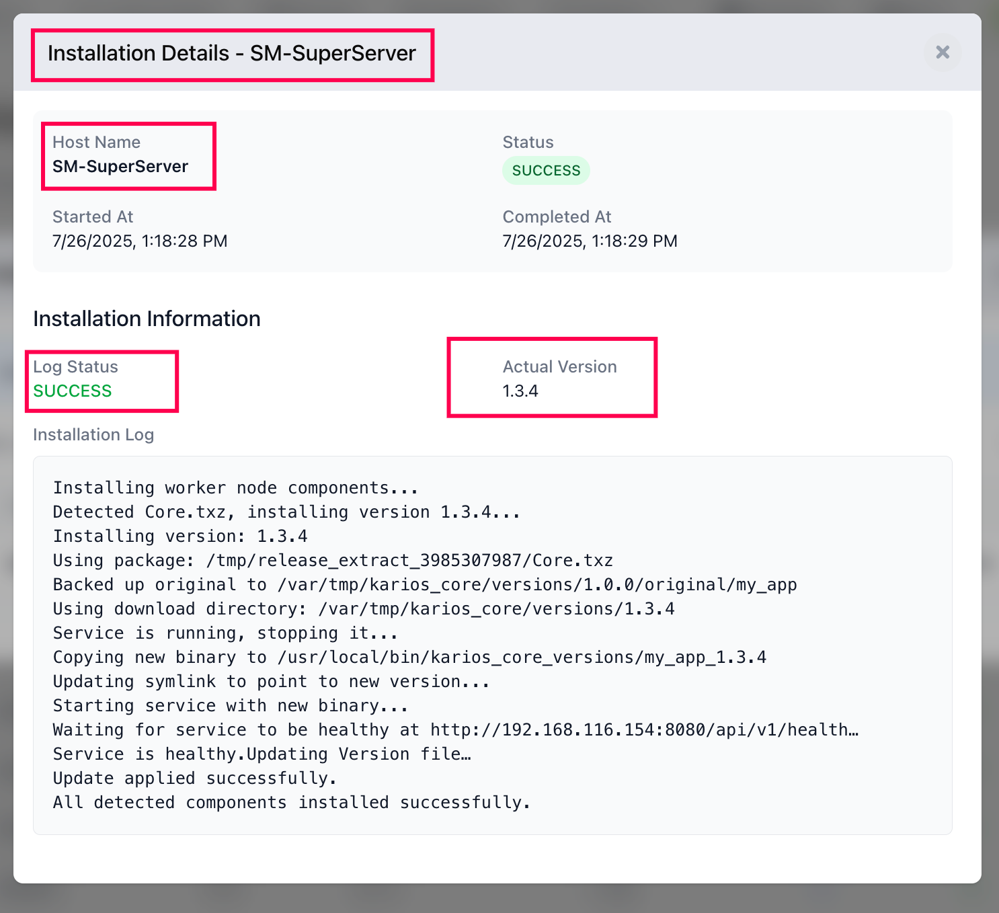

- **Detailed Log Access**: View comprehensive installation logs for each host
- **Error Diagnosis**: Detailed error messages and failure analysis
- **Installation Timeline**: Track installation start time, completion time, and duration
- **Log Status**: Monitor log status (ERROR, SUCCESS) for each installation attempt
- **Rollback Information**: View rollback procedures and restoration details when installations fail
- **Filter by Status**: Filter installation details by All, Success, Failed, Pending, and In Progress

Advanced Features
^^^^^^^^^^^^^^^^^

- **Multi-Node Management**: Support for managing updates across multiple nodes simultaneously
- **Remote Update Fetching**: Automatic fetching of updates from remote servers with status indicators
- **Installation Rollback**: Automatic rollback capabilities for failed installations
- **Comprehensive Logging**: Detailed logging for all installation activities and system changes
- **Status Filtering**: Advanced filtering options for monitoring specific installation states

For detailed information regarding system release management, advanced update procedures, rollback processes, and comprehensive release deployment strategies, please refer to Section 9: System Release Management.

Node Level Management
---------------------

Navigating to Node Level
~~~~~~~~~~~~~~~~~~~~~~~~
**Accessing Worker Node Components:** 
To access worker node level management, administrators must first navigate to the specific server they want to manage. This provides access to individual server components and detailed node-specific operations.

**Navigation Process:**

1. **Server Selection:** From the datacenter hierarchy in the left sidebar, select the specific worker node you want to manage

2. **Component Access:** Once a worker node is selected, the interface displays “Selected Server” with the server's name(e.g., k00000)

3. **Component Tabs:** The worker node interface provides access to specialized component tabs designed for individual server management

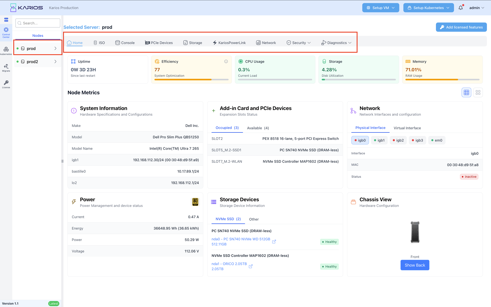

**Node Component Overview:** The worker node interface provides access to the following key components:

- **Home:** Server dashboard with performance metrics and system information

- **ISO:** Node-specific ISO image management and mounting

- **Storage:** Local storage management and disk health monitoring

- **Monitoring:** Server-specific performance monitoring and analytics

- **Power:** Power consumption monitoring and energy efficiency metrics

- **Network:** Network interface management and connectivity status

- **Firewall:** Node-level firewall configuration and security policies

- **Security:** Server-specific security settings and compliance monitoring

- **Logs:** System logs and event monitoring for the individual server

**Interface Context:** When working at the worker node level, all operations and configurations apply specifically to the selected server, providing granular control over individual infrastructure components.

Home Dashboard
~~~~~~~~~~~~~~

**Worker Node Home Overview:** The Home tab serves as the primary dashboard for individual worker node management, providing comprehensive real-time metrics and system information essential for server administration and monitoring.

**Performance Metrics Dashboard:** The Home dashboard displays five key performance indicators in an intuitive card-based layout:

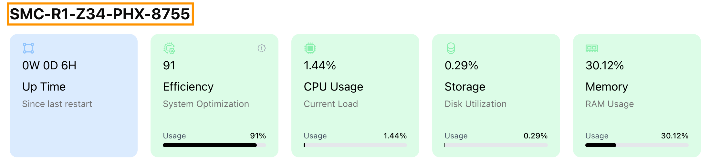

**System Uptime:**

- **Display Format:** Shows uptime in weeks, days, and hours format (e.g., “0W 0D 18H”)
- **Uptime Tracking:** Continuous monitoring of system availability since last restart
- **Reliability Indicator:** Provides quick assessment of system stability and availability
- **Color-coded Status:** Visual indicators for uptime duration and system health

**Efficiency Rating:**

- **Efficiency Score:** Displays overall system efficiency rating (e.g., “91”)
- **Performance Optimization:** Indicates how efficiently the server is utilizing resources
- **Energy Efficiency:** Reflects power consumption relative to performance output
- **Operational Insights:** Provides guidance for optimization opportunities

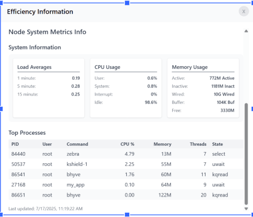

**CPU Utilization:**

- **Real-time CPU Usage:** Current CPU utilization percentage (e.g., “3.46%”)
- **Processing Load:** Indicates current computational workload on the server
- **Performance Monitoring:** Continuous tracking of CPU performance metrics
- **Capacity Planning:** Helps assess CPU capacity and usage patterns

**Storage Utilization:**

- **Storage Usage:** Current storage utilization percentage (e.g., “1.05%”)
- **Disk Capacity:** Indicates available storage space and usage trends
- **Storage Health:** Monitors storage system performance and availability
- **Capacity Management:** Assists with storage planning and optimization

**Memory Utilization:**

- **Memory Usage:** Current memory utilization percentage (e.g., “22.37%”)
- **RAM Consumption:** Indicates current memory usage and availability
- **Memory Performance:** Tracks memory allocation and usage patterns
- **Resource Optimization:** Helps optimize memory allocation for better performance

System  Information
^^^^^^^^^^^^^^^^^^^

**Hardware Information Display:** The System Information section provides comprehensive details about the server's hardware configuration and specifications.

**System Specifications:**

- **Make:** Hardware manufacturer information (e.g., “Supermicro”)
- **Model:** Server model designation (e.g., “Super Server”)
- **Network Interface:** Primary network interface details with IP address and MAC address

  - **Interface Name:** Network interface identifier (e.g., “bnxt0”)
  - **IP Address:** Server's network IP address (e.g., “192.168.116.111”)
  - **MAC Address:** Hardware MAC address (e.g., “7c:c2:55:e8:77:8c”)

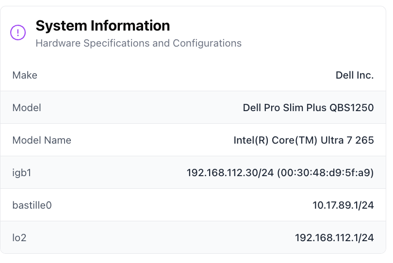

**System Identity:**

- **Server Identification:** Complete server identification including network configuration
- **Hardware Fingerprint:** Unique hardware identifiers for system tracking
- **Network Configuration:** Network interface configuration and connectivity details

Add-in Card and PCIe Devices
^^^^^^^^^^^^^^^^^^^^^^^^^^^^

**PCIe Expansion Monitoring:** The Add-in Card and PCIe Devices section provides real-time monitoring of expansion card slots and their current status.

**PCIe Slot Information:**

- **CPU SLOT1 PCI-E 4.0 X16:** PCIe slot specification with availability status
- **CPU SLOT2 PCI-E 4.0 X8:** Secondary PCIe slot with current status
- **CPU SLOT3 PCI-E 4.0 X16:** Third PCIe slot monitoring
- **CPU SLOT4 PCI-E 4.0 X8:** Fourth PCIe slot status

**Slot Status Monitoring:**

- **Available:** Indicates slots available for expansion cards
- **Occupied:** Shows slots currently in use with installed devices
- **Slot Specifications:** Detailed PCIe lane configuration and capabilities
- **Expansion Planning:** Assists with hardware expansion planning and compatibility

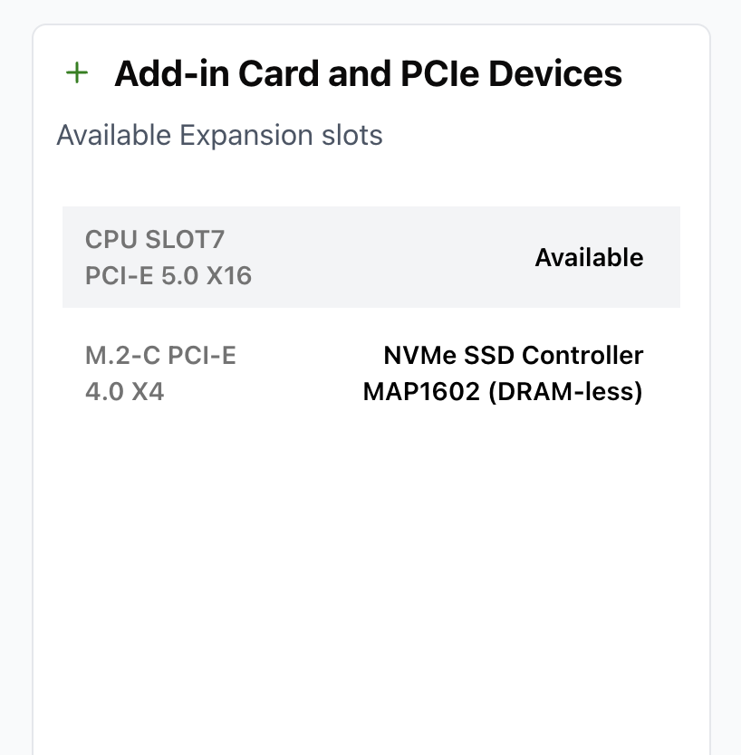

Power Monitoring
^^^^^^^^^^^^^^^^

**Real-time Power Metrics:** The Power section provides comprehensive power consumption monitoring and energy efficiency tracking.

**Power Consumption Metrics:**

- **Current:** Real-time current draw measurement (e.g., “0.34 A”)
- **Energy:** Cumulative energy consumption tracking (e.g., “15250.86 Wh (15.25 kWh)”)
- **Power:** Instantaneous power consumption (e.g., “38.53 W”)
- **Voltage:** Current voltage levels (e.g., “114.05 V”)

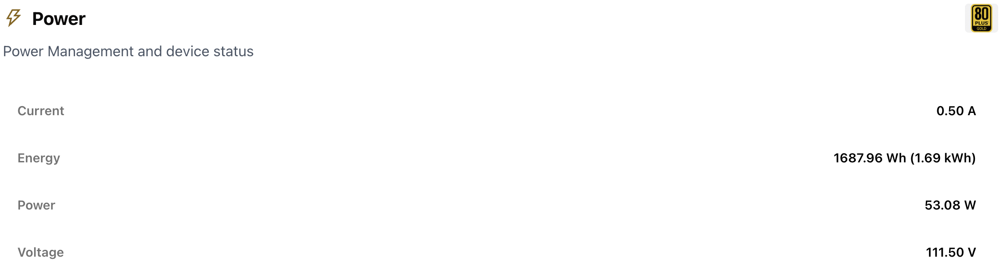

**Power Management Features:**

- **Energy Efficiency:** Track power usage effectiveness and optimization opportunities
- **Power Trends:** Historical power consumption patterns and analysis
- **Cost Monitoring:** Energy cost tracking and budgeting assistance
- **Environmental Impact:** Carbon footprint monitoring and sustainability metrics

Storage System Overview
^^^^^^^^^^^^^^^^^^^^^^^

**Storage Health Monitoring:** The Storage section provides comprehensive monitoring of all storage controllers and attached storage devices.

**NVMe SSD Controllers:**

- **Controller Model:** NVMe SSD controller specifications (e.g., “NVMe SSD Controller MAP1602 (DRAM-less)”)
- **Disk Information:** Individual disk identification and capacity (e.g., “nda0 - ORICO 1.02TB”)
- **Health Status:** Real-time health monitoring with status indicators (e.g., “Healthy”)
- **Multiple Disk Support:** Monitoring of multiple attached storage devices

**Other Storage Controllers:**

- **SATA Controllers:** Traditional SATA controller monitoring (e.g., “Raptor Lake SATA AHCI Controller”)
- **Storage Devices:** Individual storage device monitoring (e.g., “sda - Sample Disk (1TB)”)
- **Health Monitoring:** Comprehensive health status for all storage devices
- **Performance Tracking:** Storage performance metrics and optimization insights

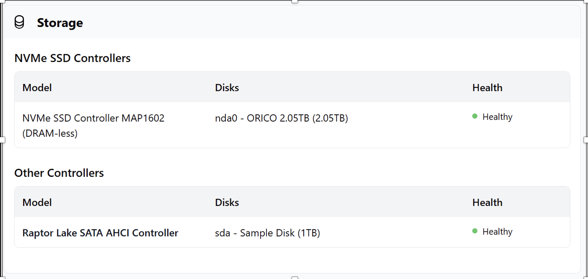

Network Interface Management
^^^^^^^^^^^^^^^^^^^^^^^^^^^^

**Physical Network Interfaces:** The Network section provides detailed information about all network interfaces configured on the server.

**Network Interface Information:**

- **Interface Model:** Network interface model identification (e.g., “bnxt0”, “bnxt1”)
- **MAC Address:** Hardware MAC address for each interface
- **IP Configuration:** Current IP address assignments and network configuration
- **Interface Status:** Current operational status of each network interface

**Virtual Network Interfaces:** The system also displays virtual network interfaces created for virtualization and network segmentation.

**Virtual Interface Details:**

- **Virtual Interface Names:** Virtual interface identifiers (e.g., “vm-default”, “vm-vlan115-sw”)
- **MAC Address Assignment:** Virtual MAC addresses for each interface
- **Network Segmentation:** Virtual network configuration for traffic isolation

**VLAN Configuration:** VLAN-specific virtual interfaces and their configurations

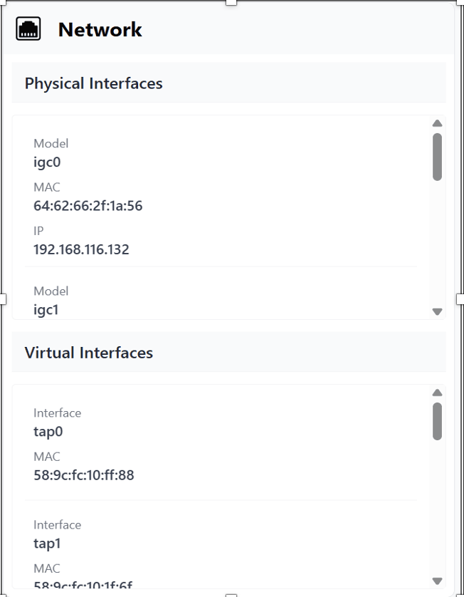

Chassis View
^^^^^^^^^^^^
**Physical Server Visualization:** The Chassis View provides a visual representation of the physical server hardware, helping administrators understand the physical layout and configuration.

**Chassis Display Features:**

- **3D Server Visualization:** Three-dimensional representation of the server chassis
- **Front Panel View:** Default front panel view of the server hardware
- **Hardware Identification:** Visual identification of physical server components
- **Physical Layout:** Understanding of physical component placement and accessibility

**Chassis Navigation:**

- **View Options:** Toggle between different chassis views (Front/Back)
- **Show Back Button:** Option to view the rear panel of the server
- **Hardware Mapping:** Visual correlation between logical and physical components
- **Physical Maintenance:** Assistance with physical hardware maintenance and identification

**Chassis View Benefits:**

- **Hardware Identification:** Quickly identify physical components and their locations
- **Maintenance Planning:** Plan physical maintenance and hardware replacement
- **Visual Reference:** Provide visual context for hardware troubleshooting
- **Documentation:** Visual documentation of server configuration and layout

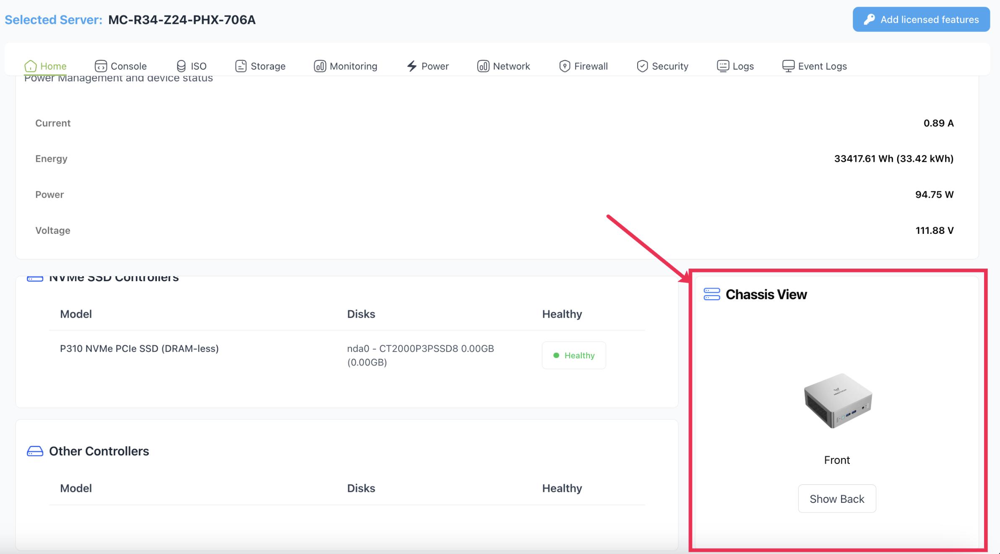

Node Console Management
~~~~~~~~~~~~~~~~~~~~~~~

Console Overview
^^^^^^^^^^^^^^^^

The Console tab provides direct access to the FreeBSD command-line interface for individual worker nodes, enabling administrators to perform advanced system administration tasks, troubleshooting, and direct system configuration through a web-based terminal interface.

**Console Interface Features:**

- **Web-based Terminal**: Browser-based access to the FreeBSD command line
- **Direct System Access**: Full command-line access to the underlying FreeBSD system
- **Real-time Interaction**: Live terminal session with immediate command execution
- **Administrative Control**: Complete system administration capabilities through CLI
- **Secure Access**: Password-protected console access with credential validation

Console Access and Authentication
^^^^^^^^^^^^^^^^^^^^^^^^^^^^^^^^^

Accessing Node Console
""""""""""""""""""""""

**Console Navigation:**

1. **Node Selection**: Select the target worker node from the datacenter hierarchy
2. **Console Tab**: Click on the "Console" tab in the node management interface
3. **Console Interface**: The web-based console interface loads automatically
4. **Authentication Prompt**: System prompts for console access credentials

**Authentication Requirements:**

- **Console Access**: Requires valid system credentials for security
- **User Authentication**: Password-based authentication for console access
- **Session Management**: Secure session handling for terminal access
- **Credential Validation**: Real-time credential verification

Console Authentication Interface
""""""""""""""""""""""""""""""""

**Credentials Dialog:**

The console authentication interface provides secure access to the node's command-line interface:

**Authentication Components:**

- **Credentials Header**: "Credentials" dialog title
- **Password Field**: Secure password input field for user authentication
- **Send Credentials Button**: Submit authentication credentials to establish console session
- **Security Prompt**: Password-protected access to prevent unauthorized console access

**Authentication Process:**

1. **Access Console**: Navigate to the Console tab on the selected node
2. **Credentials Prompt**: System displays authentication dialog
3. **Enter Password**: Input the valid system password in the password field (Default password is "karios")
4. **Submit Credentials**: Click "Send credentials" to authenticate and establish console session
5. **Console Access**: Upon successful authentication, gain full console access

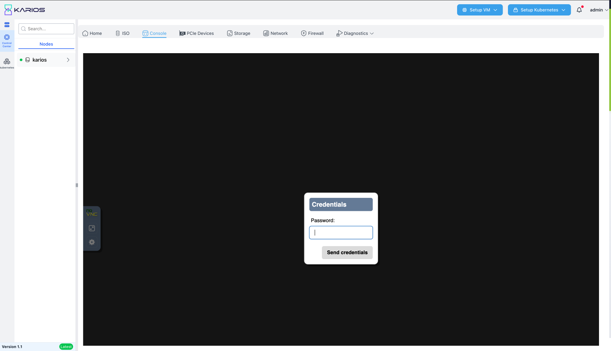

   Figure: Node Console Authentication Prompt

Console Operations and Commands
^^^^^^^^^^^^^^^^^^^^^^^^^^^^^^^

FreeBSD Command Line Access
"""""""""""""""""""""""""""

**System Administration Commands:**

Once authenticated, administrators have full access to FreeBSD system commands:

**System Monitoring:**

.. code-block:: bash

   # System status and resource monitoring
   top                    # Display running processes and system usage
   ps aux                 # List all running processes
   df -h                  # Display filesystem disk usage
   free -h                # Show memory usage statistics
   uptime                 # Display system uptime and load average

**Service Management:**

.. code-block:: bash

   # FreeBSD service management
   service -e             # List enabled services
   service <name> status  # Check service status
   service <name> start   # Start a service
   service <name> stop    # Stop a service
   service <name> restart # Restart a service

**Network Configuration:**

.. code-block:: bash

   # Network interface and connectivity
   ifconfig              # Display network interface configuration
   netstat -rn           # Show routing table
   ping <host>           # Test network connectivity
   sockstat -l           # Display listening sockets

**Log Analysis:**

.. code-block:: bash

   # System log examination
   tail -f /var/log/messages    # Monitor system messages in real-time
   grep "error" /var/log/messages # Search for errors in system logs
   dmesg                        # Display kernel boot messages
   logger "test message"        # Add custom message to system log

Advanced Console Operations
"""""""""""""""""""""""""""

**File System Operations:**

.. code-block:: bash

   # File and directory management
   ls -la                # List files with detailed information
   cd /path/to/directory # Change directory
   pwd                   # Display current directory
   mkdir directory_name  # Create new directory
   rm -rf directory      # Remove directory and contents

**System Configuration:**

.. code-block:: bash

   # System configuration files
   cat /etc/rc.conf      # View system startup configuration
   sysctl -a             # Display all system variables
   mount                 # Show mounted filesystems
   zpool status          # Check ZFS pool status (if applicable)

**Package Management:**

.. code-block:: bash

   # FreeBSD package management
   pkg info              # List installed packages
   pkg search <package>  # Search for packages
   pkg install <package> # Install new package
   pkg update            # Update package repository

**Process Management:**

.. code-block:: bash

   # Process control and monitoring
   killall <process>     # Kill processes by name
   kill -9 <pid>         # Force kill process by PID
   jobs                  # Display active jobs
   nohup <command> &     # Run command in background

Console Security and Best Practices
^^^^^^^^^^^^^^^^^^^^^^^^^^^^^^^^^^^

Security Considerations
"""""""""""""""""""""""

**Console Access Security:**

- **Authentication Required**: All console access requires valid system credentials
- **Session Management**: Secure handling of console sessions and authentication
- **Command Logging**: System logs record console activity for audit purposes
- **Access Control**: Restrict console access to authorized administrators only
- **Session Timeout**: Implement appropriate session timeout policies

**Safe Console Practices:**

- **Command Verification**: Verify commands before execution, especially destructive operations
- **Backup Before Changes**: Create backups before making significant system modifications
- **Documentation**: Document important configuration changes and commands
- **Testing Environment**: Test critical changes in non-production environments first
- **Change Management**: Follow established change management procedures

Console Support and Documentation
^^^^^^^^^^^^^^^^^^^^^^^^^^^^^^^^^

Getting Help
""""""""""""

**Console Documentation:**

- **FreeBSD Handbook**: Reference comprehensive FreeBSD documentation for command usage
- **Man Pages**: Use man pages within the console for detailed command documentation
- **System Help**: Access built-in help functions for commands and utilities
- **Community Resources**: Leverage FreeBSD community resources and forums

**Support Resources:**

- **Platform Documentation**: Refer to Karios platform documentation for integration guidance
- **Knowledge Base**: Access knowledge base articles for common console operations
- **Training Resources**: Utilize available training resources for FreeBSD administration

**Command Reference:**

.. code-block:: bash

   # Get help for any command
   man <command>         # Display manual page for command
   <command> --help      # Display command help (if available)
   which <command>       # Show path to command executable
   whereis <command>     # Locate command binary, source, and manual

ISO Management
~~~~~~~~~~~~~~

**ISO Operations:**

- **Download ISO:** Download ISO files using FQDN URL with appended ISO file path
- **Upload ISO:** Upload valid ISO files to the data center storage
- **RAW File Support:** Upload and manage RAW disk image files
- **File Selection:** Browse and select from available ISO and RAW files
- **Availability Tracking:** Real-time view of available ISO and RAW files

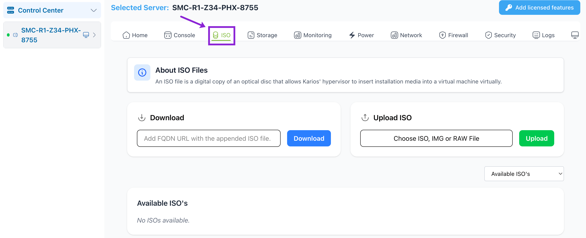

**ISO Management Features:**

- **Dual Upload Support:** Support for both ISO and RAW file formats
- **URL-based Downloads:** Download ISO files directly from FQDN URLs
- **File Browser Integration:** Integrated file selection interface
- **Availability Dropdown:** Dropdown menu displaying all available ISO and RAW files
- **Upload Status Monitoring:** Real-time upload progress and completion status
- **File Validation:** Automatic validation of uploaded ISO and RAW files

**ISO Management Interface:**

- **Download Section:** FQDN URL input field with download button for remote ISO retrieval

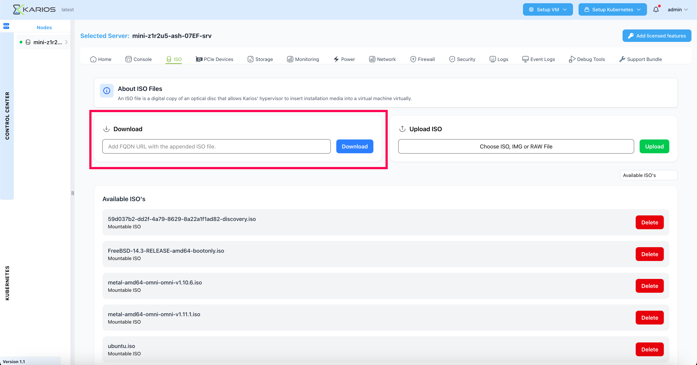

Please provide a valid FQDN url and click “Download”. The downloaded iso can be viewed in the Available ISOs section.

- **Upload Section:** File selection interface with upload button for local ISO/RAW files

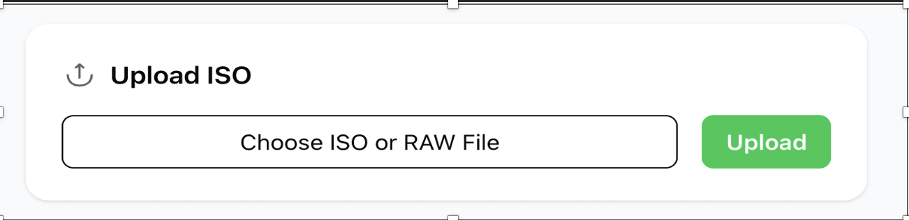

Please select the appropriate ISO/RAW files from your system and click “Upload”. The uploaded file will be in the available ISO/Cloud images section.

- **Available Files Dropdown:** Comprehensive list of all available ISO and RAW files

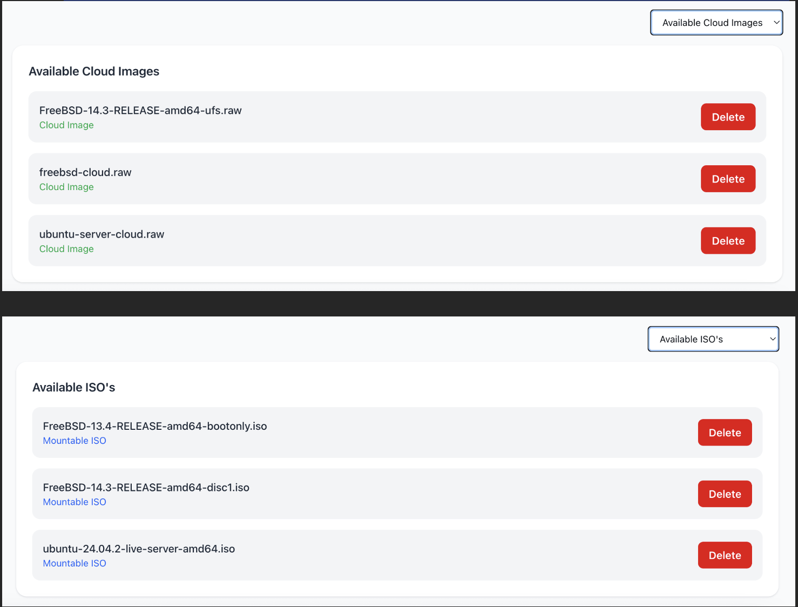

- **Status Indicators:** Visual indicators for file availability and upload status
- **File Management Controls:** Direct access to file operations and management functions

**Supported File Types:**

- **ISO Files:** Standard ISO 9660 disk image files
- **RAW Files:** Raw disk image files and virtual machine disk formats
- **Validation:** Automatic file format validation during upload process

Node Storage Management
~~~~~~~~~~~~~~~~~~~~~~~

**Storage Management Overview:** The Storage tab provides comprehensive ZFS storage management capabilities at the node level, enabling administrators to create and manage storage pools, datasets, and volumes directly on individual servers.

**ZFS (Zettabyte File System)** A next-generation file system and logical volume manager originally developed by Sun Microsystems for Solaris, now widely used on FreeBSD and other operating systems. ZFS combines traditional file system functionality with volume management, providing data integrity, compression, deduplication, snapshots, and RAID-like functionality in a single integrated solution.

**Storage Management Interface:** The Storage Management interface offers three primary functions accessible through the top action bar:

- **Create Pool:** Create new ZFS storage pools with configurable RAID levels
- **Create Datastore:** Create new datastores for virtual machine storage
- **Storage Pools Dropdown:** Select and manage existing storage pools

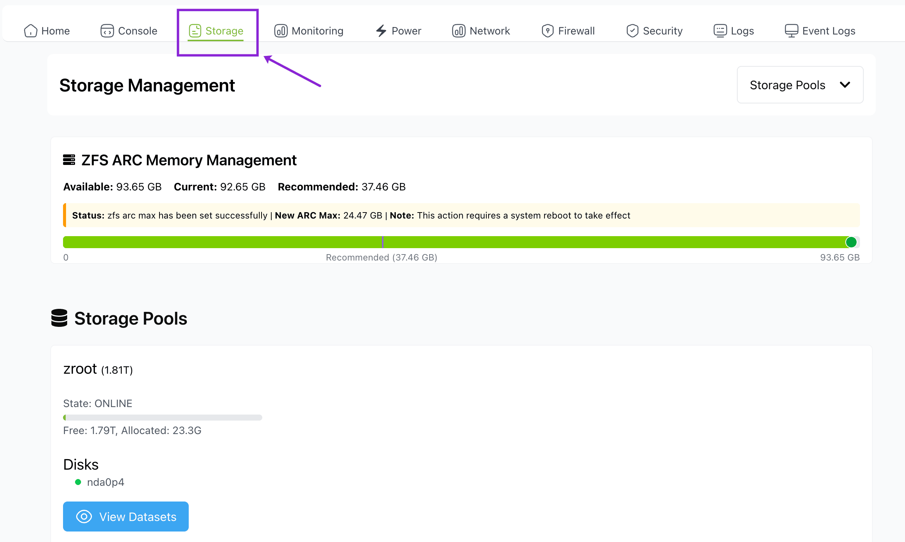

.. tip::

   **Pool (ZFS Pool/zpool)** The top-level storage container in ZFS that consists of one or more virtual devices (vdevs) made up of physical storage devices. A pool aggregates storage capacity and provides the foundation for all ZFS file systems, volumes, and datasets. Pools can be expanded by adding more vdevs and provide redundancy through various RAID-like configurations.

   **Dataset** A generic term in ZFS that refers to any of the following: file systems, volumes, clones, or snapshots. More commonly, it refers to a ZFS file system - a mountable unit of storage within a pool that can have its own properties, quotas, and snapshots. Datasets are hierarchical and can contain other datasets.

Storage Pool Management
^^^^^^^^^^^^^^^^^^^^^^^

**ZFS Storage Pool Overview:** The Storage Pools section displays comprehensive information about existing ZFS pools on the worker node:

**Pool Information Display:**

- **Pool Name:** ZFS pool identifier (e.g., “zroot”)
- **Pool Size:** Total pool capacity (e.g., “920G”)
- **Pool State:** Current operational status (e.g., “ONLINE”)
- **Storage Utilization:** Visual progress bar showing allocated vs. free space
- **Capacity Details:** Specific capacity information (e.g., “Free: 848G, Allocated: 71.6G”)

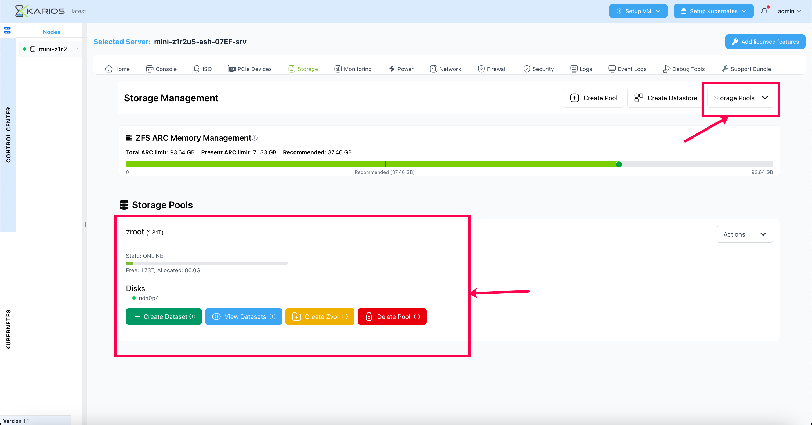

**Pool Health Monitoring:**

- **State Indicators:** Real-time pool health status (ONLINE)
- **Capacity Monitoring:** Visual and numerical capacity utilization tracking

**ZFS ARC Memory Management**

ARC (Adaptive Replacement Cache) is ZFS's in-memory caching system. It keeps frequently accessed data and metadata in RAM, improving read performance and reducing disk I/O. The **ARC Memory Management** section shows:
- **Available:** Free memory remaining on the node.
- **Current:** The ARC size currently allocated.
- **Recommended:** A suggested ARC allocation, based on system resources.

**Adjust ARC Memory:**

- **Modify the Current value** to the desired cache size.
   - You can increase it for more aggressive caching.
   - Or decrease it to free RAM for virtual machines and other workloads.
- To save the settings, click “apply” . Changes apply dynamically

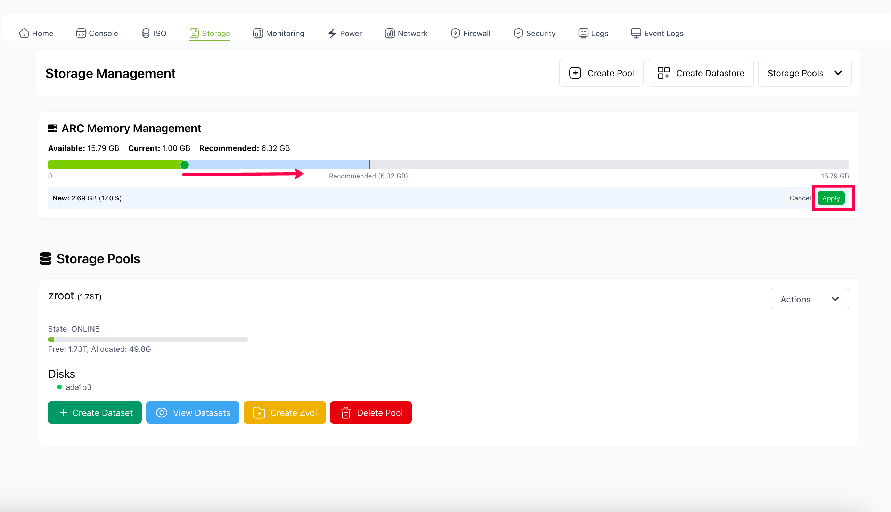

**Impact of Adjustments**

**Increasing ARC**

- **Pros:** Higher cache hit rates, improved read performance, reduced latency on repeated operations.
- **Cons:** Less memory left for VMs or applications; risk of memory pressure if set too high.

**Decreasing ARC**

- **Pros:** Frees RAM for VMs and services, preventing out-of-memory scenarios.
- **Cons:** Lower cache hit rates, more disk access, possible performance dips for repeated reads.

**Disk Management**

**Physical Disk Information:** The Disks section provides detailed information about physical storage devices within the pool:

**Disk Status Display:**

- **Disk Identifier:** Physical disk designation (e.g., “nda1p3”)
- **Disk State:** Current operational status (e.g., “ONLINE”)
- **Disk Performance:** Read, write, and checksum statistics

**Disk Health Monitoring:**

- **Performance Tracking:** Monitor disk I/O performance and statistics
- **Error Detection:** Track and report disk errors and failures
- **Health Status:** Visual indicators for disk health and reliability
- **Predictive Maintenance:** Early warning indicators for disk replacement

Storage Pool Operations
^^^^^^^^^^^^^^^^^^^^^^^
**Pool Management Actions:** The Storage Pool interface provides four primary operational buttons:

**Purpose**

Create a new ZFS dataset within an existing storage pool for file storage and organization.

**Functionality**

Datasets allow you to create structured storage areas inside a pool. They can be managed independently with properties such as quotas, compression, and optional encryption.

**Organization**

Datasets are organized hierarchically (like directories) under the pool name.

for example:
zroot/mydataset

**Usage**

Ideal for organizing file-based storage into logical, isolated datasets.

- **Steps to create a dataset:**

   - **Step 1:** Please click on "Create dataset" on any of the available pools (e.g., zroot)
   - **Step 2:** Please provide an appropriate dataset name(e.g., dataset-1)
   - **Step 3:** Enable encryption if required and provide a passphrase (min 8 characters)
   - **Step 4:** Click "Create"

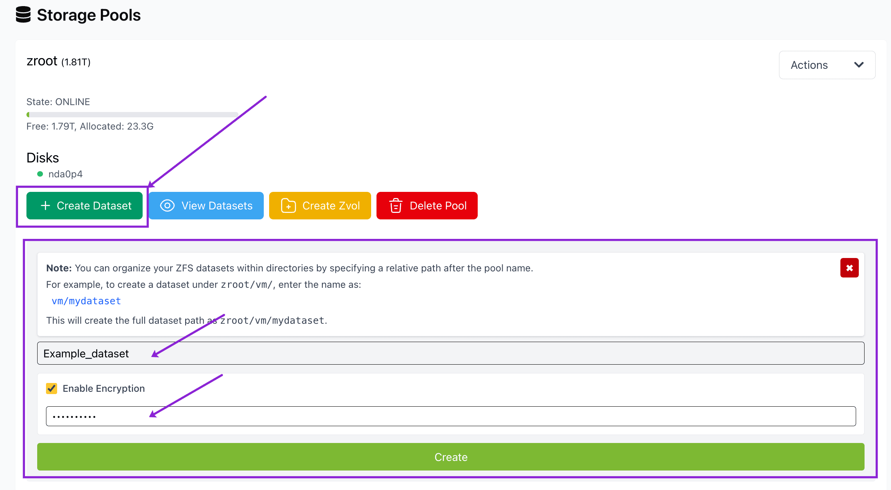

.. tip:: ZFS Encryption
   Provides data-at-rest protection by encrypting datasets at the storage level, ensuring that sensitive data remains unreadable even if physical drives are compromised, stolen, or improperly disposed of. This native encryption feature supports regulatory compliance requirements (HIPAA, PCI-DSS, GDPR) while maintaining high performance through hardware acceleration and granular control over different datasets based on security requirements.

**View Datasets:**

- **Purpose:** Display and manage existing datasets within the pool
- **Functionality:** Comprehensive dataset viewing and management
- **Dataset Information:** Usage statistics, compression settings, and configurations
- **Filter Options:** Filter datasets by type (All Types, Filesystem, Volume, Snapshot

Click on "View datasets" to display and manage your datasets within the pool.

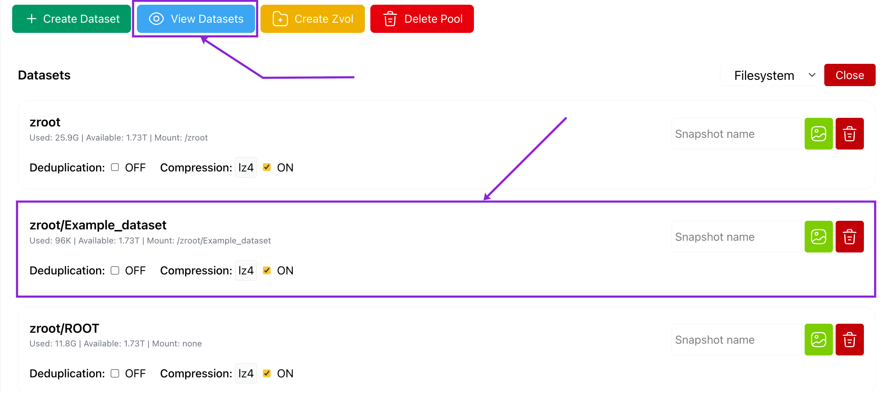

**Create Zvol:**

- **Purpose:** Create ZFS volumes for block storage

.. tip:: Block Level Storage
   Refers to a data storage method where data is stored and accessed in fixed-size blocks (typically 512 bytes to several KB), with each block having a unique address that the operating system can directly access.

- **Functionality:** Block-level storage for virtual machines and applications
- **Configuration:** Specify volume name and size with unit selection (GB, TB)
- **Usage:** Ideal for virtual machine storage and database applications

Provide an appropriate name for the zvol and select “Create Zvol”

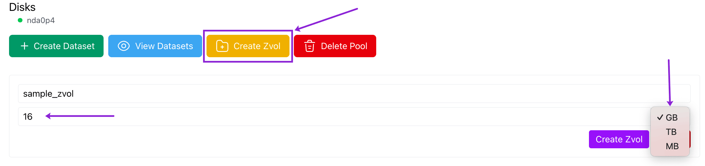

**Delete Pool:**

- **Purpose:** Remove storage pools from the system
- **Functionality:** Complete pool deletion with data removal
- **Safety:** Confirmation required before permanent deletion
- **Impact:** Permanent removal of all pool data and configurations

Please navigate to the appropriate pool and select "Delete Pool" 

**Warning:** Performing this action will delete all the datasets, volumes, snapshots and it cannot reversed. 

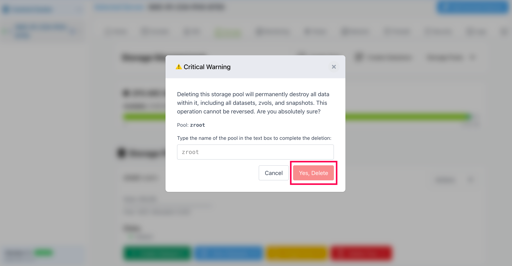

ZFS Pool Creation
"""""""""""""""""
**Create ZPool Interface:** The Create ZPool dialog provides comprehensive options for creating new ZFS storage pools:

**Pool Configuration Options:**

- **Pool Name:** Specify unique pool identifier
- **RAID Type Selection:** Choose from multiple RAID configurations:
  - **raidz1:** Single parity RAID-Z (similar to RAID 5)
  - **raidz2:** Double parity RAID-Z (similar to RAID 6)
  - **raidz3:** Triple parity RAID-Z (maximum fault tolerance)
  - **mirror:** Mirrored configuration (similar to RAID 1)
  - **striped:** Striped configuration (similar to RAID 0)

**Disk Selection:**

- **Available Disks:** Display of available physical disks for pool creation
- **Disk Status:** Real-time availability status of storage devices
- **Disk Validation:** Verification of disk suitability for pool creation
- **No Disks Available:** Clear indication when no disks are available for pool creation

**Steps to create a zpool:**

- **Step 1:** Provide an appropriate pool name
- **Step 2:** Select the desired RAID type and available disks based on the RAID type.
- **Step 3:** Click “Create ZPool” to provision the ZFS pool.

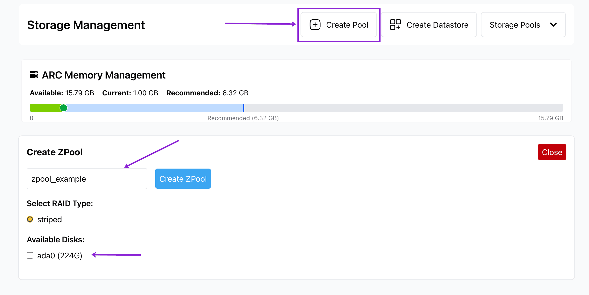

.. tip:: RAID-Z Levels

   - **RAID-Z1** A ZFS implementation similar to RAID-5, using single-parity protection across multiple drives (minimum 3 drives). Can tolerate the failure of one drive while maintaining data integrity, providing a balance between storage capacity and redundancy.
   - **RAID-Z2** A ZFS implementation similar to RAID-6, using double-parity protection across multiple drives (minimum 4 drives). Can tolerate the failure of up to two drives simultaneously, offering higher redundancy than RAID-Z1 at the cost of additional storage overhead.
   - **RAID-Z3** A ZFS implementation using triple-parity protection across multiple drives (minimum 5 drives). Can tolerate the failure of up to three drives simultaneously, providing the highest level of redundancy in the RAID-Z family, ideal for large storage arrays where maximum data protection is critical.
   - **Mirror** A ZFS configuration similar to RAID-1, where data is duplicated across two or more drives. Provides excellent read performance and can tolerate the failure of all but one drive in the mirror group, offering the fastest rebuild times but using 50% or more of available storage capacity for redundancy.
   - **Striped** A ZFS configuration similar to RAID-0, where data is distributed across multiple drives without any redundancy. Provides maximum storage capacity and improved performance through parallel I/O operations, but offers no fault tolerance - the failure of any single drive results in complete data loss.

Datastore Management
""""""""""""""""""""
**Create Datastore Interface:** The Create Datastore dialog enables creation of datastores for virtual machine storage:

.. tip:: Datastore

   A logical storage container that abstracts and manages underlying physical storage resources (hard drives, SSDs, storage arrays) into a unified pool of storage capacity.

**Datastore Configuration:**

- **Datastore Name:** Specify unique datastore identifier

.. tip:: Datastore name 
   - Logical identifiers assigned to datastores for easy identification and management within storage systems.

- **Pool Selection:** Choose from available ZFS pools (e.g., “zroot”)
- **Storage Integration:** Integration with existing storage pools
- **VM Storage:** Optimized for virtual machine storage requirements

**Datastore Benefits:**

- **VM Integration:** Seamless integration with virtual machine storage
- **Performance:** Optimized for virtualization workloads
- **Management:** Simplified virtual machine storage management
- **Flexibility:** Easy expansion and modification of storage allocation

**Steps to create a datastore:**

- **Step 1:** Provide an appropriate name
- **Step 2:** Select the pool from the available list
- **Step 3:** click "Create Datastore"

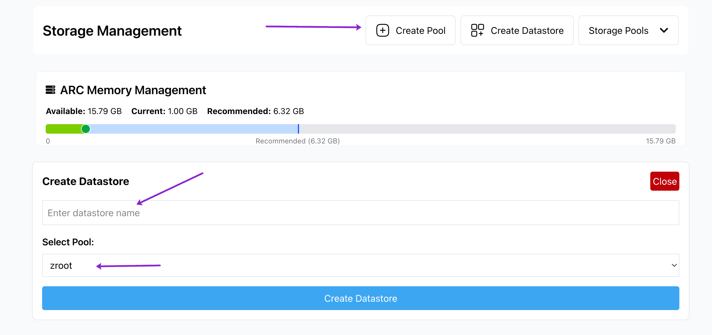

Dataset Management
""""""""""""""""""

**Dataset Overview:** The View Datasets interface provides comprehensive dataset management capabilities:

**Dataset Information Display:**

- **Dataset Name:** Hierarchical dataset naming (e.g., “zroot”, “zroot/Load-test-1-disk-1”)
- **Usage Statistics:** Detailed usage information (Used, Available, Mount point)
- **Compression Settings:** ZFS compression configuration (lz4 ON/OFF)
- **Deduplication Settings:** Data deduplication configuration (ON/OFF)

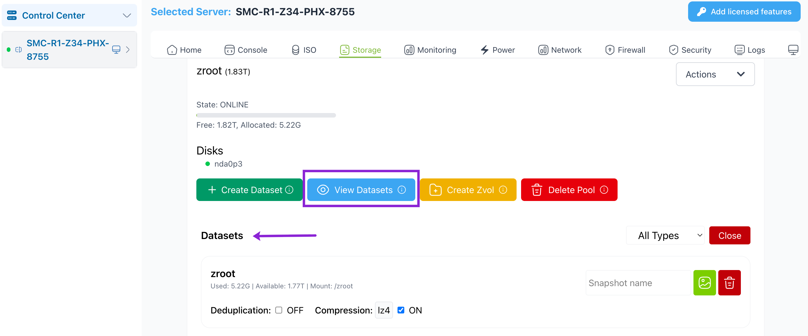

**Dataset Types and Filtering:**

- **All Types:** Display all dataset types in unified view
- **Filesystem:** File-based datasets for traditional file storage
- **Volume:** Block-based datasets for virtual machine storage
- **Snapshot:** Point-in-time snapshots for data protection

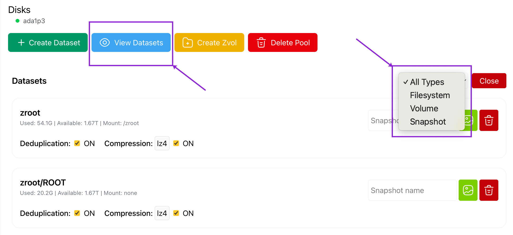

**Dataset Operations:**

- **Snapshot Creation:** Create point-in-time snapshots with custom naming

.. tip:: Snapshot
   A read-only, point-in-time copy of a ZFS dataset or zvol.

**Steps to create a snapshot:**

- **Step 1:** navigate to a particular dataset or zvol
- **Step 2:** Give an appropriate name
- **Step 3:** Click on the green icon to take a snapshot.

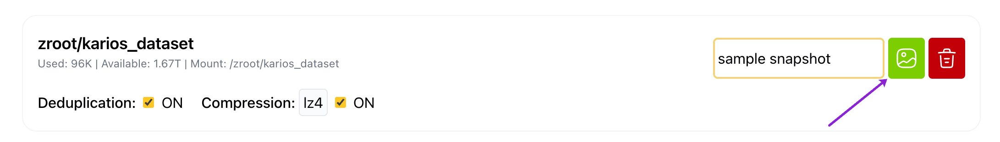

**Dataset Deletion:** Remove datasets with confirmation prompts

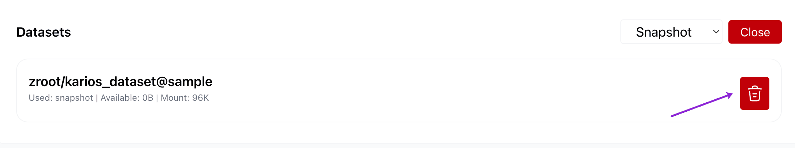

- **Snapshot Management:** Manage snapshot lifecycle and retention
- **Hierarchical Organization:** Organized dataset structure with parent-child relationships

ZFS Advanced Features
^^^^^^^^^^^^^^^^^^^^^
**Compression Management:**

- **Compression Algorithm:** lz4 compression for space efficiency
- **Compression Status:** Real-time compression status indicators (ON/OFF)
- **Space Savings:** Automatic space savings through compression
- **Performance Impact:** Minimal performance impact with lz4 compression

**Deduplication Management:**

- **Deduplication Status:** Real-time deduplication status monitoring
- **Space Optimization:** Automatic duplicate data removal
- **Resource Usage:** Monitor deduplication resource consumption
- **Performance Considerations:** Balance between space savings and performance

**Snapshot Management:**

- **Snapshot Creation:** Create instant point-in-time snapshots
- **Snapshot Naming:** Custom snapshot naming with timestamps
- **Snapshot Types:** Different snapshot types for various use cases
- **Snapshot Retention:** Automated snapshot retention policies

Node Monitoring
~~~~~~~~~~~~~~~

**Monitoring Overview:** The Monitoring tab provides comprehensive real-time performance monitoring and historical analysis for individual worker nodes, enabling administrators to track system performance, identify trends, and optimize resource utilization.

**Monitoring Interface:** The monitoring interface features a time-based performance dashboard with configurable time ranges and multiple performance metrics displayed in detailed graphical format.

Time Range Selection
^^^^^^^^^^^^^^^^^^^^

**Time Range Controls:** The monitoring interface provides flexible time range selection for performance analysis:

**Available Time Ranges:**

**Last 1h:** Real-time monitoring for the past hour (default selection)
**Last 30m:** Short-term monitoring for the past 30 minutes
**Last 15m:** Immediate monitoring for the past 15 minutes
**Last 5m:** Real-time monitoring for the past 5 minutes
**Last 1m:** Live monitoring for the past minute

**Time Range Features:**

- **Active Selection:** Currently selected time range highlighted in blue
- **Flexible Analysis:** Choose appropriate time ranges for different analysis needs
- **Historical Data:** Access historical performance data for trend analysis
- **Real-time Updates:** Continuous data updates for live monitoring

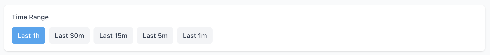

CPU Usage Monitoring
^^^^^^^^^^^^^^^^^^^^

**CPU Performance Graph:** The CPU Usage (%) graph provides detailed real-time monitoring of processor utilization:

**CPU Metrics Display:**

- **Y-Axis Scale:** CPU percentage scale from 0% to 22% (dynamically adjusted)
- **Time-based X-Axis:** Detailed timestamp display with precise time intervals
- **Performance Visualization:** Red line graph showing CPU usage patterns over time
- **Usage Patterns:** Visual representation of CPU load variations and spikes

**CPU Monitoring Features:**

- **Real-time Updates:** Continuous CPU usage monitoring with live data
- **Performance Spikes:** Visual identification of CPU usage spikes and patterns
- **Load Analysis:** Detailed analysis of CPU load distribution over time
- **Resource Planning:** Data for capacity planning and resource optimization

**CPU Graph Details:**

- **Graph Color:** Red line graph for clear CPU usage visualization
- **Time Precision:** Detailed timestamps showing minute-by-minute data
- **Performance Ranges:** Dynamic scaling showing usage from baseline to peak levels
- **Trend Analysis:** Historical CPU usage trends for performance optimization

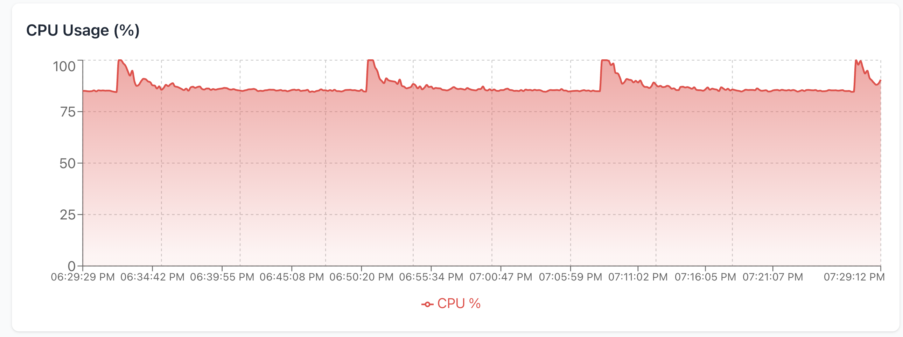

Memory Usage Monitoring
^^^^^^^^^^^^^^^^^^^^^^^

**Memory Performance Graph:** The Memory Usage (%) graph provides comprehensive memory utilization monitoring:

**Memory Metrics Display:**

**Y-Axis Scale:** Memory percentage scale from 0% to 27% (dynamically adjusted)
**Stable Usage Pattern:** Blue line graph showing consistent memory usage
**Usage Consistency:** Visual representation of stable memory consumption
**Current Usage:** Real-time memory usage percentage display

**Memory Monitoring Features:**

- **Interactive Tooltips:** Hover tooltips showing precise memory usage data
- **Timestamp Information:** Detailed timestamp display (e.g., “Time: 11:03:52 AM”)
- **Usage Percentage:** Specific memory usage percentage (e.g., “Memory Usage: 22.35%”)
- **Trend Visualization:** Blue line graph for clear memory usage patterns

**Memory Graph Characteristics:**

- **Stability Indicators:** Visual representation of memory usage stability
- **Usage Patterns:** Identification of memory usage patterns and trends
- **Resource Monitoring:** Continuous memory resource utilization tracking
- **Capacity Analysis:** Memory capacity utilization and availability assessment

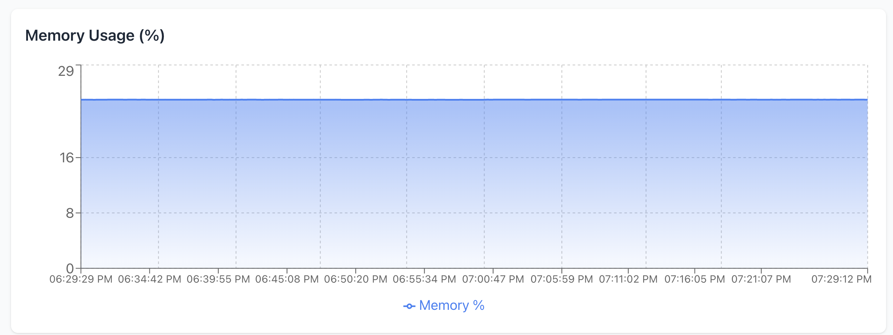

Storage Usage Monitoring
^^^^^^^^^^^^^^^^^^^^^^^^

**Storage Performance Graph:** The Storage Usage (%) graph monitors storage utilization and capacity:

**Storage Metrics Display:**

- **Y-Axis Scale:** Storage percentage scale from 0% to 6% (dynamically adjusted)
- **Low Usage Visualization:** Green line graph showing minimal storage usage
- **Usage Stability:** Consistent low storage utilization patterns
- **Capacity Monitoring:** Real-time storage capacity utilization tracking

**Storage Monitoring Features:**

- **Interactive Data Points:** Clickable data points with detailed information
- **Timestamp Display:** Precise timestamp information (e.g., “Time: 11:12:26 AM”)
- **Usage Percentage:** Specific storage usage percentage (e.g., “Storage Usage: 1.05%”)
- **Trend Analysis:** Long-term storage usage trend monitoring

**Storage Graph Characteristics:**

- **Green Visualization:** Green line graph for storage usage representation
- **Low Utilization:** Visual indication of efficient storage utilization
- **Capacity Planning:** Data for storage capacity planning and expansion
- **Performance Baseline:** Baseline storage performance monitoring

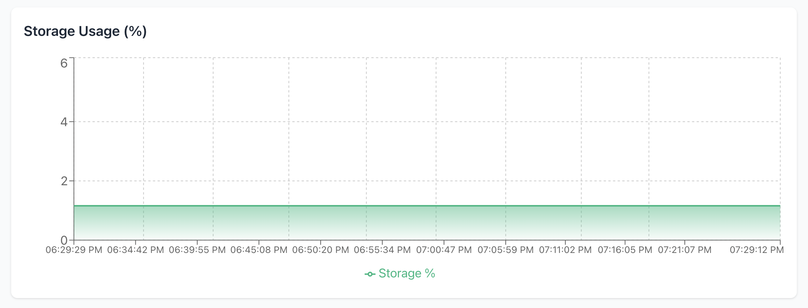

Performance Analytics
^^^^^^^^^^^^^^^^^^^^^

**Multi-Metric Analysis:** The monitoring interface provides comprehensive performance analytics across multiple system resources:

**Cross-Resource Correlation:**

- **CPU vs Memory:** Correlation analysis between CPU and memory usage
- **Resource Efficiency:** Analysis of overall system resource efficiency
- **Performance Patterns:** Identification of performance patterns across metrics
- **System Optimization:** Data-driven insights for system optimization

**Performance Insights:**

- **Usage Patterns:** Detailed analysis of resource usage patterns
- **Peak Performance:** Identification of peak performance periods
- **Resource Bottlenecks:** Early identification of potential resource bottlenecks
- **Optimization Opportunities:** Data-driven optimization recommendations

Historical Performance Analysis
^^^^^^^^^^^^^^^^^^^^^^^^^^^^^^^

**Time-Based Analysis:** The monitoring system provides comprehensive historical performance analysis:

**Historical Data Features:**

- **Time Series Data:** Continuous time series data collection and analysis
- **Trend Identification:** Long-term trend analysis for performance optimization
- **Pattern Recognition:** Automatic pattern recognition for performance insights
- **Comparative Analysis:** Compare performance across different time periods

**Performance Reporting:**

- **Real-time Dashboards:** Live performance dashboards with real-time updates
- **Historical Reports:** Detailed historical performance reports and analysis
- **Trend Analysis:** Long-term performance trend analysis and forecasting
- **Capacity Planning:** Performance data for infrastructure capacity planning

Node Power Management
~~~~~~~~~~~~~~~~~~~~~

**Power Management Overview:** The Power tab provides comprehensive power monitoring and management capabilities for individual worker nodes, enabling administrators to track power consumption, optimize energy efficiency, and manage power profiles for optimal performance and cost savings.

**Power Interface Features:** The Power management interface offers dual view modes and comprehensive power analytics:

- **View Mode Selection:** Switch between “Power Metrics” and “Power Monitoring” views
- **Time Range Controls:** Flexible time range selection for power analysis
- **Real-time Monitoring:** Live power consumption tracking and visualization
- **Power Profile Management:** Configure and optimize power profiles for different workloads

Power Metrics View
^^^^^^^^^^^^^^^^^^
**Power Metrics Dashboard:** The Power Metrics view provides detailed real-time power consumption monitoring with comprehensive electrical measurements:

**Power Consumption Graph:** The Power (W) graph displays instantaneous power consumption over time:

**Power Monitoring Features:**

- **Y-Axis Scale:** Dynamic power scale from 0W to 133W (adjustable based on consumption)
- **Real-time Visualization:** Green area chart showing power consumption patterns
- **Power Fluctuations:** Visual representation of power usage variations and spikes
- **Time-based Analysis:** Detailed timestamp tracking for power consumption trends

**Voltage Monitoring:** The Voltage (V) graph provides electrical voltage monitoring:

**Voltage Characteristics:**

- **Stable Voltage Display:** Orange line graph showing consistent voltage levels
- **Voltage Range:** Monitoring voltage from 0V to 119V range
- **Interactive Tooltips:** Hover tooltips showing precise voltage measurements
- **Voltage Stability:** Visual indication of voltage stability (e.g., “Voltage: 113.36V” at “Time: 11:20:42 AM”)

**Current Monitoring:** The Current (A) graph tracks electrical current consumption:

**Current Measurement Features:**

- **Current Range:** Monitoring current from 0A to 6A range
- **Current Stability:** Red line graph showing consistent current draw
- **Real-time Updates:** Live current measurement with tooltip information
- **Current Precision:** Detailed current measurements (e.g., “Current: 1.00A” at “Time: 11:16:33 AM”)``

**Energy Consumption Tracking:** The Energy (kWh) graph provides cumulative energy consumption monitoring:

**Energy Tracking Features:**

- **Cumulative Energy:** Blue area chart showing total energy consumption over time
- **Energy Scale:** Large scale energy tracking (e.g., 0 to 30831 kWh)
- **Energy Tooltips:** Detailed energy consumption data (e.g., “Energy: 30760.09 kWh” at “Time: 11:10:37 AM”)
- **Long-term Analysis:** Historical energy consumption tracking for cost analysis

Power Monitoring View
^^^^^^^^^^^^^^^^^^^^^

**Power Monitoring Dashboard:** The Power Monitoring view provides comprehensive power analytics and management capabilities:

**View Mode Selection:** Toggle between different power monitoring views:

- **Power Metrics:** Real-time electrical measurements and graphs
- **Power Monitoring:** Comprehensive power analytics and CPU core monitoring

**Power Supply Unit Data:** The Power Supply Unit Data section displays detailed PSU information:

**PSU Information Display:**

**PSU Details:** Complete PSU specifications including model, current, power, and voltage ratings

- **PSU Model:** Power supply model information (e.g., “SS Gemini 900A”)
- **Electrical Specifications:** Current rating (77.5 A), power rating (900 W), voltage (12 V)
- **Network Integration:** Node IP address association (e.g., “192.168.116.111”)
- **Efficiency Rating:** 80 Plus certification and rating (e.g., “80 Plus: 90, 80 Plus Rating: Platinum”)
- **Management Actions:** Edit and delete PSU configuration options

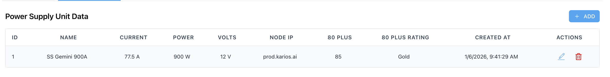

To add a new power supply unit data:

**Add Power Supply Configuration:**

**To add a power supply to your system, provide the following information:**

**Required Fields:**

- **Power Supply Name:** Enter a descriptive name for the power supply unit
- **Current (A):** Specify the current rating in amperes
- **Power (W):** Enter the power rating in watts
- **Voltage (V):** Specify the voltage rating in volts
- **By Pass Rating:** Enter the bypass power rating
- **Status:** Set the current operational status of the power supply

**Step: Complete Configuration** Click **Add** to save the power supply configuration, or **Cancel** to abort the setup

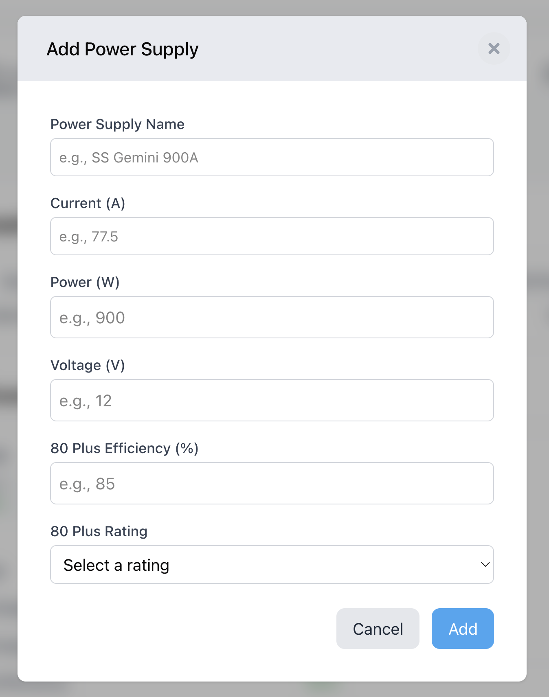

Server Power Metrics
^^^^^^^^^^^^^^^^^^^^

**Comprehensive Power Analytics:** The Server Power Metrics section provides detailed power consumption analysis and CPU core monitoring

**Core Usage Monitoring:** Individual CPU core usage tracking with color-coded visualization:

**CPU Core Performance:**

- **32-Core Monitoring:** Individual monitoring of all CPU cores (Core 0 through Core 31)
- **Usage Percentage:** Real-time usage percentage for each core
- **Color-coded Display:** Visual color coding for different usage levels:
- **Green:** Low to moderate usage (0% to ~20%)
- **Orange:** Moderate to high usage (~21% to ~50%)
- **Red:** High usage (100% indicates full utilization)
- **Color Graduation:** Progressive color changes based on usage intensity

**Core Usage Examples:**

- **Core 5:** 100% utilization (displayed in red)
- **Core 20:** 31.58% utilization (displayed in orange)
- **Core 21:** 16.67% utilization (displayed in green)
- **Idle Cores:** 0% utilization (displayed in light green)

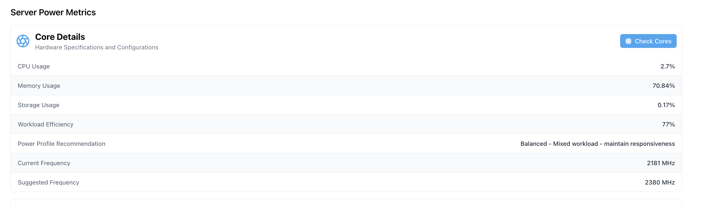

System Resource Summary
^^^^^^^^^^^^^^^^^^^^^^^

**Resource Utilization Overview:** The system provides a comprehensive summary of overall resource utilization:

**Resource Metrics:**

- **CPU Usage:** Overall CPU utilization percentage (e.g., “4.86%”)
- **Memory Usage:** System memory consumption (e.g., “22.31%”)
- **Storage Usage:** Storage capacity utilization (e.g., “13.38%”)
- **Workload Efficiency:** Overall system efficiency rating (e.g., “88%”)
- **Power Profile Management:** Intelligent power profile recommendations and management:

**Power Profile Features:**

- **Profile Recommendation:** AI-driven power profile recommendations (e.g., “Balanced”)
- **Profile Description:** Detailed profile descriptions (e.g., “Mixed workload - maintain responsiveness”)
- **Profile Selection:** Multiple power profile options:
   - **Performance:** Maximum performance for demanding workloads
   - **Balanced:** Optimal balance between performance and power efficiency
   - **Power Saving:** Maximum power efficiency for light workloads

Power Profile Configuration
^^^^^^^^^^^^^^^^^^^^^^^^^^^

**Power Profile Settings:** The Set Power-Profile section enables dynamic power profile management:

**Profile Selection Options:**

- **Performance Profile:** Optimized for maximum computational performance
- **Balanced Profile:** Balanced performance and power efficiency
- **Power Saving Profile:** Optimized for minimum power consumption

**Current Power Configuration:**

- **Current Profile:** Currently active power profile (e.g., “Power Saving”)
- **Profile Editor:** Edit button for custom power profile configuration
- **Profile Validation:** Check mark and X buttons for profile confirmation

Frequency Management
^^^^^^^^^^^^^^^^^^^^

**CPU Frequency Control:** The system provides detailed CPU frequency monitoring and management:

**Frequency Information:**

- **Current Frequency:** Real-time CPU frequency (e.g., “1500 MHz”)

- **Suggested Frequency:** System-recommended frequency for optimal performance (e.g., “2400 MHz”)

**Frequency Optimization:** Automatic frequency recommendations based on workload analysis

**Dynamic Scaling:** Real-time frequency adjustments based on power profile and workload demands

**Frequency Management Benefits:**

- **Performance Optimization:** Optimal frequency selection for workload requirements
- **Power Efficiency:** Frequency scaling for power consumption optimization
- **Thermal Management:** Frequency control for thermal management
- **Workload Adaptation:** Dynamic frequency adjustment based on workload characteristics

Power Management Best Practices
^^^^^^^^^^^^^^^^^^^^^^^^^^^^^^^

**Effective Power Management**

- **Profile Selection:** Choose appropriate power profiles based on workload characteristics
- **Monitoring:** Regular monitoring of power consumption and efficiency metrics
- **Optimization:** Use power recommendations for optimal system configuration
- **Frequency Management:** Leverage frequency scaling for performance and efficiency balance

**Power Efficiency Optimization**

- **Workload Analysis:** Analyze workload patterns for optimal power profile selection
- **Resource Utilization:** Monitor resource utilization for power efficiency opportunities
- **Profile Tuning:** Fine-tune power profiles based on specific workload requirements
- **Energy Cost Management:** Use power monitoring for energy cost optimization and budgeting

Network Management
~~~~~~~~~~~~~~~~~~

**Network Overview:** The Network tab provides comprehensive network interface and switch management for individual worker nodes, enabling administrators to configure network connectivity, manage virtual switches, and monitor network interface status across the cluster infrastructure.

**Network Interface Management:** The network management interface features dedicated sections for interface monitoring and switch configuration, providing granular control over network connectivity and virtual network topology.

   .. figure:: _static/images/networking/Image-node-001.png
      :width: 600

Network Interface Configuration
^^^^^^^^^^^^^^^^^^^^^^^^^^^^^^^

**Interface Overview:** The Network Management - Interface section displays all available network interfaces for the selected worker node:

**Available Network Interfaces:**

- Primary network interface with active switch association

- Secondary network interface without switch association

- Additional network interface available for configuration
   
   .. figure:: _static/images/networking/Image-node-002.png
      :width: 600

**Interface Information Display:**

- **Interface Name:** Clear identification of each network interface (e.g., bnxt0, bnxt1, ue0)

- **Switch Assignment:** Associated switch name display (e.g., “Switch: default”)

- **Status Badges:** Color-coded status indicators for quick assessment

- **Association Status:** Clear indication of switch association or availability

**Interface Configuration Options:**

- **Switch Association:** Ability to associate interfaces with virtual switches

- **Network Type:** Public/Private network classification management

- **Configuration Access:** Direct access to detailed interface settings

Virtual Switch Management
^^^^^^^^^^^^^^^^^^^^^^^^^

**Switch Overview:** The Network Management - Switches section provides comprehensive virtual switch management and configuration:

**Virtual Switch Display:**

- **Switch Listing:** Complete inventory of configured virtual switches

- **Interface Association:** Clear display of associated network interfaces

- **Status Monitoring:** Real-time switch operational status

- **Configuration Access:** Direct access to switch configuration options

**Switch Configuration Features:**

- **Switch Creation:** “Create Switch” button for new virtual switch deployment
- **Switch Deletion:** Red delete button for switch removal
- **Interface Assignment:** Management of interface-to-switch assignments

Switch Creation and Configuration
^^^^^^^^^^^^^^^^^^^^^^^^^^^^^^^^^
**Create Switch Interface:** The Create Switch modal provides comprehensive switch creation and configuration options:

**Switch Creation Form:**

- **Switch Name Input:** Text field for custom switch name entry

- **Interface Selection:** Dropdown menu for interface assignment

- **Creation Controls:** Cancel and Create Switch action buttons

   .. figure:: _static/images/networking/Image-node-004.png
      :width: 600

**Switch Creation Process:**

- **Name Assignment:** Enter descriptive switch name in the text field

- **Interface Selection:** Choose target interface from dropdown menu

- **Configuration Review:** Verify switch configuration parameters

- **Switch Creation:** Click “Create Switch” button to deploy new switch

- **Status Verification:** Confirm successful switch creation and activation

   .. figure:: _static/images/networking/Image-node-003.png
      :width: 600 

The switch management interface displays all configured virtual switches.

Network Configuration Best Practices
^^^^^^^^^^^^^^^^^^^^^^^^^^^^^^^^^^^^

- **Interface Configuration:**
   - **Naming Conventions:** Use descriptive names for switches and interfaces
   - **Association Management:** Maintain clear interface-to-switch relationships

- **Switch Management:**
   - **Strategic Planning:** Plan virtual switch topology for optimal performance
   - **Resource Allocation:** Allocate interfaces efficiently across switches
   - **Status Monitoring:** Regular monitoring of switch operational status

- **Network Security:**
   - **Access Control:** Implement appropriate network access controls
   - **Traffic Monitoring:** Monitor network traffic for security threats
   - **Configuration Validation:** Validate network configuration changes

Firewall Management
~~~~~~~~~~~~~~~~~~~

**Overview:** The Firewall tab provides comprehensive packet filter (PF) rule management for individual worker nodes, enabling administrators to configure network security policies, manage traffic filtering rules, and maintain system security through advanced firewall configuration.

**Firewall Rule Management:** The firewall interface features a code-based rule editor with syntax highlighting, real-time validation, and safety mechanisms to prevent system lockout through configuration errors.

   .. figure:: _static/images/networking/Image-pf-002.png
      :width: 600 

Packet Filter Rules Interface
^^^^^^^^^^^^^^^^^^^^^^^^^^^^^

**PF Firewall Rules**

**Connection Protection Rules**

This PF rule acts as a security guard for your server, preventing connection flooding and brute-force attacks. It works by implementing multiple security mechanisms:

**Limiting Connections**
   Restricts the number of simultaneous connections and rate of new connection attempts from any single IP address

**Overload Protection**
   When configured limits are exceeded, the rule aggressively blocks attackers by dropping their connections and terminating existing ones using a pre-defined "bruteforce" action block

**Attack Mitigation**
   Designed to stop malicious actors from overwhelming your server with connection requests while minimizing disruption to legitimate users

**Configuration Requirements**

Proper configuration is crucial for rule effectiveness:

**Critical Components:**

- Connection limit thresholds appropriate for your environment
- Rate limiting parameters for new connection attempts
- Bruteforce overload block configuration
- Timeout values for blocked connections

**Best Practices:**

- Test configuration changes in a controlled environment
- Monitor logs to ensure legitimate traffic isn't blocked
- Adjust thresholds based on actual traffic patterns
- Document configuration changes for future reference

.. warning::
   **Configuration Impact**
   Improper PF rule configuration can block legitimate traffic or fail to protect against attacks. Always validate settings before applying to production systems.

**PF Rules Display:** The Packet Filter Rules section provides a comprehensive view of all active firewall rules.

**Rule Configuration Display:**

   - **Line Numbers:** Sequential line numbering for easy rule reference and navigation
   - **Syntax Highlighting:** Color-coded syntax highlighting for different rule components
   - **Rule Structure:** Clear display of rule syntax with proper formatting
   - **Code Editor:** Full-featured code editor with firewall rule editing capabilities

**Advanced Configuration Warning:**

   - **Security Notice:** Prominent warning about advanced configuration complexity
   - **Risk Assessment:** Clear indication of potential security vulnerabilities
   - **Expertise Requirement:** Emphasis on required expertise for rule modification
   - **System Lockout Prevention:** Warning about potential system access issues

Firewall Rule Components
^^^^^^^^^^^^^^^^^^^^^^^^

**Rule Structure Analysis:** The firewall rules are organized in a structured format with specific components.

**Interface Configuration:**

   - **External Interface:** Definition for external network interface
   - **Interface Assignment:** Clear association between logical and physical interfaces
   - **Network Boundary:** Definition of network perimeter and access points
   - **Traffic Direction:** Inbound and outbound traffic handling specifications

**Policy Configuration:**

   - **Block Policy:** Set block-policy return for default blocking behavior
   - **Fragment Handling:** Fragment reassemble for packet processing
   - **Skip Interface:** Loopback interface exclusion
   - **Default Actions:** Comprehensive default policy configuration

**Traffic Filtering Rules**

**Rule Types and Functions:** The firewall configuration includes multiple rule types for comprehensive traffic control.

**Pass Rules Configuration:**

   - **Quick Rules**
   - **Protocol-Specific Rules**
   - **State Maintenance:** Automatic connection state tracking for established connections
   - **Direction Control:** Separate inbound and outbound traffic rule definitions

**Block Rules Implementation:**

   - **Default Block:** For comprehensive inbound traffic blocking
   - **Selective Blocking:** For controlled outbound access
   - **Anti-Spoof:** For IP spoofing prevention
   - **Security Enforcement:** Comprehensive blocking with exception-based access

**Service Access Rules:**

   **Port-Based Access Control:** The firewall configuration includes specific port access rules.
   
   **SSH Access Control:**
      - **SSH Port**
      - **Connection Flags:** Proper TCP connection flag handling for secure connections
      - **State Tracking:** Automatic connection state maintenance for SSH sessions
      - **Access Scope:** Controlled SSH access from authorized sources
   **Multi-Service Access:**
      - **Port Range:** {9090, 9100, 3000, 80, 443, 8080:8084, 5001, 6900:7000, 5432, 9592, 9595, 9694}
      - **Service Portfolio:** Comprehensive port access for multiple services and applications
      - **State Management:** Automatic connection state tracking for all services

Rule Editing and Modification
^^^^^^^^^^^^^^^^^^^^^^^^^^^^^

**Interactive Rule Editor:** The firewall interface provides comprehensive rule editing capabilities.

**Code Editor Features:**

- **Syntax Highlighting:** Color-coded syntax for different rule components

- **Line Numbering:** Sequential line numbers for easy reference

- **Real-time Validation:** Live syntax validation during rule editing

- **Error Detection:** Automatic detection of syntax errors and misconfigurations

**Rule Modification Process:**

- **Direct Editing:** Click-to-edit functionality for individual rules

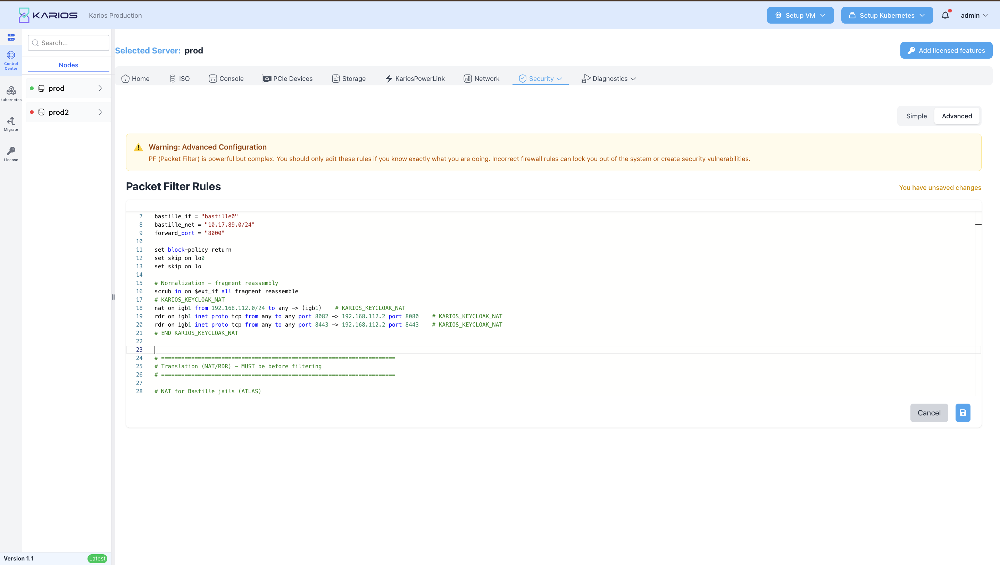

- **Syntax Validation:** Real-time syntax checking during modification

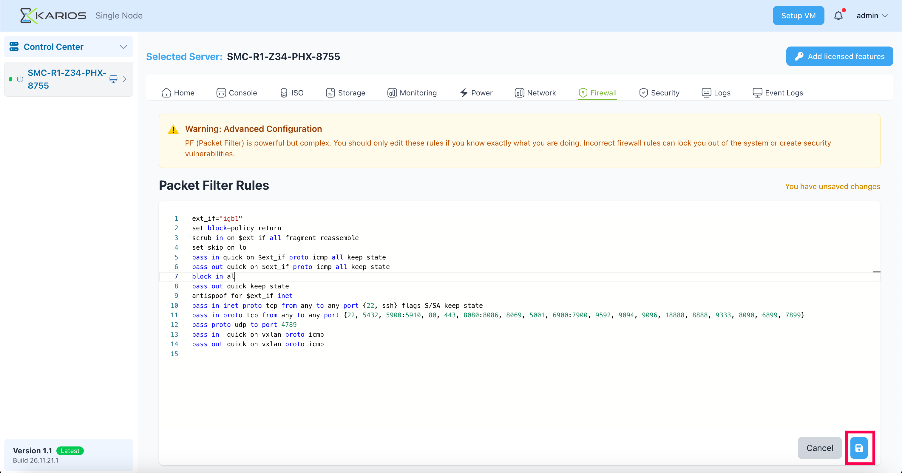

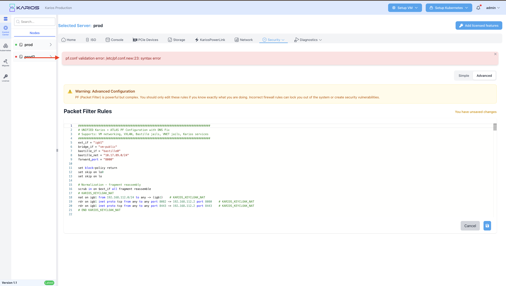

- **Change Tracking:** Visual indication of modified rules and changes

- **Preview Mode:** Rule validation before applying changes

Change Confirmation System Safety Mechanism:
^^^^^^^^^^^^^^^^^^^^^^^^^^^^^^^^^^^^^^^^^^^^

The firewall system includes a comprehensive safety mechanism to prevent system lockout.

- **Confirmation Timer System:**

- **60-Second Timer:** Changes will revert in 60 seconds countdown display

- **Auto-Revert:** Automatic reversion to previous configuration if not confirmed

- **Safety Window:** 60-second window for testing and validation

- **Change Persistence:** Manual confirmation required for permanent changes

**Confirmation Process:**

- **Rule Modification:** Edit firewall rules using the code editor

- **Timer Activation:** 60-second countdown timer begins automatically

- **Testing Period:** Test connectivity and system access during timer period

- **Confirmation Action:** Click “Confirm Changes” to make changes permanent

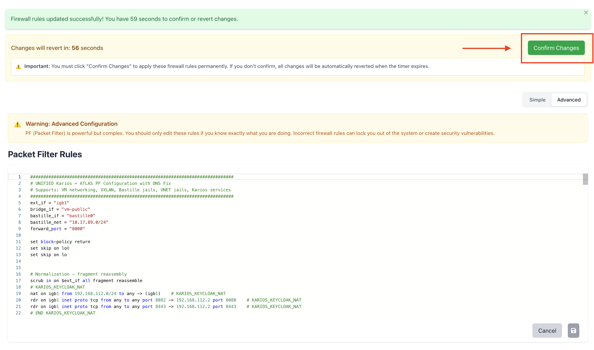

**Safety Controls:**

- **Cancel Option:** Cancel button to abort changes before confirmation

- **Confirm Changes:** Green “Confirm Changes” button for permanent application

- **Timer Display:** Real-time countdown showing remaining confirmation time

- **Revert Warning:** Clear indication of automatic reversion behavior

Security Considerations:
^^^^^^^^^^^^^^^^^^^^^^^^

- **Expertise Requirement:** Advanced PF configuration requires specialized knowledge

- **Risk Assessment:** Incorrect rules can create security vulnerabilities

- **System Access:** Improper configuration can result in system lockout

- **Best Practices:** Follow established firewall configuration best practices

Security Center Walkthrough
~~~~~~~~~~~~~~~~~~~~~~~~~~~

The Security Center provides a centralized interface for managing and monitoring your infrastructure's security posture. This walkthrough will guide you through the key features and functionalities available in the Security Center.

Accessing the Security Center
^^^^^^^^^^^^^^^^^^^^^^^^^^^^^

Navigate to the Security Center to begin security monitoring and management.

Security Center Navigation
""""""""""""""""""""""""""
   - Navigate to the "Security" tab on any node in the node's main menu
   - The below image clearly indicates where to find the 'Security' tab on the interface.

   .. figure:: _static/images/security/security_tab_pointer.png
      :width: 600
      :alt: Security Tab Pointer

      Figure 1: Security Tab Pointer

Overview Dashboard
^^^^^^^^^^^^^^^^^^

The Security Centre Overview Dashboard displays a real-time snapshot of your security posture with key metrics and status indicators.

Security Dashboard Interface
""""""""""""""""""""""""""""
   - The Security Centre Overview Dashboard displays a real-time snapshot of your security posture
   - Key metrics include risk percentage, system status, last scan status and top risk category
   - The below image clearly shows where to find 'Scan' Button

   .. figure:: _static/images/security/security_scan_pointer.png
      :width: 600
      :alt: Security Scan Button

      Figure 2: Security Scan Button

Initiating Security Scans
"""""""""""""""""""""""""
   - Click the 'Scan' button to initiate a new security scan
   - The system will perform vulnerability assessment and risk analysis
   - Scan results will be displayed in real-time on the dashboard

Security Vulnerability Management
^^^^^^^^^^^^^^^^^^^^^^^^^^^^^^^^^

Access the Vulnerability Management section to view and manage identified vulnerabilities across your infrastructure.

Vulnerability Assessment Interface
""""""""""""""""""""""""""""""""""
   - Access the Vulnerability Management section to view and manage identified vulnerabilities
   - Use filters to sort vulnerabilities by severity
   - Scroll Down to view detailed vulnerabilities information along with remediation options
   - Please click on the vulnerability to know more information about it

   .. figure:: _static/images/security/security_vuln_info.png
      :width: 600
      :alt: Vulnerability Information

      Figure 3: Vulnerability Information

Vulnerability Details and Information
"""""""""""""""""""""""""""""""""""""
   - Click on any vulnerability to access detailed information
   - A Pop up for the Vulnerability will look like this, it will contain a bit more information about the vulnerability and relevant links

   .. figure:: _static/images/security/security_vuln_popup.png
      :width: 600
      :alt: Vulnerability Popup

      Figure 4: Vulnerability Popup

   - The vulnerability popup contains:
     - Detailed vulnerability description
     - Risk assessment information
     - Relevant security links and references
     - Potential impact analysis

Remediation Actions
^^^^^^^^^^^^^^^^^^^

The Remediation Actions section allows you to initiate automated fixes for identified security issues.

Automated Remediation Interface
"""""""""""""""""""""""""""""""
   - The Remediation Actions section allows you to initiate automated fixes for identified issues
   - Where to find the remediation option (if there are any vulnerabilities to remediate)

   .. note::
      One-click Remediation is available for very few vulnerabilities at this point to make sure that it does not hamper the system functionality.

   .. figure:: _static/images/security/security_vuln_remediation_pointer_section.png
      :width: 600
      :alt: Vulnerability Remediation Pointer

      Figure 5: Vulnerability Remediation Pointer

Remediation Process
"""""""""""""""""""
   - Review available remediation options for identified vulnerabilities
   - Select appropriate remediation actions based on risk assessment
   - Monitor remediation progress and validate fixes
   - Verify system functionality after remediation

Scan History and Reporting
^^^^^^^^^^^^^^^^^^^^^^^^^^

The Scan History section provides a log of all security scans performed with detailed reporting capabilities.

Security Scan History Navigation
""""""""""""""""""""""""""""""""
   - The Scan History section provides a log of all security scans performed
   - Review past scan results and reports
   - Please click on the 'Metrics' button beside the 'Scan' button to navigate to Security Scan History Page

   .. figure:: _static/images/security/security_navigate_to_history_page.png
      :width: 600
      :alt: Security Scan History Pointer

      Figure 6: Security Scan History Pointer

Security Scan History Dashboard
"""""""""""""""""""""""""""""""
   - The Security Scan History Page provides a metrics dashboard for previous scans performed
   - Review historical reports in html and PDF formats
   - You can find the previous scan details, risk score from earlier scan and other additional details in this Security Scan History Page

   .. figure:: _static/images/security/security_history_page.png
      :width: 600
      :alt: Security History Page

      Figure 7: Security History Page

Security Report Generation
""""""""""""""""""""""""""
   - The below image clearly indicates where to find the pdf & html report download options under the Scan History section

   .. figure:: _static/images/security/security_report_pointer.png
      :width: 600
      :alt: Security Report Pointer

      Figure 8: Security Report Pointer

Security Report Content
"""""""""""""""""""""""
   - Once downloaded, the security report will contain detailed information of all the vulnerabilities identified in the scan
   - It also contains System information on which scan was performed such as OS version, architecture, kernel version, and other relevant details

   .. figure:: _static/images/security/security_report_content.png
      :width: 600
      :alt: Security Report Content

      Figure 9: Security Report Content

**Security Report Components**

The security report includes:

- **Vulnerability Details**: Complete list of identified security issues
- **System Information**: OS version, architecture, kernel version
- **Risk Assessment**: Severity ratings and impact analysis
- **Remediation Recommendations**: Suggested fixes and security improvements
- **Scan Metadata**: Timestamp, scan duration, and coverage information

Best Practices for Security Management
^^^^^^^^^^^^^^^^^^^^^^^^^^^^^^^^^^^^^^

Security Monitoring Guidelines
""""""""""""""""""""""""""""""

**Regular Security Scanning**
   - Schedule regular security scans to maintain current security posture
   - Monitor scan results and track security trends over time
   - Address high-priority vulnerabilities promptly

**Vulnerability Assessment**
   - Review vulnerability details thoroughly before taking action
   - Assess potential impact on system functionality
   - Plan remediation activities during appropriate maintenance windows

**Report Management**
   - Download and archive security reports for compliance purposes
   - Share reports with relevant stakeholders and security teams
   - Track remediation progress using historical scan data

Security Configuration Management
"""""""""""""""""""""""""""""""""

**Remediation Planning**
   - Prioritize vulnerabilities based on risk assessment
   - Test remediation actions in development environments first
   - Document all security configuration changes

**System Monitoring**
   - Monitor system performance after applying security fixes
   - Verify that remediation actions do not impact system functionality
   - Maintain audit trails of all security-related changes

.. important::
   Always test security remediation actions in a controlled environment before applying them to production systems to ensure system stability and functionality.

Node Log Management
~~~~~~~~~~~~~~~~~~~

**Log Overview:** The Logs tab provides comprehensive system log monitoring and analysis for individual worker nodes, featuring real-time log streaming, filtering capabilities, and log export functionality for troubleshooting and system analysis.

**Log Viewer Interface:** The Log Viewer displays system logs in a structured format with filtering options, search capabilities, and export tools for efficient log management and analysis.

   .. figure:: _static/images/networking/Image-node-Log-001.png
      :width: 600 

Log Viewer Dashboard
^^^^^^^^^^^^^^^^^^^^

**Log Display Interface:** The Log Viewer provides a comprehensive log monitoring interface.

**Log Table Structure:**

**Date Column:** Log entry date display (Jul 17 format)

**Time Column:** Precise timestamp display (18:35:12 format)

**Level Column:** Log severity level classification

**Message Column:** Detailed log message content

**Log Entry Examples:**

**System Messages:** “syslogd: last message repeated 3 times”

**Application Errors:** “my_app[5139]: Failed to convert str to int”

**Network Events:** “dhclient[17655]: send_packet: No buffer space available”

**Kernel Messages:** “kernel: 310.534325 [4335] netmap_transmit vlan113 full hwcur 0 hwtail 0 qlen 1023”

Log Filtering and Search
^^^^^^^^^^^^^^^^^^^^^^^^

**Advanced Log Filtering:** The Log Viewer provides comprehensive filtering and search capabilities.

**Level Filtering:**

- **Select Level Dropdown:** Filter logs by severity level

- **Available Levels:** Info, Error, Debug classification

- **Default Selection:** “Select Level” for all log entries

- **Dynamic Filtering:** Real-time log filtering based on selected level

**Content Search:**

- **Search Field:** “Search logs” text input for content filtering

- **Real-time Search:** Live filtering of log entries based on search terms

- **Message Content:** Search through log message content

- **Flexible Matching:** Partial and full text search capabilities

   .. figure:: _static/images/networking/Image-node-Log-002.png
      :width: 600 

Log Export and Management
^^^^^^^^^^^^^^^^^^^^^^^^^

**Log Export Functionality:** The Log Viewer provides log export capabilities:

**Export Options:**

- **Export Logs Button:** Blue “Export Logs” button for log data export

- **Data Format:** Structured log data export capabilities

- **Historical Data:** Export of filtered or complete log datasets

**Log Management Features:**

- **Real-time Updates:** Live log streaming and real-time updates

- **Historical Access:** Access to historical log entries

- **Filtering Export:** Export filtered log data based on search criteria

- **Batch Processing:** Efficient handling of large log volumes

Virtual Machine Management
--------------------------

VM Creation Overview
~~~~~~~~~~~~~~~~~~~~

The "Setup VM" button provides access to virtual machine creation with two distinct deployment methods:

- **Standard VM Setup**: Traditional virtual machine configuration for FreeBSD, Windows 10, and Ubuntu
- **Cloud-Init Setup**: Automated VM deployment with cloud-init support for FreeBSD and Ubuntu

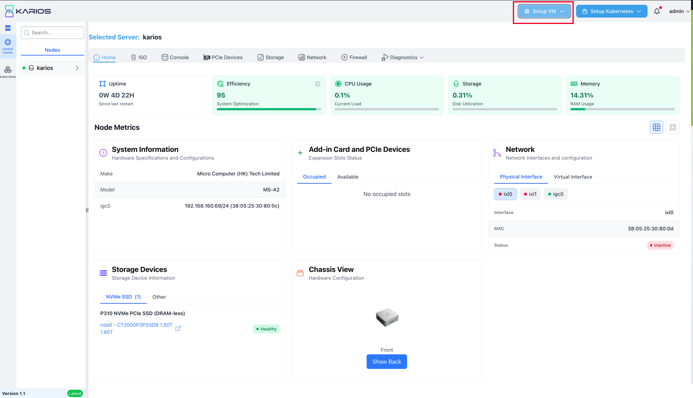

Standard VM Setup
~~~~~~~~~~~~~~~~~

**VM Configuration Process**

1. **Setup Method Selection**: Choose "Standard VM Setup" from the available options
2. **Server Selection**: Select the target server from available configured servers
3. **Basic Configuration**: Configure fundamental VM parameters
4. **Resource Allocation**: Set CPU, memory, and storage resources
5. **Network Configuration**: Configure network connectivity
6. **VM Creation**: Finalize and create the virtual machine

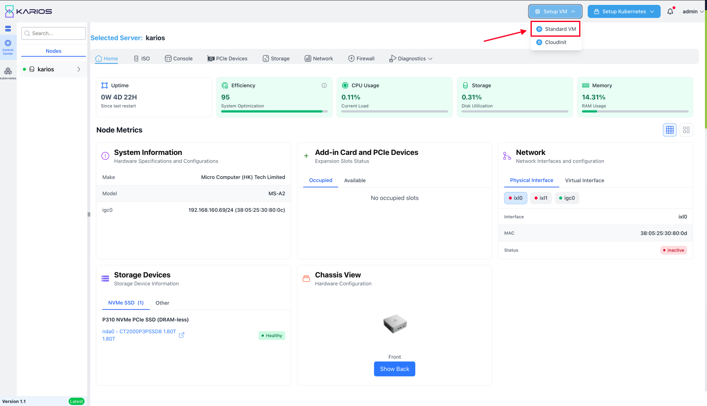

**Basic VM Configuration**

- **VM Name**: Specify a unique name for the virtual machine
- **Loader Configuration**: Select the appropriate boot loader for the operating system
- **Operating System**: Choose from supported OS options (FreeBSD, Windows 10, Ubuntu Linux)

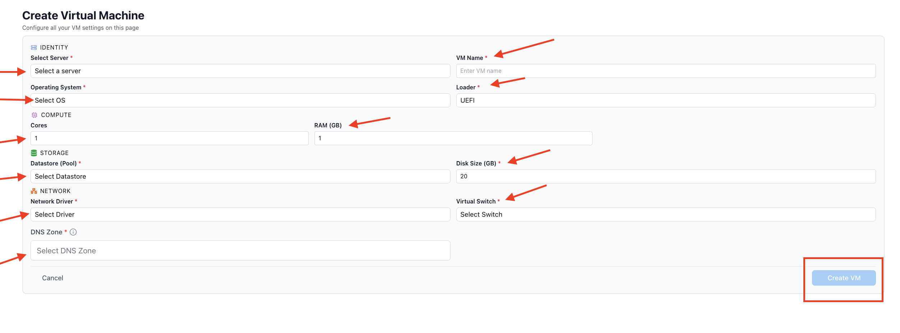

**Resource Allocation**

Configure virtual machine resources based on requirements:

- **CPU Cores**: Select number of CPU cores from available range
- **Memory**: Allocate RAM from available server memory
- **CPU Sockets**: Configure CPU socket topology

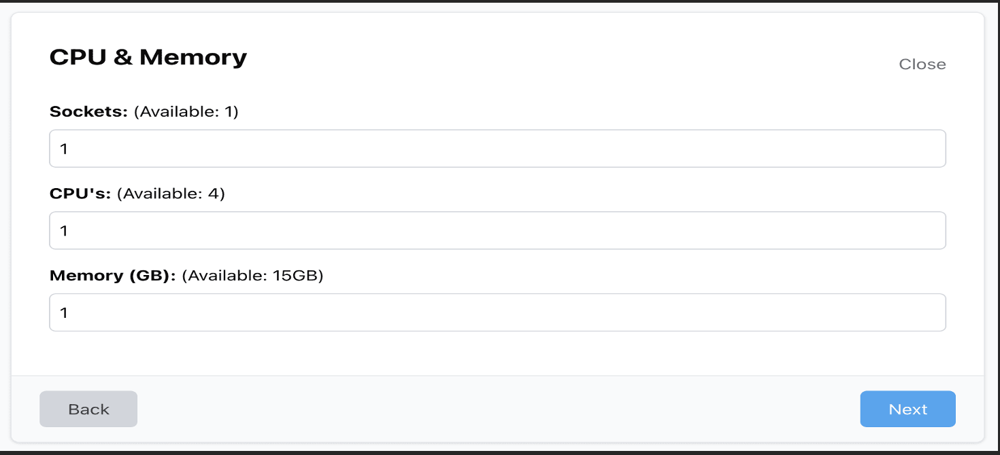

**Storage Configuration**

- **Storage Pool**: Select from available storage pools
- **Disk Size**: Specify virtual disk size based on requirements

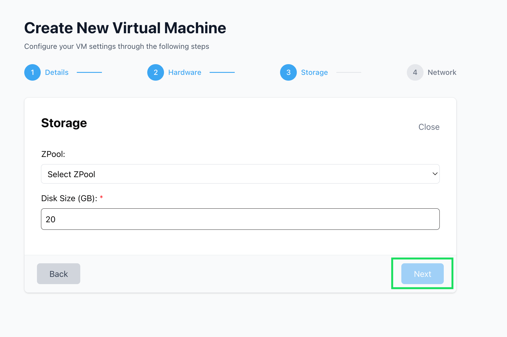

**Network Configuration**

- **Network Switch**: Select virtual network switch
- **Network Driver**: Choose network driver type for optimal performance
- **Network Adapter**: Configure virtual network adapter settings

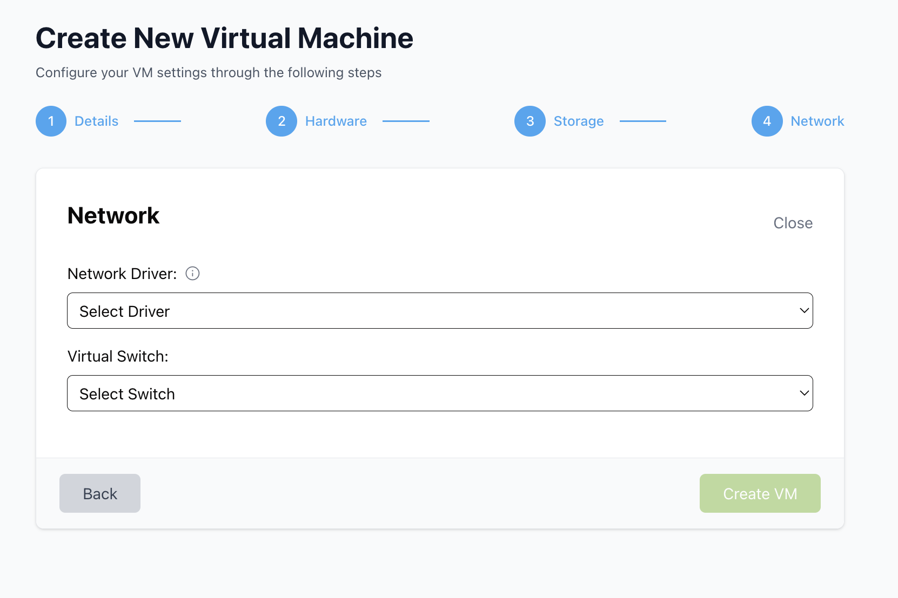

Cloud-Init VM Setup
~~~~~~~~~~~~~~~~~~~

**Cloud-Init Overview**

Cloud-Init setup provides automated VM deployment with pre-configuration capabilities, supporting:

- **FreeBSD**: Automated FreeBSD deployment with cloud-init
- **Ubuntu**: Automated Ubuntu deployment with cloud-init integration

.. note::

   Please upload and download a raw image (``.raw``) if it is not available during the setup. To do this, navigate to the node-level ISO section in the interface.

**Cloud-Init Configuration Process**

1. **Setup Method Selection**: Choose "Cloud-Init Setup" from available options

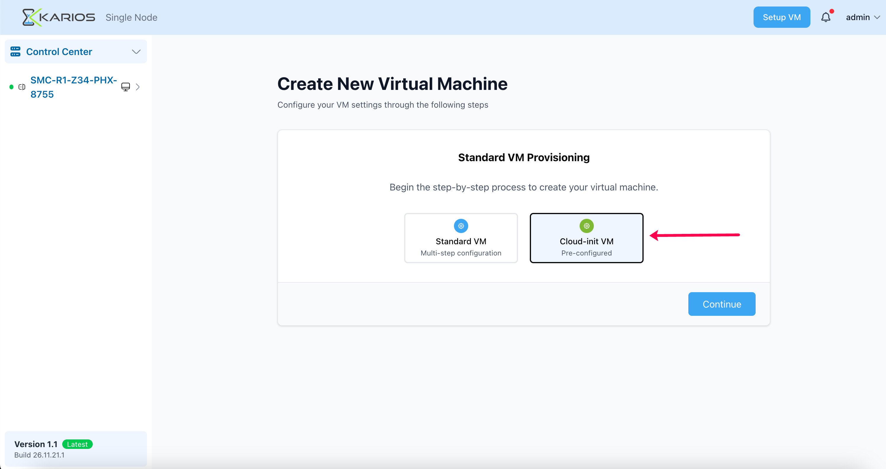

2. **Server Selection**: Select target server for VM deployment
3. **Basic VM Configuration**: Configure VM name, loader, and OS
4. **Resource Allocation**: Set CPU, memory, and storage parameters
5. **User Account Setup**: Configure initial user account and authentication
6. **Network Configuration**: Set network parameters (DHCP or static)
7. **VM Creation**: Deploy the cloud-init enabled virtual machine

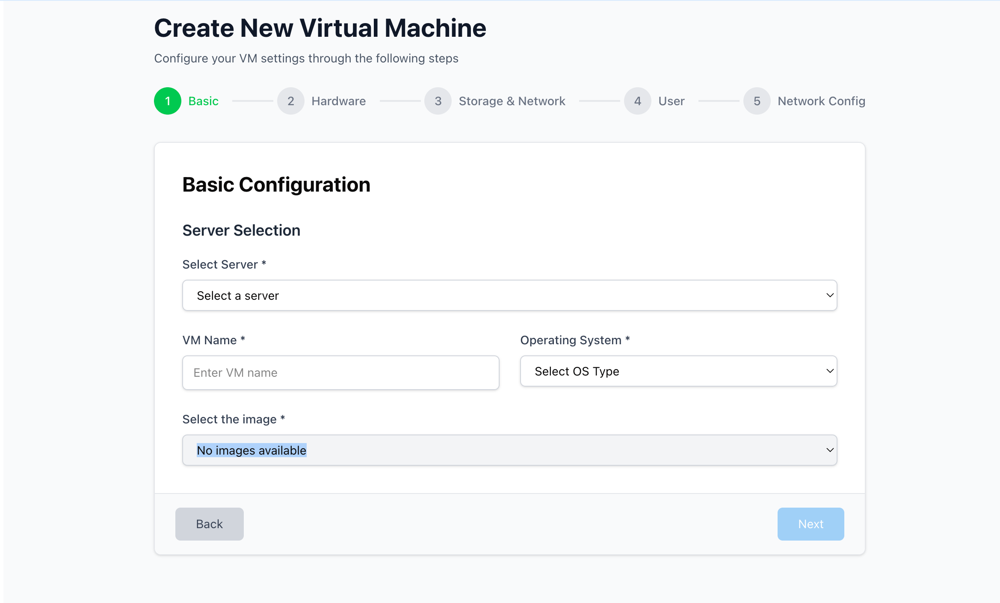

**VM Basic Configuration**
~~~~~~~~~~~~~~~~~~~~~~~~~~~~~~~~~

**Step 1: Select Server and Basic VM Details**

- **Server Selection**: Choose the target server for VM deployment.
- **VM Name**: Enter a unique name for your virtual machine.
- **Operating System**: Select the desired OS (FreeBSD or Ubuntu).

.. note::
   Cloud-Init setup only supports raw disk images (``.raw`` format).

**Step 2: Storage and Network Configuration**

- **Storage Pool**: Select the storage pool for the VM's disk.
- **Disk Size**: Specify the size of the virtual disk.
- **Network Switch**: Choose the network switch for VM connectivity.

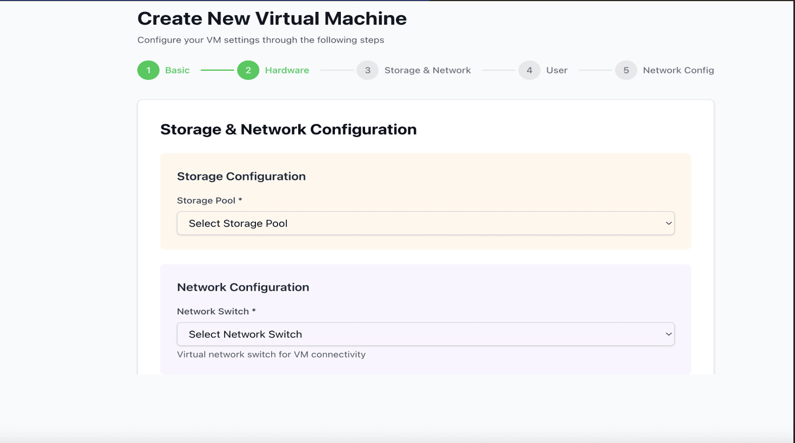

**Step 3: Hardware Configuration**

- **CPU Cores**: Allocate the number of CPU cores.
- **Memory**: Set the amount of RAM for the VM.

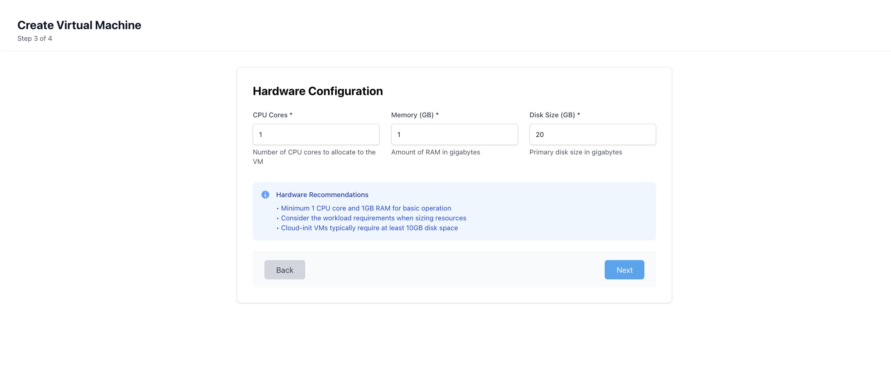

**User Account Configuration**

Cloud-Init VMs require initial user account setup:

- **Username**: Primary user account for the VM
- **Password**: Secure password for user account authentication
- **SSH Public Key (Optional)**: Add SSH public key for passwordless authentication

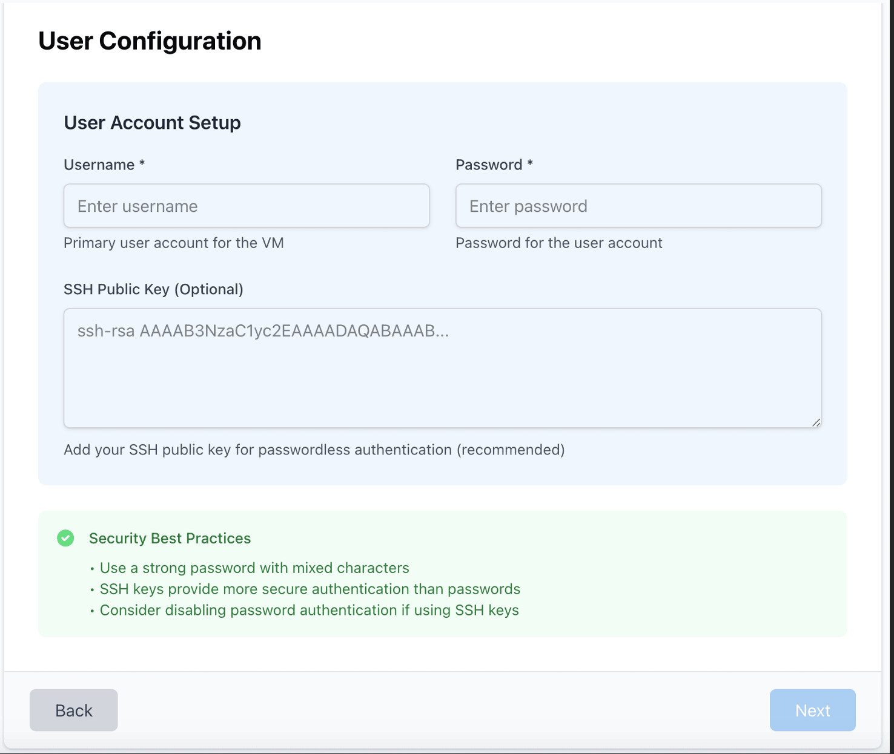

SSH Key Authentication (Enhanced Security)
~~~~~~~~~~~~~~~~~~~~~~~~~~~~~~~~~~~~~~~~~~

For enhanced security, configure SSH key authentication for your virtual machines.

**SSH Key Format**

- Provide your SSH public key in standard format (e.g., ``ssh-rsa``, ``ssh-ed25519``).
- Paste the public key directly into the VM setup form or upload as required.

**Key Benefits**

- Enables passwordless authentication for secure remote access.
- Reduces risk of brute-force password attacks.
- Simplifies automation and remote management.

**Multiple Keys Support**

- You may specify multiple SSH public keys for a VM.
- Each key grants access to authorized users.

**Key Management**

- SSH keys are managed centrally via the Karios interface.
- Administrators can add, remove, or update authorized keys for each VM.
- Regularly review and rotate SSH keys for optimal security.

.. note::

   Always keep your private SSH keys secure and never share them. 
   Only authorized public keys should be added to the VM configuration.

**Network Configuration Options**

**DHCP Configuration (Default)**:
- Automatic IP address assignment
- Dynamic network configuration
- Simplified setup process

**Static IP Configuration**:
- Static IP Address: Manually specify IP address
- Subnet Mask: Configure network subnet mask
- Domain Name: Set domain name for the VM

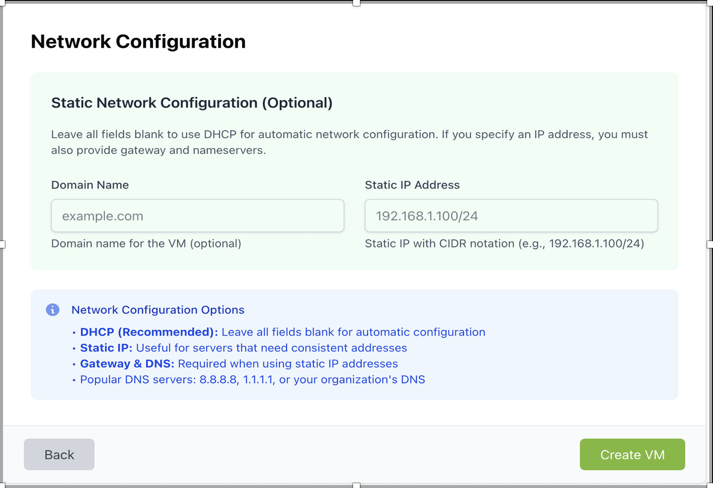

Security Best Practices
~~~~~~~~~~~~~~~~~~~~~~~

The system provides security recommendations to ensure safe and reliable VM operations:

- **Strong Passwords**: Use complex passwords with a mix of uppercase, lowercase, numbers, and special characters.
- **SSH Key Authentication**: Prefer SSH keys over passwords for VM access; they offer enhanced security and reduce brute-force risks.
- **Password Disabling**: When SSH keys are configured, consider disabling password authentication for remote access.
- **Network Security**: Apply appropriate network security policies, such as firewalls and VLAN segmentation, to protect VM traffic.

VM Deployment Process
~~~~~~~~~~~~~~~~~~~~~

Pre-Deployment Validation
^^^^^^^^^^^^^^^^^^^^^^^^^

Before creating a VM, the system performs several validation checks:

- **Network Switch Availability**: Ensure a virtual switch exists and is ready to attach to the VM's NIC (see Networking → Switches → Create).
- **OS ISO Availability**: Confirm the required installation ISO is present and attachable. If missing, upload or download the ISO from Node → ISOs.
- **Resource Availability**: Verify sufficient CPU, memory, and storage capacity on the target node.
- **Configuration Validity**: Validate all VM parameters (vCPU, memory, disk, NIC) for compatibility with the selected node.

VM Creation Process
^^^^^^^^^^^^^^^^^^^

The VM creation workflow includes:

1. **Configuration Review**: Review all VM settings before proceeding.
2. **Resource Reservation**: Reserve the specified resources on the target server.
3. **VM Instantiation**: Create the virtual machine with the chosen configuration.
4. **OS Installation**: Install the operating system (automatic for cloud-init setups).
5. **Initial Configuration**: Apply initial configuration settings, such as user accounts and network parameters.
6. **Service Startup**: Start VM services and validate basic functionality.

Post-Creation Verification
^^^^^^^^^^^^^^^^^^^^^^^^^^

After VM creation, perform the following checks:

- **VM Status**: Confirm the VM is running and accessible via the management interface.
- **Network Connectivity**: Test network connectivity and verify correct configuration.
- **User Access**: Ensure user accounts and authentication methods (password or SSH key) are working.
- **Service Functionality**: Validate that all required services within the VM are operational.

VM Lifecycle Management
~~~~~~~~~~~~~~~~~~~~~~~

**VM Management Interface**

Once a VM is created, the VM management interface provides comprehensive control through several key sections:

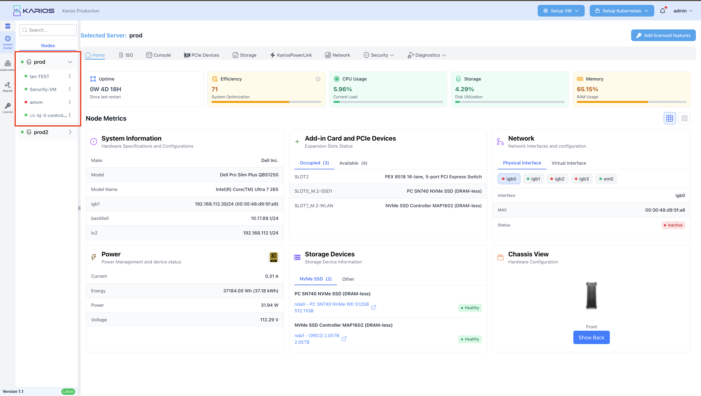

- **Hardware Tab**: Configure VM hardware specifications and resources
- **Console Tab**: Direct console access to the virtual machine
- **Snapshots Tab**: Create and manage VM snapshots
- **Activity Logs Tab**: View VM operation history and logs

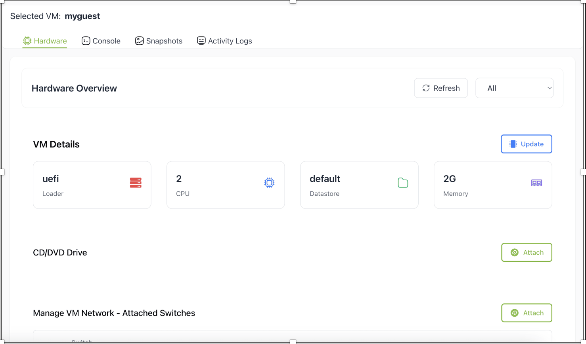

**VM Hardware Configuration**

The Hardware tab allows dynamic modification of VM specifications:

- **VM Details Configuration**: Adjust CPU and memory allocation

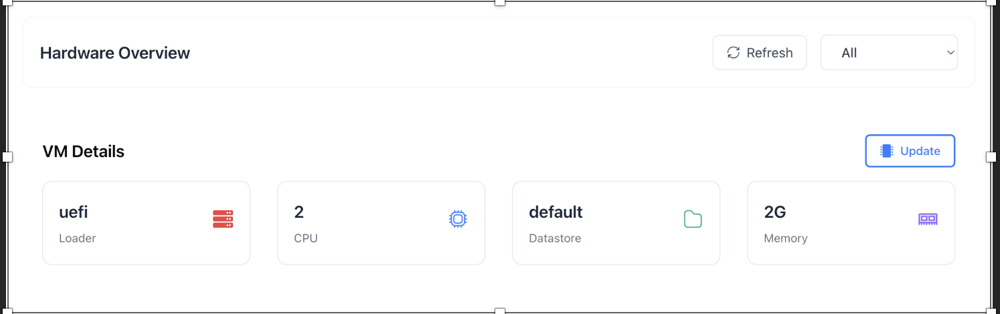

- **CD/DVD Drive Management**: Attach ISO images for installation or boot

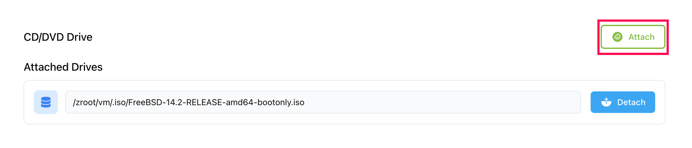

- **Network Switch Management**: Configure network interfaces and switches

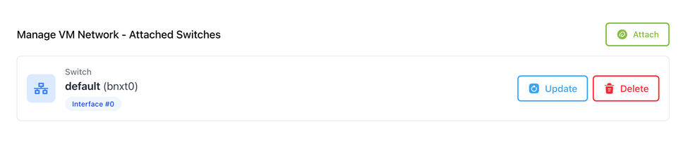

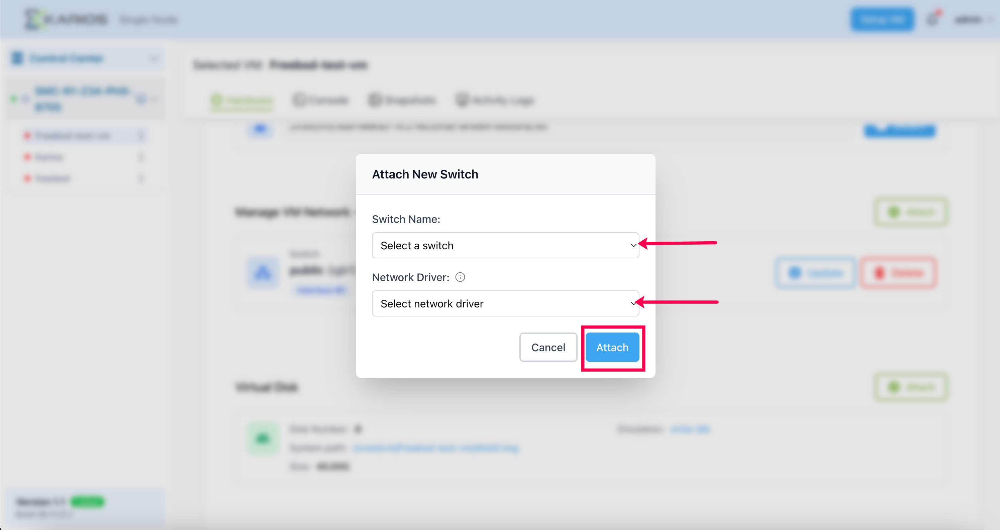

**Update: Modify existing network configurations**

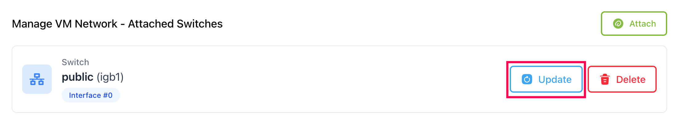

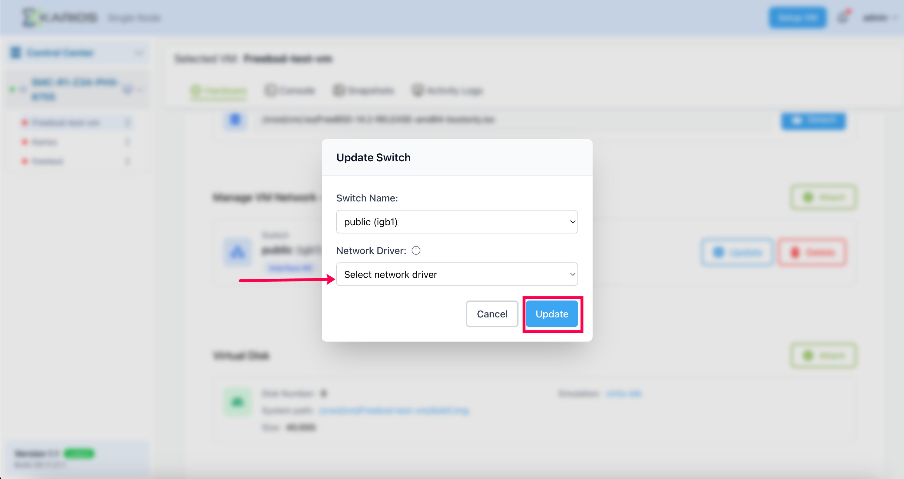

- **Virtual Disk Management**: Attach virtual disks

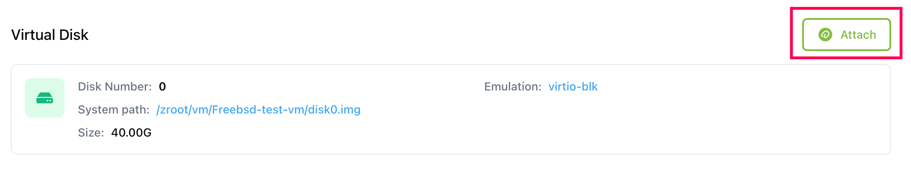

**Attach Only Disk**: 

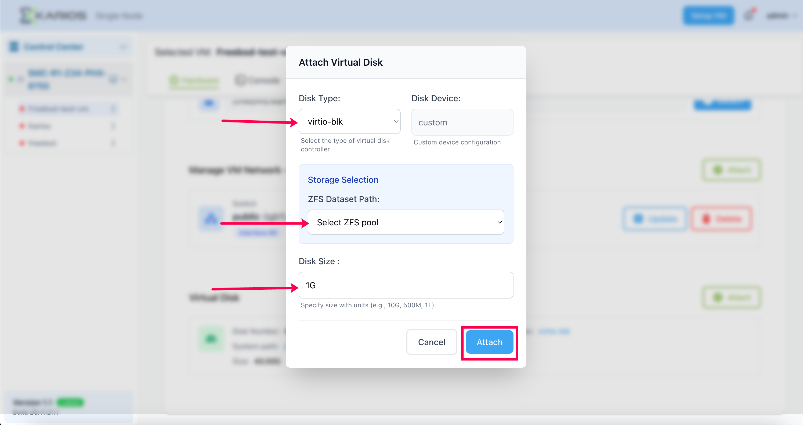

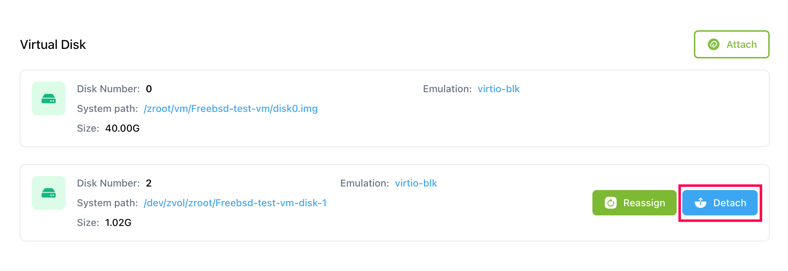

**Reassig**: Remove the virtual disk from the current vm and assign it to some other available vm in the node.

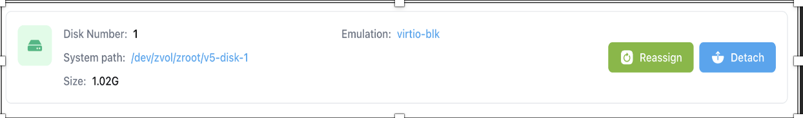

**Delete**: Delete the unused disk permanently

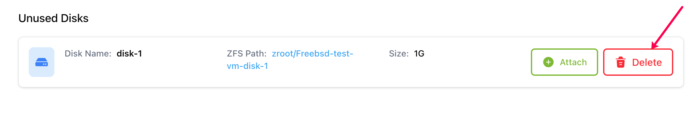

**VM Power Operations**

Standard VM management operations include:

- **Start**: Power on the virtual machine
- **Stop**: Gracefully shut down the virtual machine
- **Restart**: Reboot virtual machine
- **Reset**: Force restart the virtual machine
- **Rename**: Create a new name for the virtual machine
- **Power Off**: Force power off the virtual machine
- **Clone**: Create VM copies for testing or deployment
- **Snapshot**: Create point-in-time VM snapshots
- **Delete**: Remove the virtual machine permanently

VM Console Access
~~~~~~~~~~~~~~~~~

The Console tab provides direct browser-based access to the VM's operating system:

- **Direct Console Access**: Interact with the VM through a web-based console interface
- **Remote Management**: Perform administrative tasks and troubleshooting directly from your browser

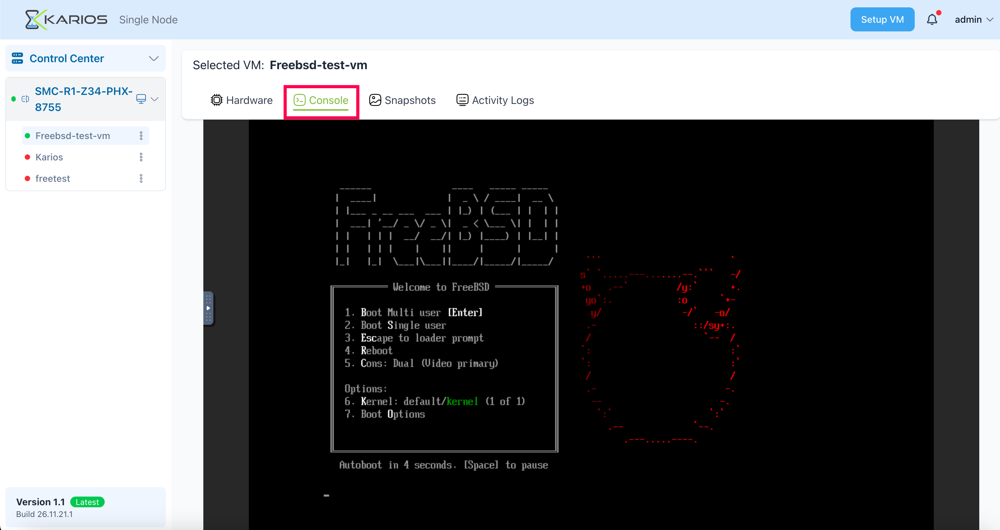

VM Snapshot Management
~~~~~~~~~~~~~~~~~~~~~~

The Snapshots tab enables comprehensive snapshot operations:

- **Snapshot Creation**: Create point-in-time snapshots of the VM state

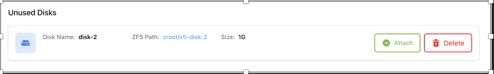

- **Snapshot Rollback**: Restore the VM to a previous snapshot

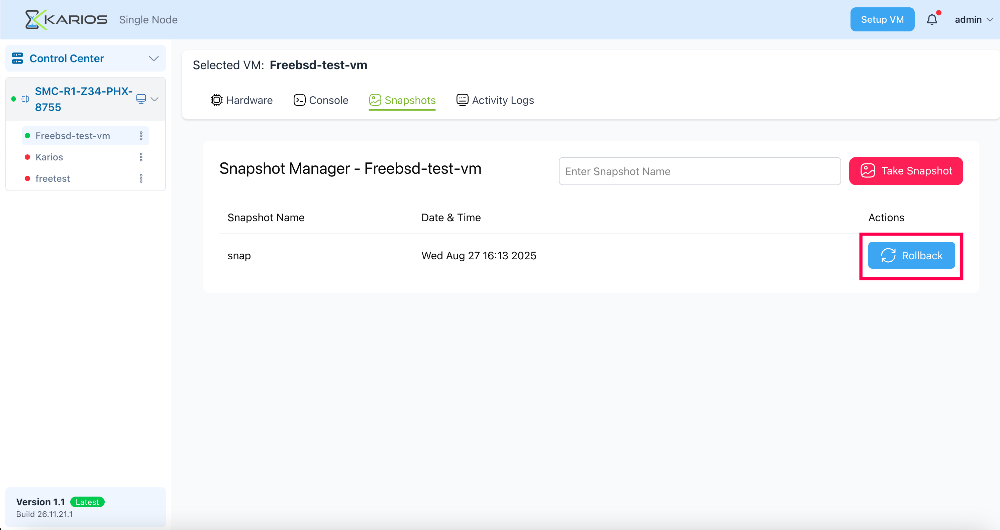

- **Snapshot Management**: View, delete, and organize existing snapshots
- **Snapshot Scheduling**: Configure automated snapshot creation for regular backups

VM Monitoring
~~~~~~~~~~~~~

Monitor VM performance and health using built-in tools:

- **Resource Usage**: Track CPU, memory, and storage utilization
- **Network Traffic**: Monitor network performance and connectivity
- **System Logs**: Access VM system logs and error messages via the Activity Logs tab

VM Maintenance
~~~~~~~~~~~~~~

Perform regular maintenance operations to ensure optimal VM performance:

- **Updates**: Apply operating system and application updates
- **Backups**: Create regular VM backups for disaster recovery
- **Security Patches**: Apply security updates and patches promptly
- **Configuration Changes**: Modify VM settings through the Hardware tab as needed
- **Hardware Modifications**: Dynamically adjust CPU, memory, storage, and network configurations

VM Console Access
~~~~~~~~~~~~~~~~~

The Console tab provides direct browser-based access to the VM's operating system:

- **Direct Console Access**: Interact with the VM through a web-based console interface
- **Remote Management**: Perform administrative tasks and troubleshooting directly from your browser

VM Snapshot Management
~~~~~~~~~~~~~~~~~~~~~~

The Snapshots tab enables comprehensive snapshot operations:

- **Snapshot Creation**: Create point-in-time snapshots of the VM state
- **Snapshot Rollback**: Restore the VM to a previous snapshot
- **Snapshot Management**: View, delete, and organize existing snapshots
- **Snapshot Scheduling**: Configure automated snapshot creation for regular backups

VM Monitoring
~~~~~~~~~~~~~

Monitor VM performance and health using built-in tools:

- **Resource Usage**: Track CPU, memory, and storage utilization
- **Network Traffic**: Monitor network performance and connectivity
- **System Logs**: Access VM system logs and error messages via the Activity Logs tab

VM Maintenance
~~~~~~~~~~~~~~

Perform regular maintenance operations to ensure optimal VM performance:

- **Updates**: Apply operating system and application updates
- **Backups**: Create regular VM backups for disaster recovery
- **Security Patches**: Apply security updates and patches promptly
- **Configuration Changes**: Modify VM settings through the Hardware tab as needed
- **Hardware Modifications**: Dynamically adjust CPU, memory, storage, and network configurations

API Integration
---------------

API Authentication and Usage Guide
~~~~~~~~~~~~~~~~~~~~~~~~~~~~~~~~~~~

**Prerequisites**

- Postman installed
- Swagger/OpenAPI documentation for the API
- Valid user credentials

**Authentication Process**

1. **Login and Obtain Access Token**

   - Open Postman
   - Create a new POST request to the login/authentication endpoint
   - Set request type to POST
   - Enter the full authentication endpoint URL
   - In the request body, include username and password

2. **Configure Authentication Request**

   Set Headers:
   
   .. code-block:: text
   
      Content-Type: application/json

   Prepare JSON body with login credentials:
   
   .. code-block:: json
   
      {
        "username": "your_username",
        "password": "your_password"
      }

   .. figure:: _static/images/user-guide/Image_137.png
      :width: 600      

3. **Retrieve Access Token**

   - Send the login request
   - The response will contain an access token
   - Copy the access token from the response body

   .. figure:: _static/images/user-guide/Image_138.png
      :width: 600    

4. **Prepare API Request in Postman**

   - Create a new request for your desired API endpoint
   - Go to the "Authorization" tab
   - Select "Bearer Token" as the authorization type
   - Paste the copied access token in the token field

   .. figure:: _static/images/user-guide/Image_139.png
      :width: 600    

5. **Configure API Request**

   - Set the appropriate HTTP method (GET, POST, PUT, DELETE)
   - Enter the complete API endpoint URL
   - Add any required headers
   - Prepare request body if needed (for POST/PUT requests)

   .. figure:: _static/images/user-guide/Image_140.png
      :width: 600    

6. **Send the Request**

   - Click "Send" to execute the API call
   - Review the response status and body

   .. figure:: _static/images/user-guide/Image_141.png
      :width: 600    

Swagger API Documentation Guide
~~~~~~~~~~~~~~~~~~~~~~~~~~~~~~~

**Overview**

The Karios platform provides a comprehensive RESTful API interface accessible through Swagger UI, enabling developers and administrators to interact with all platform features programmatically.

**Step-by-Step API Access Guide**

**Step 1: Access Swagger Endpoint**

The Swagger UI provides an interactive interface for exploring and testing the Karios API.

Navigate to Swagger Interface:

.. code-block:: text

   http://192.168.116.132:8084/swagger/index.html

**Swagger Interface Components**

Upon accessing the Swagger interface, you'll see:

- **API Title and Version**: Displays the current API version
- **Server Information**: Shows the base URL for API calls
- **Authorization Section**: Located at the top-right corner
- **API Endpoints**: Organized by functional categories
- **Try it Out Buttons**: Interactive testing for each endpoint
- **Response Examples**: Sample request/response formats

**Step 2: Authentication - Obtain Access Token**

1. **Locate the Login API Endpoint**

   Find the User management Section and locate the "Login" endpoint

   .. figure:: _static/images/user-guide/Image_142.png
      :width: 600       

2. **Execute the Login Request**

   - Click "Try it out" button on the login endpoint
   - Enter Request Body with your credentials:

   .. figure:: _static/images/user-guide/Image_143.png
      :width: 600   

   .. code-block:: json

      {
        "username": "admin",
        "password": "admin"
      }

   - Click "Execute" to send the login request
   
   .. figure:: _static/images/user-guide/Image_144.png
      :width: 600     

   - Review the Response in the response section

   .. figure:: _static/images/user-guide/Image_145.png
      :width: 600   

**Step 3: Configure Bearer Token Authorization**

1. **Locate the Authorization Section**

   - Find the "Authorize" button at the top of the Swagger interface
   - Click the "Authorize" button to open the authorization dialog

   .. figure:: _static/images/user-guide/Image_146.png
      :width: 600   

2. **Configure Bearer Token Authentication**

   - Select "Bearer Auth" section
   - Enter the Bearer Token:

   .. figure:: _static/images/user-guide/Image_147.png
      :width: 600   

   .. code-block:: text

      Bearer eyJhbGciOiJIUzI1NiIsInR5cCI6IkpXVCJ9...

   - Click "Authorize" to save the configuration

   .. figure:: _static/images/user-guide/Image_148.png
    :width: 600   

   .. figure:: _static/images/user-guide/Image_149.png
      :width: 600   

**Step 4: Test API Endpoints**

With authentication configured, you can now test all available API endpoints:

1. **Select an Endpoint**: Choose the desired API endpoint from the list
2. **Review Endpoint Information**: HTTP Method, URL Path, Parameters, Request Body, Response Codes
3. **Click "Try it out"**: This enables the interactive testing interface

   .. figure:: _static/images/user-guide/Image_151.png
      :width: 600   

4. **Configure Request Parameters**: Fill in required path variables, query parameters, request body

5. **Execute the Request**: Click the "Execute" button

   .. figure:: _static/images/user-guide/Image_152.png
      :width: 600   

   .. figure:: _static/images/user-guide/Image_153.png
      :width: 600   

**Best Practices**

- Always use HTTPS for API calls
- Keep access tokens confidential
- Refresh tokens as per the system's security policy
- Handle authentication errors gracefully
- Validate response status codes

Response Information
~~~~~~~~~~~~~~~~~~~~

- **Response Code**: HTTP status code (e.g., 200, 201, 400, 401, 404, 500)
- **Response Body**: JSON response data returned by the server
- **Response Headers**: HTTP headers included in the response
- **Request URL**: The actual URL that was called
- **Request Duration**: Time taken to complete the request

Common Response Codes
~~~~~~~~~~~~~~~~~~~~~

- **200 OK**: Request successful
- **201 Created**: Resource created successfully
- **400 Bad Request**: Invalid request format
- **401 Unauthorized**: Authentication required or token expired
- **403 Forbidden**: Insufficient permissions
- **404 Not Found**: Resource not found
- **500 Internal Server Error**: Server error

